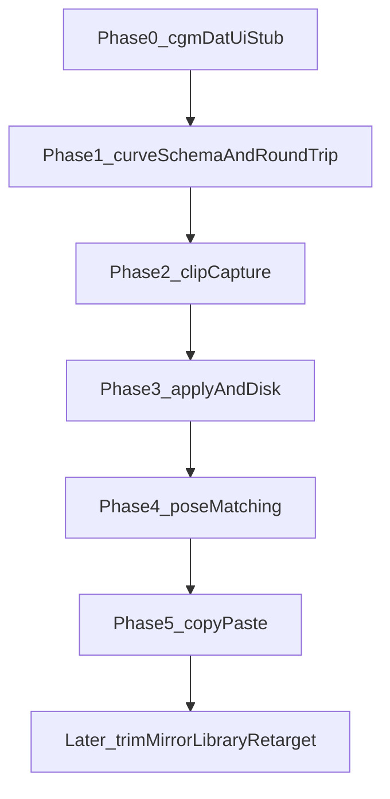

# Feature: AnimData

## Status and Overview

- **Status**: In progress — Phase 0 UI + Phase 1 curve IO (Maya tests passed); Phase 2a range capture (absolute times, no relative / boundary samples)
- **Last Updated**: August 26, 2026 (Phase 2a capture)
- **Owners**: Josh Burton
- **Audience**: Dev / TA — design contract for `cgmAnimClip`
- **Branch**: [`Branch_AnimData.md`](../Branches/Branch_AnimData.md)

**Purpose**: Lossless Maya animation clips as cgmDat: capture curves from controls, store them in a nested clip → object → channel → curve → key dict, write/read JSON, and apply at an arbitrary destination with replace / merge / insert. Later: copy/paste between scenes, trim / retime / mirror, a clip library, then retarget / additive / layers.

**Maintenance rule**: Update this doc when the clip schema, curve IO, apply modes, or matching rules change. Timeline of individual sessions lives in [`Branch_AnimData.md`](../Branches/Branch_AnimData.md).

**Related docs**

- [`Branch_AnimData.md`](../Branches/Branch_AnimData.md) — development timeline
- [`cgm_Dat.py`](../../repos/cgmToolsPy3/cgm/core/cgm_Dat.py) — `CGMDAT.data` base (`self.dat`, `write` / `read`)
- [`MRSDat.py`](../../repos/cgmToolsPy3/cgm/core/mrs/MRSDat.py) — Dat subclass pattern (`BlockDat`)
- [`PoseManager.py`](../../repos/cgmToolsPy3/cgm/core/mrs/PoseManager.py) — match methods reused in Phase 4 (not Phase 1)

---

## Scope

**`cgmDat` here means the Dat class** (`CGMDAT.data`), not the on-disk `cgmDat/` folder. Clips can later live under `_startDir = ['cgmDat','anim']`.

Do **not** build on vendored `ml_copyAnim` or Maya `.anim` export. Those are not a cgmDat format.

### In scope (product)

- Nested clip → object → channel → curve → key model
- Subclass `cgm.core.cgm_Dat.data` (`self.dat`, `get` / `set` / `write` / `read`, `_ext`, `_startDir`)
- Lossless keys, tangents, weights, infinity, breakdowns
- Capture selected controls over a frame range (Phase 2a shipped; relative time and boundary samples later)
- Normalize clips to relative time (Phase 2b)
- Preserve motion at clip boundaries (Phase 2c)
- Save/load clips to disk (JSON Dat; fixture IO in Phase 1)
- Apply at arbitrary destination frames; replace / merge / insert (Phase 3)
- Reuse pose-system object matching / rig identity (Phase 4)
- Copy/paste animation between scenes (Phase 5)
- Validation and round-trip tests (Phase 1 gate, then per phase)
- cgmDat-style clip UI (Phase 0 stub shipped; capture writes identity + curves in range; apply is a no-op until Phase 3)

### Out of scope (until Later)

- Clip trimming / retiming / mirroring
- Animation library / browser UI
- Advanced retargeting / additive / animation layers
- Driven / unitless curves (`animCurveUL/UA/UU/UT`)
- Flattening anim layers or blend nodes on capture
- Python 2 backport

### Non-goals

- Wrapping `ml_copyAnim` as the format
- Using Maya `.anim` as the on-disk contract
- Growing `cgm_Dat.py` with curve logic
- Implementing Red9 `matchMethod` before Phase 4
- Artist library / browser UI (Later). Phase 0 is the Dat window stub only.

---

## Phases

Schema is frozen in Phase 1. Capture, apply, and matching are later **behavior**. Mixing them into Phase 1 prevents a clean round-trip gate. **Phase 0** is the Dat window so File Save/Load and layout exist before curve IO.



| Phase | Ships | Explicitly not |
|-------|--------|----------------|
| **0** | `AnimClip` JSON Dat shell + Dat window (Capture / Current Clip / Apply frames, File Save/Load, identity capture) | Curves, apply behavior, matching, library browser |
| **1** | Curve+key dict, Maya read/rebuild, identity **fields** on object records, file+Maya round-trip tests | Range capture, relative time, boundary sampling, matching, apply modes |
| **2** | **2a**: selection + Start/End, snapshot direct time-based curves, drop keys outside range (absolute times). **2b/2c**: relative times, evaluate start/end if unkeyed | Apply / matching |
| **3** | Apply at dest frame; replace / merge / insert | Library UI |
| **4** | Reuse PoseManager match methods (`base`, `metaData`, `stripPrefix`, `index`, `mirrorIndex`, `mirrorIndex_ID`) | New matcher |
| **5** | Cross-scene copy/paste (clip is the clipboard) | — |
| **Later** | Trim / retime / mirror; browser; additive / layers / retarget | — |

---

## Architecture

### Schema vs behavior

- **Phase 0**: Dat window + JSON shell. Capture / Get write identity + range (curves filled in Phase 2a). Paste Clip is a stub.
- **Phase 1 freeze**: AnimClip / object / channel / curve / key dict keys so the shape does not change later.
- **Phase 1 implement**: snapshot of one `animCurve*` node ↔ dict ↔ new node. A clip file may wrap a single-curve fixture.
- **Phase 2a**: selected controls → `ATTR.get_keyed` / `ATTR.get_driver` (skip conversion nodes) → snapshot the **curve node**; TL/TA/TU/TT only; keep keys in Start/End; **absolute times**. Relative/normalize and boundary samples stay 2b/2c. Matching is Phase 4.

### Core concepts

| Layer | Role |
|-------|------|
| **AnimClip** | `CGMDAT.data` subclass. `self.dat` is the serializable clip. JSON on disk. |
| **Object** | One animated transform/control. Identity stubs for later matching. |
| **Channel** | One plug (`tx`, `rotateY`, custom attr). Points at one time-based curve. |
| **Curve** | Lossless `animCurveTL/TA/TU/TT` payload. |
| **Key** | One keyframe: time, value, tangents, weights, breakdown. |

### Capture the curve node, not the plug value

Rotate often has `unitConversion` between curve and plug. Use `ATTR.get_driver(..., skipConversionNodes=True)` to reach the curve, then query `keyframe` / `keyTangent` / `preInfinity` on the **curve**. Skip (warn) anim layers, blends, and any other non-curve driver. Time-based types only. Driven/unitless curves later.

### Times

Phase 1 stores **absolute Maya times** as queried. Phase 2a capture still uses absolute times and drops keys outside Start/End. Relative/normalize is a clip-level transform in Phase 2b. Clip metadata: `sourceStart`, `sourceEnd`, `fps`.

### Identity (stubs only until Phase 4)

On each object record: short name, long name, namespace, cgm tags, optional UUID. Do not call Red9 `matchMethod` in Phase 1.

### Data / configuration

- `_ext`: `cgmAnimClip`
- `_dataFormat`: `'json'` — not ConfigObj. Nested float key lists break ConfigObj string typing (`decodeDat`).
- `_startDir`: `['cgmDat','anim']` (folder convention; not required for Phase 1 fixture tests)

### Schema sketch (`self.dat`)

Keys below are the frozen shape. Values and capture behavior fill in per phase.

```text
clip
  version
  sourceStart, sourceEnd, fps          # capture range (absolute); relative is Phase 2b
  includeStatic                        # capture option; static-value schema later
  linearUnit, angularUnit, timeUnit    # metadata
  user, date, scene                    # metadata
  objects[]
    shortName, longName, namespace     # identity stubs
    cgmName, cgmType, uuid             # identity stubs
    rotateOrder                        # metadata; needed on apply
    channels[]
      attr                             # plug short name
      plug                             # metadata: node.attr
      curve
        curveType                      # animCurveTL / TA / TU / TT  (required)
        preInfinity, postInfinity      # required
        weightedTangents               # required
        nodeName, color                # metadata
        keys[]
          time, value                  # required (absolute time in Phase 1)
          inTangentType, outTangentType
          inAngle, outAngle
          inWeight, outWeight
          lock, weightLock, breakdown
```

### Metadata vs required (Phase 1)

**Required to rebuild a curve**

- `curveType` (`animCurveTL` / `TA` / `TU` / `TT`)
- `preInfinity`, `postInfinity`
- `weightedTangents`
- Per key: `time`, `value`, `inTangentType`, `outTangentType`, `inAngle`, `outAngle`, `inWeight`, `outWeight`, `lock`, `weightLock`, `breakdown`

**Metadata (not needed for curve identity)**

- Curve node name / color
- Plug `node.attr`
- Scene units, fps, user, date
- Object identity fields (Phase 4)
- Transform `rotateOrder` (needed on apply, not on single-curve round-trip)

---

## Implementation Details

### Files and Responsibilities

| File | Responsibility |
|------|----------------|
| [`cgm/core/lib/animClip_dat.py`](../../repos/cgmToolsPy3/cgm/core/lib/animClip_dat.py) | `AnimClip` Dat subclass (`_ext` `cgmAnimClip`, JSON) + `ui` (`CGMDAT.ui`). `get()` fills identity + channels. `from_curve` wraps a Phase 1 fixture. |
| [`cgm/core/lib/animClip_curve.py`](../../repos/cgmToolsPy3/cgm/core/lib/animClip_curve.py) | Time-based `animCurve*` snapshot / rebuild / compare / `slice_keys`. Do not grow `cgm_Dat.py`. |
| [`tool_calls.py`](../../repos/cgmToolsPy3/cgm/core/tools/lib/tool_calls.py) `ANIMCLIPDATui` | Reload curve + dat, then `reload_dependencies()`, then launch. Toolbox **Anim → cgmAnimClip**. |
| [`cgm/core/tests/test_coreLib/test_ANIMCLIP.py`](../../repos/cgmToolsPy3/cgm/core/tests/test_coreLib/test_ANIMCLIP.py) | Phase 1 round-trip + Phase 2a capture. Toolbox Unittesting → coreLib → ANIMCLIP. |

### Key Methods / APIs

Phase 0:

- `AnimClip.get()` — selected transforms → object identity + channels (time-based curves in Start/End)
- `ui` File Save / Load / Recent — inherited from `CGMDAT.ui`
- Capture Animation / status-bar Get — same as `get()`
- `uiFunc_updateTimeRange` — Slider / Sel / Scene → Start/End (`SEARCH.get_time`, same as mocap bake)
- Paste Clip — logs Phase 3 warning; Mode (Replace / Merge / Insert) and Mapping (Auto / Name / Index) optionVars only

Phase 1:

- `ANIMCLIPCURVE.snapshot(curve)` — time-based `animCurve*` → curve dict (absolute times)
- `ANIMCLIPCURVE.rebuild(dat, name=)` — curve dict → new node (not connected)
- `ANIMCLIPCURVE.compare(src, dst)` — mismatches list; ignores `nodeName` / `color`
- `AnimClip.from_curve(curve)` — wrap one curve in a clip for JSON write/read

Phase 2a:

- `AnimClip.get()` — `ATTR.get_keyed` + `ATTR.get_driver(..., skipConversionNodes=True)` to the curve node, then `snapshot` + `slice_keys`
- `ANIMCLIPCURVE.slice_keys(dat, start, end)` — drop keys outside `[start, end]`; no boundary samples
- `includeStatic` is stored on the clip; unkeyed static values are not captured yet

### Initialization / Lifecycle

- Last-file auto-load from `CGMDAT.ui.post_init` when `var_LastLoaded` exists
- `ANIMCLIPDATui` reloads `animClip_curve` then `animClip_dat`, then `reload_dependencies()` (same pattern as `mocapBakeTool`)
- Capture control count refreshes on open
- Window default **560×700**. If Maya `windowPref` is larger, that size is kept. Smaller prefs are ignored.
- Collapsible frame collapse state is optionVar-backed (`animClip_*FrameCollapse`)

---

## Configuration Guide

### Maya / tool UI

Phase 0 stub follows other cgmDat windows (`CGMDAT.ui` / `uiBlockDat` labeled rows, not pprint-key buttons). Maya-iterated layout:

**Chrome**

- Top Dat bar: loaded **file path** (or No Data), clear, open dir. Same as other cgmDat UIs. Not capture/apply text. Click still Get (Dat convention).
- Scroll **Status** row: Capture / Get / Paste messages
- File: StartDir, Save, Save As, Load, Recent
- Dev: Ui / Dat pprint (debug only)
- No footer Get/Apply row
- Scroll content is one adjustable `CGMUITemplate` column (avoids a starting horizontal scrollbar; keeps frame header text on Dat chrome)

**Frames** (independent collapse)

- **Capture**: selection count; **Set Timeline Range** on one row (Start / End + Slider / Sel / Scene, same as mocap bake); Include static attributes; **Capture Animation**
- **Current Clip**: summary (`name | N frames | N controls | N curves`), Clear, CLIP CONTENTS with collapsible per-control rows (name + curve count; expand for identity). Curve/key lists are Phase 1.
- **Apply**: Bake Range-style row — Paste at frame [field] | Mode | Mapping | **Paste Clip**. Mapping: Auto / Name / Index. Load/Save stay in the File menu.

**Launch**: Toolbox **Anim → cgmAnimClip** and Maya **cgm → Anim → cgmAnimClip** (`LOADTOOL.ANIMCLIPDATui`)

Capture / Get store identity and time-based curves whose keys fall in Start/End. `ATTR.get_driver(skipConversionNodes=True)` reaches the curve through `unitConversion`. Layers and blends are skipped with a warning. CLIP CONTENTS lists per-channel key counts. Paste Clip does not write keys. Relative times and unkeyed boundary samples are not in 2a.

### Data fields

See schema sketch above.

### Runtime / debug

TBD.

---

## Testing and Validation

Phase 0 (Maya — UI stub complete):

- Toolbox **Anim → cgmAnimClip** or Maya **cgm → Anim → cgmAnimClip** opens the window
- File bar shows path after Load or Save; stays No Data after Capture until Save
- Status row reports Capture / Get / Paste; not the file bar
- Capture Animation fills Current Clip summary and CLIP CONTENTS (curve/key counts when keys fall in Start/End)
- Set Timeline Range Slider / Sel / Scene push Start/End (Sel no-ops if the timeline has no highlight)
- Current Clip rows expand for identity (no curves) or per-channel key counts
- Capture, Current Clip, and Apply frames collapse independently
- File Save / Load round-trips the JSON shell (no curves)
- Paste Clip logs Phase 3 warning; does not write keys
- Window opens without a horizontal scrollbar at 560×700

Phase 1 gate: Toolbox **Unittesting → Test Modules → coreLib → ANIMCLIP** (opens a new file).

Cases:

- Linear / spline / stepped / auto
- Weighted tangents
- Breakdown flags
- Pre/post infinity (constant vs cycle)
- `animCurveTL` and `animCurveTA`
- Single key
- Reject `animCurveUL`
- JSON file round-trip of a one-curve fixture clip
- Capture: locator `translateX` keys in range
- Capture: keys outside Start/End are dropped
- Capture: `ATTR.get_driver(skipConversionNodes=True)` reaches the curve through `unitConversion`

Compare key times/values, tangent types/angles/weights, infinity, breakdown — **not** node names.

Keep unittest + Toolbox Unittesting menu (no pytest).

---

## Dependencies and Integration

- **`CGMDAT.data` / `CGMDAT.ui`** — JSON write/read; P4 prepare already on `write`; Dat window chrome
- **`animClip_curve.py`** — curve snapshot / rebuild; Phase 2a plug→curve capture
- **`search_utils.get_time`** — Capture Set Timeline Range (slider / selected / scene)
- **PoseManager / Red9 match methods** — Phase 4 only
- **`ml_copyAnim`** — vendored reference only; do not import as the format

---

## Related Documentation

- **[Branch_AnimData.md](../Branches/Branch_AnimData.md)** — development timeline
- **[NewFeature_Guide.md](../Guides/NewFeature_Guide.md)** — feature documentation format
- **[NewBranch_Guide.md](../Guides/NewBranch_Guide.md)** — branch documentation format
- **[cgm-module-placement.mdc](../.cursor/rules/cgm-module-placement.mdc)** — lib vs Dat placement

---

## Future Work / Ideas

- Trim / retime / mirror
- Clip library / browser
- Additive / layers / retarget
- Unitless / driven keys
- Anim-layer flatten on capture (if ever)

---

## Revision History

| Date | Author | Summary |
|------|--------|---------|
| 2026-08-25 | Josh Burton | Initial planning stub |
| 2026-08-25 | Josh Burton | Phase split, schema vs behavior, JSON Dat, curve round-trip gate |
| 2026-08-25 | Josh Burton | Phase 0: cgmDat UI stub + AnimClip JSON shell |
| 2026-08-25 | Josh Burton | Phase 0 UI: CLIP/OBJECTS labeled rows; launcher Toolbox Anim tab |
| 2026-08-25 | Josh Burton | Phase 0 Capture section (range, start/end, include static) |
| 2026-08-25 | Josh Burton | Current Clip contents list; Capture and Clip collapsible |
| 2026-08-26 | Josh Burton | Range radios; drop footer Get/Apply; Apply collapsible stub (paste layout) |
| 2026-08-26 | Josh Burton | Mocap-style Set Timeline Range; Save/Load stretch row; CLIP CONTENTS identity-only |
| 2026-08-26 | Josh Burton | Apply: header labels only; Paste Clip on fields row; File for load/save |
| 2026-08-26 | Josh Burton | Phase 0 UI stub settled: Dat file bar vs Status row; mocap range; Bake Range Apply; scroll wrap |
| 2026-08-26 | Josh Burton | Phase 1: animClip_curve snapshot/rebuild/compare; ANIMCLIP unittests; from_curve fixture |
| 2026-08-26 | Josh Burton | Phase 2a: capture time-based curves over Start/End (absolute; follow unitConversion to the curve) |
