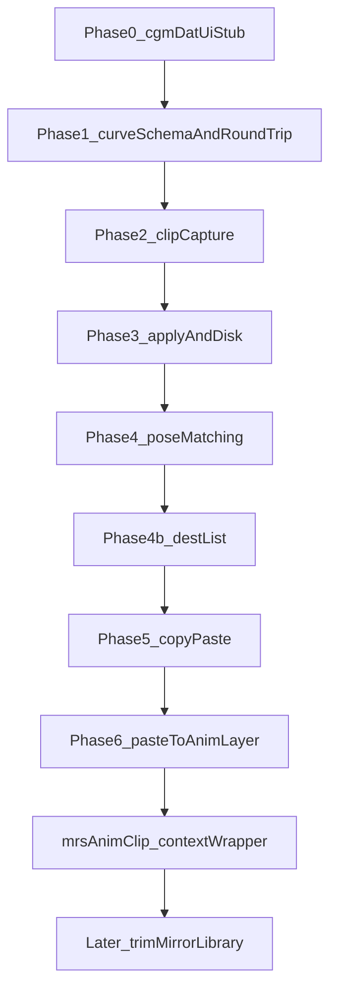

# Feature: AnimData

## Status and Overview

- **Status**: In progress — Phase 0–6 + mrsAnimClip (Maya-verified); dest list = selection or global Name; clip file is the clipboard; paste to animLayer
- **Last Updated**: September 1, 2026 (capture/dest wrap to meta `p_nameLong`)
- **Owners**: Josh Burton
- **Audience**: Dev / TA — design contract for `cgmAnimClip` and `mrsAnimClip`
- **Branch**: [`Branch_AnimData.md`](../Branches/Branch_AnimData.md)

**Purpose**: Lossless Maya animation clips as cgmDat: capture curves from controls, store them in a nested clip → object → channel → curve → key dict, write/read JSON, and apply at an arbitrary destination with replace / merge / insert. The clip file is the clipboard (Phase 5). Paste onto Base or a specified animLayer (Phase 6). **mrsAnimClip** is the MRS context tool (PoseManager chrome, inherited Capture/Clip/Apply). Later: trim / retime / clip-math mirror, a clip library, Animate time context, then retarget / additive.

**Maintenance rule**: Update this doc when the clip schema, curve IO, apply modes, or matching rules change. Timeline of individual sessions lives in [`Branch_AnimData.md`](../Branches/Branch_AnimData.md).

**Related docs**

- [`Branch_AnimData.md`](../Branches/Branch_AnimData.md) — development timeline
- [`cgm_Dat.py`](../../repos/cgmToolsPy3/cgm/core/cgm_Dat.py) — `CGMDAT.data` base (`self.dat`, `write` / `read`)
- [`MRSDat.py`](../../repos/cgmToolsPy3/cgm/core/mrs/MRSDat.py) — Dat subclass pattern (`BlockDat`)
- [`PoseManager.py`](../../repos/cgmToolsPy3/cgm/core/mrs/PoseManager.py) — match methods reused in Phase 4 (not Phase 1); context chrome reused by mrsAnimClip
- [`Feature_MRSWiring.md`](Feature_MRSWiring.md) — puppet/module `controls_get` (used via `animate_utils.context_get`)
- [`animate_utils.py`](../../repos/cgmToolsPy3/cgm/core/mrs/lib/animate_utils.py) — MRS context modes; mrsAnimClip pins `uiColumn_context`
- [`mrsAnimClip.py`](../../repos/cgmToolsPy3/cgm/core/mrs/mrsAnimClip.py) — MRS subclass of `animClip_dat.ui`

---

## Scope

**`cgmDat` here means the Dat class** (`CGMDAT.data`), not the on-disk `cgmDat/` folder. Clips can later live under `_startDir = ['cgmDat','anim']`.

Do **not** build on vendored `ml_copyAnim` or Maya `.anim` export. Those are not a cgmDat format.

### In scope (product)

- Nested clip → object → channel → curve → key model
- Subclass `cgm.core.cgm_Dat.data` (`self.dat`, `get` / `set` / `write` / `read`, `_ext`, `_startDir`)
- Lossless keys, tangents, weights, infinity, breakdowns
- Capture selected controls over a frame range (Phase 2a shipped)
- Normalize clips to relative time (Phase 2b shipped)
- Preserve motion at clip boundaries (Phase 2c shipped)
- Save/load clips to disk (JSON Dat; fixture IO in Phase 1)
- Apply at arbitrary destination frames; replace / merge / insert (Phase 3 shipped)
- Reuse pose-system object matching / rig identity (Phase 4)
- Copy/paste animation between scenes (Phase 5 shipped — File Save/Load is the clipboard)
- Dest list = Maya selection, or global Name when nothing is selected (**cgmAnimClip**)
- Paste onto a specified Maya animLayer instead of Base (Phase 6 shipped)
- **mrsAnimClip** — PoseManager context for capture and paste dests; same clip JSON / `_startDir` (Maya-verified)
- Validation and round-trip tests (Phase 1 gate, then per phase)
- cgmDat-style clip UI (Phase 0 stub shipped; capture writes identity + curves; Paste Clip Replace/Merge writes keys)

### Out of scope (until Later)

- Animate time context (back / next / bookEnd) — not on mrsAnimClip
- Clip trimming / retiming / clip-math mirroring
- Animation library / browser UI
- Advanced retargeting / additive (not paste-to-layer — that is Phase 6 shipped)
- Driven / unitless curves (`animCurveUL/UA/UU/UT`)
- Flattening anim layers or blend nodes on capture
- Python 2 backport

### Non-goals

- Wrapping `ml_copyAnim` as the format
- Using Maya `.anim` as the on-disk contract
- Growing `cgm_Dat.py` with curve logic
- Implementing a new matcher instead of PoseManager / `r9Core.matchNodeLists`
- Artist library / browser UI (Later). Phase 0 is the Dat window stub only.

---

## Phases

Schema is frozen in Phase 1. Capture, apply, and matching are later **behavior**. Mixing them into Phase 1 prevents a clean round-trip gate. **Phase 0** is the Dat window so File Save/Load and layout exist before curve IO.



| Phase | Ships | Explicitly not |
|-------|--------|----------------|
| **0** | `AnimClip` JSON Dat shell + Dat window (Capture / Current Clip / Apply frames, File Save/Load, identity capture) | Curves, apply behavior, matching, library browser |
| **1** | Curve+key dict, Maya read/rebuild, identity **fields** on object records, file+Maya round-trip tests | Range capture, relative time, boundary sampling, matching, apply modes |
| **2** | **2a**: selection + Start/End, snapshot time-based curves, drop keys outside range. **2b**: key times relative to Start (`sourceStart`/`sourceEnd` stay absolute). **2c**: evaluate start/end if unkeyed | Apply / matching |
| **3** | Apply at dest frame; Replace / Merge / Insert. Name / Index / Auto mapping | Library UI |
| **4** | Reuse PoseManager match methods (`base`, `metaData`, `stripPrefix`, `mirrorIndex`, `mirrorIndex_ID`) via `r9Core.matchNodeLists`. Select dest. | New matcher |
| **4b** | Dest list is the Maya selection (no DAG walk, no Dest menu). Empty sel → global Name. `Name` + sel restricts Name to that list. `mirrorIndex_ID` via `getMirrorIndex`. | Capture-from-puppet on **cgmAnimClip**; Dest menu; silent puppet walk; `mPuppet` in JSON |
| **5** | **Shipped:** clip file is the clipboard. Capture → File Save → other scene → File Load → Paste. No separate in-memory copy buffer. | Dedicated Copy button |
| **6** | **Shipped:** Paste Clip onto **Base** or a specified Maya **animLayer**. **New** creates a layer; **Override / Additive** is set only on create. Dests are added, then keyed. Dest list / Mapping unchanged. | Flatten layers on capture; clip additive math; retarget |
| **mrsAnimClip** | **Shipped:** separate tool. PoseManager context chrome pinned above inherited AnimClip UI. Context fills capture nodes and paste dests. Same `_ext` / `_startDir`. Empty context warns (no global Name). | Dest dropdown on cgmAnimClip; Animate time row; clip-math mirror; `Animate.py` into `animClip_dat` |
| **Later** | Trim / retime / clip-math mirror; library / browser; Animate time context; additive / retarget | — |

---

## Architecture

### Schema vs behavior

- **Phase 0**: Dat window + JSON shell. Capture / Get write identity + range (curves filled in Phase 2a). Paste Clip is a stub.
- **Phase 1 freeze**: AnimClip / object / channel / curve / key dict keys so the shape does not change later.
- **Phase 1 implement**: snapshot of one `animCurve*` node ↔ dict ↔ new node. A clip file may wrap a single-curve fixture.
- **Phase 2a**: selected controls → `ATTR.get_keyed` / `ATTR.get_driver` (skip conversion nodes) → snapshot the **curve node**; TL/TA/TU/TT only; keep keys in Start/End.
- **Phase 2b**: subtract Start from each key time so the clip starts at 0. `sourceStart` / `sourceEnd` stay the original range. `relative` is True on capture. Matching is Phase 4.
- **Phase 2c**: optional **Key start/end**. When on, if Start/End are unkeyed, evaluate `curve.output` and insert linear samples. Off by default. Do **not** sample Start when it is before the first key and `preInfinity` is not `constant`. Do **not** sample End when it is after the last key and `postInfinity` is not `constant`. Interior unkeyed bounds still sample when the option is on.

### Core concepts

| Layer | Role |
|-------|------|
| **AnimClip** | `CGMDAT.data` subclass. `self.dat` is the serializable clip. JSON on disk. |
| **Object** | One animated transform/control. Identity stubs for later matching. |
| **Channel** | One plug (`tx`, `rotateY`, custom attr). Points at one time-based curve. |
| **Curve** | Lossless `animCurveTL/TA/TU/TT` payload. |
| **Key** | One keyframe: time, value, tangents, weights, breakdown. |

### Capture the curve node, not the plug value

Rotate often has `unitConversion` between curve and plug. Use `ATTR.get_driver(..., skipConversionNodes=True)` to reach the curve, then query `keyframe` / `keyTangent` on the **curve**. Infinity is `MFnAnimCurve` (`read_curve_infinity` / `set_curve_infinity`), not `cmds.setInfinity`. Skip (warn) anim layers, blends, and any other non-curve driver. Time-based types only. Driven/unitless curves later.

### Apply keys the dest object attribute, not a named curve

Paste matches a dest transform, then for each channel uses the stored **attr name** (`translateX`, `visibility`, …) and writes keys on `dest.attr`. Do not look up clip `curve.nodeName` (`pSphere1_translateX`). Maya `cutKey` / `setKeyframe` on a DG animCurve name fail with “No object matches name”. Skip (warn) if the dest plug is already driven by a non-time-curve (layers/blends). **Insert** shifts dest keys strictly after the first pasted time by the clip span, then writes; it does not cut or change infinity.

### Apply target layer (Phase 6)

Paste writes **Base** or a **specified Maya animLayer**. Dest list and Mapping stay as they are — layer is where those dests’ keys go, not which nodes to pair. UI **Layer** is `Base`, **New**, plus scene animLayers (`BaseAnimation` is Base). **New** prompts for a name and creates the layer; do not store `New` in the optionVar. Named layers are created if missing. **Override / Additive** is applied only when the layer is created (Maya animLayer mode — not clip additive math). Existing layers keep their mode. Paste **adds dest controls to the layer** (`addSelectedObjects`), then keys the **preferred** layer (same pattern as `animFilterTool` / `ml_copyAnim`). Do not rely on `setKeyframe -animLayer` — it can report success without membership or connected curves. Capture still skips layered/blend drivers until flatten-on-capture (Later). Not retarget. Blend drivers on the dest are allowed when pasting onto a layer.

### Times

Phase 1 stores **absolute Maya times** as queried. Phase 2a capture slices to Start/End. Phase 2b subtracts Start from key times (`relative` True). `sourceStart` / `sourceEnd` remain the source range. Phase 2c inserts evaluated samples when **Key start/end** is on and Start/End are unkeyed, except in the pre/post infinity extrapolation region when infinity is not `constant`.

### Identity (Phase 4 matching)

Object records store **namespace-stripped** `shortName` / `longName` (`mObj.p_nameBase` / DAG path without `ns:`). Capture and dest lists wrap live nodes with `cgmMeta.validateObjArg`; longs are `mObj.p_nameLong`; selected shapes use `mObj.getParent(asMeta=True)`. Clip header holds `namespace` (shared source ns, `;`-joined if mixed). Mapping **base** / **stripPrefix** / **metaData** / **mirrorIndex** call `r9Core.matchNodeLists`. **mirrorIndex_ID** is PoseSaver’s slot-only match (`MirrorHierarchy.getMirrorIndex`) — `matchNodeLists` does not implement it. **cgmAnimClip dest list** is the Maya selection as-is (no DAG descendents, no puppet walk). Empty selection falls back to global **Name** (`_scene_node_by_name`). **Name** with a selection still name-matches, but only among those dests. **mrsAnimClip** uses MRS context as the capture list and dest pool (not a Dest dropdown on cgmAnimClip). **metaData** matches stored Red9 `{metaAttr, metaNodeID}` to dest wires, then live wires if the source is still in the scene, then **stripPrefix**. `mirrorIndex` / `mirrorIndex_ID` still need captured nodes in the scene. Do not add a new matcher.

### MRS context (mrsAnimClip)

Context is **runtime node pooling**, not clip schema. Do not store `mPuppet` / `mModule` on the JSON. Do not import `Animate.py` into `animClip_dat.py`.

| When | What | Gate |
|------|------|------|
| **cgmAnimClip** | Dest list = selected transforms, or global Name when nothing is selected. No Dest menu, no silent puppet walk. | Dest MRS was dest-pooling disguised as mapping |
| **Phase 5 shipped** | Clip file is the clipboard (File Save / Load / Recent). Shared with mrsAnimClip (`_ext` / `_startDir`). | Dedicated Copy button is optional UX |
| **mrsAnimClip shipped** | Separate window. PoseManager chrome (`uiSetup_context` / `uiColumn_context` / `context_get`) pinned under the Dat file bar. Context fills **capture nodes and paste dests**. Empty context warns — no global Name. Subclass of `animClip_dat.ui`; hooks `get(nodes=)`, `apply(dests=)`, `_clip_capture_nodes`, `_clip_apply_dests`, `_clip_source_label`, `uiBuild_pinned_chrome`. Context **mirror** = extra controls in the pool, not clip-math mirror. | Do not add a Dest dropdown to cgmAnimClip; do not copy Capture/Clip/Apply |
| **Later** | Animate time row (back/next/bookEnd); trim / retime / clip-math mirror; library | File paste is boring; AnimClip math later |

`animClip_dat.py` stays generic: dest list is a list of nodes; mrsAnimClip fills it via `animate_utils.dat.context_get`. Reuse [`animate_utils.py`](../../repos/cgmToolsPy3/cgm/core/mrs/lib/animate_utils.py) and [`Feature_MRSWiring.md`](Feature_MRSWiring.md) for `controls_get`. Launch: Toolbox **MRS → mrsAnimClip** (`tool_calls.mrsANIMCLIP`).

### Data / configuration

- `_ext`: `cgmAnimClip`
- `_dataFormat`: `'json'` — not ConfigObj. Nested float key lists break ConfigObj string typing (`decodeDat`).
- `_startDir`: `['cgmDat','anim']` (folder convention; not required for Phase 1 fixture tests)

### Schema sketch (`self.dat`)

Keys below are the frozen shape. Values and capture behavior fill in per phase.

```text
clip
  version
  sourceStart, sourceEnd, fps          # capture range (absolute Maya times)
  relative                             # True after Phase 2b capture; key times are start-relative
  includeStatic                        # capture option; static-value schema later
  keyStartEnd                          # capture option; sample unkeyed Start/End (2c)
  linearUnit, angularUnit, timeUnit    # metadata
  user, date, scene                    # metadata
  namespace                            # source Maya namespace (header); stripped from object names
  objects[]
    shortName, longName                # identity; no namespace
    cgmName, cgmType, cgmDirection, uuid
    metaData                           # Red9 {metaAttr, metaNodeID} at capture
    rotateOrder                        # metadata; needed on apply
    channels[]
      attr                             # plug short name
      plug                             # metadata: node.attr
      curve
        curveType                      # animCurveTL / TA / TU / TT  (required)
        preInfinity, postInfinity      # required
        weightedTangents               # required
        nodeName, color                # metadata
        keys[]
          time, value                  # required (absolute in Phase 1 fixtures; relative to Start on capture)
          inTangentType, outTangentType
          inAngle, outAngle
          inWeight, outWeight
          lock, weightLock, breakdown
```

### Metadata vs required (Phase 1)

**Required to rebuild a curve**

- `curveType` (`animCurveTL` / `TA` / `TU` / `TT`)
- `preInfinity`, `postInfinity`
- `weightedTangents`
- Per key: `time`, `value`, `inTangentType`, `outTangentType`, `inAngle`, `outAngle`, `inWeight`, `outWeight`, `lock`, `weightLock`, `breakdown`

**Metadata (not needed for curve identity)**

- Curve node name / color
- Plug `node.attr`
- Scene units, fps, user, date
- Object identity fields (Phase 4)
- Transform `rotateOrder` (needed on apply, not on single-curve round-trip)

---

## Implementation Details

### Files and Responsibilities

| File | Responsibility |
|------|----------------|
| [`cgm/core/lib/animClip_dat.py`](../../repos/cgmToolsPy3/cgm/core/lib/animClip_dat.py) | `AnimClip` Dat subclass (`_ext` `cgmAnimClip`, JSON) + `ui` (`CGMDAT.ui`). `get()` fills identity + channels. `from_curve` wraps a Phase 1 fixture. |
| [`cgm/core/lib/animClip_curve.py`](../../repos/cgmToolsPy3/cgm/core/lib/animClip_curve.py) | Time-based `animCurve*` snapshot / rebuild / compare / `slice_keys` / `offset_keys` / `ensure_boundary_keys` / `apply_to_plug`. Do not grow `cgm_Dat.py`. |
| [`tool_calls.py`](../../repos/cgmToolsPy3/cgm/core/tools/lib/tool_calls.py) `ANIMCLIPDATui` | Reload curve + dat, then `reload_dependencies()`, then launch. Toolbox **Anim → cgmAnimClip**. |
| [`cgm/core/tests/test_coreLib/test_ANIMCLIP.py`](../../repos/cgmToolsPy3/cgm/core/tests/test_coreLib/test_ANIMCLIP.py) | Phase 1 round-trip + Phase 2a capture. Toolbox Unittesting → coreLib → ANIMCLIP. |

### Key Methods / APIs

Phase 0:

- `AnimClip.get()` — selected transforms → object identity + channels (time-based curves in Start/End)
- `ui` File Save / Load / Recent — inherited from `CGMDAT.ui`
- Capture Animation / status-bar Get — same as `get()`
- `uiFunc_updateTimeRange` — Slider / Sel / Scene → Start/End (`SEARCH.get_time`, same as mocap bake)
- Paste Clip — `AnimClip.apply`; Replace/Merge/Insert write keys; Mapping Auto/Name/Index plus Pose methods

Phase 1:

- `ANIMCLIPCURVE.snapshot(curve)` — time-based `animCurve*` → curve dict (absolute times). Infinity via `MFnAnimCurve` (`read_curve_infinity`); `cmds.getAttr` / `setInfinity` often stay `constant`.
- `ANIMCLIPCURVE.rebuild(dat, name=)` — curve dict → new node (not connected)
- `ANIMCLIPCURVE.compare(src, dst)` — mismatches list; ignores `nodeName` / `color`
- `AnimClip.from_curve(curve)` — wrap one curve in a clip for JSON write/read

Phase 2a:

- `AnimClip.get()` — `ATTR.get_keyed` + `ATTR.get_driver(..., skipConversionNodes=True)` to the curve node, then `snapshot` + `slice_keys`; `ensure_boundary_keys` only when `keyStartEnd`
- `ANIMCLIPCURVE.slice_keys(dat, start, end)` — drop keys outside `[start, end]`
- `includeStatic` / `keyStartEnd` are stored on the clip; unkeyed static values are not captured yet

Phase 2b:

- `ANIMCLIPCURVE.offset_keys(dat, origin)` — subtract `origin` from each key time (does not mutate in place)
- `AnimClip.get()` — after slice, offset by Start; `clip['relative'] = True`

Phase 2c:

- `ANIMCLIPCURVE.ensure_boundary_keys(dat, curve, start, end)` — if Start/End have no key, insert `getAttr(curve.output, time=)` samples (linear tangents). Skip Start when it is before the first key and `preInfinity` is not `constant`; skip End when it is after the last key and `postInfinity` is not `constant`. Caller (`get`) only runs this when `keyStartEnd` is True. Does not `listConnections` or move `currentTime`.

Phase 3:

- `ANIMCLIPCURVE.apply_to_plug(dat, node, attr, timeOffset=, mode=, animLayer=)` — keys `node.attr`; Replace cuts dest window; Merge keeps other keys; Insert shifts keys after the first pasted time by the clip span, then writes; tangents by time; Insert does not change infinity. `animLayer` None/Base writes Base; any other name adds the dest control to that Maya layer and keys the preferred layer
- `AnimClip.get(..., nodes=)` — capture those transforms; `None` = Maya selection
- `AnimClip.apply(..., dests=)` / `_match_destinations(..., dests=)` / `_preview_mapping(..., dests=)` — `None` = sel or global Name; a list is the dest pool (empty list = nothing)
- `ui._clip_capture_nodes` / `_clip_apply_dests` / `_clip_source_label` / `uiBuild_pinned_chrome` — subclass hooks; cgmAnimClip defaults keep selection / no pinned chrome
- [`mrsAnimClip.py`](../../repos/cgmToolsPy3/cgm/core/mrs/mrsAnimClip.py) — `ui(ANIMCLIPDAT.ui)`; PoseManager context; same `AnimClip` Dat

Phase 4:

- `_match_destinations(..., dests=)` — `dests is None`: if sel, Pose/Index/Auto use that list as-is; if not sel, global Name. `Name` with sel: `_scene_node_by_name` then keep the hit only if it is in sel. A given `dests` list is the dest pool (empty list = all misses; no Name fallback). Pose pairing stays Red9 (`matchNodeLists` for `base` / `stripPrefix` / `metaData` / `mirrorIndex`; `getMirrorIndex` for `mirrorIndex_ID`). `metaData` uses stored Red9 wire maps, then live wires, then stripPrefix. Mirror methods need captured nodes still in the scene. No DAG descendents, no puppet walk on cgmAnimClip.
- `_preview_mapping` — same dest list as paste; clip shortName → dest shortName (or None). Does not write keys. UI **Check Mapping** uses this; unmatched CLIP CONTENTS rows prefix `[x]` (display-only)

Phase 6:

- Apply **Layer** — Base, New (prompt + create), or a specified Maya animLayer. **Override / Additive** enum applies only when the layer is created. Dest controls are added to the layer, then Replace/Merge/Insert key the preferred layer. Dest list / mapping unchanged

Phase 5 (shipped):

- File Save / Load / Recent is the clipboard. Capture in one scene, Load in another, Paste. No extra copy buffer.

### Initialization / Lifecycle

- Last-file auto-load from `CGMDAT.ui.post_init` when `var_LastLoaded` exists
- `ANIMCLIPDATui` reloads `animClip_curve` then `animClip_dat`, then `reload_dependencies()` (same pattern as `mocapBakeTool`)
- `mrsANIMCLIP` reloads `animate_utils`, curve/dat, `reload_dependencies()`, then `mrsAnimClip`
- Capture control count refreshes on open (`_clip_capture_nodes`)
- Window default **560×700**. If Maya `windowPref` is larger, that size is kept. Smaller prefs are ignored.
- Collapsible frame collapse state is optionVar-backed (`animClip_*FrameCollapse`)
- mrsAnimClip `insert_init` calls `uiSetup_context(self, TOOLNAME)` then `get_sharedDatObject()` — per-tool optionVars, shared `MRSDAT` gather

---

## Configuration Guide

### Maya / tool UI

Phase 0 stub follows other cgmDat windows (`CGMDAT.ui` / `uiBlockDat` labeled rows, not pprint-key buttons). Maya-iterated layout:

**Chrome**

- Top Dat bar: loaded **file path** (or No Data), clear, open dir. Same as other cgmDat UIs. Not capture/apply text. Click still Get (Dat convention).
- **Pinned chrome** (`uiBuild_pinned_chrome`): default `None`. mrsAnimClip returns PoseManager `uiColumn_context` so context stays visible while CLIP CONTENTS scrolls. Form-attach under the Dat file bar, above the scroll. See [`Feature_CgmToolUI.md`](Feature_CgmToolUI.md).
- Scroll **Status** row: Capture / Get / Paste / Check Mapping messages
- File: StartDir, Save, Save As, Load, Recent — shared `_ext` `cgmAnimClip` and `_startDir` `['cgmDat','anim']` (Capture in one window, Load in the other)
- Dev: Ui / Dat pprint (debug only)
- No footer Get/Apply row
- Scroll content is one adjustable `CGMUITemplate` column (avoids a starting horizontal scrollbar; keeps frame header text on Dat chrome)

**Frames** (independent collapse)

- **Capture**: first-row label from `_clip_source_label()` (cgmAnimClip: Maya selection; mrsAnimClip: MRS context); count from `_clip_capture_nodes()`; **Set Timeline Range** on one row (Start / End + Slider / Sel / Scene, same as mocap bake); Include static attributes; **Key start/end**; **Capture Animation**. Empty capture nodes warn (`_clip_empty_capture_msg`); mrsAnimClip does not fall back to global Name.
- **Current Clip**: summary (`name | N frames | N controls | N curves`), **Set Slider**, Clear, collapsible **CLIP CONTENTS** (optionVar; per-control rows). CLIP CONTENTS uses `guiHeaderColor` on a `cgmUIHeaderTemplate` wrap (`adj=True`) so the label stays white. Object frames parent directly to that inner column (`adj=True`) — no extra stretch-row wrap — and zebra with even `guiButtonColor` / odd `guiBackgroundColor` so they read lighter than CLIP CONTENTS. After Check Mapping, rows show `src → dest`; misses start with `[x]` (`[x] src  →  --`). **Set Slider** sets the playback range to **Paste at frame** plus clip duration (`sourceEnd − sourceStart`); duration 0 → a single-frame slider. Scene range expands if the new slider would sit outside it.
- **Apply**: Bake Range-style row — Paste at frame | Mode | Mapping | **Check Mapping** | **Paste Clip**. Second row: **Layer** (`Base` / **New** / scene animLayers, stretch) | **Override / Additive** (create-only) | Refresh. **cgmAnimClip** dest list is implicit: selected transforms, or global Name when nothing is selected. **mrsAnimClip** dests come from `_clip_apply_dests()` (context pool); empty context warns — no Name fallback. No Dest dropdown on either window. Mapping stays Red9/Pose. Layer is where keys go (Base or a Maya animLayer). **New** prompts for a name; Override/Additive is set only if the layer is created. **Check Mapping** previews clip → dest (CLIP CONTENTS `src → dest`; unmatched rows start with `[x]` and `→ --`; Status `N/M matched | missed`). Does not paste. Per-row **Sel** still finds the captured name in the scene, not the preview dest. Load/Save stay in the File menu.

**Launch**

- Toolbox **Anim → cgmAnimClip** and Maya **cgm → Anim → cgmAnimClip** (`LOADTOOL.ANIMCLIPDATui`)
- Toolbox **MRS → mrsAnimClip** next to mrsPoser (`LOADTOOL.mrsANIMCLIP`)

Capture / Get store identity and time-based curves whose keys fall in Start/End. **Key start/end** (off by default) adds evaluated samples when Start/End are unkeyed (not in a non-constant pre/post infinity region). Times are relative to Start (`relative` True); `sourceStart` / `sourceEnd` stay the Maya range. **Paste Clip** matches a dest object, then keys each stored attr on that object at **Paste at frame** (`atFrame + relative time`). Replace cuts the window; Merge adds; Insert shifts later dest keys by the clip span. Mapping: Name (scene), Index (selection order), Auto (Index when counts match), Pose methods (`base` / `stripPrefix` / `metaData` / `mirrorIndex` / `mirrorIndex_ID`). **cgmAnimClip** dest list is the Maya selection, or global Name when empty. `Name` with a selection only matches among those dests. **mrsAnimClip** uses MRS context for capture and paste dests. The clip file is the clipboard (File Save / Load / Recent). **Layer** is Base, New, or a specified animLayer (**Override / Additive** on create only). Capture and paste drive Maya’s main progress bar (`CGMUI.doStartMayaProgressBar`); Esc cancels (partial clip / partial paste kept).

### Data fields

See schema sketch above.

### Runtime / debug

TBD.

---

## Testing and Validation

Phase 0 (Maya — UI stub complete):

- Toolbox **Anim → cgmAnimClip** or Maya **cgm → Anim → cgmAnimClip** opens the window
- Toolbox **MRS → mrsAnimClip** opens the same Dat UI with PoseManager context pinned under the file bar
- File bar shows path after Load or Save; stays No Data after Capture until Save
- Status row reports Capture / Get / Paste; not the file bar
- Capture Animation fills Current Clip summary and CLIP CONTENTS (curve/key counts when keys fall in Start/End)
- Set Timeline Range Slider / Sel / Scene push Start/End (Sel no-ops if the timeline has no highlight)
- Current Clip rows expand for identity (no curves) or per-channel key counts; object frames alternate gray
- Set Slider maps the time slider to Paste at frame + clip duration (single frame if duration is 0)
- Capture, Current Clip, CLIP CONTENTS, and Apply frames collapse independently
- File Save / Load round-trips the JSON shell (no curves)
- Paste Clip writes Replace/Merge/Insert keys at Paste at frame
- Check Mapping previews clip → dest for the current Mapping; does not paste; CLIP CONTENTS shows `src → dest`; unmatched rows start with `[x]`
- Capture and Paste show Maya’s main progress bar (Esc cancels)
- Window opens without a horizontal scrollbar at 560×700
- Phase 5: File Save in scene A, File Load in another scene/asset, Paste Clip (clip file is the clipboard; shared with mrsAnimClip)
- Paste: Layer `ac_clipLayer` (created if missing) adds dests to that animLayer and keys it (mute layer → Base pose)
- Paste: Layer **New** + **Override / Additive** (mode set only on create; existing layers unchanged)
- **cgmAnimClip**: Capture/Paste follow Maya selection, or global Name when nothing is selected (Maya-verified)
- **mrsAnimClip**: Capture/Paste follow MRS context (control/part/puppet/scene/list + core/children/siblings/mirror). Empty context warns. Does not fall back to global Name. Context **mirror** adds mirrored controls to the pool (not clip-math mirror). Maya-verified.

Phase 1 gate: Toolbox **Unittesting → Test Modules → coreLib → ANIMCLIP** (opens a new file).

Cases:

- Linear / spline / stepped / auto
- Weighted tangents
- Breakdown flags
- Pre/post infinity (constant vs cycle)
- `animCurveTL` and `animCurveTA`
- Single key
- Reject `animCurveUL`
- JSON file round-trip of a one-curve fixture clip
- Capture: locator `translateX` keys in range
- Capture: namespaced node stores `namespace` on the clip header; object `shortName` has no `:`
- Capture: keys outside Start/End are dropped
- Capture: `ATTR.get_driver(skipConversionNodes=True)` reaches the curve through `unitConversion`
- Capture: key times are relative to Start (`10–20` → `0–10`); `sourceStart`/`sourceEnd` stay absolute
- Capture: unkeyed Start/End get evaluated linear samples only when `keyStartEnd` (keys at 0 and 20, range 5–15 → relative 0/10 with values 5 and 15)
- Capture: default off — same range with no in-range keys stores no channel
- Capture: no Start sample when Start is before the first key and `preInfinity` is not `constant`; no End sample when End is after the last key and `postInfinity` is not `constant`
- Paste: Replace at frame 50 places those keys at 50 and 60
- Paste: unkeyed dest with a different name (Index) keys that object's attrs; does not look up source curve node names
- Paste: Insert at 20 on dest keys at 10 and 30 (clip 0–10) leaves 10, writes 20/30, shifts 30 → 40
- Paste: `stripPrefix` maps `pfx_ac_poseLoc` onto selected `ac_poseLoc`
- Preview: `stripPrefix` reports dest `ac_prevLoc` and does not set keys
- Paste: `metaData` with no Red9 wires still maps via stripPrefix (`pfx_ac_metaLoc` → `ac_metaLoc`)
- Paste: Pose mapping uses the selected dest only (parent group does not map a child loc)
- Paste: empty selection falls back to Name (`ac_emptyMapLoc` in the scene)
- Paste: `mirrorIndex` maps same side+slot; `mirrorIndex_ID` maps slot only (Left_5 → Right_5)
- Capture: `get(nodes=)` uses that list and ignores Maya selection
- Paste: `apply(dests=)` uses the given dests; `dests=[]` applies nothing (no Name fallback)

Compare key times/values, tangent types/angles/weights, infinity, breakdown — **not** node names.

Keep unittest + Toolbox Unittesting menu (no pytest).

---

## Dependencies and Integration

- **`CGMDAT.data` / `CGMDAT.ui`** — JSON write/read; P4 prepare already on `write`; Dat window chrome
- **`animClip_curve.py`** — curve snapshot / rebuild; Phase 2a plug→curve capture
- **`search_utils.get_time`** — Capture Set Timeline Range (slider / selected / scene)
- **PoseManager / `r9Core.matchNodeLists`** — Phase 4 mapping (`base`, `stripPrefix`, `metaData`, `mirrorIndex`, `mirrorIndex_ID`); mrsAnimClip reuses PoseManager context chrome
- **`mrs/lib/animate_utils.py`** — `uiSetup_context` / `uiColumn_context` / `context_get` / `get_contextDict` / `get_sharedDatObject`. mrsAnimClip only — not `Animate.py` into `animClip_dat.py`
- **`mrs/mrsAnimClip.py`** — subclass of `animClip_dat.ui`; same `AnimClip` Dat
- **`ml_copyAnim`** — vendored reference only; do not import as the format

---

## Related Documentation

- **[Branch_AnimData.md](../Branches/Branch_AnimData.md)** — development timeline
- **[NewFeature_Guide.md](../Guides/NewFeature_Guide.md)** — feature documentation format
- **[NewBranch_Guide.md](../Guides/NewBranch_Guide.md)** — branch documentation format
- **[cgm-module-placement.mdc](../.cursor/rules/cgm-module-placement.mdc)** — lib vs Dat placement
- **[Feature_MRSWiring.md](Feature_MRSWiring.md)** — puppet/module `controls_get` (used via `animate_utils.context_get`)
- **[Feature_CgmToolUI.md](Feature_CgmToolUI.md)** — pinned chrome above scroll; Layer optionMenu; CLIP CONTENTS zebra

---

## Future Work / Ideas

- Trim / retime / clip-math mirror
- Clip library / browser
- Animate time context (back / next / bookEnd) — not on mrsAnimClip
- Dedicated Copy button (no Save dialog) — optional UX; File Save/Load is the clipboard
- Additive / retarget
- Unitless / driven keys
- Anim-layer flatten on capture (if ever)
- `includeStatic` capture of unkeyed static values (flag exists; schema later)

---

## Revision History

| Date | Author | Summary |
|------|--------|---------|
| 2026-08-25 | Josh Burton | Initial planning stub |
| 2026-08-25 | Josh Burton | Phase split, schema vs behavior, JSON Dat, curve round-trip gate |
| 2026-08-25 | Josh Burton | Phase 0: cgmDat UI stub + AnimClip JSON shell |
| 2026-08-25 | Josh Burton | Phase 0 UI: CLIP/OBJECTS labeled rows; launcher Toolbox Anim tab |
| 2026-08-25 | Josh Burton | Phase 0 Capture section (range, start/end, include static) |
| 2026-08-25 | Josh Burton | Current Clip contents list; Capture and Clip collapsible |
| 2026-08-26 | Josh Burton | Range radios; drop footer Get/Apply; Apply collapsible stub (paste layout) |
| 2026-08-26 | Josh Burton | Mocap-style Set Timeline Range; Save/Load stretch row; CLIP CONTENTS identity-only |
| 2026-08-26 | Josh Burton | Apply: header labels only; Paste Clip on fields row; File for load/save |
| 2026-08-26 | Josh Burton | Phase 0 UI stub settled: Dat file bar vs Status row; mocap range; Bake Range Apply; scroll wrap |
| 2026-08-26 | Josh Burton | Phase 1: animClip_curve snapshot/rebuild/compare; ANIMCLIP unittests; from_curve fixture |
| 2026-08-26 | Josh Burton | Phase 2a: capture time-based curves over Start/End (absolute; follow unitConversion to the curve) |
| 2026-08-26 | Josh Burton | Phase 2b: offset_keys — capture times relative to Start; sourceStart/sourceEnd stay absolute |
| 2026-08-26 | Josh Burton | Phase 3: Paste Clip Replace/Merge; Name/Index/Auto mapping; Insert not implemented |
| 2026-08-26 | Josh Burton | Paste keys dest.attr via apply_to_plug; do not resolve stored curve node names |
| 2026-08-26 | Josh Burton | Phase 2c: ensure_boundary_keys — sample unkeyed Start/End on curve.output |
| 2026-08-26 | Josh Burton | 2c: skip Start/End samples in non-constant pre/post infinity regions |
| 2026-08-26 | Josh Burton | Phase 3 Insert: ripple dest keys after first pasted time by clip span |
| 2026-08-26 | Josh Burton | Key start/end is a capture checkbox (off by default); not always sampled |
| 2026-08-26 | Josh Burton | Paste at frame defaults to slider start (`SEARCH.get_time('slider')`), not current time |
| 2026-08-26 | Josh Burton | Phase 4: Mapping adds Pose match methods via r9Core.matchNodeLists; select dest |
| 2026-08-28 | Josh Burton | Capture stores namespace on the clip header; object names are stripped |
| 2026-08-28 | Josh Burton | Set Slider (paste frame + duration); CLIP CONTENTS even/odd gray like AnimFilters |
| 2026-08-28 | Josh Burton | Capture and paste Maya main progress bar; Esc cancels |
| 2026-08-28 | Josh Burton | Check Mapping previews clip → dest; does not paste |
| 2026-08-28 | Josh Burton | ANIMCLIP tests: reload-safe AnimClip(); curve infinity via setAttr |
| 2026-08-28 | Josh Burton | CLIP CONTENTS is its own collapsible frame (optionVar) |
| 2026-08-28 | Josh Burton | CLIP CONTENTS object rows full-width; zebra `guiButtonColor` / `guiBackgroundColor` |
| 2026-08-30 | Josh Burton | metaData: stored Red9 map + dest descendents + stripPrefix fallback |
| 2026-08-30 | Josh Burton | Plan: Phase 4b MRS dest pool; Later Animate context chrome |
| 2026-08-30 | Josh Burton | 4b dest pool (`controls_get` + moduleSet); mirrorIndex_ID via getMirrorIndex |
| 2026-08-31 | Josh Burton | Dest is Selection vs MRS; Red9 mapping no longer walks the puppet |
| 2026-08-31 | Josh Burton | Dest list = selection or global Name; Dest menu and MRS walk removed (Later context) |
| 2026-08-31 | Josh Burton | Check Mapping: unmatched CLIP CONTENTS rows prefix `[x]` |
| 2026-08-31 | Josh Burton | Maya-verified dest list (sel vs Name) and Check Mapping `[x]` |
| 2026-08-31 | Josh Burton | Phase 6 planned: paste onto a specified animLayer (or Base) |
| 2026-08-31 | Josh Burton | Phase 5 done: clip file is the clipboard (File Save/Load); no extra copy buffer |
| 2026-08-31 | Josh Burton | Phase 6: Apply Layer Base or specified animLayer (create if missing) |
| 2026-08-31 | Josh Burton | Layer paste: add dest controls to the animLayer, then key the preferred layer |
| 2026-08-31 | Josh Burton | Layer picker New + Override/Additive (set only when the layer is created) |
| 2026-08-31 | Josh Burton | Maya-verified Phase 6 layer paste (membership, New, Override/Additive) |
| 2026-08-31 | Josh Burton | mrsAnimClip: PoseManager context on inherited AnimClip UI; `get(nodes=)` / `apply(dests=)` hooks |
| 2026-08-31 | Josh Burton | Maya-verified mrsAnimClip (context capture/paste; empty warns; cgmAnimClip still sel/Name) |
| 2026-09-01 | Josh Burton | Capture/dest lists wrap `validateObjArg`; longs via `p_nameLong`; shapes via `getParent` |
