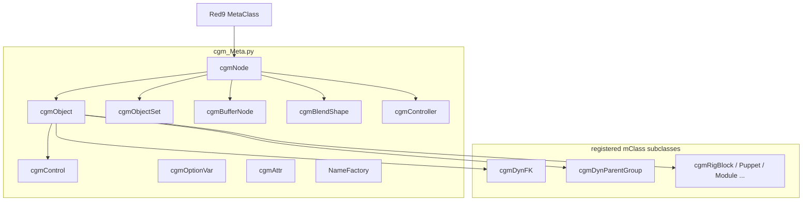

# cgmMeta API scope (dev reference)

Living inventory of **`cgm/core/cgm_Meta.py`** (~6k lines) and closely related **`cgmMeta.*`** subclasses elsewhere. Source of truth for behavior remains the py3 module; this doc is for navigation and agent/human onboarding.

**Related rules:** **`cgm-runtime-meta-not-strings`**, **`maya-cmds-strings-only`**, **`cgm-meta-naming-hierarchy`** (`m*` / `ml_*` / `md_*`; new edits first).

**Revision:** 2026-09-15 — session reload / **`mClass`** registry order; module vs instance APIs.

**Reload / registry:** [`Feature_SimChain.md`](Feature_SimChain.md) **Reload contract** (reference tool). Rules: **`cgm-reload-mod`** § Meta / `mClass` — **no partial meta reload in tools**; **`cgm-meta-and-existing-patterns`**.

### Agent policy (all `mClass` work)

1. **Do not** add new **methods on meta subclasses** or wire tools to **new** `mObj.<method>()` without **explicit user approval** for that instance API.
2. **Default:** implement behavior as a **module function** (`lib/`, `rig/`, `mrs/`) with **`mObj` meta** as an argument; tools and pipelines call the module, not a method you invented on the wrapper class.
3. If the user **did** approve **`mClass` / subclass** code changes: **prompt them to run cgm core reload** (`import cgm.core as CGM; CGM._reload()`) so Red9 + **`cgm_Meta`** + subclass modules register **in order**. **Do not** add Red9/**`cgm_Meta`** partial reload inside a tool’s **`reload_dependencies()`** — it breaks other metaclasses.
4. **Calling existing** documented meta APIs (`p_parent`, `msgList_*`, `connectChildNode`, …) is normal — this policy targets **new** instance surface area.

---

## Which class wraps a Maya node?

| Maya node | Default meta class | Notes |
|-----------|-------------------|--------|
| **`transform`**, **`joint`** (DAG object with TRS) | **`cgmObject`** | Factory and **`validateObjArg`** (no **`mType`**) pick **`cgmObject`** for transforms. Rig/runtime parenting and hierarchy APIs live here. |
| **Shapes** (`mesh`, `nurbsCurve`, …), **`network`**, deformers, etc. | **`cgmNode`** | Non-transform dependency/DAG shapes and utility nodes. Shared attr/message/msgList API; no full **`p_parent`** setter. |
| **`objectSet`** | **`cgmObjectSet`** | Factory special case. |
| Node with **`mClass`** attr | Registered subclass | e.g. **`cgmDynFK`**, **`cgmRigBlock`** — via Red9 registry / **`createMetaNode`**. |

**Convention:** In rig and tools, **`m*`** on something you move, parent, or constrain is almost always **`cgmObject`** (or a subclass). **`cgmNode`** is for the shape side, buffer networks, sets, and other non-transform nodes you still need messages/attrs on.

**Factory logic** (`cgmMetaFactory.__new__`): objectSet → **`cgmObjectSet`**; **`mc.ls(node, type='transform')`** → **`cgmObject`**; else → **`cgmNode`**.

---

## Architecture

| Layer | Role |
|--------|------|
| **Red9 `MetaClass`** | `mNode`, node cache, message graph UI, **`disconnectChild`**, **`delete`**, attr/message helpers not reimplemented in cgm |
| **`cgmNode`** | **Non-transform** nodes (shapes, networks, …): attrs, messages, msgList/datList, naming, duplicate/loc, component mode |
| **`cgmObject`** | **Transform default** (incl. joints): hierarchy via **`transform_utils`**, TRS/pivot/BB, constraints, grouping |
| **`cgmControl`** | Rig control: module/switch hooks, aim/mirror/controller tags |
| **Specialized nodes** | Sets, buffer lists, optionVars, per-attr wrapper **`cgmAttr`**, naming **`NameFactory`** |

End of file: **`r9Meta.registerMClassInheritanceMapping()`** — cgm classes join Red9’s **`mClass`** registry.

---

## Construction and validation

| Entry | Purpose |
|--------|---------|
| **`cgmMeta.cgmMetaFactory`** | **`__new__`**: create or wrap node → **`cgmObjectSet`** if objectSet, **`cgmObject`** if transform, else **`cgmNode`**. Reads **`mClass`** on node (full specialized routing still mostly “log and fall through”). |
| **`cgmMeta.asMeta(*args, sl=…)`** | List → **`validateObjListArg`**, else **`validateObjArg`**. Common UI/selection boundary. |
| **`validateObjArg` / `validateObjListArg`** | Normalize str/meta → instance; honor **`mType`**, node **`mClass`** in registry, **`default_mType`**, **`mayaType`**, **`setClass`**. Transforms default to **`cgmObject`**. |
| **`createMetaNode(mType, …)`** | Instantiate registered class by **`mClass`** string name. |
| **`reinitializeMetaClass(node)`** | Pop Red9 cache entry; re-wrap DAG node (use after reload / class change). |
| **`set_mClassInline` / registry** | Set or verify **`mClass`** attr; changing type after init → **`convertMClassType`** (Red9/cgm). |
| **`isTransform` / `getTransform`** | Thin wrappers → **`search_utils`** (not meta methods). |

**Identity on instances**

- **`mNode`** — current DAG path (Red9); use **only at `mc.*` edge**.
- **`p_nameShort` / `p_nameLong` / `p_nameBase`** — properties (aliases **`getNameShort`**, etc.).
- **`getShortName`**, **`getNameMatches`**, **`getReferencePrefix`**, **`getNameAlias`**, **`getNameDict`**, **`getCGMNameTags`** (legacy naming tags).
- **`cached`** — Red9: skip re-init when serving cached wrapper.
- **`__repr__`** — node short name + **`mClass`** when present.

**Component mode** (face/vtx-style handles): **`getComponent`**, **`isComponent`**, **`getComponents`**.

---

## `cgmNode` — non-transform nodes

Subclasses **`Red9_Meta.MetaClass`**. Use for **shapes**, **network** nodes, and other Maya types that are **not** classified as **`transform`** in the factory. Inherits the shared cgm attr/message API. **Not** the default wrapper for joints/nulls/groups — those are **`cgmObject`**. Limited read-only **`getParent`** only; no **`p_parent`** assignment (see **`cgmObject`**).

### Attributes and connections

| API | Notes |
|-----|--------|
| **`hasAttr`** | API + alias check; falls back to **`mc.objExists`**. |
| **`addAttr`** | cgm-aware create/convert; blocks referenced nodes. |
| **`doStore`**, **`doRemove`**, **`copyAttrTo`** | High-level attr storage patterns. |
| **`getMayaAttr` / `setMayaAttr` / `getMayaAttrString`** | Pass-through to attr layer. |
| **`getAttrs`**, **`resetAttrs`**, **`setAttrFlags`**, **`verifyAttrDict`** | Bulk attr ops. |
| **`doConnectIn` / `doConnectOut`** | Connection helpers with optional transfer/lock. |
| **`isAttrKeyed`**, **`isAttrConnected`**, **`getEnumValueString`** | Query helpers. |
| **`__setMessageAttr__`** | Overload: cgm **`ATTR.set_message`** unless **`ignoreOverload`**. |

### Message links (single)

| API | Notes |
|-----|--------|
| **`connectChildNode` / `connectParentNode`** | **`ATTR.set_message`**; accepts meta (uses **`.mNode`**). |
| **`connectChildrenNodes`** | Multi-child message connect. |
| **`getMessage(attr, asMeta=…, …)`** | Returns strings or meta per flag. |
| **`getMessageAsMeta(attr, asList=False)`** | Preferred rig read when you want instances. |

**Red9:** **`disconnectChild(node, attr=…)`** — not named **`disconnectChildNode`** in Red9; some rig code calls **`disconnectChildNode`** (verify at runtime / align naming with **`disconnectChild`**).

### Indexed lists on node (`msgList_*`, `datList_*`)

Parallel APIs for **message-linked lists** vs **datList** (serialized list attrs).

| Pattern | msgList | datList |
|---------|---------|---------|
| connect | **`msgList_connect`** | **`datList_connect`** |
| get | **`msgList_get`** — default **`asMeta=True`** | **`datList_get`** |
| mutate | append, index, remove, purge, clean, exists | same set |
| temp | **`msgList_getMessage`** | — |

Implementation delegates to **`attribute_utils`** on **`self.mNode`**.

### Naming

| API | Notes |
|-----|--------|
| **`doName`**, **`doTagAndName`**, **`doCopyNameTagsFromObject`** | Scene naming / cgmName tags. |
| **`uiPrompt_rename`** | Artist rename prompt. |
| **`stringModuleCall(module, func, …)`** | MEL-style dispatch into another module with **`self`** context. |

### Scene ops (any node)

| API | Notes |
|-----|--------|
| **`doLoc`**, **`doDuplicate`**, **`doOverrideColor`** | Locator, duplicate, color override. |
| **`getMayaType`** | Node type string. |
| **`getPosition` / `getPositionOLD`**, **`getDag` / `getTransform`** | Position / transform resolution (**`getDag(asMeta=True)`** → **`cgmObject`**). |
| **`getPositionOutPlug`** | World position plug; optional meta. |

### Hierarchy on `cgmNode` (limited)

| API | Notes |
|-----|--------|
| **`getParent(asMeta=False)`** | **`TRANS.parent_get`** — **read-only** property **`p_parent` / `parent`** (no setter on **`cgmNode`**). |
| **`getSiblings(asMeta=False)`** | Siblings via transform utils. |

**Important:** Parent **assignment** for transforms is on **`cgmObject.p_parent`** (**`doParent`** → **`TRANS.parent_set`**), not on bare **`cgmNode`**.

---

## `cgmObject` — transform default

**Default meta class for transforms** (groups, nulls, locators, **joints**, etc.). **`__init__`:** default transform; **`nodeType='joint'`** creates a joint. Requires **`VALID.is_transform`**.

### Hierarchy (prefer in rig/tool logic)

| API | Default / notes |
|-----|------------------|
| **`getParent(asMeta=False, fullPath=True)`** | **`cgmObject`** when **`asMeta=True`**. |
| **`p_parent` / `parent`** | **get + set** — **`doParent`** / **`TRANS.parent_set`**. |
| **`getParents`**, **`getSiblings`** | Ancestor chain / same-level siblings. |
| **`getChildren`**, **`getDescendents` / `getAllChildren`** | Filter by **`type`** (default transform). |
| **`getShapes`**, **`getListPathTo(target)`** | Shape list; path between nodes. |
| **`isParentTo`**, **`isChildTo`**, **`isVisible`** | Relationship / visibility checks. |

### Transform, pivot, bounding box

**`doSnapTo`**, **`doAim`**, **`doAimAtPoint`**, **`setPosition`**, **`getPositionAsEuclid`**, **`getOrient` / `setOrient`**, rotate axis/pivots, **`getBBSize` / `getBBCenter`**, axis vectors, world matrix, transform point/direction (incl. inverse), **`dagLock`**, **`getTransformAttrs`**, **`getPositionOutPlug(autoLoc=True)`**, **`getDeformers`**, **`doCopyPivot`**, **`doMatchTransform`**.

### Grouping and creation

**`doGroup`**, **`doCreateAt`** — null/group at self; optional **`setClass`**, connect-as patterns.

### Constraints

**`getConstraintsTo` / `From`**, **`getConstrainingObjects`**, **`getConstraintsByDrivingObject`**, **`isConstrainedBy`**.

---

## Other classes in `cgm_Meta.py`

| Class | Base | Purpose (summary) |
|--------|------|-------------------|
| **`cgmController`** | **`cgmNode`** | Controller network; **`parent_set` / `parent_get`**, **`purge`**, **`pickWalk`**, **`index_get`**. Factory helper **`controller_get`**. |
| **`cgmControl`** | **`cgmObject`** | Rig control: **`_hasModule`**, **`_hasSwitch`**, **`controller_get`**, group locks, **`doAim`**, mirror tags (**`_verifyMirrorable`**, **`doMirrorMe`**, push to mirror), **`controlTags_*`**. |
| **`cgmObjectSet`** | **`cgmNode`** | Maya set as meta: QSS, set type, **`getList` / `getMetaList`**, **`append` / `remove` / `extend`**, selection helpers, key/reset on members. |
| **`cgmOptionVar`** | (standalone) | Maya **`optionVar`** wrapper: get/set, type, append/remove, UI prompt, recent list helpers. |
| **`cgmBufferNode`** | **`cgmNode`** | Sequential **`item_N`** message/string storage: **`store`**, **`value`**, **`updateData`**, **`rebuild`**, purge/remove by index. |
| **`cgmAttr`** | (standalone) | Rich wrapper for one attr on a **`cgmNode`**: value, min/max, enum, connections, rename — large API (~1.2k lines). |
| **`NameFactory`** | (standalone) | Scene-wide cgm naming iteration (**`doNameObject`**, fast iterate, tag dict). |
| **`cgmBlendShape`** | **`cgmNode`** | Blend shape helper (also a duplicate class name in **`cgm_Deformers.py`** — use the one your caller imports). |
| **`pathList`** | (standalone) | OptionVar-backed path list UI helper. |
| **`cgmTest`** | **`MetaClass`** | Internal/test hook. |
| **`ModuleFunc`** | **`cgmFuncCls`** | Validates **`moduleInstance`** for module-scoped func wrappers. |

---

## Registered subclasses (outside this file)

These use **`mClass`** on the node and **`createMetaNode` / `validateObjArg(mType=…)`**:

| Module | Classes (sample) |
|--------|-------------------|
| **`cgm/core/cgm_RigMeta.py`** | **`cgmDynamicSwitch`**, **`cgmDynamicMatch`**, **`cgmDynParentGroup`** |
| **`cgm/core/rig/dynamic_utils.py`** | **`cgmDynFK`** |
| **`cgm/core/mrs/RigBlocks.py`** | **`cgmRigBlock`**, **`cgmRigBlockHandle`**, **`cgmRigPuppet`**, **`cgmRigMaster`**, **`cgmMasterNull`**, **`cgmRigModule`** |
| **`cgm/core/tools/lightLoomLite.py`** | **`cgmLight`**, **`cgmLightShape`** |

Extend this table when adding new **`mClass`** types.

---

## Red9 inherited behavior (not duplicated in cgm docstrings)

Use **`Red9/core/Red9_Meta.py`** for full detail. Typical calls in cgm codebases:

- **`delete()`**, **`deleteCall`**
- **`disconnectChild(node, attr=…)`** — message unlink
- Message / meta rig UI, **`getChildren`** meta rig walks (Red9 meta rig — distinct from **`cgmObject.getChildren`** DAG walk)
- Cache: **`RED9_META_NODECACHE`**, **`cached`**, dead-node cleanup in **`cgmNode.__repr__`**

Attr **get/set** on nodes often uses **`mObj.attrName`** or **`ATTR.get(mObj.mNode, …)`** patterns rather than a single **`getAttr`** on **`cgmNode`**.

---

## `asMeta` defaults cheat sheet

| Call | Typical default |
|------|------------------|
| **`msgList_get`** | **`asMeta=True`** |
| **`getMessage`** | check call — often string unless **`asMeta=True`** |
| **`getParent`** on **`cgmObject`** | **`asMeta=False`** (explicit **`True`** for rig steps) |
| **`getChildren` / descendents** | **`asMeta=False`** unless requested |

At **`mc.*`**: **`asMeta=False`**, **`.mNode`**, or **`p_nameLong`** — never pass meta instances into commands.

---

## Session reload and `mClass` subclasses

Subclasses defined outside **`cgm_Meta.py`** (e.g. **`cgmDynFK`** in **`cgm/core/rig/dynamic_utils.py`**) register at **module import** via **`cgmMeta.r9Meta.registerMClassInheritanceMapping()`** at the file tail. Red9 maps the node’s **`mClass`** string → **Python class**. That mapping and per-node wrappers go stale in Maya if you reload modules out of order.

### Full core reload

**`import cgm.core as CGM; CGM._reload()`** (see **`cgm/core/__init__.py`**) runs:

1. **`Red9.core._reload()`** (after **`addPythonPackages()`**)
2. **`_l_core_order`** modules in sequence — includes **`cgm_Meta`**, **`cgm_RigMeta`**, **`rig.dynamic_utils`**, …
3. Remaining **`cgm.core.*`** packages

Use when **`mClass`** subclasses, **`cgm_Meta`**, **`cgm_RigMeta`**, or **`registerMClassInheritanceMapping`** modules changed. **Only** this path safely re-initializes the full registry — partial Red9/**`cgm_Meta`** reload inside one tool’s **`reload_dependencies()`** is **forbidden** (breaks other metaclasses).

### Tool `reload_dependencies()` (feature backends only)

Reload **libs** → **rig helpers** → **subclass module last** (e.g. **`dynamic_utils`**), rebind module aliases (**`RIGDYN`**), **`reinitializeMetaClass` + re-wrap** RETAIN handles. **Does not** replace core reload after subclass **class** edits.

**cgmSimChain:** **`dynFKTool.reload_dependencies()`** + **`_dynfk_rebind_loaded_mDynFK`**; shelf **`cgmSimChain()`** also **`cgmGEN._reloadMod(dynFKTool)`**. Log line reminds: **mClass edits need `CGM._reload`**.

### Symptoms (mis-reload)

| Symptom | Likely cause |
|---------|----------------|
| **`AttributeError: object instance has no attribute : foo`** on **`mDynFK.foo()`** | Stale wrapper after subclass edit — **core reload** + rebind; or use module API |
| **`RIGDYN.foo(mDynFK)`** works, **`mDynFK.foo()`** does not | **`foo`** is module-level only — preferred pattern |
| New **`log.info`** in **`dynamic_utils`**, UI handler logs only | Stale **`dynamic_utils`** — **Reload Dependencies** + rebind |
| Other tools’ **`mClass`** types misbehave after SimChain reload | Partial meta reload was used — **avoid**; use core reload only |

### Where to put new behavior

| Kind | Prefer | Reload note |
|------|--------|-------------|
| Tool action, rig op, new pipeline step | **`lib.*` / `rig.*` / `mrs.*` module function** taking **`mObj` meta** | Tool **`reload_dependencies()`** + rebind RETAIN meta |
| Persistent type API on scene nodes | New **`def`** on an **`mClass` subclass | **User approval**; then user runs **`CGM._reload`**; update this doc + **`Feature_*`** |
| UI re-read scene graph | **`reinitializeMetaClass` + fresh wrap** | Does not load new Python — **Reload Dependencies** after module-fn edits |

**Examples:** **`RIGDYN.chain_set_name(mDynFK, …)`** (module) vs **`mDynFK.chain_set_name`** (instance — avoid without approval). **`cgmRigBlock`**, puppet meta, and other registered types follow the same rule.

---

## Gaps and maintenance

- **`cgmMetaFactory`** does not fully branch on every **`mClass`** value yet (logs “specialized processing not implemented” in places).
- **`cgmNode.p_parent`** is read-only; assigning parent requires **`cgmObject`** (or **`TRANS.parent_set`** at lib boundary).
- New **subclass instance methods** require **explicit user approval**, user **core reload** after subclass edits, and updates to this doc + **`Feature_*`** contracts. Prefer **module functions** taking meta unless the user asked for a type method.

**Primary code path:** `d:\Repos\cgmToolsPy3\cgm\core\cgm_Meta.py`
