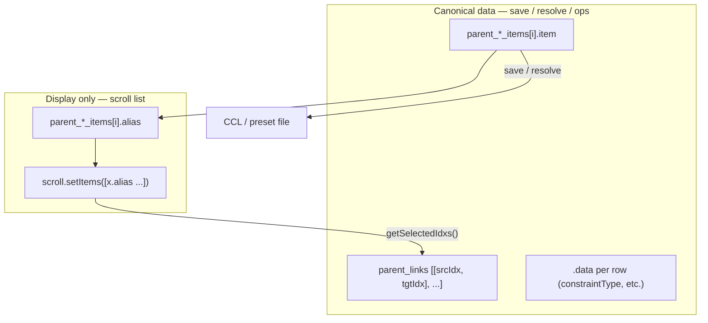

# Feature: cgm Tool UI patterns

## Status and Overview

- **Status**: Living document — initial capture from mocapBakeTools list refactor + Builder scroll-list patterns (August 2026)
- **Last Updated**: August 17, 2026
- **Audience**: Dev / TA / agents — design contract for **Maya tool windows** under `cgm/core/tools/`, `cgm/core/mrs/`, and related UI helpers
- **Purpose**: Prevent **display strings from polluting saved data** (CCL, optionVars, scene presets, message attrs). Document how cgm tools keep **canonical data** and **UI labels** separate, and how scroll lists map selection back to data by **index**, not by parsing row text.

**Maintenance rule**: Add to this doc when you establish or refine a UI pattern in a shipped tool. Link concrete tools as reference implementations. Do **not** duplicate full feature logic here — link to feature-specific docs (e.g. [`Feature_MocapAlignSnap.md`](Feature_MocapAlignSnap.md)) for domain behavior.

**Related docs**

- [`Feature_MocapAlignSnap.md`](Feature_MocapAlignSnap.md) — CCL + link-list UI; canonical example of `cgmListItem` + alias refresh
- [`Feature_MRSWiring.md`](Feature_MRSWiring.md) — MRS Builder block lists (`cgmScrollList`, `BlockScrollList`)
- Module placement — `.cursor/rules/cgm-module-placement.mdc` (UI in `tools/`, shared chunks in `tools/lib/`)

---

## Core rule: data vs display

| Layer | Holds | Must never contain |
|-------|--------|---------------------|
| **Canonical data** | DAG long paths, CCL patterns, meta refs, link index pairs | Scroll-list decoration (`[0]`, `-> [1],[2]`, nice names, filter text) |
| **Display strings** | Aliases rebuilt for the scroll list | Anything written to disk or used as resolve keys without stripping |

**Do not** “fix” polluted strings at save/load time with regex strip helpers. **Prevent pollution at the source**: only pass display strings into the scroll widget; read/write canonical data from parallel structures indexed by row number.



---

## Parallel list pattern (preferred)

Used throughout MRS **Builder** and newer list-heavy tools.

### Structure

| Field | Role |
|-------|------|
| `_ml_loaded` / `parent_*_items` | Ordered list of **scene objects**, **patterns**, or **row wrappers** — source of truth |
| `_l_strings` / `.alias` | Human-readable row text — **derived**, rebuilt when data or display options change |
| Scroll widget | Shows `_l_strings` / aliases only |
| Selection | `getSelectedIdxs()` → index into parallel list → read `.item` / meta |

### Reference: `cgmScrollList` (Builder)

[`cgm/core/mrs/Builder.py`](../../cgmToolsPy3/cgm/core/mrs/Builder.py) — `cgmScrollList`, `BlockScrollList`:

- `rebuild()` fills `_ml_loaded` from scene/meta and builds `_l_strings` for display.
- `update_display()` pushes filtered `_l_strings` into the widget.
- `getSelectedObjs()` → `getSelectedIdxs()` → `self._ml_loaded[i]` — **never** parse the visible string back to an object.
- **`setHLC(mBlock)`** — on select, set widget `hlc` to dimmed row `itc` (`× 0.7`) so selected text stays readable on Maya’s inverted selection row.

[`cgm/core/classes/GuiFactory.py`](../../cgmToolsPy3/cgm/core/classes/GuiFactory.py) — shared `cgmScrollList` adds `_syncHLCFromSelection(dim=0.7)` for row-model lists (`_ml_rows[].itc`); Scene browser passes `SCENE_LIST_HLC_DIM` from `scene_utils.py`.

When adding a new block list in MRS-style tools, **subclass or mirror** this pattern rather than storing formatted strings as the only row identity.

### Reference: `cgmListItem` (mocapBakeTools)

[`cgm/core/tools/mocapBakeTools.py`](../../cgmToolsPy3/cgm/core/tools/mocapBakeTools.py):

```python
class cgmListItem(object):
    """Parallel list row: .item = canonical CCL pattern or DAG string; .alias = display-only."""
    item = None   # pattern or long path — saved to CCL
    alias = None  # scroll label — rebuilt in refresh_aliases()
    data = None   # per-row metadata (e.g. constraintType)
```

Workflow:

1. **Load / add** — set `.item` from CCL pattern or `mc.ls` selection; do not resolve into `.item` on load unless the resolved path *is* the canonical stored form.
2. **`refresh_aliases()`** — compute `.alias` from `.item`, link indices, and display options (short names, index prefixes).
3. **`refresh_parent_scrolls()`** — `scroll.setItems([x.alias for x in items])`.
4. **Ops / save** — use `.item`, `.data`, and `parent_links` indices only.

Index labels (e.g. `[0] spine_cog_anim`) belong in **`.alias`**, not in `.item` or CCL `target_items`.

### Reference: Scene browser lists (asset / sets / variation / version)

[`cgm/core/mrs/Scene.py`](../../cgmToolsPy3/cgm/core/mrs/Scene.py) — four searchable browser columns; row helpers in [`scene_utils.py`](../../cgmToolsPy3/cgm/core/mrs/lib/scene_utils.py).

**Problem**: Mixed columns (sets, variation) list folders and `.ma`/`.mb` files in one scroll. Extension-only cues are ambiguous; decorated strings must not become path / optionVar keys.

**Row type** (`SceneListRow`):

| Field | Role |
|-------|------|
| `.item` | Canonical basename — paths, optionVars, export queue, `selectByValue` restore |
| `.alias` | Scroll label only — dirs: `+ name/` (see below) |
| `.kind` | `'dir'` \| `'file'` — sort + tint |
| `.itc` | Row text color for `iconTextScrollList` |
| `.data` | Optional metadata — `p4Status` when P4 file tint applied |

**Searchable list dict** (`build_searchable_list`):

| Key | Role |
|-----|------|
| `rows` | Full unfiltered `SceneListRow` list — filter source of truth |
| `items` | `[r.item for r in displayed rows]` — canonical basenames |
| `scrollList` | `cgmScrollList` with `_ml_rows` = currently displayed rows |

**Refresh contract** (mirror [`BlockScrollList.update_display`](../../cgmToolsPy3/cgm/core/mrs/Builder.py)):

1. `_push_searchable_rows(searchableList, rows, store=True)` — store source rows when loading from disk.
2. `_refresh_searchable_display(searchableList)` — filter `rows` → temp **`b_selCommandOn=False`**, **`deselectAll`**, then `ra=True` → **`sl.appendDisplayRow(label, itc, displayIndex)`** per row (Builder append + itc in one call); restore `b_selCommandOn` in `finally`.
3. Set `sl._items` / `sl._ml_rows` from displayed rows after append loop.
4. `sl._syncHLCFromSelection(dim=SCENE_LIST_HLC_DIM)` — restore readable selected-row color after rebuild (see below).
5. `process_search_filter` / clear filter → `_refresh_searchable_display` only (do not overwrite stored `rows`).

**Popup / menu reload**: When a scroll-list action (P4 Revert, popup **Refresh**, popup **Delete**, column refresh icon) must rebuild the **same** list, defer the load via `mc.evalDeferred(cgmGEN.Callback(...), lp=True)` — Scene uses `_defer_ui()`. Synchronous `ra=True` during `QMenu::exec` can crash Maya (`QTreeWidget::clear` / `QItemSelectionModel::clear`).

**Selection**: `cgmScrollList.getSelectedItem()` / `getSelectedItems()` map selected index → `_ml_rows[i].item` (canonical). `selectByValue(canonical)` selects by alias internally.

**Row text color (`itc`) and selection highlight (`hlc`)** — `iconTextScrollList` uses two colors:

| Flag | When | Role |
|------|------|------|
| **`itc`** | Unselected row | Per-row text color (set per display index on append) |
| **`hlc`** | Selected row | Selected text color — must be set on every user/programmatic select |

Maya **inverts the selection row background**. Light `itc` values (pastel blue, pure white) copied straight to `hlc` wash out and become unreadable when selected.

**Builder pattern** ([`BlockScrollList.setHLC`](../../cgmToolsPy3/cgm/core/mrs/Builder.py)):

1. **Saturated base `itc`** — e.g. `d_state_colors` / side blue `[0.5, 0.5, 1.0]`, not pastels or `[1, 1, 1]`.
2. **Dimmed `hlc` on select** — `hlc = [v × 0.7 for v in itc]` so selected text stays the same hue but darker (readable on inverted bar).
3. **Call on every select** — `uiScrollList_block_select` → `setHLC(mBlock)`; programmatic select → `selectByObj` → `setHLC`.

**Scene implementation** (`scene_utils.py` tuning constants + `cgmScrollList._syncHLCFromSelection`):

| Constant | Default | Notes |
|----------|---------|-------|
| `SCENE_LIST_ITC_DIR` | `[0.5, 0.55, 1.0]` | Builder-style blue for folders |
| `SCENE_LIST_ITC_FILE` | `[0.85, 0.85, 0.85]` | Off-white files — avoid pure white |
| `SCENE_LIST_HLC_DIM` | `0.7` | Multiply row `itc` for `hlc`; match Builder |

`_syncHLCFromSelection` runs from `selCommand`, `selectByValue` / `selectByIdx`, and `_refresh_searchable_display` (after selection restore). `build_searchable_list` sets default widget `hlc=[.5,.5,.5]` until first select (Builder create-time fallback).

**Display rules** (August 2026):

- Sort: folders first, then files; case-insensitive name within group.
- Dir tint: `SCENE_LIST_ITC_DIR`; file tint: `SCENE_LIST_ITC_FILE` (see table above).
- Filter matches **both** `.item` and `.alias` (typing `rig` finds `+ rig/`).
- **Show all files** toggles reload SubType + Variation + Version lists.

**Folder marker (not icons)**: Maya **`iconTextScrollList` does not render per-row icons** from cmds (no `-image` on append; `numberOfIcons` only reserves empty gutter). Use **alias prefix** instead — dirs: `+ rig/` via `SCENE_LIST_DIR_ALIAS_PREFIX` + trailing `/`; files: plain basename. Pair with folder-first sort + dir `itc` tint.

**P4 file-row colors** (August 2026) — **file rows only**, when `project_uses_perforce(mDat)` **and** `query_project_p4_status()['connected']`:

**Classification priority** (first match wins): `locked_by_other` → `marked_for_add` / `checked_out` → `out_of_sync` → `unknown`.

| UI tint | `classify_file_status_ui` key | Condition | Alias suffix |
|---------|-------------------------------|-----------|--------------|
| Red | `locked_by_other` | `lockedByOther` | `(locked-by-other)` / `(open-elsewhere)` |
| Blue | `checked_out` | `checkedOut`, `openAction == 'edit'` | `(checked-out)` |
| Green | `marked_for_add` | `checkedOut`, `openAction == 'add'` | `(marked-for-add)` |
| Orange | `out_of_sync` | `outOfDate`, not checked out | `(out-of-sync)` |
| Yellow | `unknown` | `notOnDepot`, in client, not checked out | `(unknown)` |
| Off-white | *(default)* | Synced at head; query errors; not in client | *(none)* |

**RGB constants** (`scene_utils.py` — saturated for inverted select row):

| Constant | RGB |
|----------|-----|
| `SCENE_LIST_ITC_P4_LOCKED` | `[1.0, 0.3, 0.3]` |
| `SCENE_LIST_ITC_P4_CHECKED_OUT` | `[0.31, 0.81, 1.0]` |
| `SCENE_LIST_ITC_P4_MARKED_ADD` | `[0.17, 0.50, 0.02]` |
| `SCENE_LIST_ITC_P4_OUT_OF_SYNC` | `[0.84, 0.40, 0.02]` |
| `SCENE_LIST_ITC_P4_UNKNOWN` | `[1.0, 0.88, 0.0]` |
| `SCENE_LIST_ITC_FILE` | `[0.85, 0.85, 0.85]` (synced default) |

**Wiring**: `scene_list_apply_p4_file_itc` → cache-first `query_files_status` once per column load (`LoadSubTypeList`, `LoadVariationList`, `LoadVersionList` via `_apply_p4_file_row_colors`). Sets `row.itc`, `row.alias` via `scene_list_file_alias`, `row.data['p4Status']`. Suffix strings from [`perforce.file_status_ui_suffix`](../../cgmToolsPy3/cgm/core/lib/perforce.py). Dirs always `SCENE_LIST_ITC_DIR`. **`.item` stays canonical basename** — never parse suffix for paths, optionVars, or export. Search filter matches alias suffix text. **Navigation** reuses fstat session cache (fast revisit). Column **Refresh** (icon or popup) invalidates P4 cache for **that column's directory only** (`_refreshSubTypeList` / `_refreshVariationList` / `_refreshVersionList`) then reloads; external depot changes stay stale until Refresh.

**P4 right-click menu** (August 2026) — file scroll lists (`subTypeSearchList`, `variationList`, `versionList`), button 3 popup:

| Gate | Behavior |
|------|----------|
| `versionControl != 'perforce'` | No Perforce section in menu |
| `versionControl == 'perforce'`, P4 disconnected | Perforce divider + Revert / Sync / Submit shown, **`en=False`** |
| Connected + **file** row selected | Items **`en=True`** |
| Connected + **dir** row (SubType/Variation) | P4 items **`en=False`** |

Menu items (in order): **Checkout** (`p4 edit`), **Add** (`p4 add`), **Revert**, **Sync**, **Submit**. Callbacks validate fstat before confirm (e.g. checkout blocked when out of date or not on depot; add blocked when already on depot).

Actions call [`perforce.py`](../../cgmToolsPy3/cgm/core/lib/perforce.py) write APIs on selected file path(s); confirm dialogs match cgmP4. After success: `invalidate_fstat_paths` + **deferred** reload of owning column via `_scene_p4_after_write(list_key=)` (refreshes P4 colors; avoids Qt popup reentrancy crash). Implemented in [`Scene.py`](../../cgmToolsPy3/cgm/core/mrs/Scene.py): `_defer_ui`, `_append_p4_file_menu`, `uiFunc_p4_checkout_file`, `uiFunc_p4_add_file`, `uiFunc_p4_revert_file`, `uiFunc_p4_sync_file`, `uiFunc_p4_submit_file`.

**Pitfall (blank lists)**: Widget-only `ra=True`, then `appendDisplayRow` (append + itc per display index). Do not wipe `_ml_rows` before populate.

**Pitfall (Maya crash on popup refresh)**: Calling `ra=True` or `selectIndexedItem` on an `iconTextScrollList` **from its own right-click menu callback** (P4 actions, popup **Refresh**, popup **Delete**) runs list mutation while the menu event loop is still active → intermittent `ACCESS_VIOLATION` in `QItemSelectionModel`. **Fix**: defer the menu action and column reload (`_defer_ui` / `mc.evalDeferred`); centralize post-delete reload via `_defer_list_reload_after_delete(mode)`; in `_refresh_searchable_display`, disable `b_selCommandOn` and `deselectAll` before `ra=True` (Builder `rebuild` pattern).

**Future**: real icons need PySide — out of scope for Mel columns.

---

## Scroll list widgets

| Widget | Typical use | Selection API |
|--------|-------------|---------------|
| `cgmScrollList` / `BlockScrollList` | Meta/block rows with icons, filters | `getSelectedIdxs()` → `_ml_loaded` |
| `MelObjectScrollList` | Legacy lists; object stored, string from `itemAsStr` | `getSelectedIdxs()` → `_items` |
| `MelTextScrollList` | Plain string list (display = stored if you control strings) | Index into your parallel list |

### `MelObjectScrollList.itemAsStr` caveat

[`cgm/core/lib/zoo/baseMelUI.py`](../../cgmToolsPy3/cgm/core/lib/zoo/baseMelUI.py) — when `DISPLAY_NAMESPACES` is false, `itemAsStr` keeps only the segment **after the last `:`**. That breaks display-only prefixes like `[0] name` on non-namespaced rows (prefix is lost).

**Acceptable fixes** (display layer only):

- Patch `scroll.itemAsStr` on that scroll instance to preserve a leading `[n]` prefix before namespace strip (mocapBakeTools target list).
- Prefer `MelTextScrollList` / alias-only strings via `setItems([x.alias ...])` so the scroll never re-formats canonical data.

**Do not** store decorated strings in `.item` and strip them later in lib code.

---

## Links and indices

When a tool connects **source row i → target row j**:

- Store **`[[i, j], ...]`** in a dedicated link list (e.g. `parent_links`, CCL element `[4]`).
- Show link hints in **aliases** (`spine_cog_anim -> [0],[1]`) for artist readability.
- Remap indices when rows are inserted, removed, or reordered — update link list, then `refresh_aliases()`.

Never encode list indices into pattern strings saved to CCL.

---

## Presets, CCL, and file IO

For multi-list tools (mocap align, constraint presets, etc.):

| CCL / file slot | Content |
|-----------------|--------|
| `source_items` / `target_items` | Clean patterns or paths only |
| `links` | Index pairs only |
| `connection_data` / per-link dicts | Patterns + captured offsets; resolved paths may be filled at runtime in memory |

**Load**: populate `.item` from file patterns; resolve at **Capture / Snap / Bake** time, not by overwriting `.item` with long DAG paths unless that is the intentional on-disk format.

**Save**: `[x.item for x in items]` and `[x.data for x in items]` — not scroll labels, not aliases.

---

## Display options

Common pattern:

- **OptionVar** toggles display (e.g. `mocap_show_short_names`) — affects **alias rebuild only**.
- **`parse_alias(name)`** — central place for short-name vs long-path formatting from canonical `name`.
- Changing display → call `refresh_aliases()` then `refresh_parent_scrolls()` — do not mutate `.item`.

---

## Tool shell conventions

| Topic | Pattern |
|-------|---------|
| Base class | `cgmUI.cgmGUI` for standard tool windows |
| Reload | `tool_calls.<toolName>()` reloads libs then module; **Setup → Reload** in window calls same path |
| Direct `MODULE.ui()` | Shelf/toolbox buttons that bypass `tool_calls` skip reload — prefer `tool_calls` for dev iteration |
| Shared UI chunks | `cgm/core/tools/lib/` when multiple tools reuse the same list or section |

---

## Section layout: width vs height (Maya Mel)

Common pitfall when adding **status / instruction blocks** or **centered multi-line labels** inside collapsible frames: text looks centered but only within a **narrow widget**, or the section gains **extra vertical padding**.

### `MelColumnLayout` `adj` is horizontal, not vertical

| `adj` (adjustableColumn) | Effect |
|--------------------------|--------|
| **`True`** (default in many cgm columns) | Children **stretch to the column width** |
| **`False`** | Children stay **only as wide as their content** |

**Symptom**: `align='center'` on a label looks correct, but the label’s parent is content-sized — text is centered in a small box, not the full section.

**Fix**: Keep **`adj=True`** on the inner column when you need full-width rows. Do **not** turn `adj=False` to “fix height” — that trades one bug for another.

Tight **vertical** height instead comes from explicit control sizing (below), not from disabling column stretch.

### Full-width centered label — use `MelHSingleStretchLayout`

Prefer the same row pattern as Connection text fields in [`p4Tool.py`](../../cgmToolsPy3/cgm/core/tools/p4Tool.py) (Status section):

```python
_row = mUI.MelHSingleStretchLayout(_inside, ut='cgmUISubTemplate', padding=0, expand=False)
mUI.MelSpacer(_row, w=1, h=1)  # optional; minimal side anchor
self.uiLabel_status = mUI.MelLabel(_row, align='center', h=15, ...)
_row.setStretchWidget(self.uiLabel_status)
_row.layout()
```

| Piece | Why |
|-------|-----|
| **`setStretchWidget(label)`** | Label absorbs horizontal space → `align='center'` centers across the **section** |
| **`padding=0`** | No extra row inset inside compact status blocks |
| **`expand=False`** | Row does not grow vertically to fill the frame (`MelHSingleStretchLayout` default; set explicitly when copying the pattern) |
| **Parent column `adj=True`** | Row itself stretches to frame width |

**Avoid** relying on **`MelFormLayout`** alone for this case: attaching the label to all four edges centers text inside the form, but the form may still shrink to content width when the parent column does not stretch.

### Compact collapsible status block

For header frames (`cgmUIHeaderTemplate`) with minimal vertical slack:

| Setting | Typical value |
|---------|----------------|
| `leading_spacer` | `False` when no top padding needed |
| `row_spacing` | `0` on inner column |
| `margin_height` | `2` on frame (not default frame padding) |
| Label `h` | Fixed at build; on update: `(13 * line_count) + 2` for multi-line status text |
| Dynamic text | Set `l=` and `h=` together in one `edit=True` — do not rely on word-wrap height alone |

Reference: `uiFunc_set_status_panel()` + Status block in [`p4Tool.py`](../../cgmToolsPy3/cgm/core/tools/p4Tool.py).

### Collapsible section helper (optional)

Repeated pattern in newer tools — wrap `MelFrameLayout` + optionVar collapse + inner column kwargs:

```python
def _build_collapse_frame(self, parent, label, option_name, default_collapsed=0,
                          leading_spacer=True, column_adj=True, row_spacing=None, margin_height=None):
    ...
```

Pass **`column_adj`**, **`row_spacing`**, **`margin_height`** per section rather than one global column style.

### Checkbox + collapsible frame + header buttons (animFilter pattern)

For **batch actions on grouped rows** (animFilter actions list, cgmP4 opened + shelved changelists):

```python
_row = mUI.MelHSingleStretchLayout(parent, bgc=header_bgc, padding=2)
_master_cb = mUI.MelCheckBox(_row, value=1, changeCommand=cgmGEN.Callback(toggle_all, self, group_key))
_sub_column = mUI.MelColumnLayout(_row, bgc=header_bgc)
_frame = mUI.MelFrameLayout(_sub_column, label='Group label (N)', collapsable=True, collapse=False, bgc=header_bgc)
# ... per-item rows with their own checkboxes inside _frame
mUI.MelButton(_row, l='R', w=22, ...)  # compact batch action
mUI.MelButton(_row, l='S', w=22, ...)
_row.setStretchWidget(_sub_column)
_row.layout()
```

| Piece | Why |
|-------|-----|
| **Master checkbox** | Select/deselect all items in the group (`changeCommand` pushes to row checkboxes) |
| **Frame in stretch column** | Collapsible content without sacrificing header button column width |
| **Short button labels (`R`, `S`)** | Keeps header row narrow; use `ann=` for full tooltip |
| **Per-row checkboxes** | Batch action applies to checked subset; all/none → whole-group API |

Reference: [`animFilterTool.py`](../../cgmToolsPy3/cgm/core/tools/animFilterTool.py) `uiBuild_ActionsColumn`; [`p4Tool.py`](../../cgmToolsPy3/cgm/core/tools/p4Tool.py) `uiFunc_build_opened_changelist_section`, `uiFunc_build_shelved_changelist_section`.

**Section empty state (cgmP4):** Messages like `(no shelved changelists)` use a **persistent** full-width `MelHSingleStretchLayout` + centered label in the collapse-frame **inner column** (same as Status) — toggle visibility vs the dynamic content frame (`uiFrame_opened` / `uiFrame_shelved`). Do not build empty text only inside the dynamic content column (no stretch width → center align fails).

**Data refresh:** Rebuild grouped UI from canonical structured data on Refresh; store parallel flat list (`_l_opened_entries`) indexed for row callbacks — do not parse frame labels back to data.

---

## Anti-patterns (avoid)

| Anti-pattern | Why it fails | Instead |
|--------------|--------------|---------|
| Save scroll list `query` strings to CCL | Labels include indices, arrows, nice names | Save parallel `.item` list |
| Parse P4 `(checked-out)` suffix from scroll for paths | Alias is display-only | `getSelectedItem()` → `.item`; paths from canonical basename |
| Parse `[n]` prefix out of patterns at resolve time | Masks UI bugs; fragile regex | Keep patterns clean; indices in links / aliases |
| Shadow fields (`cclPattern` duplicate of `.item`) | Two sources of truth drift | Single `.item` canonical field |
| Resolve to long DAG on load into `.item` | Save compacts wrong; display toggles break | Keep pattern; resolve in connection pass |
| Select-by-matching display string | Breaks when alias changes | `getSelectedIdxs()` |
| Light pastel / white `itc` copied to `hlc` on select | Maya inverts selection row; text washes out | Saturated `itc` + dimmed `hlc` (`itc × 0.7`); see Builder `setHLC` |
| Rebuild scroll list (`ra=True`) or `selectIndexedItem` inside its popup menu callback | Qt reentrancy crash in `QItemSelectionModel` | `mc.evalDeferred(..., lp=True)`; defer Delete handler + `_defer_list_reload_after_delete`; disable `b_selCommandOn` + `deselectAll` before clear |
| `column_adj=False` to reduce vertical space | Shrinks row **width**; centered labels look wrong | `adj=True` + explicit label `h`, `row_spacing=0`, `expand=False` on stretch row |
| `MelFormLayout` only for full-width centered status | Form may stay content-width | `MelHSingleStretchLayout` + `setStretchWidget(label)` |

---

## Reference implementations

| Tool / module | Pattern | Notes |
|---------------|---------|-------|
| [`Builder.py`](../../cgmToolsPy3/cgm/core/mrs/Builder.py) | `cgmScrollList`, `_ml_loaded` + `_l_strings` | Block browser, filter, select by meta |
| [`mocapBakeTools.py`](../../cgmToolsPy3/cgm/core/tools/mocapBakeTools.py) | `cgmListItem`, dual lists + links, CCL | Align tab; target `itemAsStr` patch; last-CCL autoload + status bar |
| [`animFilterTool.py`](../../cgmToolsPy3/cgm/core/tools/animFilterTool.py) | LastLoaded optionVar + pathList recent | `post_init` autoload; status row with clear/explore |
| [`Scene.py`](../../cgmToolsPy3/cgm/core/mrs/Scene.py) | `SceneListRow` + searchable `rows`/`items` | Browser columns: `+ name/` dir alias, P4 file `itc` + `(status)` suffix, canonical `getSelectedItem()`; `_defer_ui` for popup/column reload; `_defer_list_reload_after_delete` after file delete |
| [`p4Tool.py`](../../cgmToolsPy3/cgm/core/tools/p4Tool.py) | Collapsible header frames, status buffer, changelist batch UI | Status stretch row; animFilter-style CL header (checkbox + **collapsible frame** + **R**/**S**/**Sh** or **D**/**Mv**/**Sub**); Shelved Files blue headers; section empty rows; standard Setup → Reload |

---

## Session persistence (last file / recent)

For tools that load external preset files (CCL, AFS, etc.), use the **`animFilterTool`** pattern:

| Piece | Purpose |
|-------|---------|
| **`create_guiOptionVar('…_last_…')`** | Single global path for autoload on next open |
| **`cgmMeta.pathList('…_Recent')`** | Recent-files submenu (separate from autoload key) |
| **`post_init`** | If last path exists on disk → load without dialog |
| **Status row** | Truncated path label + clear (drops autoload only) + open-folder |
| **Persist on save and load** | Keep optionVar accurate after both operations |

**mocapBakeTools (Aug 2026)**: `mocap_last_ccl`, `mocapBakeTool_CCLRecent`, status bar above source/target lists, **Setup → Recent**.

**Clear semantics**: status-bar Clear wipes last-path optionVar and label — it does **not** clear in-session list data unless the tool explicitly adds that behavior.

---

## Open / TBD (flesh out over time)

- [ ] Standard lightweight row type in `tools/lib/` (shared `cgmListItem` vs inline per tool) — Scene uses `SceneListRow` in `mrs/lib/scene_utils.py`
- [ ] When to use `iconTextScrollList` vs plain `textScrollList` for new tools
- [x] Filter field + scroll rebuild contract — Scene `_refresh_searchable_display` (Builder `BlockScrollList` pattern)
- [ ] Multi-column or two-way list tools (source/target) — naming conventions for links + reorder menus
- [ ] OptionVar naming convention table across tools
- [ ] Popup menus on lists — index capture before modal dialogs
- [ ] Persisting selection across `refresh_aliases()` / rebuild
- [x] Alternating row backgrounds + per-row action buttons — cgmP4 opened-files list (nested by changelist)
- [ ] Changelist sub-section collapse persistence via optionVar (deferred — dynamic CL ids)

*Add sections here as patterns repeat across tools.*

---

## Revision history

| Date | Summary |
|------|---------|
| 2026-08-17 | cgmP4 Shelved Files UI + section empty-state centered rows; collapsible per-CL frame preserved (animFilter pattern) |
| 2026-08-17 | Scene browser popup Delete crash fix: defer Delete menu + `_defer_list_reload_after_delete`; single version delete uses `LoadVersionList` |
| 2026-08-13 | Scene log noise: removed `HasSub` debug warnings (asset popup loop); P4 cache status at debug in perforce.py |
| 2026-08-13 | Scene browser scroll-list popup crash fix: defer column reload from P4/Refresh menus; `_refresh_searchable_display` `b_selCommandOn` + `deselectAll` before `ra=True` |
| 2026-08-13 | Scene browser P4 right-click menu: Checkout/Add/Revert/Sync/Submit on file popups when versionControl + connected |
| 2026-08-13 | Scene browser P4: alias suffix `(status)`, locked red, unknown yellow; `file_status_ui_suffix`, `scene_list_file_alias` |
| 2026-08-13 | Scene browser P4 file-row colors (versionControl + connected): batch fstat, status tints, `SceneListRow.data` |
| 2026-08-13 | Scene browser selection highlight: `itc`/`hlc` contract (Builder `setHLC`, saturated base colors, `SCENE_LIST_HLC_DIM`); `_syncHLCFromSelection` |
| 2026-08-13 | Scene browser: drop iconTextScrollList row icons (Maya unsupported); dir alias `+ name/` prefix |
| 2026-08-13 | Scene browser row icons attempt — not rendered in Maya cmds API |
| 2026-08-13 | Scene browser lists: `SceneListRow`, searchable `rows`/`items`, Builder-style append+itc refresh, dir `name/` alias, folder-first sort |
| 2026-08-13 | animFilter-style checkbox + frame + compact header buttons; p4Tool changelist R/S batch pattern |
| 2026-08-13 | Section layout: `column adj` = horizontal stretch; full-width centered labels via `MelHSingleStretchLayout`; compact status block kwargs; p4Tool ref |
| 2026-08-12 | Session persistence pattern: last-file optionVar + pathList recent + status bar; refs animFilterTool + mocapBakeTools autoload |
| 2026-08-11 | Initial doc: data vs display rule, parallel lists, `cgmListItem`, `cgmScrollList`, `MelObjectScrollList` caveat, CCL IO, anti-patterns; refs Builder + mocapBakeTools |
