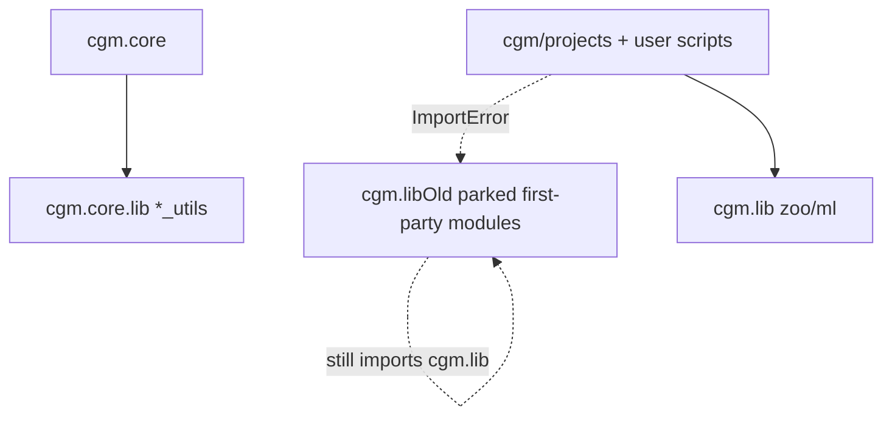
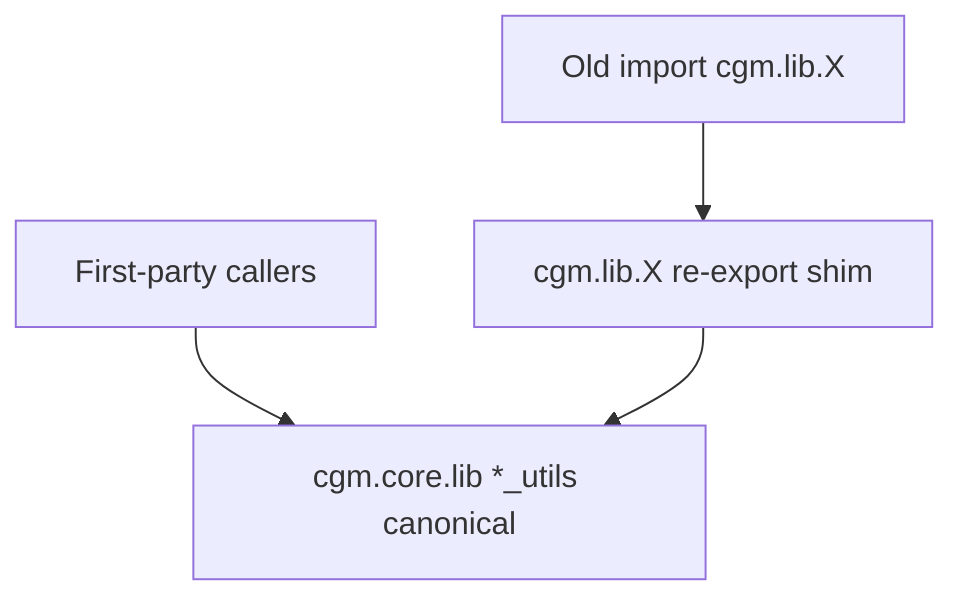

# Feature: cgm.lib to cgm.core migration

## Status and Overview

- **Status**: **Complete — Phase 2** (2026-09-01). Waves 0–9 shipped. First-party `cgm.lib` → core; leftover zoo used-slices owned; Maya contract tests + `UISMOKE`; cgm menus do not launch leftover zoo UIs. **Red9 stays** (still maintained).
- **Last Updated**: September 1, 2026 (Phase 2 closed)
- **Owners**: Josh Burton
- **Audience**: Dev / TA / agents — living map of the `cgm.lib` → `cgm.core` move and leftover vendored peel
- **Branch**: [`Branch_SpringCleaning.md`](../Branches/Branch_SpringCleaning.md)

**Purpose**: First-party Maya helpers started in `cgm.lib` (pre-MRS). They were rewritten into `cgm.core.lib.*_utils` and related homes. **Production `cgm.core` is grep-clean** of live first-party `cgm.lib`. First-party implementations are parked in **`cgm/libOld`**. This doc is the living map: what maps where, what stays vendored, shim rules (historical), and how tests gated each wave. Do not revive hollow shims or port `libOld` unless explicitly asked.

**Phase 2** (closed 2026-09-01): owned the zoo calls we actually use (UI already in `cgm/core/lib/zoo`; skin transfer in `SKIN.transfer_fromTo`). Left Red9. Characterizing tests for Maya-fragile APIs (SEARCH / SNAP / ATTR driver / TEXTURE) plus `UISMOKE`. Did not rewrite `baseMelUI`. Did not replace `r9Meta.MetaClass`.

**Maintenance rule**: Living map — update if a leftover `libOld` module is later shimmed, deleted, or a core caller regresses onto `cgm.lib`. Do not treat inventory “Partial / Shim not done” rows as open work. Timeline lives in the branch doc.

**Related docs**

- [`Branch_SpringCleaning.md`](../Branches/Branch_SpringCleaning.md) — timeline
- [`.cursor/rules/cgm-module-placement.mdc`](../.cursor/rules/cgm-module-placement.mdc) — where new helpers go
- [`Feature_CgmToolUI.md`](Feature_CgmToolUI.md) — tool UI (not this migration)
- [`Feature_PerforceIntegration.md`](Feature_PerforceIntegration.md) — zooPy perforce is reference-only; same vendored rule applies here

---

## Scope

### In scope

- First-party top-level `cgm/lib/*.py` that still have callers outside `cgm/lib`
- First-party `cgm/lib/classes/` factories still imported by core or shipped tools
- Retargeting **first-party** callers (`cgm.core`)
- **Dropped named legacy artist tools** under `cgm/tools` (attrTools 1.0, tdTools, locinator 1.0, setTools 1.0, namingTools, puppetBox, bufferTools, polyUniteTool, plus old `cgm/tools/markingMenus`, plus leftover animTools 1.0 + locinatorLib / tdToolsLib / namingToolsLib) — use `cgm.core.tools` only.
- Thin **shims** so `import cgm.lib.X` keeps working for user scripts / ProjectScripts
- Unittest safety net: characterizing tests before a port, real tests (not `pass`) as each module is touched

### Out of scope

- **`cgm/lib/zoo/`** full tree — unmaintained; **do not port wholesale**. Phase 2 owns **used slices only** (skin transfer; UI already forked). **Wave 8:** cgm menus no longer launch zoo XferAnim / Keymaster / Shots / HUD / Tangent Works / zooToolbox / refPropagation. Vendored tree stays on disk; existing hotkeys that source zoo MEL still work if `cgm.lib.zoo` is on the path.
- **`ml/`**, **`bo/`**, **`openSource/`** — vendored. Exception: live `cgm.core` callers use **`cgm.core.lib.ml_tools`**, not `cgm.lib.ml`. zooSetkey.mel South dragBreakdown is a one-line `ml_tools` hook (2026-09-01).
- **`Red9/`** — **stays**. Still maintained. `cgmNode` inherits `r9Meta.MetaClass`. Do not replace. Do not edit without explicit clearance. Contract canaries live in `test_cgmMeta.test_base` (`Test_r9Issues`).
- Rewriting MRS (`modules.py` was replaced by MRS; do not port the old module system)
- Rewriting remaining `cgm/tools` that are **not** on the cut list (`cgm/tools` is empty after the findTextures move)
- Deleting **`cgm.lib`** this branch (the **package** stays for zoo/ml). First-party modules were **moved** to `cgm/libOld` as a probe, not deleted.
- Rewriting **`cgm/core/lib/zoo`** (`baseMelUI`) this phase
- Introducing pytest (keep unittest + Toolbox Unittesting menu)
- Python 2 backport of this work (py3-only)

### Non-goals

- Big-bang rewrite of every lib line
- Porting unused / show-specific code (`specialCaseStuff.py`, `gigs/`)
- Making core import from zooPy perforce or other vendored P4

---

## Architecture

### Dual stack (current problem)

Other first-party modules were parked in **`cgm/libOld`** (probe). `from cgm.lib import attributes` / `lists` now fails. **`cgm/projects`** and user scripts still import the old `cgm.lib` names (they `ImportError`; they were not retargeted to `libOld`).

Parked files still `from cgm.lib import …` each other, so `import cgm.libOld.X` is not a working package.



**Target after a completed wave:**



### Per-module recipe

1. **Usage map** — which functions are called outside `cgm/lib` (core vs `cgm/tools` vs `cgm/projects`).
2. **Characterizing tests** — lock current canonical behavior. If lib and core disagree, **core wins**; document the delta here; alias the old name on the shim.
3. **Port used functions** into the existing core module (or the placement-rule home). Do not dump into `cgm_General.py`.
4. **Retarget** `cgm.core` first (break the cycle), then tools/projects.
5. **Shim** (when restoring `import cgm.lib.X`): put a re-export module back on **`cgm/lib/X.py`**, not inside `libOld`. Old names on the shim. Do not add them on `*_utils`.
6. **Grep gate** — touched core files must not `from cgm.lib import that_module`.

If a function has **zero callers outside parked lib**, leave it in **`libOld`** until that file is shimmed or the leftover caller goes away.

### Closed on this branch — Waves 0–5 (2026-09-01)

First-party migration is done. Phase 2 (zoo leftover + contract tests + `UISMOKE`) is **closed 2026-09-01** — see **Phase 2** below. Optional still not this branch: revive hollow shims for user scripts, retarget `cgm/projects`, or delete `libOld`.

| Item | Status | Notes |
|------|--------|-------|
| Maya smoke of **core** tools | **Closed 2026-09-01** | Called complete. Scene, MRS, mocap bake, Toolbox (TD / Anim / Settings), PuppetKey MM, rigger MM, zoo/ml. |
| `cgm - All` | **Closed 2026-09-01** | Runner prints a PASS/FAIL rollup at the end. |
| Hollow-shim `attributes` / `search` (and others) back onto `cgm.lib` | **Won’t do** | Production core does not need it. `returnObjectType` ≠ `VALID.get_mayaType` for components. |
| **animTools 1.0** | **Dropped 2026-09-01** | Deleted `animTools.py`, locinatorLib / tdToolsLib / namingToolsLib, `animToolsLEGACY()`, then `animToolsLib`. PuppetKey uses `cgm.core.lib.ml_tools`. |
| `findTextures` | **Moved 2026-09-01** | `cgm/core/lib/texture_utils.py` (`TEXTURE.remap_missing` / `localize`). Scene Tools → Remap Unlinked Textures. |
| zooSetkey.mel dragBreakdown | **Fixed 2026-09-01** | South item → `ml_breakdownDragger.drag()` (same as PuppetKey). |
| `cgmBaseMelUI` | **Deleted 2026-09-01** | Unused one-line re-export. Core uses `cgm.core.lib.zoo.baseMelUI`. |
| `cgm/projects` mk1 / morpheus / lbs | **Skip** | Show scripts; not production core. |
| Leftover deformers bake / leftover joints helpers / bulk skinning | **Do not port** | libOld internals, not core. |
| Old `modules` null-system | **Do not port** | MRS replaced it. |
| `cgm.lib.lists` shim | **Dropped 2026-09-01** | Production uses `list_utils`. `test_LISTS.Test_noOldAliases` disk-checks old names are not on core. |
| Delete `cgm.lib` package / migrate zoo/ml/bo/openSource/Red9 | **Out of scope** (refined Phase 2) | Package stays. **Red9 stays** (maintained). Zoo **used slices** are Phase 2, not a full migrate. **libOld is already on git** — no P4 `move`. |

### Phase 2 — leftover zoo + Maya contract tests (closed 2026-09-01)

Zoo is **unmaintained**. Red9 is **maintained** — leave it. UI already lives in `cgm/core/lib/zoo`. The live production zoo *call* was skin transfer.

| Item | Status | Notes |
|------|--------|-------|
| `SKIN.transfer_fromTo` owns closest-point copy | **Maya-verified 2026-09-01** | Was `skinWeights.transferSkinning`. Uses `SKIN.get_cluster` + `mc.copySkinWeights`. |
| `baseMelUI` MEL press callback | **Maya-verified 2026-09-01** | Imports `cgm.core.lib.zoo.baseMelUI`, not `cgm.lib.zoo.zooPyMaya`. Do not rewrite the UI layer. |
| `toolbox.py` ml dual-stack | **Maya-verified 2026-09-01** | ArcTracer / CopyAnim / Hold → `cgm.core.lib.ml_tools` (same as PuppetKey). |
| zoo XferAnim menu landmine | **Superseded Wave 8** | Was `TOOLCALLS.loadXferAnim`. Menu item removed. |
| SEARCH / SNAP / ATTR driver / TEXTURE / SKIN transfer tests | **Maya-verified 2026-09-01** | In `_d_modules['coreLib']`. Red9 canaries already in `test_base.Test_r9Issues`. |
| UI open/close (`UISMOKE`) | **Maya-verified 2026-09-01** | Shipped cgm windows from `tool_calls`. Skip Red9 / ngSkin / ml / marking menus / actions. Needs Maya GUI. `Close(skipVerify=True)` for `VERIFY_CLOSE`. Idle flush after open/close. Deferred rebuilds no-op if the widget is gone. |
| Zoo Toolbox / Keymaster / Shots / HUD / Tangent Works / refPropagation | **Maya-verified Wave 8** | Off cgm menu / `tool_calls`. Tree stays in `cgm/lib/zoo`. CGM menu rebuilds each open (`postMenuCommandOnce=False`); Reload Core calls `uiMainMenu_rebuild`. |
| Replace Red9 MetaClass | **Won’t do** | Still maintained. Spine of cgmNode / MRS / Pose. |
| Update Tool GitHub / py3 branches | **Code 2026-09-01** | Empty `get_dat` does not crash the window. Py3 Maya only lists `cgmToolsPy3` (`main` / `diffusionTools`); refuses py2 branch names. |

### Prefer the newer core API

Old lib names are not the long-term core surface. If `cgm.core` already has a better call, **use that** — do not add 1:1 old-name wrappers on core just to match leftover `cgm.lib` signatures.

- Leftover **`cgm/projects`** still import old `cgm.lib` names (they `ImportError` after libOld). Parked implementations live in `libOld` and still `from cgm.lib import …` each other.
- Core callers retarget to the modern name (`TRANS.group_me`, `CORERIG.copy_pivot`, `NAMES.get_base`, `CORERIG.shapeParent_in_place`, …).
- Old names belong on the **shim** when a lib file is hollowed, not as a parallel API on `*_utils`.
- Exception: the newer call is **not** a drop-in when it changes behavior (e.g. `SNAP.go` converts rotateOrder — mocap snap stays `move_point_snap`). Document that delta here; do not silently swap.

### Audit of shipped waves (August 25, 2026)

Old-name aliases on core were a migration convenience. **`cgm/projects`** and user scripts still *call* old lib names (now `ImportError`); those aliases are not required on `*_utils`.

**Hygiene pass (same day):** core callers retargeted to the modern name; unused old-name aliases dropped from `list_utils` / DIST / MATH / SHARED / SNAP / GuiFactory. lists old names live on the **`cgm.lib.lists` shim only**. Leftover `distance` / `cgmMath` / `dictionary` / `position` / `guiFactory` keep their own old names until those files are shimmed.

| Wave | Module | Verdict | After hygiene | Keep / drop |
|------|--------|---------|---------------|-------------|
| 1 | `lists` | Shim is correct. Canonical is `get_*`. | Core callers use `get_chunks` / `get_noDuplicates` / `get_listPairs` / `reorder_in_place`. Aliases on **shim only** | Leave shim aliases. Do not put `return*` back on `list_utils` |
| 2 | `attributes` / `search` | **Done right.** Core uses ATTR/SEARCH/VALID. No old-name wrappers intended. | — | Leave. Do not alias `returnObjectType` = `get_mayaType` |
| 3 | `distance` | Core uses `get_*` / `POS.get` | `return*` wrappers removed from DIST | Leftover lib keeps `return*`. **Do not** alias `returnClosestPoint` = `get_closest_point` |
| 3c | `position` snap | **Keep.** `move_point_snap` / `move_orient_snap` are the correct APIs (`SNAP.go` is not). | `movePointSnap` aliases dropped | Do not add camelCase aliases on SNAP |
| 3d | `cgmMath` | Canonical is `is_float_equivalent` / `normalizeListToSum`. `mag` is already the core name | `normSumList` / `isFloatEquivalent` aliases dropped; skinDat uses `normalizeListToSum` | Do not alias `multiplyList` = `MATH.multiply` |
| 3e | `dictionary` | Canonical data is `_d_axis_string_to_vector` (tuples), `_l_axis_by_string`, `_d_gui_state_colors` | `returnStringToVectors` / `stringToVectorDict` / `returnStateColor` helpers dropped | Leftover lib keeps old lookups. `'ready'` green is core `0.5` |
| 3f | `names` | **Done right** after contract pass | `NAMES.get_base` | Leave. No `getBaseName` on NAMES |
| 3g | gui / optionVars | `do_purgeOptionVar` / `do_resetGuiInstanceOptionVars` are core. `purgeCGM` has no newer name (Toolbox wipe) | puppetKey appends `self.optionVars` inline; Reset → `do_resetGuiInstanceOptionVars`. `appendOptionVarList` / `purgeOptionVar` aliases dropped | Keep `purgeCGM`. Do not call it from unittest |
| 3h | `rigging` | **Done right** after contract pass | `TRANS.group_me` / `copy_pivot` | Leave. No `groupMeObject` on CORERIG |
| 5 | legacy UIs | Cut; Toolbox Legacy tab removed 2026-08-25; leftover animTools 1.0 + `animToolsLib` deleted 2026-09-01; `findTextures` → `texture_utils` | — | `cgm/tools` empty |

**Not in this audit:** leftover `modules` null system (do not port), bulk deformers bake, leftover joints helpers. See **Closed on this branch** above.

### Shim rules

- New first-party code imports **core only** (`import cgm.core.lib.list_utils as LISTS`).
- No new `from cgm.lib import …` in `cgm.core`.
- Shim shape: `from cgm.core.lib.x_utils import *` plus explicit aliases for renamed APIs (`returnListChunks = get_chunks`).
- Old names stay on the **lib shim** when that file is hollowed. Do not add them on core unless core callers already use the mixed name and there is no newer API.
- Do not `import *` from lib into core.

### Placement (when porting)

| Kind | Home |
|------|------|
| General Maya/Python helpers | `cgm/core/lib/` (`*_utils.py`) |
| Meta / MRS / puppet | `cgm/core/mrs/`, `mrs/lib/` — do not revive `cgm.lib.modules` |
| Rig build | `cgm/core/rig/` |
| Tool windows | `cgm/core/tools/` — callers stay thin |
| Factories | `cgm/core/classes/` if a counterpart exists |

---

## Inventory (August 20, 2026; remainder August 24)

Survey of `d:\repos\cgmToolsPy3`. Counts are **unique caller files outside `cgm/lib`** unless noted. Vendored zoo/ml/bo imports excluded from “first-party” ranks.

### Snapshot

- First-party top-level modules + `classes/` + `gigs/` live under **`cgm/libOld`** (probe 2026-08-25). `from cgm.lib import attributes` (etc.) raises `ModuleNotFoundError`.
- **74** unique files outside `cgm/lib` still import first-party `cgm.lib.*` *(August 20 count, before Wave 5)*
- **50** of those are under `cgm/core`
- **20** under legacy `cgm/tools` *(August 20 — historical)*, **3** under `cgm/projects`, plus `cgmToolbox.py` (`ml.*`)
- `cgm/lib/__init__.py` documents the park (vendored zoo/ml only)

**Post-cut remainder (September 1, 2026):** leftover first-party `cgm/tools` is **empty**. animTools 1.0 + locinatorLib / tdToolsLib / namingToolsLib / `animToolsLib` / **`findTextures`** deleted or moved. PuppetKey uses `cgm.core.lib.ml_tools`. Scene Remap Unlinked Textures uses `TEXTURE.remap_missing`.

### Old module → core home

| Old (`cgm.lib`) | Core home | Status | Outside callers | Notes |
|-----------------|-----------|--------|-----------------|-------|
| `search` | `search_utils.py`, `selection_Utils.py` | Partial | tools + lib internals | Core grep-clean of live `from cgm.lib import search`. **Do not alias `returnObjectType` = `get_mayaType` on the lib shim** — lib classifies components (`polyFace`, `curveCV`, `group`). Shim not done. |
| `lists` | `list_utils.py` | **Shim dropped 2026-09-01** | — | Wave 1 retargeted core to `get_*`. Compatibility `cgm.lib.lists` deleted; old names must not return on `list_utils`. |
| `attributes` | `attribute_utils.py` | Partial rewrite | tools + lib internals | `test_ATTR` Maya-verified. Core grep-clean of live `from cgm.lib import attributes`. **Float and double are the same family.** Full shim not done. |
| `guiFactory` | `classes/GuiFactory.py` | Mostly moved | leftover tools | Wave 3g + hygiene: `cgm.core` grep-clean of live `from cgm.lib import guiFactory`. PuppetKey appends `self.optionVars` inline; Reset → `do_resetGuiInstanceOptionVars`. **Do not mix `self.optionVars` with core windows (`l_optionVars`)**. Shim not done. |
| `optionVars` | `GuiFactory.do_purgeOptionVar` / `purgeCGM` | Partial | leftover tools | Wave 3g: Toolbox Purge Option Vars → `cgmUI.purgeCGM`. **Do not call `purgeCGM` from unittest** (wipes every optionVar containing `cgm`). Shim not done. |
| `dictionary` | `shared_data.py`, `string_utils.py` | Partial | leftover tools + lib internals | Wave 3e + hygiene: `cgm.core` grep-clean of live `from cgm.lib import dictionary`. Core uses `_d_axis_string_to_vector` / `_l_axis_by_string` / `_d_gui_state_colors`. Conf-file `initializeDictionary` stays on lib. `'ready'` green is core `0.5` not lib `0.388`. Shim not done. |
| `distance` | `distance_utils.py`, `math_utils.py`, `position_utils.py` | Partial | lib internals + leftover tools | Wave 3 + hygiene: `cgm.core` grep-clean of live `from cgm.lib import distance`. Core uses `get_*` / `POS.get` — no `return*` on DIST. **Do not alias `returnClosestPoint` = `get_closest_point`** (pos-list vs surface). Shim not done. |
| `rigging` | `rigging_utils.py`, `rig/general_utils.py` | Partial | leftover tools + lib internals | Wave 3h: core callers use **`TRANS.group_me`** / **`copy_pivot`**. No old-name wrappers on CORERIG. Lib `groupMeObject` / `copyPivot` stay on lib until leftover tools / `curves.parentShapeInPlace`. Shim not done. |
| `locators` | `locator_utils.py`, `snap_utils.py` | Partial | lib internals + leftover tools | Rigger MM Locator uses `LOC.create`. SnapFactory `locClosest` → `DIST.get_closest_point` + spaceLocator. `surface_Utils` unused locators import dropped. **Do not import `locator_utils` from Dragger** (LOC imports Dragger). Shim not done. |
| `curves` | `curve_Utils.py`, `shape_utils.py` | Partial | leftover tools + lib internals | Wave 4: `cgm.core` grep-clean of live `from cgm.lib import curves`. Core uses **`create_fromName`** / **`shapeParent_in_place`** / **`override_color`** / **`SHAPES.combine`** / **`create_text`**. Do not wrap `createControlCurve` / `parentShapeInPlace`. `create_controlCurve` returns a **list** and always colors — not a drop-in. Lib `dupeCurve` raises DeprecationWarning. Shim not done. |
| `classes.OptionVarFactory` | `GuiFactory` purge helpers | Partial | 13 | Was leftover animTools / locinatorLib — those files deleted 2026-09-01. |
| `cgmMath` | `math_utils.py` | Partial | leftover tools + lib internals | Wave 3d + hygiene: `cgm.core` grep-clean of live `from cgm.lib import cgmMath`. Core uses `is_float_equivalent` / `normalizeListToSum`. **Do not alias `multiplyList` = `MATH.multiply`** (multiply is wrong for len>2). Core `normalizeListToSum` wins when `normalizeTo != 1`. Shim not done. |
| `modules` | MRS `module_utils` / `puppet_utils` | Evolved replacement | leftover tools | **Do not port** the old module-null system. Wave 4b: MCS `returnSettingsData` landmine → `'zyx'` + `getSettingsColors` from SHARED. Conf-file `returnSettingsData` stays on lib. |
| `classes.ObjectFactory` | — | Lib-only | 8 | Was leftover locinatorLib / tdToolsLib — those files deleted 2026-09-01. |
| `classes.NameFactory` | `nameTools.py` + still libOld | Parked | 8 | `cgm_Meta` no longer imports `Old_Name` (was unused). Factory not ported; leftover in `libOld`. |
| `deformers` | `cgm_Deformers.py`, `geo_Utils.py` | Partial | leftover tools + lib internals | Wave 4b: eye blink `returnBlendShapeAttributes` → `mc.listAttr(..., m=True)` (same as `cgmBlendshape.get_weight_attrs`). Bulk bake still lib. Shim not done. |
| `names` | `name_utils.py`, `nameTools.py` | Partial | leftover tools + lib internals | Wave 3f: core callers use **`NAMES.get_base`**. Lib `getBaseName` (False on missing) stays on lib. Shim not done. |
| `skinning` | `skin_utils.py`, `rig/skin_utils.py` | Partial | leftover tools + lib internals | Wave 4b: core uses **`SKIN.get_cluster`** / **`get_influences_fromCluster`**. No `querySkinCluster` wrapper. Shim not done. |
| `joints` | `rig/joint_utils.py` | Partial | leftover tools + lib internals | Wave 4c: dropped unreachable `joints.orientJoint` in `segment_utils` (`reorient` still raises). Do not port the old joint helper set. Shim not done. |
| `position` | `position_utils.py`, `arrange_utils.py`, `snap_utils.py` | Partial | leftover tools + lib internals | Wave 3c: `cgm.core` grep-clean of live `from cgm.lib import position`. Snap/bake use `SNAP.move_point_snap` / `move_orient_snap` (**not** `SNAP.go` — go converts rotateOrder). Shim not done. |
| `classes.SetFactory` | — | Lib-only | 4 | Was `cgm/tools` setTools 1.0 — window deleted; confirm remaining callers before shim. |
| `constraints` | `constraint_utils.py`, `rig/constraint_utils.py` | Partial | 4 | |
| `nodes` | `node_utils.py`, `classes/NodeFactory.py` | Partial | leftover tools + lib internals | Wave 4c: core uses **`NODES.create`** / **`setup_offset_cycle_speed`**. No `createNamedNode` / `offsetCycleSpeedControlNodeSetup` wrappers. Shim not done. |
| `ml.*` | `core/lib/ml_tools/` (existing slice) | Vendored usage | 4 | **Do not migrate the `cgm/lib/ml` tree.** |
| `settings` | `mayaSettings_utils.py`, `shared_data.py` | Partial | 1–3 | Conf-file path helpers (`getNamesDictionaryFile`) still lib. |
| `batch` | `mrs/lib/batch_utils.py` | Different scope | 1–3 | Old = selection batch; new = MRS mayapy. Do not conflate. |
| `classes.AttrFactory` | partly `attribute_utils` | Lib-only | 1–3 | Referenced from core ControlFactory/NodeFactory. |
| `pyui` | `classes/GuiFactory.py` | Thin wrapper | leftover tools | Wave 4c: unused Scene import dropped. Lib `pyui` still exists; Scene comments mention SearchableList. |
| `geo` | `geo_Utils.py`, `shape_utils.py` | Partial | 1–3 | Tiny lib file; big rewrite in core. |
| `logic` | *(none)* | Lib-only | 1–3 | Aim helpers; `returnLocalAimDirection` warns “Moved to distance”. |
| `sdk` | `sdk_utils.py` | Mostly moved | 1–3 | |
| `controlBuilder` | `classes/ControlFactory.py`, `control_utils.py` | Partial | leftover tools | Wave 4b: unused ControlFactory lib imports dropped. Shim not done. |
| `surfaces` | `surface_Utils.py` | Partial | lib-internal + few | |
| `autoname` | `nameTools.py` | Partial | mostly via NameFactory | |
| `cgmDeveloperLib` | `core/tools/lib/cgmDeveloperLib.py` | Parallel copy | 0 outside | Near-identical Wing connect helper. |
| `cgmBaseMelUI` | `core/lib/zoo/baseMelUI.py` | **Deleted 2026-09-01** | — | Unused `cgm.lib` one-liner. Core uses `from cgm.core.lib.zoo import baseMelUI`. |
| `specialCaseStuff` | *(none)* | **Leave** | show-specific | Phosphor / one-offs. Do not port. |
| `gigs/project_02012.py` | *(none)* | **Leave** | show-specific | Do not port. |
| `dynamics` | `rig/dynamic_utils.py`, `nCloth_utils.py` | Partial / superseded | few | Prefer core dynFK / nCloth. |

### Cycle hubs (core still importing first-party lib)

Clear these as later waves land. **Grep-clean for live first-party `from cgm.lib import` in `cgm.core`.**

| File | Remaining first-party lib imports |
|------|---------------------------|
| `cgm/core/cgm_Meta.py` | none live — `SEARCH`/`ATTR`/`TRANS`/`NAMES`/`SHARED`/`POS`. Leftover: commented lib block |
| `cgm/core/lib/geo_Utils.py` | none |
| `cgm/core/lib/rayCaster.py` | none (`locators`/`distance`/`cgmMath`/`dictionary` dropped) |
| `cgm/core/lib/curve_Utils.py` | none (unused `deformers`/`skinning`/`nodes`/`joints` dropped) |
| `cgm/core/lib/rigging_utils.py` | none |
| `cgm/core/lib/search_utils.py` | none |
| `cgm/core/lib/attribute_utils.py` | none |
| `cgm/core/classes/DraggerContextFactory.py` | none (`curves`/`locators`/`geo`/`nodes`/`distance`/`guiFactory`/`rigging` dropped) |
| `cgm/core/lib/surface_Utils.py` | none (unused `deformers`/`lists`/`skinning`/`nodes`/`joints` dropped) |
| `cgm/core/lib/skinDat.py` | none (`skinning.querySkinCluster` → `SKIN.get_cluster`) |
| `cgm/core/tools/Project.py` | none (unused `skinning` dropped) |
| `cgm/core/lib/shapeCaster.py` | none (`modules`/`curves`/`lists` unused or retargeted) |
| `cgm/core/classes/SnapFactory.py` | none (`distance`/`locators`/`position`/`dictionary` dropped) |
| `cgm/core/lib/mocap_align_utils.py` | none — SNAP |
| `cgm/core/cgm_Deformers.py` | none for `cgmMath` — MATH |
| `cgm/core/tools/meshTools.py` | none for `dictionary` — SHARED |
| `cgm/core/classes/ControlFactory.py` | none (unused `modules`/`controlBuilder`/`settings` dropped) |
| `cgm/core/mrs/lib/ModuleShapeCaster.py` | none (`curves` Wave 4; `returnSettingsData` landmine → `'zyx'` + `getSettingsColors`) |
| `cgm/core/mrs/lib/ModuleControlFactory.py` | none (`curves.parentShapeInPlace` → `CORERIG.shapeParent_in_place`) |
| `cgm/core/lib/meta_Utils.py` | none (`modules.returnSettingsData` → SHARED `_d_side_colors_index`) |
| `cgm/core/mrs/blocks/organic/eye.py` | none (`deformers.returnBlendShapeAttributes` → `mc.listAttr(..., m=True)`) |
| `cgm/core/mrs/Scene.py` | none (unused `pyui` dropped) |
| `cgm/core/classes/NodeFactory.py` | none (`createNamedNode` → `NODES.create`) |
| `cgm/core/mrs/lib/post_utils.py` | none (`offsetCycleSpeedControlNodeSetup` → `NODES.setup_offset_cycle_speed`) |

### Lib files that already import core (not shims)

`guiFactory`, `distance`, `locators`, `curves`, `cgmMath`, `deformers`, `skinning`, `pyui`, `cgmDeveloperLib`. These are still full implementations with selective core hooks.

### Vendored / do not touch

| Tree | Role |
|------|------|
| `cgm/lib/zoo/` | Unmaintained zooPy / zooPyMaya / zooMel (~274 files). **UI in use** is `cgm/core/lib/zoo/`. Skin transfer is `SKIN.transfer_fromTo`. **Wave 8:** no live `cgm.core` imports of `cgm.lib.zoo.zooPyMaya` (launchers removed). Tree stays for leftover hotkeys / `import zooToolbox`. |
| `cgm/lib/ml/` | Morgan Loomis animation tools. Live core callers use **`cgm.core.lib.ml_tools`**. |
| `cgm/lib/bo/` | Bohdon Sayre tools |
| `cgm/lib/openSource/euclid.py` | pyeuclid (duplicate also under `ml/`) |
| `Red9/` | **Keep.** Still maintained. `cgmNode(r9Meta.MetaClass)`, Pose/`matchNodeLists`, Animate. Do not edit without clearance. |

Core must not grow new imports from `cgm.lib.zoo.zooPy.perforce`.

### Legacy `cgm/tools` (this branch)

Artist-facing **1.0** windows under `cgm/tools` were not import-retargeted. **Deleted 2026-08-20** — use core only:

| Cut (`cgm/tools`) | Canonical (`cgm.core.tools`) | Notes |
|-------------------|------------------------------|-------|
| `attrTools.py` + `lib/attrToolsLib.py` | `attrTools.py` | `TOOLCALLS.attrTools()` → `.ui()` |
| `setTools.py` + `lib/setToolsLib.py` | `setTools.py` | `TOOLCALLS.setTools()` → `.ui()`. Core UI does not import the old lib |
| `tdTools.py` | No 1:1 window | mesh / snap / loc / attr live in core. **`tdToolsLib.py` deleted 2026-09-01** |
| `locinator.py` | `locinator.py` | `TOOLCALLS.locinator()` → `.ui()`. **`locinatorLib.py` deleted 2026-09-01** |
| `namingTools.py` | core name tools / MRS naming | Unused window. **`namingToolsLib.py` deleted 2026-09-01** |
| `puppetBox.py` + `lib/puppetBoxLib.py` | MRS Builder / puppet | Unused; `loadPuppetBox2` already had no module |
| `bufferTools.py` + `lib/bufferToolsLib.py` | *(none)* | Unused |
| `polyUniteTool.py` | Maya `polyUnite` / MRS proxy combine | Unused; was a tdToolsLib UI |
| `markingMenus/cgmSnap.py`, `cgmSetMenu.py`, `cgmSetKey.py` + `cgm/mel/cgmSnapMM.mel`, `cgmSetToolsMM.mel`, `cgmSetKeyMM.mel` | `cgmMM_tool`, `snapTools`, core `setTools`, `cgmPuppetKey` | Old hotkeys that still call those MEL procs will fail |

**Keep this branch:** none under `cgm/tools`. **Deleted 2026-09-01:** `animTools.py`, `lib/locinatorLib.py`, `lib/tdToolsLib.py`, `lib/namingToolsLib.py`, `lib/animToolsLib.py`, `findTextures.py`, and `TOOLCALLS.animToolsLEGACY`. PuppetKey Reset / dragBreakdown → `cgm.core.lib.ml_tools`. Scene Remap Unlinked Textures → `TEXTURE.remap_missing`.

**rigger MM:** unused `tdToolsLib.doSnapClosestPointToSurface` (Surface radial) was dropped, not retargeted. `cgmMM_tool` no longer imports `tdToolsLib` (commented snap strings remain). locinatorLib Match/Buffer snap block in `cgmMMRigger` is commented.

**Launchers:** Toolbox tabs are TD / Anim / Settings (Legacy tab removed). Canonical attr / locinator / setTools stay on `TOOLCALLS.*` → `cgm.core.tools`. `loadPuppetBox` / `loadPuppetBox2` / `animToolsLEGACY` removed.

Cutting these UIs **does not** lift the `attributes.py` / `search.py` hollow-shim gate — `cgm.lib.locators` / `distance` / `deformers` still need lib `returnObjectType`.

---

## Wave 1 detail: `lists` → `list_utils`

**Shipped 2026-08-20. Hygiene 2026-08-25. Shim dropped 2026-09-01:** Canonical module: `cgm.core.lib.list_utils` (`__MAYALOCAL = 'LISTS'`). Maya-free. `cgm/lib/lists.py` is gone.

Old names must **not** be assigned on `list_utils`. Compatibility `cgm.lib.lists` was deleted 2026-09-01. `list_utils` exposes `get_*` / `reorder_in_place` / `simplify_cv_list`.

`arrange_utils` / `ModuleShapeCaster` landmines fixed (they now import `list_utils`). Unused `lists` imports removed from several core files.

### Function map

All of the following live on `list_utils`. Old names were shim aliases; they must not return on core.

| Lib (`cgm.lib.lists`) | Core | Notes |
|----------------------|------|-------|
| `returnListChunks` | `get_chunks` | Shim alias |
| `returnListNoDuplicates` | `get_noDuplicates` | Shim alias |
| `parseListToPairs` | `get_listPairs` | Shim alias |
| `returnMatchList` | `get_matchList` | Always returns a list (empty, not False) |
| `reorderListInPlace` | `reorder_in_place` | Shim alias |
| `returnMissingList` | `get_missing` | Shim alias |
| `returnDifference` | `get_difference` | Shim alias |
| `returnPosListNoDuplicates` | `get_pos_no_duplicates` | Shim alias |
| `returnFirstMidLastList` | `get_first_mid_last` | Shim alias |
| `returnFactoredConstraintList` | `get_factored_constraint_list` | Shim alias |
| `returnSplitList` | `get_split` | py3 `//` for slice indices |
| `removeMatchedIndexEntries` | `remove_matched_index_entries` | Shim alias |
| `returnMatchedIndexEntries` | `get_matched_index_entries` | Shim alias |
| `returnMatchedStrippedEndList` | `get_matched_stripped_end` | Shim alias |
| `returnReplacedNameList` | `get_replaced_name_list` | Shim alias |
| `cvListSimplifier` | `simplify_cv_list` | Shim alias |
| `get_keys_from_dict` | `get_keys_from_dict` | Core-only originally |

Landmines **fixed**: `arrange_utils` imports `LISTS`; `ModuleShapeCaster` imports `list_utils` as `lists` (lib `distance` dropped in Wave 3).

---

## Wave 2 detail: `attributes` / `search` (core retarget, shim gated)

**Core retarget Maya-verified 2026-08-20.** `attribute_utils` / `search_utils` do not import first-party lib. `cgm.core` has no live `from cgm.lib import attributes` / `search`.

### Why no hollow shim this wave

`lists` was shimmed because every used function lived on `list_utils`. `attributes.py` (~2600 lines) and `search.py` (~1400 lines) are still the implementation for **`cgm/projects`**, and **other `cgm.lib` modules** (`locators`, `distance`, `deformers`, `curves`, `rigging`, `joints`, `modules`, …). Wave 5 window deletion does **not** lift this gate.

A `from cgm.core.lib.search_utils import *` hollow shim would replace `search.returnObjectType` with `VALID.get_mayaType`. Lib `returnObjectType` is component-aware (`polyVertex`, `curveCV`, `polyEdge`, `polyFace`, transform-with-children → `group`). Locators and distance still branch on those strings.

Naive ATTR aliases are also unsafe:

| Lib | Core | Why not a raw alias |
|-----|------|---------------------|
| `returnDriverAttribute(plug, True)` | `get_driver(node, attr=None, getNode=False, skipConversionNodes=False)` | Positional `True` would bind to `attr`, not `skipConversionNodes` |
| `doConnectAttr(..., transferConnection=True)` | `connect` | Core **raises** if `transferConnection` is True |
| `doSetAttr(..., forceLock=)` | `set(..., lock=)` | Keyword name differs |
| `returnObjectType` | `get_mayaType` | Component / group classification differs |

### Core map (already used after retarget)

| Lib | Core |
|-----|------|
| `doGetAttr` | `ATTR.get` |
| `doSetAttr` | `ATTR.set` |
| `doConnectAttr` | `ATTR.connect` (no transfer) |
| `doBreakConnection` | `ATTR.break_connection` |
| `doDeleteAttr` | `ATTR.delete` |
| `storeInfo` | `ATTR.store_info` / `ATTR.set_message` |
| `returnDriverObject` | `ATTR.get_driver(..., getNode=True)` |
| `returnDriverAttribute` | `ATTR.get_driver(..., skipConversionNodes=kw)` |
| `selectCheck` | `SEARCH.select_check` |
| `returnSelectedAttributesFromChannelBox` | `SEARCH.get_selectedFromChannelBox(report=False)` |
| `returnReferencePrefix` | `SEARCH.get_referencePrefix` |
| `returnObjectType` (transforms / node types in core) | `VALID.get_mayaType` / `SEARCH.get_mayaType` |

Shim of those two lib files waits until locators/distance/deformers are off old `returnObjectType` **or** a hybrid shim that re-exports core **and keeps leftover bodies** (especially `returnObjectType` `'shape'`). `VALID.get_mayaType` is component-aware (`polyFace`, `curveCV`, `group`) but returns the concrete shape type, not `'shape'`.

---

## Wave 3 detail: `distance` / locators (core retarget, shim gated)

**Maya-verified for core retarget (earlier 2026-08-25).** Hygiene pass same day dropped `return*` aliases on DIST — re-run `cgm - All` after that. `cgm.core` has no live `from cgm.lib import distance`. Hollow shim of `cgm.lib.distance` is **not** done — leftover `cgm/tools` and other lib modules still call old names.

### DIST map (core wins; leftover lib keeps `return*`)

Core callers use the modern name. **Do not** put `return*` back on DIST.

| Lib (`cgm.lib.distance`) | Core | Notes |
|-------------------------|------|-------|
| `returnDistanceBetweenPoints` | `get_distance_between_points` | Also `get_between_points` (core short name) |
| `returnAveragePointPosition` | `get_average_position` | |
| `returnDistanceBetweenObjects(a,b)` | `get_distance_between_targets([a,b])` | |
| `returnAverageDistanceBetweenObjects` | `get_distance_between_targets(..., average=True)` | |
| `returnBoundingBoxSizeToAverage` | `get_bb_average` | |
| `returnBoundingBoxSize` | `get_bb_size` | Also `POS.get_bb_size` |
| `returnWorldSpacePosition` | `POS.get` | |
| `returnCurveLength` | `get_arcLen` | |
| `returnCurveDiameter` | `get_arcLen / pi` | ModuleShapeCaster |
| `returnCenterPivotPosition` | `POS.get_bb_center` | |
| `returnClosestObject` | `get_closestTarget` | |
| `returnClosestPoint` | **`get_closest_from_posList` only** | **Not** `get_closest_point` (that is surface/mesh) |
| `returnFurthestPoint` | `get_furthest_from_posList` | |
| `returnPositionDataDistanceSortedList` | `get_positions_sorted_by_distance` | |
| `returnWorldSpaceFromMayaSpace` | `MATH.get_space_value(value, 'apiSpace')` | Dragger uses MATH directly |
| `returnObjectSize` | `get_object_size` | Mesh / nurbsSurface / nurbsCurve only. Component sizer stays on lib. |

### Remaining lib-only (do not 1:1 alias)

| Lib | Why |
|-----|-----|
| `returnClosestPointOnSurfaceInfo(obj, surface)` | Arg order ≠ `get_closest_point_data(targetSurface, targetObj)`. Follicle attach uses `get_closest_point_data_from_mesh(mesh=, targetObj=)` |
| `returnNearestPointOnCurveInfo` | Core callers use `get_closest_point_data(targetSurface=, targetObj=)` (`shape` + `parameter`) |
| `returnClosestUPosition` | Core callers use `get_closest_point(source, crv)[0]` |
| `returnClosestUVToPos` | OpenMaya UV; only leftover in a Dragger comment. Not ported. |
| Component `returnObjectSize` | Needs verts-from-edge / face-area helpers still in lib |

### Callers retargeted

- Simple measure/pos: `ModuleShapeCaster`, `rayCaster`, `skinDat`, `segment_utils`, `general_utils`, `arrange_utils`, `rigging_utils`, `SnapFactory`
- Curve closest: `curve_Utils`, `shapeCaster` → `DIST.get_closest_point` / `get_closest_point_data`
- Surface attach: `surface_Utils` → `DIST.get_closest_point_data_from_mesh(mesh=surface, targetObj=obj)` (previous positional call had args swapped)
- Dragger: object size / pos-list sort / unit convert; dropped unused locators/geo/nodes/guiFactory
- SnapFactory `locClosest` → `DIST.get_closest_point` + `spaceLocator` (cannot import `locator_utils` from Dragger; SnapFactory can, but DIST already covers closest-on-surface)
- `geo_Utils` progress → core `GuiFactory.doProgressWindow` / `doUpdateProgressWindow` / `doCloseProgressWindow`
- Rigger MM Locator → `LOC.create`

### Tests

`test_DIST.py` in `_d_modules['coreLib']` — point-list math; `get_closest_from_posList` is not `get_closest_point`. Importing DIST still loads Maya cmds. Scene-node closest-on-curve/mesh not covered.

### Wave 3c: `position` snap (core retarget, shim gated)

**Not a hollow `position.py` shim.** Leftover `cgm/tools` (locinatorLib / tdToolsLib) and other lib modules still call `cgm.lib.position`.

| Lib (`cgm.lib.position`) | Core | Notes |
|-------------------------|------|-------|
| `movePointSnap` | `SNAP.move_point_snap` | 1:1 world rotate-pivot `xform` + `move rpr`. **Do not use `SNAP.go`** (rotateOrder conversion). |
| `moveOrientSnap` | `SNAP.move_orient_snap` | 1:1 world rotation copy. Same `SNAP.go` caveat. |
| `moveParentSnap` | `SNAP.move_parent_snap` | 1:1 world scale-pivot + rotate. Leftover tools keep lib name. |

Callers: `mocap_align_utils`, `SnapFactory`. Query/layout (`layoutByColumns` vs `POS.layout_byColumn`) still live on lib for leftover tools.

### Wave 3d: `cgmMath` (core retarget, shim gated)

**Not a hollow `cgmMath.py` shim.** Leftover tools and other lib modules still import `cgm.lib.cgmMath`.

| Lib (`cgm.lib.cgmMath`) | Core | Notes |
|------------------------|------|-------|
| `isFloatEquivalent` | `is_float_equivalent` | Leftover lib keeps old name. Core also treats `-2e-20` as zero. |
| `isVectorEquivalent` | `is_vector_equivalent` | Leftover lib keeps old name |
| `list_add` / `list_subtract` | same names | Already on MATH |
| `normList` | `normalizeList` | Leftover lib keeps old name |
| `normSumList` | `normalizeListToSum` | **Core wins:** lib did `x/sum / normalizeTo`; core does `x/sum * normalizeTo`. At `1.0` they match (skinDat). |
| `mag` | `mag` | N-d list/tuple hypot. **Not** `length()` (euclid). |
| `multiplyLists` | `multiplyLists` | Already on MATH (pairwise `list_mult`) |
| `multiplyList` | — | **Do not alias** `MATH.multiply` (pair overwrite, not a product) |

Landmine **fixed**: `rigging_utils` called `cgmMath.*` with no live lib import — now `COREMATH`. Unused `cgmMath` imports dropped from Project / shapeCaster / surface_Utils.

### Tests

`test_MATH.py` in `_d_modules['coreLib']` — float/vector/norm. Importing MATH still loads Maya cmds. Does not assert old-name aliases on MATH.

### Wave 3e: `dictionary` (core retarget, shim gated)

**Not a hollow `dictionary.py` shim.** Leftover tools and lib modules still use conf-file loaders (`initializeDictionary`) and leftover axis/color helpers.

| Lib (`cgm.lib.dictionary`) | Core | Notes |
|---------------------------|------|-------|
| `stringToVectorDict` | `SHARED._d_axis_string_to_vector` | Core values are **tuples**. Lib dict uses lists. |
| `returnStringToVectors` | `SHARED._d_axis_string_to_vector.get` | Missing → `None` on core (lib returned `False`) |
| `returnVectorToString` | `SHARED._d_axis_vector_to_string.get('[' + … + ']')` | Compact `[1,0,0]` keys. SnapFactory uses this lookup. |
| `axisDirectionsByString` | `SHARED._l_axis_by_string` | Tuple on core |
| `returnStateColor` | `SHARED._d_gui_state_colors[state]` | **`ready` green is core `0.5`**, not lib `0.388`. meshTools uses `'help'`. |
| `initializeDictionary` | — | Conf files stay on lib |

`test_SHARED.py` in `_d_modules['coreLib']` — `_d_*` axis + help/ready color + side color index / `getSettingsColors` (left main/sub, center sub/aux). Does not create nodes.

### Wave 3f: `names` (core retarget, shim gated)

**Not a hollow `names.py` shim.** Leftover tools still use lib `getBaseName` (False on missing).

Core callers use **`NAMES.get_base`**. Do not add `getBaseName` on NAMES — leftover tools keep lib.

Callers: `nameTools.py`, `skinDat.py`. Unused `names` import dropped from `Project.py`.

`test_NAMES.py` in `_d_modules['coreLib']` — path-split `get_base`.

### Wave 3g: `guiFactory` / `optionVars` (core retarget, shim gated)

**Not a hollow `guiFactory.py` / `optionVars.py` shim.** Leftover tools still use lib.

| Lib | Core | Notes |
|-----|------|-------|
| `optionVars.purgeOptionVar` | `cgmUI.do_purgeOptionVar` | Missing → False |
| `optionVars.purgeCGM` | `cgmUI.purgeCGM` | Every optionVar whose name **contains** `cgm`. Destructive. **Do not call from unittest.** |
| `guiFactory.appendOptionVarList` | append to `self.optionVars` if missing | puppetKey. Core windows use `l_optionVars` — do not mix. |
| `guiFactory.resetGuiInstanceOptionVars` | `cgmUI.do_resetGuiInstanceOptionVars` | |
| `guiFactory.warning` | `mc.warning` | ControlFactory |

Callers: `tool_chunks.py` Purge Option Vars, `cgmPuppetKey.py`. Unused `guiFactory` import dropped from `shapeCaster.py`.

`test_GUI.py` in `_d_modules['coreLib']` — single-var purge + holder reset. Does not call `purgeCGM`.

### Wave 3h: `rigging` groupMeObject / copyPivot (core retarget, shim gated)

**Not a hollow `rigging.py` shim.** Leftover tools and lib `curves.parentShapeInPlace` still call lib rigging.

Core callers use **`TRANS.group_me(..., parent=False, maintainParent=False)`** and **`CORERIG.copy_pivot`**. No `groupMeObject` / `copyPivot` wrappers on CORERIG. `group_me` default `maintainParent=True` is not the old `groupMeObject(obj, False)` — pass the kwargs.

Callers: `shapeCaster`, Dragger group mode, `ModuleShapeCaster`, `ModuleControlFactory`. Unused `rigging` dropped from Project / skinDat / curve_Utils / surface_Utils / ControlFactory.

`test_RIGGING.py` in `_d_modules['coreLib']` — `group_me` with parent=False does not parent.

### Wave 4: `curves` (core retarget, shim gated)

**Not a hollow `curves.py` shim.** Leftover tools, `controlBuilder`, `joints`, and lib internals still call `cgm.lib.curves`.

Do **not** add `createControlCurve` / `parentShapeInPlace` / `setCurveColorByName` / `combineCurves` wrappers on core.

| Lib (`cgm.lib.curves`) | Core | Notes |
|------------------------|------|-------|
| `createControlCurve(shape, size=, direction=, absoluteSize=)` | `CURVES.create_fromName(name, size=, direction=, absoluteSize=)` | Returns a **string**. Same kwargs. |
| `createControlCurve` as snap+color helper | `CURVES.create_controlCurve` | Returns a **list**; always `override_color`s. Not a drop-in for MCS/MCF. |
| `parentShapeInPlace(obj, curve)` | `CORERIG.shapeParent_in_place(obj, curve)` | Default `keepSource=True` matches lib (original source stays). |
| `combineCurves(list)` | `SHAPES.combine(list)` | Onto **first**; `keepSource=False` on the rest. **Do not** use `CORERIG.combineShapes` (that parents onto **last**). |
| `setCurveColorByName(obj, name)` | `CORERIG.override_color(obj, name)` | Index + RGB (2016+). |
| `createTextCurve(text, size=)` | `CURVES.create_text(text, size=)` | Default font `arial` vs lib `Arial`. |

Callers: `ModuleShapeCaster`, `ModuleControlFactory`, `shapeCaster`, Dragger vectorLine colors. Unused `curves` import dropped from `curve_Utils` / `surface_Utils` / `ControlFactory`.

`test_CURVES.py` in `_d_modules['coreLib']` — create_fromName, combine onto first, shapeParent keeps source, override_color.

**Maya-verified 2026-08-25** — Toolbox **Unittesting → cgm - All**.

### Wave 4b: skinning query / unused lib imports / settings-color landmine

**Not a hollow shim** of `skinning.py` / `modules.py` / `deformers.py` / `joints.py`. Do **not** port the old `modules` null system. Do **not** add `querySkinCluster` / `queryInfluences` / `returnBlendShapeAttributes` / `returnSettingsData` on core.

| Lib | Core | Notes |
|-----|------|-------|
| `skinning.querySkinCluster(obj)` | `SKIN.get_cluster(obj)` | First `skinCluster` in history; `''` if none. Same idea as Maya `findRelatedSkinCluster`. |
| `skinning.queryInfluences(cluster)` | `SKIN.get_influences_fromCluster` | Already on core; `or []`. |
| `modules.returnSettingsData('jointOrientation')` | `'zyx'` | Same as RigBlocks. Conf-file lookup stays on lib. |
| `modules.returnSettingsData` color keys via `getSettingsColors` | `SHARED._d_side_colors_index` | left/right = **main, sub**. **Center is sub, aux** (`yellowBright`,`peach`) — SHARED center `main` is `'yellow'`. Do not “fix” center to main. |
| `deformers.returnBlendShapeAttributes(node)` | `mc.listAttr(node + '.weight', m=True)` | Same as `cgmBlendshape.get_weight_attrs`. |

Callers: `skinDat`, `segment_utils`, `meta_Utils.getSettingsColors`, `ModuleShapeCaster`, `eye.py` blink attrs. Unused lib imports dropped from `curve_Utils` / `surface_Utils` / `Project` / `ControlFactory`.

`test_SKIN.py` in `_d_modules['coreLib']` — unskinned vs skinned `get_cluster`. Phase 2 adds `transfer_fromTo`. `test_SHARED` locks left/center color pairs + `getSettingsColors`.

**Maya-verified 2026-08-25** — Toolbox **Unittesting → cgm - All**.

### Wave 4c: `nodes` / unused pyui / dead joints landmine

**Not a hollow shim** of `nodes.py` / `joints.py` / `pyui.py`. Do **not** add `createNamedNode` / `offsetCycleSpeedControlNodeSetup` wrappers on core.

| Lib | Core | Notes |
|-----|------|-------|
| `nodes.createNamedNode(name, type)` | `NODES.create(name, nodeType)` | Suffix from `SHARED._d_node_to_suffix`. Utility types use `shadingNode`. |
| `nodes.offsetCycleSpeedControlNodeSetup(deformer, speedAttr, cycleLength, offset)` | `NODES.setup_offset_cycle_speed` | Lib created an unused offset multiplyDivide; core does not. Connects `time1.outTime * speed` into `{deformer}_offset.input`. |
| unused `import cgm.lib.pyui` | dropped | Scene SearchableList assignments were already commented. |
| `joints.orientJoint` in `segment_utils` | removed | Unreachable after `raise NotImplementedError`; `JOINTS.orientChain` remains in that dead block. |

Callers: `NodeFactory.groupToConditionNodeSet`, `post_utils.autoSwim` (`setupCycle`).

`test_NODES.py` in `_d_modules['coreLib']` — `create` condition/mdNode; offset-cycle keys + speed MD.

**Maya-verified 2026-08-25** — Toolbox **Unittesting → cgm - All**.

### Wave 4d: test leftovers off first-party lib

Retargeted diagnostic/legacy test files that still imported first-party `cgm.lib`. Did **not** add them to `_d_modules`. Did **not** revive `cgmMeta_test` in the runner (hardcoded `J:/Dropbox/...` paths remain).

| File | Lib | Core |
|------|-----|------|
| `mayaBeOdd.py` | `curves.createCurve('sphere')` | `CURVES.create_fromName('sphere')` |
| `mayaBeOdd.py` | `names.getShortName` | `NAMES.get_short` (raises if missing; object exists here) |
| `cgmMeta_test.py` | `attributes.doGetAttr` | `ATTR.get` |
| `cgmMeta_test.py` | `attributes.returnMessageData` | `ATTR.get_messageLong` |
| `cgmMeta_test.py` | `attributes.doBreakConnection` | `ATTR.break_connection` |
| `cgmMeta_test.py` | `distance.returnWorldSpacePosition` | `POS.get` (default rp / world) |

**Keep:** `test_LISTS.Test_noOldAliases` disk-checks old names are not assigned on `list_utils`. Does **not** import `cgm.lib.lists`.

### Wave 4e: examples off first-party lib

| File | Lib | Core |
|------|-----|------|
| `help_rayCasting.py` | `curves.createControlCurve('arrowSingleFat3d', 5, 'y-')` | `CURVES.create_fromName(..., size=5, direction='y-')` |
| `help_rayCasting.py` | `locators.doLocPos(hit)` | `mc.spaceLocator(p=hit)` — same idea as the hits loop above; avoid `LOC.create` (locator_utils imports Dragger) |
| `help_introToMeta.py` | `attributes.storeObjectsToMessage` | Inline Maya `addAttr` + `connectAttr(..., nextAvailable=True)` — the demo is native multi-message duplication, not cgm `set_message` |
| `exampleForMark.py` | `doGetAttr` / `doSetAttr` / `doAddAttr` | `ATTR.get` / `ATTR.set(..., lock=True)` / `ATTR.add` |

Live first-party lib leftovers in `cgm.core` after this: **none live** (`test_LISTS` no longer imports the lists shim). `ModuleControlFactory` still has a **commented** lib import block.

**Next leftover hub:** leftover deformers bake / leftover joints helpers / bulk skinning / `modules` null-system (do not port).

---

### libOld probe (2026-08-25)

Moved first-party Maya helpers out of `cgm/lib` so leftover `from cgm.lib import X` fails loudly. **Did not** rewire callers to `cgm.libOld`. **Did not** add shims that hide the miss. Parked files still `from cgm.lib import …` each other, so `import cgm.libOld.attributes` is not a working package.

**Stayed in `cgm/lib`:** `zoo/`, `ml/`, `bo/`, `openSource/`, `lists.py` (shim; **deleted 2026-09-01**), `cgmBaseMelUI.py` (zoo re-export; **deleted 2026-09-01**).

**Moved to `cgm/libOld`:** `attributes.py`, `search.py`, `guiFactory.py`, `classes/`, conf files, `gigs/`, `specialCaseStuff.py`, and the rest of the first-party top-level modules.

**Expected Maya `ImportError` (do not “fix” zoo/ml):**

| Surface | Why |
|---------|-----|
| `cgm/projects` mk1 / morpheus / lbs | `NameFactory` + `curves` |
| User scripts | `from cgm.lib import attributes` / `search` / … |

**Expected still OK:** Scene, MRS, mocap bake, Toolbox (TD / Anim / Settings), PuppetKey MM (`cgm.core.lib.ml_tools`), rigger MM (locinator block is commented), `cgm.lib.ml` / `cgm.lib.zoo`. zooSetkey South dragBreakdown was later retargeted (2026-09-01). `cgm.lib.lists` shim was later dropped.

Filesystem move (p4 CLI was not on PATH). Later closed: **this checkout is git**; libOld is already in tree — no P4 `move`.

**Unittest fallout (same day):** `importlib.reload` does not drop removed `Test*` classes or aliases (`Test_object_size_alias`, `returnListChunks` on `list_utils`). `_reload()` skips `cgm.lib` so a stale `lists` module can lack `get_chunks`. `cgmTests` now drops each test module from `sys.modules` and reimports. LISTS shim test reloads `cgm.lib.lists` and disk-checks old names are not assigned on `list_utils`.

**NODES `isConnected`:** did **not** change `setup_offset_cycle_speed`. Direct `isConnected` is false when Maya inserts `unitConversion` on time-typed plugs (`time1.outTime`, animCurve `input`). `loc.speed` → `input2X` stayed direct. Tests use `ignoreUnitConversion=True`. `mc.file(new=True)` does not reset `currentUnit`. `_reload()` ignore tag includes `cgm.libOld`.

---

### Leftover animTools 1.0 file cut (2026-09-01)

Deleted the leftover 1.0 window and the held libs that only existed for it. Did **not** delete `animToolsLib` (PuppetKey ml wrappers) or `findTextures` (Scene). Did **not** hollow-shim `attributes` / `search`. Did **not** touch `cgm.libOld` or vendored `cgm.lib`.

**Files:**
- DELETED: `cgm/tools/animTools.py`, `cgm/tools/lib/locinatorLib.py`, `cgm/tools/lib/tdToolsLib.py`, `cgm/tools/lib/namingToolsLib.py`
- EXTENDED: `tool_calls.py` — dropped `animToolsLEGACY`

**Kept:** `cgm/tools/findTextures.py` (at that pass; `animToolsLib` still existed until the PuppetKey retarget below)

---

### PuppetKey off animToolsLib (2026-09-01)

Retargeted live PuppetKey Reset / dragBreakdown onto `cgm.core.lib.ml_tools` (`ml_resetChannels.main`, `ml_breakdownDragger.drag`). Deleted `cgm/tools/lib/animToolsLib.py`. Did **not** edit vendored `zooSetkey.mel` (South dragBreakdown still names `animToolsLib`).

**Files:**
- EXTENDED: `cgm/core/tools/markingMenus/cgmPuppetKey.py`
- DELETED: `cgm/tools/lib/animToolsLib.py`

---

### findTextures → texture_utils (2026-09-01)

Moved Scene Remap Unlinked Textures off leftover `cgm/tools/findTextures.py` into `cgm/core/lib/texture_utils.py`. Scene passes `mDat.userPaths_get()` content/export. Fixed `LocalizeTextures` `of.path.basedir` typo (`os.path.dirname`). Did **not** add a unittest. `cgm/tools` is empty after this.

**Files:**
- NEW: `cgm/core/lib/texture_utils.py` (`remap_missing` / `localize`)
- EXTENDED: `Scene.py` (`TEXTURE.remap_missing`)
- DELETED: `cgm/tools/findTextures.py`
- EXTENDED: `Features/Feature_LibToCore.md`, `Feature_CoreLibLookups.md`, `Branches/Branch_SpringCleaning.md`, `AGENTS.md`

---

### zooSetkey + drop cgmBaseMelUI (2026-09-01)

Retargeted zoo Setkey MM South dragBreakdown onto `ml_breakdownDragger.drag`. Deleted unused `cgm/lib/cgmBaseMelUI.py`. Did **not** hollow-shim `attributes` / `search`. Production core does not need those shims. **libOld is already on git** — no P4 `move`.

**Files:**
- EXTENDED: `cgm/lib/zoo/zooMel/zooSetkey.mel`
- DELETED: `cgm/lib/cgmBaseMelUI.py`
- EXTENDED: `cgm/lib/__init__.py`

---

### Drop cgm.lib.lists shim (2026-09-01)

Deleted the Wave 1 compatibility shim. Production already used `list_utils`. `test_LISTS.Test_noOldAliases` keeps the disk/attr check that old names are not on core. Did **not** add a hollow shim.

**Files:**
- DELETED: `cgm/lib/lists.py`
- EXTENDED: `test_LISTS.py`, `list_utils.py` docstring, `cgm/lib/__init__.py`

---

## Testing contract

Keep **unittest** and the Toolbox **Unittesting** menu. Do not add pytest this branch.

### Current runner

| Piece | Path / behavior |
|-------|-----------------|
| Runner | `cgm/core/tests/cgmTests.py` — `main(tests='all', testCheck=False)`. Test modules are **dropped from `sys.modules` and reimported** (reload leaves removed `Test*` classes in memory). **PASS/FAIL rollup** at the end of a real run (module + test id + exception headline). |
| Registry | `_d_modules` / `_l_all_order` (explicit, not `discover`). `coreLib` includes **LISTS**, PATH, ATTR, VALID, NODEFACTORY, **DIST**, **MATH**, **SHARED**, **NAMES**, **GUI**, **RIGGING**, **CURVES**, **SKIN**, **NODES**, ANIMCLIP, **SEARCH**, **SNAP**, **TEXTURE**, **UISMOKE** |
| Side effect | **`mc.file(new=True)` per test module** — wipes the scene before each module |
| Unregistered / skipped | `test_PuppetMeta.py` not in `_d_modules`. **MRS RigBlocks** is in the menu dict but **not** in `_l_all_order`; the class is `@unittest.skip` (incomplete; selection/`xform` issues) |
| Reload | `cgm.core._reload()` at start of `main()`. Test modules: **delete from `sys.modules` then `import_module`** (not `_reloadMod` — reload leaves removed `Test*` classes). |
| Menu | `tool_chunks.py` Unittesting — built from `_d_modules` (new names appear automatically) |
| Stubs | `test_ATTR.py` has real get/set/message tests (Maya) |
| Do not revive | `cgmMeta_test.py` (hardcoded `J:/Dropbox/...` paths) |

Maya Script Editor:

```python
import cgm.core.tests.cgmTests as cgmTests
import cgm.core.cgm_General as cgmGEN
cgmGEN._reloadMod(cgmTests)
cgmTests.main('all')                 # WARNING: new scene
cgmTests.main('LISTS')               # after Wave 0b registry add
cgmTests.main('all', testCheck=True) # list only
```

Or: cgmToolbox → Unittesting → **cgm - All**.

### Target layers (same runner)

1. **Maya-free** — `list_utils`, later math/string/path slices that need no `cmds`. Tests must not create nodes. They still live under `cgm.core.tests` so the Maya menu can run them.
2. **Maya** — `attribute_utils`, `search_utils`, locators, etc. Each test class creates what it needs. Runner still new-scenes between modules.

### Characterizing tests

Before moving a dual API, assert current results. Example: `lists.returnListChunks([1,2,3,4], 2)` vs `LISTS.get_chunks([1,2,3,4], 2)`. On disagreement, core wins; record it in this doc.

Fill stubs **when touching that module**. `test_ATTR` is real Maya CRUD + message tests. **Float and double are equivalent** — assert via `ATTR.validate_attrTypeMatch`, not a raw `get_type` string.

`cgm - All` Maya-verified 2026-08-20 for **coreLib + cgmMeta**. MRS RigBlocks is skipped (incomplete). Runner does `file -new` **per test module**.

Optional later: `mayapy` + `maya.standalone.initialize()`. Not Wave 0.

### Registry convention

File `cgm/core/tests/test_coreLib/test_LISTS.py` → add `'LISTS'` to `_d_modules['coreLib']`. Menu items follow the registry. Test modules are dropped from `sys.modules` and reimported (do not `_reloadMod` the test module).

---

## Waves (stop after any; ship shims)

| Wave | Work | Status |
|------|------|--------|
| 0 | This inventory + branch/feature docs | Done 2026-08-20 |
| 0b | Harden `cgmTests.py`; Maya-free `test_LISTS` | Done 2026-08-20 — `'LISTS'` in `_d_modules['coreLib']`. Tests still load via Maya package init. |
| 1 | Finish `list_utils`, retarget core, shim `cgm.lib.lists` | Done 2026-08-20. **Shim deleted 2026-09-01.** |
| 2 | `attributes` + `search` (incl. real `test_ATTR`); drop lib imports from those core files | **Core retarget Maya-verified 2026-08-20.** Hollow shim **gated** — `returnObjectType` ≠ `get_mayaType` for components; user scripts / `cgm/projects` `ImportError` after libOld. |
| 3 | `distance`, `locators`, `rigging`, leftover `position` / `cgmMath`; clear `rigging_utils` / `geo_Utils` dual-imports | **Distance Maya-verified.** 3c–3h shipped. **Hygiene:** old names off core DIST/MATH/SHARED/SNAP/GUI; lists aliases on shim only. Hollow shims not done (impl in `libOld`). |
| 4 | Remaining used Maya utils as usage justifies | **4 / 4b / 4c Maya-verified 2026-08-25.** **4d** tests + **4e** examples off first-party lib. Production `cgm.core` grep-clean of live first-party lib. |
| 4f | Park first-party `cgm.lib` in `cgm/libOld` (probe) | **Done 2026-08-25.** Unittest runner/LISTS/NODES fallout Maya-closed. **libOld is on git** — no P4 `move`. |
| 5 | Drop named legacy `cgm/tools` UIs; leftover animTools 1.0 + findTextures; `guiFactory` for remaining | **Done 2026-08-20** (docs catch-up 2026-08-24). **Legacy Toolbox tab removed 2026-08-25.** **Leftover animTools 1.0 + `animToolsLib` deleted 2026-09-01.** **`findTextures` → `TEXTURE.remap_missing` 2026-09-01.** |
| 6 | Maya contract tests: SEARCH, SNAP `move_*_snap`, ATTR `get_driver` skipConversion, TEXTURE remap, SKIN transfer | **Maya-verified 2026-09-01.** |
| 7 | Own zoo used-slices: skin transfer, `baseMelUI` MEL callback, `toolbox.py` → `ml_tools`; XferAnim launcher landmine | **Maya-verified 2026-09-01.** |
| 8 | Drop remaining zoo menu launchers | **Maya-verified 2026-09-01.** Off cgm menu: XferAnim, Keymaster, Shots, HUDCtrl, Tangent Works. Dropped `tool_calls` `loadZooToolbox` / `loadSkinPropagation` / `loadXferAnim`. Did **not** delete `cgm/lib/zoo`. Menu rebuilds each open (`postMenuCommandOnce=False`); Reload Core rebuilds CGM menu. |
| 9 | UI open/close smoke (`test_UISMOKE`) | **Maya-verified 2026-09-01.** Shipped cgm windows (tool_calls + Toolbox). Skip Red9 / ngSkin / ml / marking menus / actions. Skip batch Maya. `Close(skipVerify=True)` + idle flush. |

After each wave: Unittesting → **cgm - All**, plus a smoke of a tool that imported that module (locinator / Scene / mocapBakeTools as relevant).

---

## Hygiene (every wave)

- No new `from cgm.lib import …` in `cgm.core`.
- One canonical API per concern (`get`, `get_chunks`). Old names live on the **lib shim**, not as a parallel core surface.
- Callers stay thin: port into `*_utils`, then change the import.
- py3 files need Perforce checkout before edit.
- Dev docs stay in **cgmToolsDev** (this repo), not inside `cgmToolsPy3`.

---

## Success criteria (branch, not “lib is gone”)

Waves 0–5 met 2026-09-01:

- This doc has a living old → new table and shim rules.
- Production `cgm.core` no longer imports first-party `cgm.lib` (grep-clean).
- Unittest runner has real tests for each completed module (not `pass`).
- Vendored trees untouched except the one-line zooSetkey South hook (Phase 2 owned used zoo slices).
- Hollow shims / `libOld` ports / `cgm/projects` are out of scope, not leftover.

Phase 2 (**complete** 2026-09-01):

- Core does not import `cgm.lib.zoo.zooPyMaya.skinWeights` or `cgm.lib.ml` from production callers.
- `SKIN.transfer_fromTo` is native `get_cluster` + `copySkinWeights`.
- Contract tests for SEARCH / SNAP / ATTR driver / TEXTURE are in `cgm - All`.
- `UISMOKE` opens/closes shipped cgm windows (Maya GUI). Does not prove tool behavior. Skip Red9 / ngSkin / ml / marking menus / actions.
- Cgm menus do not launch leftover zoo UIs (Wave 8).
- Red9 remains the meta base. Zoo UI stays `cgm.core.lib.zoo`.

---

## Revision history

| Date | Summary |
|------|---------|
| 2026-08-20 | Initial inventory and contract (Wave 0) |
| 2026-08-20 | Wave 1 lists shim; test_LISTS / test_ATTR; search_utils + attribute_utils off lib; rigging_utils/geo_Utils dual-import cut |
| 2026-08-20 | Maya-verified `cgm - All` (coreLib + cgmMeta); RigBlocks skipped; ATTR float/double via `validate_attrTypeMatch`; per-module file-new |
| 2026-08-20 | Legacy artist-tool cut: attr/td/locinator/setTools 1.0, namingTools, puppetBox, bufferTools, polyUniteTool, old marking menus + MEL; animTools 1.0 later |
| 2026-08-24 | Wave 5 recorded as done; leftover `cgm/tools` inventory (six files); launcher / rigger-MM notes |
| 2026-08-25 | Wave 3 distance core retarget; DIST aliases + `test_DIST`; leftover curve/surface/Dragger/SnapFactory off lib `distance`; rigger MM `LOC.create` |
| 2026-08-25 | Wave 3 Maya-verified; Wave 3c SNAP `move_point_snap` / `move_orient_snap`; `cgm.core` off lib `position` |
| 2026-08-25 | Wave 3d `cgmMath` core retarget; MATH aliases + `test_MATH`; `rigging_utils` landmine |
| 2026-08-25 | Wave 3e `dictionary` core retarget; SHARED axis/color aliases + `test_SHARED` |
| 2026-08-25 | Wave 3f `names` core retarget; callers use `NAMES.get_base`; `mayaBeOdd` still on lib |
| 2026-08-25 | Wave 3g gui/optionVars core retarget; `purgeCGM` / `appendOptionVarList` on GuiFactory + `test_GUI`; do not call `purgeCGM` from tests |
| 2026-08-25 | Wave 3h core callers → `TRANS.group_me` / `copy_pivot` (no old-name wrappers on CORERIG); restored lib `curves` on ModuleShapeCaster / ModuleControlFactory |
| 2026-08-25 | Contract: prefer newer core API; do not add old-name wrappers on core for leftover-lib signatures |
| 2026-08-25 | Audit of shipped waves: lists/DIST/MATH/SHARED still expose old names to core callers; ATTR/SEARCH/names/group_me already on modern APIs |
| 2026-08-25 | Hygiene pass: retarget core off old names; drop unused aliases on list_utils/DIST/MATH/SHARED/SNAP/GuiFactory; lists old names on shim only |
| 2026-08-25 | Wave 4 curves core retarget; `create_fromName` / `shapeParent_in_place` / `override_color` / `SHAPES.combine`; `test_CURVES` |
| 2026-08-25 | Wave 4 curves **Maya-verified** (`cgm - All`) |
| 2026-08-25 | Wave 4b `SKIN.get_cluster`; unused lib imports dropped; MCS `returnSettingsData` landmine; eye blendshape attrs; `test_SKIN` |
| 2026-08-25 | Wave 4b **Maya-verified** (`cgm - All`) |
| 2026-08-25 | Wave 4c `NODES.create` / `setup_offset_cycle_speed`; unused Scene `pyui`; dropped dead `joints.orientJoint`; `test_NODES` |
| 2026-08-25 | Wave 4c **Maya-verified** (`cgm - All`, including NODES) |
| 2026-08-25 | Wave 4d `mayaBeOdd` / `cgmMeta_test` off first-party lib; `test_LISTS` shim check kept |
| 2026-08-25 | Wave 4e examples off first-party lib (`help_rayCasting`, `help_introToMeta`, `exampleForMark`) |
| 2026-08-25 | libOld probe: first-party `cgm/lib` modules + `classes/` moved to `cgm/libOld`; zoo/ml/lists stay |
| 2026-08-25 | Unittest: cgmTests reimports test modules; LISTS shim test reloads `cgm.lib.lists`; NODES `isConnected(..., ignoreUnitConversion=True)` — production `setup_offset_cycle_speed` unchanged |
| 2026-08-25 | Remaining-work table: P4 depot, core-tool Maya smoke, animTools 1.0 deferred, hollow shims gated |
| 2026-08-25 | Restored `SEARCH.get_referencePrefix` (hygiene had left the body dead under `returnSelectedAttributesFromChannelBox`) |
| 2026-08-25 | Toolbox Legacy tab removed (`buildTab_legacy`); animTools 1.0 files remain, no UI launcher |
| 2026-09-01 | Leftover animTools 1.0 file cut: deleted `animTools.py` + locinatorLib / tdToolsLib / namingToolsLib; dropped `animToolsLEGACY`; kept `animToolsLib` + `findTextures` |
| 2026-09-01 | PuppetKey Reset / dragBreakdown → `cgm.core.lib.ml_tools`; deleted `animToolsLib`. zooSetkey.mel still names it (vendored; not edited) |
| 2026-09-01 | `findTextures` → `cgm/core/lib/texture_utils.py`; Scene Remap Unlinked Textures uses `TEXTURE.remap_missing`; `cgm/tools` empty |
| 2026-09-01 | `cgmTests.main` prints a PASS/FAIL rollup at the end of a real run |
| 2026-09-01 | zooSetkey South → `ml_breakdownDragger.drag`; deleted unused `cgmBaseMelUI`; remaining table: no P4, hollow-shim won’t-do |
| 2026-09-01 | Dropped `cgm.lib.lists` shim; `test_LISTS.Test_noOldAliases` only checks old names stay off `list_utils` |
| 2026-09-01 | **Waves 0–5 closed.** Maya smoke called complete. |
| 2026-09-01 | **Phase 2 reopened.** Zoo leftover peel + Maya contract tests. Red9 stays (maintained). `SKIN.transfer_fromTo` owns `transferSkinning`; `baseMelUI` MEL → core zoo; `toolbox.py` → `ml_tools`; tests SEARCH/SNAP/ATTR-driver/TEXTURE/SKIN transfer. |
| 2026-09-01 | **Wave 8.** Dropped zoo menu launchers from cgm menus / `tool_calls`. Vendored `cgm/lib/zoo` kept. |
| 2026-09-01 | **Phase 2 closed.** Waves 6–9 Maya-verified. UISMOKE follow-ons: Update Tool empty fetch + py3 branches only; deferred UI no-op; `Close(skipVerify=True)`. CGM menu rebuilds each open; Reload Core rebuilds the menu. |
