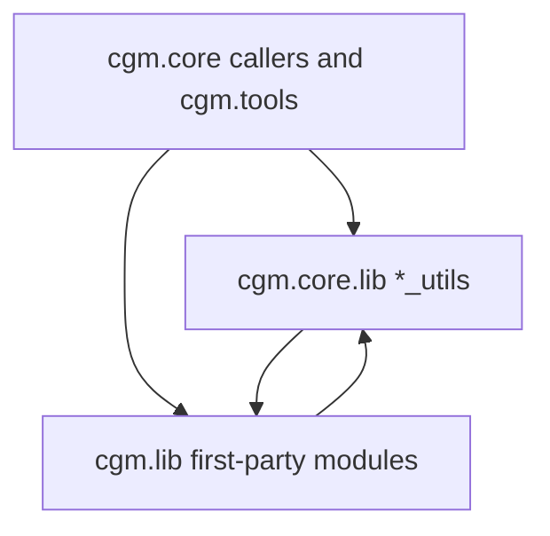
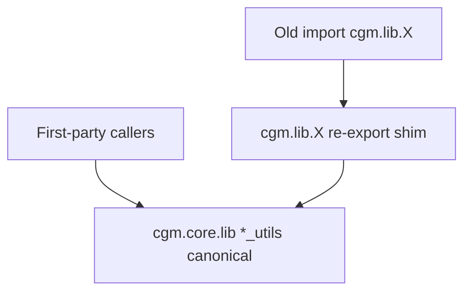

# Feature: cgm.lib to cgm.core migration

## Status and Overview

- **Status**: In progress — Wave 1 lists shim shipped. Wave 2 core retarget Maya-verified (`cgm.core` grep-clean of live `attributes`/`search` except examples / `cgmMeta_test`). **Do not hollow-shim `attributes.py` / `search.py` yet** — locators/distance/deformers/tools still call dozens of old names; `search.returnObjectType` is not `VALID.get_mayaType` for components.
- **Last Updated**: August 20, 2026 (mixed-hub retarget Maya-verified; attributes/search shim gated)
- **Owners**: Josh Burton
- **Audience**: Dev / TA / agents — design contract for finishing the unfinished `cgm.lib` → `cgm.core` move
- **Branch**: [`Branch_SpringCleaning.md`](../Branches/Branch_SpringCleaning.md)

**Purpose**: First-party Maya helpers started in `cgm.lib` (pre-MRS). Years ago they were rewritten into `cgm.core.lib.*_utils` and related homes, but **core still imports lib** and lib still holds full implementations. This doc is the living map: what maps where, what stays vendored, how shims work, and how tests gate each wave.

**Maintenance rule**: Update the mapping table and wave notes when a module is ported, shimmed, or marked leave-alone. Timeline of individual sessions lives in the branch doc.

**Related docs**

- [`Branch_SpringCleaning.md`](../Branches/Branch_SpringCleaning.md) — timeline
- [`.cursor/rules/cgm-module-placement.mdc`](../.cursor/rules/cgm-module-placement.mdc) — where new helpers go
- [`Feature_CgmToolUI.md`](Feature_CgmToolUI.md) — tool UI (not this migration)
- [`Feature_PerforceIntegration.md`](Feature_PerforceIntegration.md) — zooPy perforce is reference-only; same vendored rule applies here

---

## Scope

### In scope

- First-party top-level `cgm/lib/*.py` that still have callers outside `cgm/lib`
- First-party `cgm/lib/classes/` factories still imported by core or shipped tools
- Retargeting **first-party** callers (`cgm.core`, then `cgm/tools`, `cgm/projects`)
- Thin **shims** so `import cgm.lib.X` keeps working for user scripts / ProjectScripts
- Unittest safety net: characterizing tests before a port, real tests (not `pass`) as each module is touched

### Out of scope

- **`cgm/lib/zoo/`**, **`ml/`**, **`bo/`**, **`openSource/`** — vendored; do not migrate or edit
- **`Red9/`** — vendored; do not edit without explicit clearance
- Rewriting MRS (`modules.py` was replaced by MRS; do not port the old module system)
- Rewriting legacy `cgm/tools` UIs (import retarget only)
- Deleting `cgm.lib` this branch
- Introducing pytest (keep unittest + Toolbox Unittesting menu)
- Python 2 backport of this work (py3-only)

### Non-goals

- Big-bang rewrite of every lib line
- Porting unused / show-specific code (`specialCaseStuff.py`, `gigs/`)
- Making core import from zooPy perforce or other vendored P4

---

## Architecture

### Dual stack (current problem)

**`cgm.lib.lists` is now a shim.** Other first-party lib modules are still full implementations. Typical leftover pattern:

1. Core has a renamed rewrite (`attribute_utils.get` vs `attributes.doGetAttr`)
2. Some core files still `from cgm.lib import X` for unmigrated helpers
3. Some lib files already import `cgm.core` (validateArgs, cgm_General) — **bidirectional cycle** except where a wave already cleared it



**Target after a completed wave:**



### Per-module recipe

1. **Usage map** — which functions are called outside `cgm/lib` (core vs `cgm/tools` vs `cgm/projects`).
2. **Characterizing tests** — lock current canonical behavior. If lib and core disagree, **core wins**; document the delta here; alias the old name on the shim.
3. **Port used functions** into the existing core module (or the placement-rule home). Do not dump into `cgm_General.py`.
4. **Retarget** `cgm.core` first (break the cycle), then tools/projects.
5. **Shim** `cgm/lib/X.py` to re-export core + deprecated aliases. Do not delete the lib file this branch.
6. **Grep gate** — touched core files must not `from cgm.lib import that_module`.

If a function has **zero callers outside `cgm/lib`**, leave it in lib until that lib file itself is shimmed (internal lib-to-lib calls ride the shim).

### Shim rules

- New first-party code imports **core only** (`import cgm.core.lib.list_utils as LISTS`).
- No new `from cgm.lib import …` in `cgm.core`.
- Shim shape: `from cgm.core.lib.x_utils import *` plus explicit aliases for renamed APIs (`returnListChunks = get_chunks`).
- Old names stay on the shim (and as aliases on core if callers already mixed names).
- Do not `import *` from lib into core.

### Placement (when porting)

| Kind | Home |
|------|------|
| General Maya/Python helpers | `cgm/core/lib/` (`*_utils.py`) |
| Meta / MRS / puppet | `cgm/core/mrs/`, `mrs/lib/` — do not revive `cgm.lib.modules` |
| Rig build | `cgm/core/rig/` |
| Tool windows | `cgm/core/tools/` — callers stay thin |
| Factories | `cgm/core/classes/` if a counterpart exists |

---

## Inventory (August 20, 2026)

Survey of `d:\repos\cgmToolsPy3`. Counts are **unique caller files outside `cgm/lib`** unless noted. Vendored zoo/ml/bo imports excluded from “first-party” ranks.

### Snapshot

- ~33 first-party top-level `cgm.lib` modules + `classes/` factories + `gigs/`
- **74** unique files outside `cgm/lib` still import first-party `cgm.lib.*`
- **50** of those are under `cgm/core`
- **20** under legacy `cgm/tools`, **3** under `cgm/projects`, plus `cgmToolbox.py` (`ml.*`)
- `cgm/lib/__init__.py` is empty

### Old module → core home

| Old (`cgm.lib`) | Core home | Status | Outside callers | Notes |
|-----------------|-----------|--------|-----------------|-------|
| `search` | `search_utils.py`, `selection_Utils.py` | Partial | tools + lib internals | Core grep-clean of live `from cgm.lib import search`. **Do not alias `returnObjectType` = `get_mayaType` on the lib shim** — lib classifies components (`polyFace`, `curveCV`, `group`). Shim not done. |
| `lists` | `list_utils.py` | **Shimmed** | — | Wave 1 done. `cgm.lib.lists` re-exports core. |
| `attributes` | `attribute_utils.py` | Partial rewrite | tools + lib internals | `test_ATTR` Maya-verified. Core grep-clean of live `from cgm.lib import attributes` except examples / `cgmMeta_test`. **Float and double are the same family.** Full shim not done. |
| `guiFactory` | `classes/GuiFactory.py` | Mostly moved | 25 | Mostly `cgm/tools`. Lib still imported widely. |
| `dictionary` | `shared_data.py`, `string_utils.py` | Partial | 20 | Static naming dicts in core; generic dict helpers still lib-only. |
| `distance` | `distance_utils.py`, `math_utils.py` | Partial | 17 | Core rewrite; lib still used by geo/arrange/rayCaster. |
| `rigging` | `rigging_utils.py`, `rig/general_utils.py` | Partial | 16 | Unused lib imports removed from `rigging_utils`. Other files still import lib `rigging`. |
| `locators` | `locator_utils.py`, `snap_utils.py` | Partial | 15 | `cgm_Meta.doLoc` uses `POS` + `spaceLocator`. Old `locMeObject` still used from lib (marking menus). |
| `curves` | `curve_Utils.py`, `shape_utils.py` | Partial | 14 | Lib `dupeCurve` raises DeprecationWarning. |
| `classes.OptionVarFactory` | `GuiFactory` purge helpers | Partial | 13 | Almost all `cgm/tools`. |
| `cgmMath` | `math_utils.py` | Partial | 11 | Lib already imports core validateArgs. |
| `modules` | MRS `module_utils` / `puppet_utils` | Evolved replacement | 10 | **Do not port** the old module-null system. Retarget leftover callers or leave on shim. |
| `classes.ObjectFactory` | — | Lib-only | 8 | `cgm/tools`. |
| `classes.NameFactory` | `nameTools.py` + still lib | Partial | 8 | `cgm_Meta` no longer imports `Old_Name` (was unused). Factory wave still open. |
| `deformers` | `cgm_Deformers.py`, `geo_Utils.py` | Partial | 7 | Bulk blendShape/lattice still lib. Lib imports `geo_Utils` (cycle). |
| `names` | `name_utils.py`, `nameTools.py` | Partial | 6 | `cgm_Meta` uses `NAMES.get_long` / `get_short`. Conf-file naming still lib/`settings`. |
| `skinning` | `skin_utils.py`, `rig/skin_utils.py` | Partial | 6 | `segment_utils` still imports as `OLDSKINNING`. |
| `joints` | `rig/joint_utils.py` | Partial | 5 | Many helpers still lib-only. |
| `position` | `position_utils.py`, `arrange_utils.py`, `snap_utils.py` | Partial | 5 | Query vs layout split. `mocap_align_utils` still uses lib `position`. |
| `classes.SetFactory` | — | Lib-only | 4 | `cgm/tools`. |
| `constraints` | `constraint_utils.py`, `rig/constraint_utils.py` | Partial | 4 | |
| `nodes` | `node_utils.py`, `classes/NodeFactory.py` | Partial | 4 | |
| `ml.*` | `core/lib/ml_tools/` (existing slice) | Vendored usage | 4 | **Do not migrate the `cgm/lib/ml` tree.** |
| `settings` | `mayaSettings_utils.py`, `shared_data.py` | Partial | 1–3 | Conf-file path helpers (`getNamesDictionaryFile`) still lib. |
| `batch` | `mrs/lib/batch_utils.py` | Different scope | 1–3 | Old = selection batch; new = MRS mayapy. Do not conflate. |
| `classes.AttrFactory` | partly `attribute_utils` | Lib-only | 1–3 | Referenced from core ControlFactory/NodeFactory. |
| `pyui` | `classes/GuiFactory.py` | Thin wrapper | 1 | Already delegates to core. |
| `optionVars` | `GuiFactory.do_purgeOptionVar` | Partial | 1–3 | `tool_chunks` still imports lib. |
| `geo` | `geo_Utils.py`, `shape_utils.py` | Partial | 1–3 | Tiny lib file; big rewrite in core. |
| `logic` | *(none)* | Lib-only | 1–3 | Aim helpers; `returnLocalAimDirection` warns “Moved to distance”. |
| `sdk` | `sdk_utils.py` | Mostly moved | 1–3 | |
| `controlBuilder` | `classes/ControlFactory.py`, `control_utils.py` | Partial | 1–3 | ControlFactory still imports lib. |
| `surfaces` | `surface_Utils.py` | Partial | lib-internal + few | |
| `autoname` | `nameTools.py` | Partial | mostly via NameFactory | |
| `cgmDeveloperLib` | `core/tools/lib/cgmDeveloperLib.py` | Parallel copy | 0 outside | Near-identical Wing connect helper. |
| `cgmBaseMelUI` | `core/lib/zoo/baseMelUI.py` | Shim already | — | One-line re-export from zoo; core hosts the used copy. |
| `specialCaseStuff` | *(none)* | **Leave** | show-specific | Phosphor / one-offs. Do not port. |
| `gigs/project_02012.py` | *(none)* | **Leave** | show-specific | Do not port. |
| `dynamics` | `rig/dynamic_utils.py`, `nCloth_utils.py` | Partial / superseded | few | Prefer core dynFK / nCloth. |

### Cycle hubs (core still importing first-party lib)

Clear these as later waves land. **Grep-clean for `cgm.lib.lists` in `cgm.core`** (except the LISTS shim test).

| File | Remaining first-party lib imports |
|------|---------------------------|
| `cgm/core/cgm_Meta.py` | none live — `SEARCH`/`ATTR`/`TRANS`/`NAMES`/`SHARED`/`POS`. Leftover: commented lib block; unused `ml_resetChannels` / `NameFactory` imports removed. |
| `cgm/core/lib/geo_Utils.py` | `guiFactory` only (progress windows) |
| `cgm/core/lib/rayCaster.py` | `locators`, `dictionary`, `cgmMath`, `distance` (`search`/`attributes` retargeted to VALID/ATTR) |
| `cgm/core/lib/curve_Utils.py` | `distance`, `curves`, `deformers`, `rigging`, `skinning`, `dictionary`, `nodes`, `joints`, `cgmMath` (`lists`/`attributes`/`search` removed) |
| `cgm/core/lib/rigging_utils.py` | none (unused lib imports removed) |
| `cgm/core/lib/search_utils.py` | none |
| `cgm/core/lib/attribute_utils.py` | none |
| `cgm/core/classes/DraggerContextFactory.py` | `locators`, `geo`, `curves`, `nodes`, `rigging`, `distance`, `guiFactory` (`search`/`attributes` retargeted to ATTR) |
| `cgm/core/lib/surface_Utils.py` | `distance`, `locators`, `curves`, `deformers`, `lists`, `rigging`, `skinning`, `dictionary`, `nodes`, `joints`, `cgmMath` (`attributes`/`search` removed) |
| `cgm/core/lib/skinDat.py` | `names`, `cgmMath`, `rigging`, `distance`, `skinning` (`search`/`attributes` retargeted) |
| `cgm/core/tools/Project.py` | `names`, `cgmMath`, `rigging`, `distance`, `skinning` (unused search/attributes dropped) |
| `cgm/core/lib/shapeCaster.py` | `cgmMath`, `locators`, `modules`, `distance`, `dictionary`, `rigging`, `curves`, `lists` (unused search dropped) |
| `cgm/core/classes/SnapFactory.py` | `distance`, `dictionary`, `locators`, `position` (`search` → VALID) |
| `cgm/core/lib/mocap_align_utils.py` | `position` |

### Lib files that already import core (not shims)

`guiFactory`, `distance`, `locators`, `curves`, `cgmMath`, `deformers`, `skinning`, `pyui`, `cgmDeveloperLib`. These are still full implementations with selective core hooks.

### Vendored / do not touch

| Tree | Role |
|------|------|
| `cgm/lib/zoo/` | zooPy / zooPyMaya / zooMel (~274 files). Core already has `cgm/core/lib/zoo/` for UI in use. |
| `cgm/lib/ml/` | Morgan Loomis animation tools |
| `cgm/lib/bo/` | Bohdon Sayre tools |
| `cgm/lib/openSource/euclid.py` | pyeuclid (duplicate also under `ml/`) |
| `Red9/` | Vendored Red9 (not under `cgm/lib`) |

Core must not grow new imports from `cgm.lib.zoo.zooPy.perforce`.

### Legacy `cgm/tools`

~20 files still import `guiFactory` and `classes.*`. **This branch retargets imports** after the core API is complete for that module. Do not rewrite those tool UIs here.

---

## Wave 1 detail: `lists` → `list_utils`

**Shipped 2026-08-20.** Canonical module: `cgm.core.lib.list_utils` (`__MAYALOCAL = 'LISTS'`). Maya-free. `cgm/lib/lists.py` is a re-export shim.

Old names are aliases on core (`returnListChunks = get_chunks`, etc.). `from cgm.lib import lists` still works.

`arrange_utils` / `ModuleShapeCaster` landmines fixed (they now import `list_utils`). Unused `lists` imports removed from several core files. Legacy `cgm/tools` still import `cgm.lib.lists` (shim).

### Function map

All of the following now live on `list_utils` with old names as aliases (shim re-exports them).

| Lib (`cgm.lib.lists`) | Core | Notes |
|----------------------|------|-------|
| `returnListChunks` | `get_chunks` | Alias |
| `returnListNoDuplicates` | `get_noDuplicates` | Alias |
| `parseListToPairs` | `get_listPairs` | Alias |
| `returnMatchList` | `get_matchList` | Always returns a list (empty, not False) |
| `reorderListInPlace` | `reorder_in_place` | Alias |
| `returnMissingList` | `get_missing` | Alias |
| `returnDifference` | `get_difference` | Alias |
| `returnPosListNoDuplicates` | `get_pos_no_duplicates` | Alias |
| `returnFirstMidLastList` | `get_first_mid_last` | Alias |
| `returnFactoredConstraintList` | `get_factored_constraint_list` | Alias |
| `returnSplitList` | `get_split` | py3 `//` for slice indices |
| `removeMatchedIndexEntries` | `remove_matched_index_entries` | Alias |
| `returnMatchedIndexEntries` | `get_matched_index_entries` | Alias |
| `returnMatchedStrippedEndList` | `get_matched_stripped_end` | Alias |
| `returnReplacedNameList` | `get_replaced_name_list` | Alias |
| `cvListSimplifier` | `simplify_cv_list` | Alias |
| `get_keys_from_dict` | `get_keys_from_dict` | Core-only originally |

Landmines **fixed**: `arrange_utils` imports `LISTS`; `ModuleShapeCaster` imports `list_utils` as `lists` and `cgm.lib.distance` (that file still uses old `distance.*` names).

---

## Wave 2 detail: `attributes` / `search` (core retarget, shim gated)

**Core retarget Maya-verified 2026-08-20.** `attribute_utils` / `search_utils` do not import first-party lib. `cgm.core` has no live `from cgm.lib import attributes` / `search` except examples and `cgmMeta_test` (do not revive).

### Why no hollow shim this wave

`lists` was shimmed because every used function lived on `list_utils` with old-name aliases. `attributes.py` (~2600 lines) and `search.py` (~1400 lines) are still the implementation for **`cgm/tools`**, **`cgm/projects`**, and **other `cgm.lib` modules** (`locators`, `distance`, `deformers`, `curves`, `rigging`, `joints`, `modules`, …).

A `from cgm.core.lib.search_utils import *` hollow shim would replace `search.returnObjectType` with `VALID.get_mayaType`. Lib `returnObjectType` is component-aware (`polyVertex`, `curveCV`, `polyEdge`, `polyFace`, transform-with-children → `group`). Locators and distance still branch on those strings.

Naive ATTR aliases are also unsafe:

| Lib | Core | Why not a raw alias |
|-----|------|---------------------|
| `returnDriverAttribute(plug, True)` | `get_driver(node, attr=None, getNode=False, skipConversionNodes=False)` | Positional `True` would bind to `attr`, not `skipConversionNodes` |
| `doConnectAttr(..., transferConnection=True)` | `connect` | Core **raises** if `transferConnection` is True |
| `doSetAttr(..., forceLock=)` | `set(..., lock=)` | Keyword name differs |
| `returnObjectType` | `get_mayaType` | Component / group classification differs |

### Core map (already used after retarget)

| Lib | Core |
|-----|------|
| `doGetAttr` | `ATTR.get` |
| `doSetAttr` | `ATTR.set` |
| `doConnectAttr` | `ATTR.connect` (no transfer) |
| `doBreakConnection` | `ATTR.break_connection` |
| `doDeleteAttr` | `ATTR.delete` |
| `storeInfo` | `ATTR.store_info` / `ATTR.set_message` |
| `returnDriverObject` | `ATTR.get_driver(..., getNode=True)` |
| `returnDriverAttribute` | `ATTR.get_driver(..., skipConversionNodes=kw)` |
| `selectCheck` | `SEARCH.select_check` |
| `returnSelectedAttributesFromChannelBox` | `SEARCH.get_selectedFromChannelBox(report=False)` |
| `returnObjectType` (transforms / node types in core) | `VALID.get_mayaType` / `SEARCH.get_mayaType` |

Shim of those two lib files waits until locators/distance/deformers are off old `returnObjectType` (Wave 3) **or** a hybrid shim that re-exports core **and keeps leftover bodies** (especially `returnObjectType`).

---

## Testing contract

Keep **unittest** and the Toolbox **Unittesting** menu. Do not add pytest this branch.

### Current runner

| Piece | Path / behavior |
|-------|-----------------|
| Runner | `cgm/core/tests/cgmTests.py` — `main(tests='all', testCheck=False)` |
| Registry | `_d_modules` / `_l_all_order` (explicit, not `discover`). `coreLib` includes **LISTS**, PATH, ATTR, VALID, NODEFACTORY |
| Side effect | **`mc.file(new=True)` per test module** — wipes the scene before each module |
| Unregistered / skipped | `test_PuppetMeta.py` not in `_d_modules`. **MRS RigBlocks** is in the menu dict but **not** in `_l_all_order`; the class is `@unittest.skip` (incomplete; selection/`xform` issues) |
| Reload | `cgm.core._reload()` then `cgmGEN._reloadMod` per test module |
| Menu | `tool_chunks.py` Unittesting — built from `_d_modules` (new names appear automatically) |
| Stubs | `test_ATTR.py` has real get/set/message tests (Maya) |
| Do not revive | `cgmMeta_test.py` (hardcoded `J:/Dropbox/...` paths) |

Maya Script Editor:

```python
import cgm.core.tests.cgmTests as cgmTests
import cgm.core.cgm_General as cgmGEN
cgmGEN._reloadMod(cgmTests)
cgmTests.main('all')                 # WARNING: new scene
cgmTests.main('LISTS')               # after Wave 0b registry add
cgmTests.main('all', testCheck=True) # list only
```

Or: cgmToolbox → Unittesting → **cgm - All**.

### Target layers (same runner)

1. **Maya-free** — `list_utils`, later math/string/path slices that need no `cmds`. Tests must not create nodes. They still live under `cgm.core.tests` so the Maya menu can run them.
2. **Maya** — `attribute_utils`, `search_utils`, locators, etc. Each test class creates what it needs. Runner still new-scenes between modules.

### Characterizing tests

Before moving a dual API, assert current results. Example: `lists.returnListChunks([1,2,3,4], 2)` vs `LISTS.get_chunks([1,2,3,4], 2)`. On disagreement, core wins; record it in this doc.

Fill stubs **when touching that module**. `test_ATTR` is real Maya CRUD + message tests. **Float and double are equivalent** — assert via `ATTR.validate_attrTypeMatch`, not a raw `get_type` string.

`cgm - All` Maya-verified 2026-08-20 for **coreLib + cgmMeta**. MRS RigBlocks is skipped (incomplete). Runner does `file -new` **per test module**.

Optional later: `mayapy` + `maya.standalone.initialize()`. Not Wave 0.

### Registry convention

File `cgm/core/tests/test_coreLib/test_LISTS.py` → add `'LISTS'` to `_d_modules['coreLib']`. Menu items follow the registry. Keep `exec` + `_reloadMod` (existing style).

---

## Waves (stop after any; ship shims)

| Wave | Work | Status |
|------|------|--------|
| 0 | This inventory + branch/feature docs | Done 2026-08-20 |
| 0b | Harden `cgmTests.py`; Maya-free `test_LISTS` | Done 2026-08-20 — `'LISTS'` in `_d_modules['coreLib']`. Tests still load via Maya package init. |
| 1 | Finish `list_utils`, retarget core, shim `cgm.lib.lists` | Done 2026-08-20 |
| 2 | `attributes` + `search` (incl. real `test_ATTR`); drop lib imports from those core files | **Core retarget Maya-verified 2026-08-20.** Hollow shim **gated** — locators/distance/tools still need lib implementations; `returnObjectType` ≠ `get_mayaType` for components. |
| 3 | `distance`, `locators`, `rigging`, leftover `position` / `cgmMath`; clear `rigging_utils` / `geo_Utils` dual-imports | Partial — unused lib imports removed from `rigging_utils`. `geo_Utils` retargeted to DIST/MATH/NAMES/ATTR; **still imports `cgm.lib.guiFactory`** for progress windows. `MATH.multiplyLists` and `DIST.get_bb_average` added. Locators not shimmed. |
| 4 | Remaining used Maya utils as usage justifies | Not started (callers still use lib `distance`, `search`, `curves`, etc.) |
| 5 | Factories / `guiFactory` retarget for `cgm/tools`; mark `specialCaseStuff` / `gigs` leave-alone | Leave-alone confirmed. Factory/`guiFactory`/`cgm/tools` retarget not done. |

After each wave: Unittesting → **cgm - All**, plus a smoke of a tool that imported that module (locinator / Scene / mocapBakeTools as relevant).

---

## Hygiene (every wave)

- No new `from cgm.lib import …` in `cgm.core`.
- One canonical API per concern (`get`, `get_chunks`). Old names live on the shim / aliases.
- Callers stay thin: port into `*_utils`, then change the import.
- py3 files need Perforce checkout before edit.
- Dev docs stay in **cgmToolsDev** (this repo), not inside `cgmToolsPy3`.

---

## Success criteria (branch, not “lib is gone”)

- This doc has a living old → new table and shim rules (Wave 0: yes).
- `cgm.core` no longer imports first-party `cgm.lib` for **completed** waves (grep-clean).
- Completed lib modules are shims; `import cgm.lib.lists` still works after Wave 1.
- Unittest runner has real tests for each completed module (not `pass`).
- Vendored trees untouched.
- Branch timeline is current enough for a later PR.

---

## Revision history

| Date | Summary |
|------|---------|
| 2026-08-20 | Initial inventory and contract (Wave 0) |
| 2026-08-20 | Wave 1 lists shim; test_LISTS / test_ATTR; search_utils + attribute_utils off lib; rigging_utils/geo_Utils dual-import cut |
| 2026-08-20 | Maya-verified `cgm - All` (coreLib + cgmMeta); RigBlocks skipped; ATTR float/double via `validate_attrTypeMatch`; per-module file-new |
