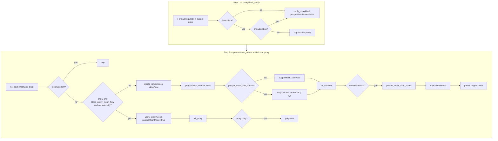

# Feature: MRS Mesh Creation (proxy / puppet / skinned)

## Status and Overview

- **Status**: Active — code complete on Face26; Maya-verified for skin-unify puppet path and geoGroup stability
- **Last Updated**: September 4, 2026
- **Audience**: Dev / TA — design contract for MRS **module proxy mesh**, **puppet mesh**, and **batch post** mesh steps
- **Purpose**: Canonical reference for how rig blocks build display/geo mesh, how face blocks (`muzzle`, `brow`, `eye`) align with body blocks (`segment`, `limb`, `head`), and how puppet-level unify/skin routing works without corrupting puppet hierarchy (`geoGroup`, armature).

**Maintenance rule**: Update this doc when changing `build_proxyMesh`, `create_simpleMesh`, `proxyMesh_verify`, `puppetMesh_create`, face-block mesh attrs, or batch post mesh stages.

**Related docs**

- [`Branch_Face26.md`](../Branches/Branch_Face26.md) — implementation timeline (muzzle/brow/eye mesh pipeline, normals, geoGroup fix)
- [`Feature_MRSWiring.md`](Feature_MRSWiring.md) — module/puppet message graphs; `moduleTarget`, `rigNull`
- [`Feature_SceneExportFlow.md`](Feature_SceneExportFlow.md) — export prep (separate from mesh build, but shares puppet geo expectations)

---

## Scope

### In scope

- **Block attrs** — `meshBuild`, `proxyBuild` on face blocks; canonical proxy/puppet modes on all mesh-capable blocks
- **Module proxy** — `build_proxyMesh`, `verify_proxyMesh`, `proxyMesh` msgList on `rigNull`
- **Puppet proxy dup** — `puppetMeshMode=True` reuses module proxy where possible; `puppetProxyMesh` msgList
- **Skinned puppet mesh** — `create_simpleMesh` (per block) and `puppetMesh_create` (puppet-level unify)
- **Batch post** — `proxyMesh_verify` then `puppetMesh_create` in `batch_utils`
- **Post-create helpers** — normals, proxy shaders, geoGroup resolution, protected-node delete filter
- **Face-specific tessellation** — `get_meshFromNurbs` `mode='general'` for brow/eye lid splits

### Out of scope

- Final game-engine export mesh (FBX bake, tdSets) — see `Feature_SceneExportFlow`
- Module rig build (joints, controls, constraints) — see `Feature_MRSWiring`
- MetaHuman facial solve — see `Feature_Metahuman`
- Artist Google Doc prose — seed from this doc via [`GoogleDoc_Capture_Guide.md`](../Guides/GoogleDoc_Capture_Guide.md) when shipping to manual

---

## Core Concepts

### Two block-level switches (face blocks)

| Attr | UI group | Default (muzzle/brow/eye) | Role |
|------|----------|---------------------------|------|
| **`meshBuild`** | `proxySurface` | `True` | Master on/off for **any** mesh on the block (module proxy, puppet proxy dup, or skinned puppet mesh) |
| **`proxyBuild`** | `proxySurface` | `False` | When **on**: module `proxyMesh` + puppet proxy-dup path (`puppetMeshMode`). When **off**: skinned puppet mesh via `create_simpleMesh` |

**Artist default on face blocks**: `meshBuild=True`, `proxyBuild=False` → batch builds a **single skinned puppet mesh** (no colored module proxy pass).

Body blocks (`segment`, `limb`, `head`, …) use the proxy pipeline unless `meshBuild` is off; face blocks gate proxy flow through `proxyBuild`.

### Three mesh “modes” in `build_proxyMesh`

Canonical blocks implement `build_proxyMesh` with these kwargs:

| Mode | `puppetMeshMode` | `simpleMeshMode` | Output |
|------|------------------|------------------|--------|
| **Module proxy** | `False` | `False` | Colored proxy on `rigNull.proxyMesh`; used for rig visualization |
| **Puppet proxy dup** | `True` | `False` | Reuse module proxy when possible; dup to `puppetProxyMesh`; skin copied for export preview |
| **Simple skinned mesh** | `False` | `True` | Tessellated/skin mesh for puppet unify (face `create_simpleMesh` delegates here) |

Face blocks (`muzzle`, `brow`, `eye`) refactored to match `segment` / `head` / `limb` split. **`eye.create_simpleMesh`** must call module-level `build_proxyMesh(self, …)` — not `self.build_proxyMesh` (Red9 meta has no such method on the block node).

### Puppet-level storage

| msgList | Owner | Contents |
|---------|-------|----------|
| `proxyMesh` | `rigNull` (per module) | Module proxy geo |
| `puppetProxyMesh` | `rigNull` | Puppet-level proxy dupes |
| `simpleMesh` | `rigBlock` | Per-block skinned mesh (when connected) |
| `puppetMesh` | `cgmRigPuppet` | Unified or per-part puppet output |

Parent for skinned output: **`puppet_geoGroup_get(mPuppet)`** → `masterNull.geoGroup` (or armature child `geo` after `armature_verify`).

---

## Architecture

### Batch post mesh flow (default)



**Batch kwargs** (`batch_utils` post rig):

```python
mPuppet.atUtils('puppetMesh_create', unified=True, skin=True, proxy=True)
```

- **`skin=True`**: skin-unify path; `_skinUnify` disables per-block proxy dup (`and not _skinUnify` on `_blockProxyFlow`)
- **`proxy=True`**: body/segment blocks still eligible for proxy dup when not skin-unifying; face blocks only when `proxyBuild` on
- Skinned pieces → `polyUniteSkinned`; proxy pieces → `polyUnite` (never run `polyUniteSkinned` on unskinned proxy geo)

### Routing helper

```python
def block_proxy_mesh_flow(mBlock):
    if mBlock.blockType in ['muzzle', 'brow', 'eye', 'facs']:
        return mBlock.getMayaAttr('proxyBuild') in [True, 1]
    return True
```

Used in `block_utils.puppetMesh_create`, `puppet_utils.puppetMesh_create`, and `puppet_utils.proxyMesh_verify` (skip face blocks when `proxyBuild` off).

---

## Implementation Details

### Files and responsibilities

| File | Responsibility |
|------|----------------|
| `cgm/core/mrs/blocks/organic/muzzle.py` | `meshBuild` / `proxyBuild`; `build_proxyMesh` modes; `create_simpleMesh`; nurbs `GEO.normalCheck` |
| `cgm/core/mrs/blocks/organic/brow.py` | Same; `get_meshFromNurbs` **`mode='general'`** (`numSplit_u` / `numSplit_v`) |
| `cgm/core/mrs/blocks/organic/eye.py` | Same; **`block_puppet_mesh_self_colored`** (per-part lid shaders); lid splits via `general` mode |
| `cgm/core/mrs/blocks/organic/head.py` | `create_simpleMesh` (head dup + optional neck loft); **intermediate geo stays at world until final unite** |
| `cgm/core/mrs/blocks/organic/segment.py` | Canonical `build_proxyMesh` reference (`puppetMeshMode`, `ml_proxyExisting`) |
| `cgm/core/mrs/lib/block_utils.py` | `block_proxy_mesh_flow`, `puppetMesh_create`, `create_simpleMesh`, `create_simpleLoftMesh`, mesh helpers |
| `cgm/core/mrs/lib/puppet_utils.py` | Puppet-level `proxyMesh_verify`, `puppetMesh_create`; `groups_verify` |
| `cgm/core/mrs/lib/batch_utils.py` | Post rig: `proxyMesh_verify` → `puppetMesh_create` |
| `cgm/core/mrs/lib/shared_dat.py` | `proxyBuild` / `meshBuild` in `proxySurface` UI group |
| `cgm/core/rig/create_utils.py` | `get_meshFromNurbs` + `GEO.normalCheck` on tessellate |
| `cgm/core/mrs/lib/builder_utils.py` | `create_loftMesh` + `GEO.normalCheck` |

### Key APIs (`block_utils`)

| Function | Role |
|----------|------|
| `block_proxy_mesh_flow(mBlock)` | Face blocks: proxy path only when `proxyBuild` on |
| `block_puppet_mesh_self_colored(mBlock)` | `True` for `eye` — skip blanket `puppetMesh_colorGeo` |
| `puppetMesh_normalCheck(ml_geo)` | Per-shape `GEO.normalCheck` after create |
| `puppetMesh_colorGeo(mBlock, ml_geo)` | `CORERIG.color_mesh` with block side (`'center'` when side is `none`/empty) |
| `puppet_geoGroup_get(mPuppet, verify=True)` | `groups_verify` + `getMessageAsMeta('geoGroup')`; falls back to armature geo plug |
| `puppet_mesh_protected_mNodes(mPuppet)` | masterNull groups, armature, masterControl — never delete/unite |
| `puppet_mesh_filter_nodes(mPuppet, ml_nodes, for_delete=False)` | Strip protected nodes; for unite, require mesh shape |
| `puppet_mesh_delete_existing(mPuppet)` | Safe `forceNew` cleanup of `puppetMesh` msgList |
| `puppetMesh_create(...)` | Block or puppet entry; unified skin/proxy split |
| `puppetMesh_delete(self)` | Block-context delete via `puppet_mesh_delete_existing` |
| `create_simpleMesh(self, skin=, ...)` | Dispatches to block module or `create_simpleLoftMesh` |

### Head `create_simpleMesh` invariants

When `neckBuild` is on (or multiple visible head proxy pieces), the block runs internal `polyUniteSkinned` before returning to puppet unify.

**Rules** (geoGroup stability fix, Sep 2026):

1. **Do not** parent intermediate head/neck pieces under `geoGroup` before internal unite — keep at world during build
2. Parent **only** the final unified head mesh to `parent` (`geoGroup`)
3. Clear `ml_headStuff` after `polyUniteSkinned` (inputs are deleted by Maya)
4. Cleanup loop must never delete `parent` if it appears in the source list

### geoGroup / armature

- `groups_verify` creates/renames puppet groups under `masterNull` (`geo` transform, message `geoGroup`)
- `armature_verify` may reparent `geoGroup` under armature and rename to `geo` — message plugs on **both** `masterNull` and `armature` should still resolve via `puppet_geoGroup_get`
- **Do not** use bare `masterNull.geoGroup` property when message is broken — Red9 returns `[]`, and parenting silently fails or misbehaves
- **Do not** `mc.delete` raw `puppetMesh` msgList without `puppet_mesh_filter_nodes` — protects structure groups if msgList is stale

### Tessellation (`get_meshFromNurbs`)

| `mode` | Split behavior |
|--------|----------------|
| `'default'` | Hardcoded 3×3 — **avoid** for artist-driven density |
| `'general'` | Respects `uNumber` / `vNumber` (brow `numSplit_u`/`numSplit_v`, eye `numLidSplit_u`/`numLidSplit_v`) |

### Shaders on puppet mesh

| Block type | Puppet mesh coloring |
|------------|---------------------|
| muzzle, brow, head, body, … | `puppetMesh_colorGeo` → `CORERIG.color_mesh` (`proxy=True`) |
| eye | **Skipped** — `build_proxyMesh` / lids assign per-part shaders (eyewhite, iris, pupil) |

---

## Configuration Guide (block attrs)

### Face block defaults (muzzle, brow, eye)

| Attr | Recommended default | Artist workflow |
|------|---------------------|-----------------|
| `meshBuild` | `True` | Turn off to skip all mesh for that block |
| `proxyBuild` | `False` | Turn **on** only when you want colored module + puppet proxy dup (two skinned sets) |

### Batch post toggles (`batch_utils` kws)

| Kw | Default | Effect |
|----|---------|--------|
| `proxyMesh` | `1` | Runs `proxyMesh_verify` (respects face `proxyBuild`) |
| `puppetMesh` | `1` | Runs `puppetMesh_create(unified=True, skin=True, proxy=True)` |

---

## Testing and Validation

### Manual Maya checklist

**Face — `proxyBuild` off (default skinned puppet path)**

- [ ] Batch post on character with muzzle + brow + eye: single unified skinned `*_unified_geo` under geo group
- [ ] `geoGroup` / `geo` transform still exists after puppet mesh create (including re-run with `forceNew`)
- [ ] Head with `neckBuild` on: no geoGroup loss after puppet mesh (regression for internal `polyUniteSkinned`)
- [ ] Normals face outward on unified mesh (`puppetMesh_normalCheck`)
- [ ] Muzzle/brow use side-appropriate `color_mesh`; center blocks use `'center'`
- [ ] Eye keeps multi-shader parts when not skin-unifying per-block meshes

**Face — `proxyBuild` on**

- [ ] Step 1 builds module `proxyMesh` on face blocks
- [ ] Step 2 builds puppet proxy dupes with skin copied (`SKIN.transfer_fromTo` / module path)
- [ ] Proxy unify uses `polyUnite` (not skinned unite)

**Body / mixed puppet**

- [ ] Segment/limb/head participate in skin-unify when `skin=True`
- [ ] Body loft normals correct (`create_simpleLoftMesh` / `create_loftMesh` `GEO.normalCheck`)
- [ ] Brow density responds to `numSplit_u` / `numSplit_v`

**Hierarchy**

- [ ] With armature: geo group resolves under armature as `geo`
- [ ] Without armature: geo group under `masterNull`

### Reload snippet (dev)

```python
import cgm.core.cgm_General as cgmGEN
import cgm.core.mrs.lib.block_utils as BLOCKUTILS
import cgm.core.mrs.lib.puppet_utils as PUPPETUTIL
import cgm.core.mrs.blocks.organic.head as HEADBLOCK
import cgm.core.mrs.blocks.organic.muzzle as MUZZLEBLOCK
import cgm.core.mrs.blocks.organic.brow as BROWBLOCK
import cgm.core.mrs.blocks.organic.eye as EYEBLOCK
for m in (BLOCKUTILS, PUPPETUTIL, HEADBLOCK, MUZZLEBLOCK, BROWBLOCK, EYEBLOCK):
    cgmGEN._reloadMod(m)
```

---

## Dependencies and Integration

| System | Interaction |
|--------|-------------|
| `Feature_MRSWiring` | Requires `moduleTarget`, `rigNull.moduleJoints` for skin path |
| `puppet_utils.groups_verify` | Creates geo/skeleton groups before mesh parent |
| `puppet_utils.armature_verify` | May reparent geo under armature |
| `SKIN.transfer_fromTo` | Puppet proxy dup skin copy on face/body blocks |
| `CORERIG.color_mesh` | Proxy/puppet display shaders |
| `GEO.normalCheck` | Inside-out tessellation fix (nurbs, loft, puppet post) |

**Breaking changes**: None intended. Blocks without `proxyBuild` attr behave as proxy off (skinned puppet path). New attrs are opt-in via block definitions.

---

## Future Work

- [ ] Maya-verify `proxyBuild` on vs off on production face rigs (two skinned sets vs single unify)
- [ ] Eye unified puppet mesh may collapse multi-shader parts if all eye pieces enter one `polyUniteSkinned` — separate unify group or post-unite shader pass if needed
- [ ] Extend `block_puppet_mesh_self_colored` if other blocks need per-part puppet shaders
- [ ] Document blockDat mesh handle identity when adding prerig geo (Face26 deferred)

---

## Revision History

| Date | Author | Summary |
|------|--------|---------|
| 2026-09-04 | Face26 / doc pass | Initial feature doc: face `proxyBuild`/`meshBuild`, routing, helpers, geoGroup invariants, head neckBuild fix |
| 2026-09-03 | Face26 | Normals, `puppetMesh_colorGeo`, skin-unify proxy skip |
| 2026-09-02 | Face26 | Face proxy/puppet pipeline; brow/eye/muzzle `build_proxyMesh` refactor |

Timeline detail: [`Branch_Face26.md`](../Branches/Branch_Face26.md).
