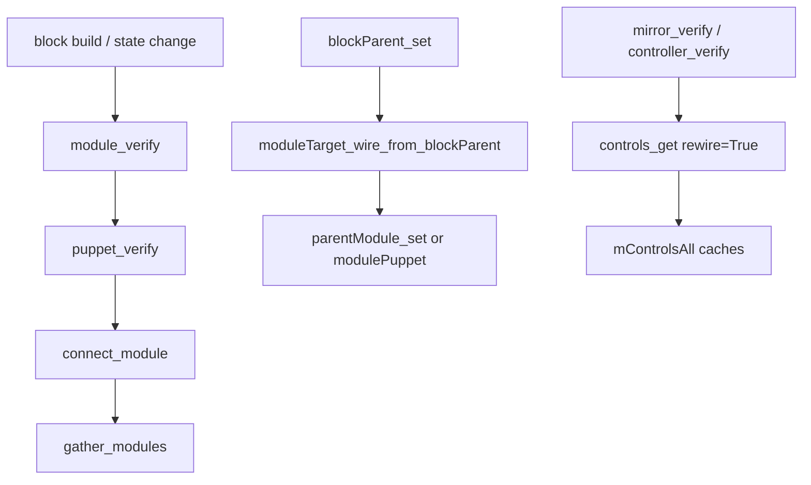
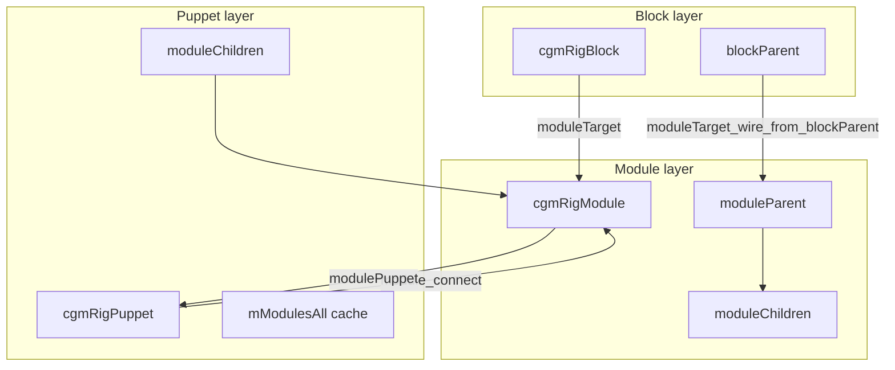
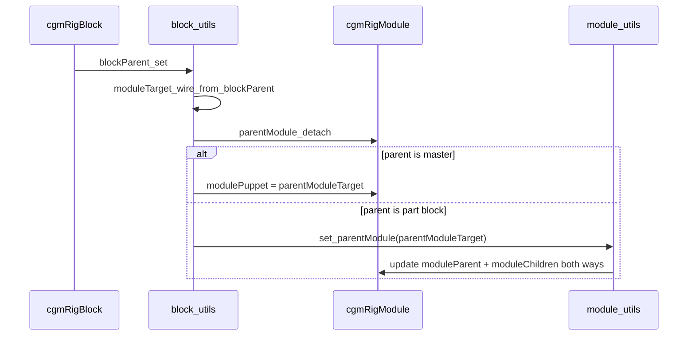

# Feature: MRS Module Wiring

## Status and Overview

- **Status**: Shipped (core MRS; ongoing maintenance)
- **Last Updated**: July 22, 2026
- **Audience**: Dev / TA — design contract for block/module/puppet message graphs and build sync (not artist manual prose)
- **Purpose**: Canonical reference for how `cgmRigBlock`, `cgmRigModule`, and `cgmRigPuppet` stay linked via message attributes, DAG parenting, and cached lists. Use when debugging build regressions, mirror/controller passes, module hierarchy bugs, or attach-point failures.

**Maintenance rule**: Update this doc whenever `puppet_utils.module_connect`, `module_utils.parentModule_set`, `module_utils.mirror_get`, `block_utils.moduleTarget_wire_from_blockParent` / `puppet_verify`, `controls_getDat` rewire behavior, or message attr names on `cgmRigPuppet` / `cgmRigModule` change.

**Related docs**

- [`Feature_SceneExportFlow.md`](Feature_SceneExportFlow.md) — export uses puppet/module sets (orthogonal)
- [`Feature_SimChain.md`](Feature_SimChain.md) — dyn drivers collected to puppet space groups

---

## Scope

### In scope

- Three-layer graph: **Block** (`moduleTarget`) → **Module** (`moduleParent` / `moduleChildren` / `modulePuppet`) → **Puppet** (`moduleChildren`, caches)
- Build-time wiring: `module_verify`, `puppet_verify`, `connect_module`, `gather_modules`, `moduleTarget_wire_from_blockParent`
- Query + **rewire** caches: `mModulesAll`, `mControlsAll`, `mControlsCore`, `mControlsCoreAll`
- Spatial attachment: `get_attachPoint`, `get_driverPoint`, `skeleton_connectToParent`
- Rig live/deform wiring: `rig_connect` / `rig_disconnect` (skin joints → rig joints)
- Dispatch pattern: `atUtils`, `atRigModule`, `atRigPuppet` on meta classes

### Out of scope

- Block **state** message wiring (`d_wiring_form`, `d_wiring_prerig`, `msgDat_check`) — brief cross-ref only; detail stays in block build docs
- Face control **attribute** wiring (`face_utils` `wiringDict`) — separate system
- Mirror index assignment / controller graph (`mirror_verify`, `controller_verify`) — documented here as **consumers** of control rewire, not full mirror spec
- Artist Google Doc / shelf wording (this doc can seed that later)

---

## Entry Points and Call Graph

| Surface | Entry | Notes |
|---------|-------|-------|
| Block build | `block_utils.puppet_verify` | Non-master blocks attach module to puppet |
| Meta API | `cgmRigPuppet.connect_module` / `gather_modules` | Delegates to `puppet_utils` |
| Block parent change | `block_utils.moduleTarget_wire_from_blockParent` | Syncs block tree → module tree |
| Module hierarchy | `module_utils.parentModule_set` / `parentModule_detach` | Bidirectional `moduleParent` / `moduleChildren` |
| String dispatch | `cgmRigBlock.atRigModule('set_parentModule', …)` | `RigBlocks.py` |
| Control repair | `controls_getDat(..., rewire=True)` | Puppet + module level |

### Key files

| File | Responsibility |
|------|----------------|
| [`cgm/core/mrs/lib/puppet_utils.py`](../../cgmToolsPy3/cgm/core/mrs/lib/puppet_utils.py) | Puppet↔module connect, module enumeration, puppet control aggregation, `rig_connectAll` |
| [`cgm/core/mrs/lib/module_utils.py`](../../cgmToolsPy3/cgm/core/mrs/lib/module_utils.py) | Module hierarchy, attach/driver points, module control rewire, rig connect per module |
| [`cgm/core/mrs/lib/block_utils.py`](../../cgmToolsPy3/cgm/core/mrs/lib/block_utils.py) | `puppet_verify`, `module_verify`, `moduleTarget_wire_from_blockParent`, `blockParent_set` |
| [`cgm/core/mrs/RigBlocks.py`](../../cgmToolsPy3/cgm/core/mrs/RigBlocks.py) | `cgmRigPuppet`, `cgmRigModule` meta classes, `atUtils` / `atRigModule` dispatch |
| [`cgm/core/mrs/lib/general_utils.py`](../../cgmToolsPy3/cgm/core/mrs/lib/general_utils.py) | `get_puppet_heirarchy_context` (hierarchical module order) |
| [`cgm/core/mrs/lib/shared_dat.py`](../../cgmToolsPy3/cgm/core/mrs/lib/shared_dat.py) | `_l_controlOrder`, block wiring UI keys |

---

## Core Concepts

### Three meta layers

MRS maintains **two parallel hierarchies** that must stay aligned:

1. **Block tree** — `blockParent` on `cgmRigBlock` (authoring / build order)
2. **Module tree** — `moduleParent` / `moduleChildren` on `cgmRigModule` (runtime part graph)

Each non-master block owns a **`moduleTarget`** (`cgmRigModule`). All modules roll up to a single **`cgmRigPuppet`** (the master block's `moduleTarget`).

**Sync point**: when `blockParent_set` runs, it calls `moduleTarget_wire_from_blockParent` so the module tree reflects the block tree.

### Message attribute contract

| Object | Attribute | Direction | Role |
|--------|-----------|-----------|------|
| `cgmRigBlock` | `moduleTarget` | block → module | Built module instance |
| `cgmRigModule` | `rigBlock` | module → block | Source block |
| `cgmRigModule` | `modulePuppet` | module → puppet | Owning puppet |
| `cgmRigModule` | `moduleParent` | module → module | Parent part |
| `cgmRigModule` | `moduleChildren` | module → module[] | Child parts |
| `cgmRigPuppet` | `moduleChildren` | puppet → module[] | Top-level modules only |
| `cgmRigPuppet` | `mModulesAll` | cache | Flat module list (`rewire=True` rebuilds) |
| `cgmRigModule` | `mControlsAll`, `mControlsCore` | cache | Per-module control lists |
| `cgmRigPuppet` | `mControlsAll`, `mControlsCoreAll` | cache | Aggregated control lists |

### Manual list maintenance invariant

`moduleChildren` on puppet and modules is updated by **explicit append/remove** (`__setMessageAttr__`, list reassignment) — not only `connectChildNode`. This is intentional: simple message attrs stay predictable and list order is controlled by the utils.

Always use **`parentModule_set`** / **`parentModule_detach`** for module-to-module links; do not set `moduleParent` alone without updating the parent's `moduleChildren`.

### Block state wiring (related, separate)

Per-block-type **`d_wiring_{state}`** dicts (e.g. `d_wiring_form`, `d_wiring_prerig`) declare which message links must exist for `is_form`, `is_prerig`, etc. Resolved via `block_utils.get_stateLinks` and checked by `msgDat_check`. This is **block null wiring**, not the module part graph — do not conflate the two when debugging.

---

## Normative Wiring Sequences

### A. Build attach (non-master block)

Inside `puppet_verify` (`block_utils.py`):

1. **`module_verify`** — create or find `moduleTarget` on the block
2. **Resolve puppet** — from existing `modulePuppet`, or walk block parents to master `moduleTarget`, or create new puppet
3. **`connect_module(mi_module)`** — append to puppet `moduleChildren`, set `modulePuppet`, parent module DAG under `masterNull.partsGroup`
4. **`gather_modules()`** — iterate all modules and re-run `module_connect` on each

`module_connect` (`puppet_utils.py`) in order:

- Append module to puppet `moduleChildren` if not present
- Set `mModule.modulePuppet = self.mNode`
- Set `mModule.parent = self.masterNull.partsGroup.mNode`

### B. Block parent → module parent sync

`moduleTarget_wire_from_blockParent` runs from `blockParent_set` whenever block parenting changes:

| Block parent | Module action |
|--------------|---------------|
| Master block | `modulePuppet = parentModuleTarget` (top-level under puppet) |
| Non-master block | `set_parentModule(parentModuleTarget)` |
| No block parent | `parentModule_detach`, then `modulePuppet = puppet_get(self)` |

`parentModule_set` (`module_utils.py`) maintains bidirectional links:

1. Remove self from old parent's `moduleChildren` (if any)
2. Append self to new parent's `moduleChildren`
3. Set `moduleParent` message on self
4. Copy new parent's DAG parent: `self.parent = mModuleParent.parent`

### C. Module enumeration

| Function | Behavior |
|----------|----------|
| `modules_get(rewire=False)` | Start from puppet `moduleChildren`; recursively extend via `get_allModuleChildren` → `moduleChildren_get` (BFS deque) |
| `modules_getHeirarchal(rewire=True)` | Ordered list via `get_puppet_heirarchy_context` |
| `rewire=True` | Writes `mModulesAll` on puppet |

**Referenced assets**: all rewire paths skip writes when `isReferenced()` is true.

### D. Control discovery and rewire

Two-level aggregation:

**Module** — `controls_getDat(..., rewire=True)` in `module_utils.py`:

1. Walk `d_controlLinks` keys against `rigNull` message/msgList plugs (merge block-module overrides from `d_controlDat_links`)
2. Second pass: reconcile against `rigNull.moduleSet` members; tag via `cgmControlDat` / `cgmTypeModifier`
3. On rewire: purge/rebuild `moduleSet`, repair broken `rigNull` parent links on controls, write `mControlsAll` and `mControlsCore`

**Puppet** — `controls_get(..., rewire=True)` in `puppet_utils.py`:

1. Collect puppet-level controls via puppet `d_controlLinks` (`root`, `settings`, `motionHandle`, etc.)
2. Extend with each module's `atUtils('controls_get', rewire=rewire)`
3. On rewire: repair broken `cgmOwner` links, write `mControlsAll` and `mControlsCoreAll`

**Control category maps**: puppet `d_controlLinks` adds puppet-only keys (`root` → `masterControl`, `cog`, …). Module `d_controlLinks` follows `BLOCKSHARE._l_controlOrder` (`fk`, `ik`, `direct`, …). Block modules may extend via `d_controlDat_links`.

**Downstream consumers**: `mirror_verify` and `controller_verify` call `controls_get(..., rewire=True)` before processing — stale caches break mirror pairing and controller parenting.

### E. Spatial attachment (rig build)

Used when a child module must attach to its parent's skeleton or controls:

| Function | Returns | Notes |
|----------|---------|-------|
| `get_attachPoint(mode)` | Parent skeleton joint | Reads parent `moduleJoints` or `rigJoints` (head/end special case); modes: `end`, `base`, `closest`, `index` |
| `get_driverPoint(mode)` | Constraint driver transform | Often `masterGroup` or `dynParentGroup` off rig joint; root modules get puppet `masterControl`; default mode from block `attachPoint` enum |
| `skeleton_connectToParent` | — | Parents first `moduleJoint` under resolved attach joint; block-parent aware |

### F. Rig connect (deform layer)

Separate from message wiring — connects **skin joints to rig joints** for live deformation:

| Module type | Constraints |
|-------------|-------------|
| Face modules | `parentConstraint` (rig → skin) |
| Body/limb | `pointConstraint` + `orientConstraint` + `scaleConstraint` |

- **`rig_connect`** / **`rig_disconnect`** — per module
- **`rig_connectAll`** on puppet — walks `[self] + modules_get(self)` and calls each `rig_connect` or `rig_disconnect`

Puppet-level **`rig_connect`** (master) connects `rootJoint` to `rootMotionHandle` via `RIGCONSTRAINT.driven_connect`.

---

## Dispatch API

Meta classes route string calls to lib utils:

| Caller | Method | Resolves to |
|--------|--------|-------------|
| `cgmRigPuppet` | `atUtils(func, …)` | `puppet_utils.{func}(self, …)` |
| `cgmRigModule` | `atUtils(func, …)` | `module_utils.{func}(self, …)` |
| `cgmRigBlock` | `atRigModule(func, …)` | `block.moduleTarget.atUtils(func, …)` |
| `cgmRigBlock` (master) | `atRigPuppet(func, …)` | `block.moduleTarget.atUtils(func, …)` |
| `cgmRigBlock` (non-master) | `atRigPuppet(func, …)` | `block.moduleTarget.modulePuppet.atUtils(func, …)` |

Convenience wrappers on `cgmRigPuppet`: `connect_module`, `get_modules`, `gather_modules` → direct `PUPPETUTILS` calls.

---

## Common Rig Patterns

### Pattern: Master + two part blocks

| Item | Value |
|------|-------|
| **Setup** | Master block + spine block + limb block; limb `blockParent` = spine |
| **Expected** | Master `moduleTarget` = puppet; spine and limb modules in puppet `moduleChildren`; limb `moduleParent` = spine module |
| **DAG** | All module transforms under `masterNull.partsGroup` |
| **Verify** | `puppet.atUtils('modules_get', rewire=True)` returns 2+ modules |

### Pattern: Reparent block in form state

| Item | Value |
|------|-------|
| **Setup** | Change limb `blockParent` from spine to master |
| **Expected** | `moduleTarget_wire_from_blockParent` detaches old parent, sets `modulePuppet` or new `moduleParent` |
| **Regression** | `get_driverPoint` / `get_attachPoint` must resolve against new parent |

### Pattern: Mirror verify after rig build

| Item | Value |
|------|-------|
| **Setup** | Built bilateral limbs with mirror blocks |
| **Expected** | `mirror_verify` runs `controls_get(..., rewire=True)` then pairs controls by tag/name |
| **Failure** | Stale `mControlsAll` → missing controls in mirror pass |

### Pattern: Module mirror lookup (`mirror_get`)

| Item | Value |
|------|-------|
| **Setup** | Puppet with multiple same-name modules on one side (e.g. `L_coat_segment_part` and `L_FRNT_coat_segment_part`) |
| **Expected** | `module_utils.mirror_get` resolves the opposite-side module with flipped `cgmDirection` **and** matching CGM name tags (`cgmPosition`, `cgmPositionModifier`, `cgmDirectionModifier`); absent tags compare as `False` |
| **Contract** | Same tag-matching contract as control pairing in `mirror_verify` — do not match only on `cgmName` + `moduleType` + direction when modifiers differ |
| **Failure** | Ambiguous match → `"Shouldn't have found more than one mirror module!"`; animate context may fail downstream if uncaught |

### Pattern: Referenced rig asset

| Item | Value |
|------|-------|
| **Setup** | Puppet/module from referenced file |
| **Expected** | Query functions work; `rewire=True` is no-op (no message writes) |
| **Contract** | Do not expect rewire to repair referenced assets in-place |

---

## Anti-Patterns and Failure Modes

| Anti-pattern | Symptom | Contract |
|--------------|---------|----------|
| Stale `mModulesAll` / `mControlsAll` | Mirror/UI misses modules or controls | Run query with `rewire=True` on non-referenced assets |
| Block parent changed but module tree stale | Wrong attach parent / driver | `blockParent_set` must call `moduleTarget_wire_from_blockParent` |
| Only set `moduleParent` without updating parent's `moduleChildren` | Orphan or duplicate in hierarchy | Always use `parentModule_set` / `parentModule_detach` |
| Iterate+mutate same list in module children walk | Infinite loop / "Max count reached" | Use BFS deque in `moduleChildren_get` (do not regress) |
| Confuse block wiring with module wiring | `is_prerig` fails vs module not on puppet | Block `d_wiring_*` = state null links; module wiring = part graph |
| Rewire on referenced puppet | Unexpected message writes | `rewire` skips when `isReferenced()` |
| Manual `mc.parent` on module without message sync | DAG and module graph diverge | Use utils; `parentModule_set` copies DAG parent from module parent |

---

## Verification Checklist (dev)

Run in Maya after wiring changes:

1. **Master + child blocks** — build spine → limb; verify `modulePuppet`, `moduleParent`, puppet `moduleChildren`, DAG under `partsGroup`
2. **Reparent block** — change `blockParent`; verify `moduleTarget_wire_from_blockParent` updates module tree and attach points
3. **Module cache** — `puppet.atUtils('modules_get', rewire=True)`; `mModulesAll` count matches scene modules
4. **Control rewire** — `mirror_verify` or `controls_get(..., rewire=True)`; no broken `rigNull` / `cgmOwner` links in log
5. **Rig connect** — `rig_connectAll(mode='connect')` constrains skin joints; `rig_disconnect` clears constraints
6. **Referenced asset** — confirm rewire does not write messages; queries still return expected lists

---

## Related Documentation

- **[Feature_SceneExportFlow.md](Feature_SceneExportFlow.md)** — export bake/prep uses puppet/module qss sets (orthogonal)
- **[Feature_SimChain.md](Feature_SimChain.md)** — dyn drivers collected to puppet `worldSpaceObjects` / `puppetSpaceObjects` groups
- **[Guides/NewFeature_Guide.md](../Guides/NewFeature_Guide.md)** — feature doc conventions

### Code references (py3)

- [`cgm/core/mrs/lib/puppet_utils.py`](../../cgmToolsPy3/cgm/core/mrs/lib/puppet_utils.py) — `module_connect`, `modules_get`, `controls_get`
- [`cgm/core/mrs/lib/module_utils.py`](../../cgmToolsPy3/cgm/core/mrs/lib/module_utils.py) — `parentModule_set`, `controls_getDat`, `get_attachPoint`, `rig_connect`
- [`cgm/core/mrs/lib/block_utils.py`](../../cgmToolsPy3/cgm/core/mrs/lib/block_utils.py) — `puppet_verify`, `moduleTarget_wire_from_blockParent`
- [`cgm/core/mrs/RigBlocks.py`](../../cgmToolsPy3/cgm/core/mrs/RigBlocks.py) — `cgmRigPuppet`, `cgmRigModule`, dispatch methods

---

## Revision History

| Date | Summary |
|------|---------|
| 2026-07-21 | Initial feature doc — block/module/puppet message contract, build sync, control rewire, attach points, anti-patterns |
