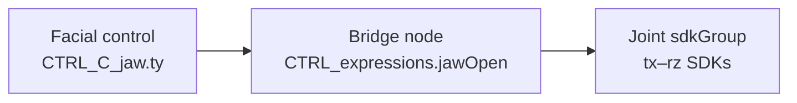
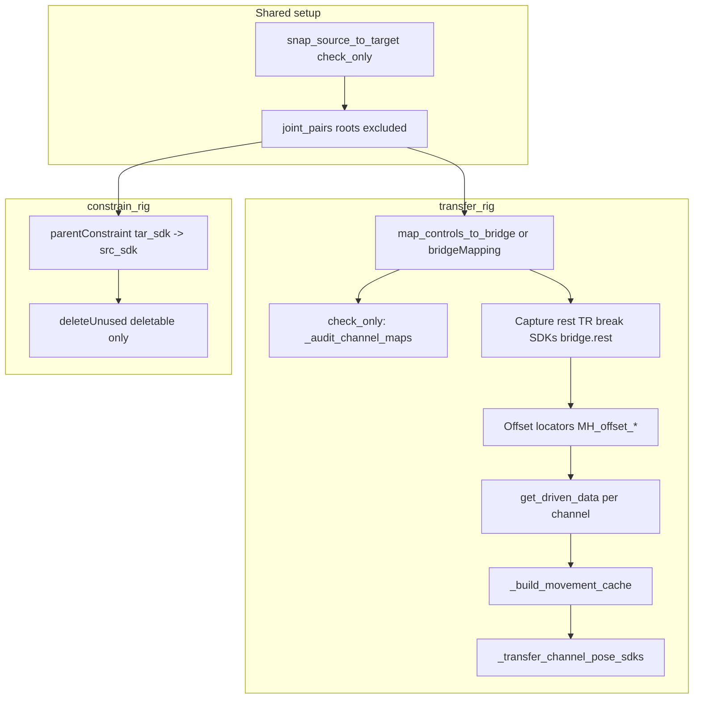

# Feature: MetaHuman Facial Rig Solving

## Status and Overview

- **Status**: In progress (July 2026)
- **Last Updated**: July 7, 2026
- **Audience**: Dev / TA — design contract for MetaHuman facial retargeting, SDK transfer, constraint workflows, and related Maya pipelines (body alignment, animation import)
- **Purpose**: Canonical reference for how we match Fortnite / custom rigs to MetaHuman hierarchies, probe control→bridge wiring, copy or constrain target SDK behavior onto source joints, align custom anim controls to MetaHuman body skeletons, and import / retarget animation. Use when extending project facial solve scripts, debugging pose drift, building align presets, or onboarding to the multi-month MetaHuman effort.

**Maintenance rule**: Update this doc when `transfer_rig`, `constrain_rig`, `map_controls_to_bridge`, rest-pose / offset-locator behavior, **body align offset capture**, or **CCL mapping conventions** change. Day-to-day iteration notes live in [`Branch_UnrealWorkflow.md`](../Branches/Branch_UnrealWorkflow.md) (MetaHuman timeline section).

---

## Scope

### In scope

- Joint hierarchy matching between source (`faceRoot`) and target (`targetRoot`)
- Control → bridge (`CTRL_expressions`) channel discovery and manual wiring maps
- Target SDK audit (`get_driven_data`) and transfer onto source joints (`transfer_rig`)
- Lightweight target-follow setup (`constrain_rig`) without SDK rebuild
- Rest-pose capture, `bridge.rest` base SDK, offset-locator sampling
- cgm `face_utils` pose-buffer schema for `fortniteMetaHuman` (reference only — wiring lives in project scripts today)
- **Body rig alignment** — map custom anim controls to MetaHuman body / hand joints, capture spatial offsets, snap controls to follow skeleton motion (CCL preset workflow)
- **Animation import** — light FBX body/face merge import and face control key transfer onto namespaced scene rigs

### Code placement note

Facial solve logic still lives in Perforce **project scripts** for fast iteration (`MetahumanFacial.py`; animation-import orchestration in separate project modules wired through Scene **Project Scripts**). **Body align** capture / snap / bake helpers are shipped in **`cgmToolsPy3`**: `cgm.core.lib.mocap_align_utils` + `cgm.core.tools.mocapBakeTools` (canonical UI). Facial SDK helpers should still factor into `sdk_utils` / `mrs/lib/face_utils` when that API stabilizes — see **MetaHuman Facial Solve** deliverables and **Future Considerations** in [`Branch_UnrealWorkflow.md`](../Branches/Branch_UnrealWorkflow.md).

Project scripts depend on **cgmTools on Maya `PYTHONPATH`** (`cgm.core`, `cgm.lib`, `other.metahuman_api`). They are **not** co-located with the cgm ship tree; CCL mapping **data** lives under character `cgmDat/mocap/` assets.

### Out of scope

- Artist Google Doc / shelf UI (can seed from this later)
- MetaHuman DCC export/import outside Maya
- Changes to vendored Red9 / zooPy
- Full auto-rig build from DNA — this doc covers **retargeting behavior onto an existing source hierarchy**

---

## Problem Domain

MetaHuman facial rigs use a **two-hop SDK chain**:



| Hop | Example | Role |
|-----|---------|------|
| **Control → bridge** | `CTRL_C_jaw.translateY` → `CTRL_expressions.jawOpen` | Artist-facing control maps to expression channel |
| **Bridge → joint** | `jawOpen` (or `bridge.rest`) → joint `sdkGroup` translate/rotate | Channel drives corrective joint pose |

**Transfer goal**: Replicate the **target** rig's joint motion on the **source** rig while preserving the source's rest differential (bind pose / jointOrient layout). Control→bridge wiring is assumed to already exist on the scene; transfer rebuilds **bridge-driven and control-driven joint SDKs** on source joints.

**Constrain goal**: Skip SDK work — parentConstrain each matched source joint to its target counterpart with `maintainOffset=True` for quick follow setups or intermediate testing.

---

## Entry Points and Call Graph

Primary implementation: Perforce project script (not in `cgmToolsPy3` ship tree):

| File | Path |
|------|------|
| **MetahumanFacial.py** | `SourceArt-DDE/TechAnimation/Maya/ProjectScripts/MetahumanFacial.py` |

Supporting cgm reference:

| File | Role |
|------|------|
| [`cgm/core/mrs/lib/face_utils.py`](../../cgmToolsPy3/cgm/core/mrs/lib/face_utils.py) | Pose buffer schema (`fortniteMetaHuman`), SDK group helpers |
| [`cgm/core/lib/sdk_utils.py`](../../cgmToolsPy3/cgm/core/lib/sdk_utils.py) | SDK curve patterns (imported by MetahumanFacial) |

### Public APIs

| Function | Purpose |
|----------|---------|
| `snap_source_to_target(source, target, check_only=False)` | Name-match joints; snap or report pairs |
| `map_controls_to_bridge(controls='FacialControls', bridge='CTRL_expressions')` | Probe axis mappings control → bridge channel |
| `get_driven_data(joint, attribute, bridge=…)` | Read SDK animCurve keys on a plug (driver, driven, key times/values) |
| `transfer_rig(faceRoot, targetRoot, bridgeMapping=None, …)` | Full SDK transfer pipeline |
| `constrain_rig(faceRoot, targetRoot, check_only=False, deleteUnused=False)` | parentConstraint target → source per pair |



---

## Core Concepts

### faceRoot vs targetRoot

| Root | Typical role |
|------|----------------|
| **faceRoot** (source) | New / Fortnite facial joint hierarchy receiving SDKs or constraints |
| **targetRoot** (target) | Reference MetaHuman (or solved) hierarchy with existing SDK behavior |

Both roots are **excluded** from joint pairs — only descendants are matched and processed.

### Joint matching (`snap_source_to_target`)

1. Index all joints under each root (breadth: root + children).
2. Match by `p_nameBase` (case-insensitive exact), then suffix/prefix fallback.
3. Each target joint used at most once (pool pop).
4. `check_only=True` returns `(m_src, m_tar)` list without snapping.

### Bridge mapping (`map_controls_to_bridge`)

- Members of `FacialControls` set (or passed control list).
- For each control, probe eligible translate axes (`tx`/`ty`/`tz`) at `+` and `-` sign.
- Restore scene baseline between probes (only one axis active at a time).
- One channel per control axis in the simple map; multi-driver channels logged separately.
- Output: `{ 'maps': [ { control, channel, axis, value }, … ], … }`.
- Manual override: `d_wire` dict at top of `MetahumanFacial.py` for known Fortnite ↔ MetaHuman wiring.

### SDK node resolution

- Joints drive through **`sdkGroup`** message children when present (`_primary_sdk_node`, `_joint_sdk_nodes`).
- Transfer keys `tx, ty, tz, rx, ry, rz` on the sdk node (`_REST_SDK_ATTRS`).

### Offset locators (`MH_offset_*`)

- Per joint pair: mirrored hierarchy under source, `parentConstraint(target_sdk, locator, maintainOffset=True)`.
- During pose SDK transfer: set **control only**, snap **source sdk → locator** (`doSnapTo`), then `setDrivenKeyframe` **without explicit `value=`** (uses snapped attrs).
- Preserves rest differential between source and target without manual per-attribute delta math.

### Movement cache

- Before transferring a channel, determine which joint pairs actually move when that control is exercised (via target SDK key sampling + baseline restore).
- Static joints for a channel are skipped (logged in `skipped` with `joint_static`).

---

## Body rig alignment to MetaHuman skeleton

**Goal**: While a MetaHuman skeleton drives or previews motion, keep a **custom anim rig’s controls** spatially aligned using per-pair offsets — without rebaking the rig each frame manually.

This is separate from facial SDK transfer but shares the **offset-locator** mental model: capture a rest differential once, replay it under moving joints.

### Workflow (artist / TA)

**Canonical tool**: `cgm.core.tools.mocapBakeTools` (Align local-offsets section). Helpers live in `cgm.core.lib.mocap_align_utils`.

1. **Scene setup** — MetaHuman skeleton (Body / Face roots) and custom anim rig referenced in the same scene.
2. **Skeleton roots** — Select the MH skeleton root transform(s) used for this shot / character and register them in the align UI. Required when **more than one MetaHuman skeleton** exists in the scene (duplicate `foot_l`-style names otherwise resolve to the wrong hierarchy).
3. **Rig namespace** — Set the anim rig namespace (e.g. `Hondo:`) so control names resolve.
4. **Load mapping preset** — Per-character `.ccl` file (mocapBakeTools-compatible JSON): skeleton joint pattern → anim control, plus follow mode per pair. Tool **autoloads the last saved/loaded CCL** on open when the file still exists (`mocap_last_ccl`); **Setup → Recent** switches presets without a file dialog.
5. **Bind pose** — With rig and skeleton in the intended aligned rest pose, **capture offsets** for all pairs (or selection).
6. **Preview / animate** — Scrub skeleton or retarget motion; **snap** mapped controls (all or selected). Optional **debug locators** parented under joints for inspection.
7. **Save preset** — Write updated `.ccl` with captured `localTranslate` / `localRotate` for reuse.
8. **Bake** — Timeline bake uses the same local-TR snap math when offsets are captured; without local offsets, mocapBakeTools keeps the legacy vector Manual Set / bake path.

**List display**: **Setup → Show short names** toggles source/target list labels to `cgmObject.p_nameShort` (optionVar `mocap_show_short_names`). Internal link data and CCL save still use resolved paths / patterns. **Index labels (Aug 2026)**: each target row shows a 0-based prefix (`[0] control`); linked sources append driven target indices (`spine_cog_anim -> [0],[1]`). Set Index and reorder use the same numbering. **Session (Aug 2026)**: status bar shows loaded CCL path; clear button drops autoload without wiping lists.

### CCL mapping conventions (July 2026)

Keep preset files **small and portable** — resolve at runtime, do not store scene DAG long paths.

| Field | Convention | Resolved via |
|-------|------------|--------------|
| **Source (joint)** | **Shortest unique pattern under Skel Roots**: leaf when unique (e.g. `foot_l`), else minimal pipe chain (e.g. `Body\|spine_04`) | Skeleton roots + `resolve_skeleton_joint` |
| **Target (control)** | Namespaced short name only (`Namespace:control_anim`) | Rig namespace field |
| **Follow** | `po` = position + rotation; `o` = rotation only | Per-pair `setPosition` / `setRotation` in connection dict |
| **Offsets** | `localTranslate`, `localRotate` on locator **parented to source joint** | Captured in bind pose; legacy `positionOffset` / forward-up vectors are deprecated for this workflow |

Finger pairs follow MetaHuman ↔ custom rig naming (e.g. `index_metacarpal_r` → `*_index_0_FK_anim`, `index_01_r` → `*_index_1_fk_anim`, thumb chain three joints, no metacarpal). Helper / twist joints without anim controls (e.g. `index_01_half_r`) are intentionally unmapped.

### Offset capture contract (body align)

Same pivot discipline as marking-menu **Locator → Selected** (`LOC.create` uses rotate pivot), not legacy scale-pivot placement:

1. **`doLoc()` on the anim control** — locator matches control world orientation; placement uses **rotate pivot (`rp`)**.
2. **Parent locator to source joint** — preserve world transform (`maintainOffset` parenting).
3. **Store** locator **`localTranslate` / `localRotate`** under that joint.
4. **Snap / bake** — rebuild parented locator with **`doLoc()` on the anim control** (same rotate pivot / `rotateOrder` / `rotateAxis` as capture), apply saved local TR, then **`movePointSnap`** / **`moveOrientSnap`** on the control from locator world pivots/rotation. Persistent debug locators use the same rebuild path.

Use **`cgmObject(longName)`** for meta wrapping on production controls — avoid `validateObjArg(..., setClass=True)` on rig controls with locked `mClass`.

**Save**: Skel Roots **required** to write a CCL; compaction validates uniqueness under those roots. **Load** of existing presets unchanged.

### Multi-skeleton scenes

When two MetaHuman rigs are present, joint lookup must be **scoped to UI skeleton roots** (semicolon-separated **long DAG paths** stored from selection). Short-name CCL patterns alone are correct only **after** roots disambiguate the hierarchy. Re-set roots, delete stale debug locators, and re-capture if the wrong skeleton was used during an earlier session.

### Reporting

Snap completion summaries go to the **Script Editor** (print + log), not modal dialogs — failures and unchanged pairs remain visible there for batch debugging.

---

## Animation import (MetaHuman FBX)

Lightweight pipeline for bringing Unreal / MetaHuman animation into an existing namespaced scene rig:

1. **Detect namespace** from selection (`CTRL_expressions` or `FacialControls` on target rig).
2. **Body FBX** — merge import with aggressive FBX flags (no skins/shapes/cameras/constraints); optional post-import geo prune on the import delta.
3. **Face FBX** — same light import; transfer animation from imported `CTRL_*` drivers onto namespaced scene controls using shared **`other.metahuman_api`** helpers (key copy / audit, not a full SDK rebuild).
4. **Audit** — matched vs missing controls reported for TA review before publish.

This path is orthogonal to facial **SDK transfer** (`transfer_rig`) — import moves **keys**; transfer rebuilds **driven joint SDK curves**.

---

## transfer_rig Pipeline (normative order)

High-level stages inside the undo chunk:

1. **Joint pairs** — `snap_source_to_target(…, check_only=True)`, exclude roots.
2. **Maps** — provided `bridgeMapping` or auto `map_controls_to_bridge()`. Optional `testControl` filter (single control, e.g. `'CTRL_C_jaw'`).
3. **`check_only`** — `_audit_channel_maps` only; return joint map + SDK hit audit.
4. **Snapshot** — `bridge.rest`, bridge channel plugs, control plugs; `pose_baseline` for per-channel restore.
5. **REST POSE block** (see invariants below):
   - Read-only capture entry rest via `_sdk_local_tr` on each source sdk node.
   - Hierarchical SDK break + re-apply captured TR on sdk nodes.
   - Key `bridge.rest @ 0` with captured values via `_set_bridge_rest_sdk`.
6. **Offset locators** — hierarchical create + target constraint.
7. **SDK key cache** — `get_driven_data(None, bridge_channel_plug)` per map channel (reads **target** curves).
8. **Movement cache** — `_build_movement_cache(sorted_pairs, maps, sdk_cache, pose_baseline)`.
9. **Per-channel transfer** — `_restore_transfer_baseline` → `_transfer_channel_pose_sdks` → baseline restore:
   - Control SDK `0 @ 0` on all moving joints for that channel.
   - Per pose key: set control, snap sdk to locator, key attrs with tangent metadata from target curve.
10. **Cleanup** — restore all `saved_plugs`; close undo chunk.

### REST POSE INVARIANTS

**Do not change without explicit user request** (comment block lives in `MetahumanFacial.py` near `_REST_SDK_ATTRS`):

| Rule | Detail |
|------|--------|
| **Entry rest capture** | Read-only `getAttr` on sdk node `tx–rz`. **Never** `xform` / world matrix — `jointOrient` makes xform ≠ rotate attrs. |
| **Post-break apply** | Re-apply the **same** captured attr tuple after breaking incoming SDKs. Do not recompute. |
| **bridge.rest @ 0** | Keys captured entry pose values. Base pose lives here, not on control SDKs. |
| **Control SDK @ 0** | Always keys **value 0** at driver 0 (`_set_control_sdk_zero_at_rest`). |
| **Pose keys** | Set control only (not bridge channels during sampling). Snap sdk → offset locator. `setDrivenKeyframe` without `value=`. |
| **Baseline during transfer** | `_restore_transfer_baseline` resets control + bridge channels from `pose_baseline` before/after each channel. **`bridge.rest` is not restored** during transfer (stays @ 0). |

### transfer_rig parameters

| Param | Default | Notes |
|-------|---------|-------|
| `faceRoot` | selection[0] | Source hierarchy |
| `targetRoot` | selection[1] | Target hierarchy |
| `bridgeMapping` | auto probe | Pass cached dict to skip re-probe |
| `bridge` | `'CTRL_expressions'` | Bridge node name |
| `check_only` | `False` | Audit only |
| `testControl` | `None` | Single control short name filter |

---

## constrain_rig

Simpler path — no bridge, locators, SDK break, or `bridge.rest`.

1. Same joint pairing as transfer (roots excluded, hierarchical sort).
2. `parentConstraint(tar_sdk, src_sdk, maintainOffset=True)` per pair.
3. Optional `deleteUnused=True`:
   - **`deletable_unused`** — unmapped target joints with **no** matched descendant.
   - **`protected_unused`** — unmapped joints on the parent chain between `targetRoot` and a matched joint (structural — **never delete**).

Deepest-first delete order for deletable joints only.

### constrain_rig parameters

| Param | Default | Notes |
|-------|---------|-------|
| `check_only` | `False` | Log pairs + deletable/protected unused lists |
| `deleteUnused` | `False` | Delete only `deletable_unused` |

---

## Key Helpers

| Helper | Role |
|--------|------|
| `_sdk_local_tr` / `_sdk_local_tr_tuple` | Rest capture from attrs |
| `_apply_local_tr` | Write captured tuple to sdk node |
| `_break_incoming_sdks` | Disconnect incoming SDK curves before rebuild |
| `_ensure_bridge_rest` | Add `rest` float attr on bridge if missing |
| `_set_bridge_rest_sdk` | Key rest pose on bridge.rest driver |
| `_create_offset_locator_pair` | MH_offset locator + target constraint |
| `_snap_sdk_to_locator` | `doSnapTo` sdk → locator |
| `_transfer_channel_pose_sdks` | Control pose SDK loop (snap-sampled) |
| `_restore_transfer_baseline` | Reset control + bridge channels between channels |
| `_audit_channel_maps` | check_only SDK hit report |
| `_protected_target_ancestors` | Unmapped parents of matched targets |
| `_deletable_unused_target_joints` | Safe delete list for constrain_rig |
| `get_driven_data` | Target SDK curve introspection |

---

## Rejected Approaches (learned the hard way)

| Approach | Why rejected |
|----------|--------------|
| **`xform` / quaternion reads for rest** | `jointOrient` breaks equivalence with `rotate` attrs; rest pose drifts |
| **Bridge channel driving during pose sampling** | Pollutes joint evaluation; control-only + snap is the stable contract |
| **Locator differential math without snap** | Error-prone vs `doSnapTo` after setting control |
| **Per-pose SDK disconnect + eval loop** | Too slow for full-face transfer |
| **Explicit `value=` on pose `setDrivenKeyframe`** | Bypasses snapped pose; omit `value` to use current attrs |
| **Deleting all unmapped target joints** | Unmapped **ancestors** of matched joints are structural — must protect |
| **Recomputing rest after SDK break** | Must use entry snapshot only |
| **Scale pivot for align `doLoc` capture** | Translate wrong while rotate looks fine — snap uses rotate pivot; use **`rp`** (matches `LOC.create` / marking-menu locators) |
| **Long DAG paths in CCL presets** | Bloated, path-dependent assets — use short joint patterns + namespaced controls; resolve via skeleton roots + rig NS |
| **Global joint resolve with duplicate skeletons** | Locators parent to wrong hierarchy — require skeleton roots in UI before capture / snap |
| **`validateObjArg(setClass=True)` on anim controls** | Locked `mClass` errors — use `cgmObject` only for align meta wrap |
| **Legacy CCL `positionOffset` + forward/up for align** | Incompatible with parented local-TR workflow — capture `localTranslate` / `localRotate`; re-capture after pivot fix |

---

## Anti-Patterns and Failure Modes

| Anti-pattern | Symptom | Contract |
|--------------|---------|----------|
| Capture rest after breaking SDKs | Wrong base pose | Capture **first**, break second |
| Use `xform` for rest | Subtle rotate errors | `_sdk_local_tr` only |
| Drive bridge channels while sampling poses | Keys don't match target motion | Control only; baseline restore |
| Skip `0 @ 0` control SDK | Rest drift on control axis | `_set_control_sdk_zero_at_rest` always |
| Transfer without movement cache | Keys on static joints | Respect `joint_static` skips |
| `deleteUnused` on protected ancestors | Broken hierarchy / constraints | Use `check_only` → read `protected_unused` |
| Assume control → joint direct SDK | Missing bridge hop | Audit with `get_driven_data` on bridge plug first |
| Capture align offsets without skeleton roots (multi-MH scene) | Wrong joint parent for locators | Set roots from selection first |
| Mix scale-pivot capture with rotate-pivot snap | Position drift on IK / offset controls | Single pivot contract end-to-end (`rp`) |

---

## Verification Checklist (dev)

Run in Maya on a known MetaHuman + Fortnite test scene:

1. **`snap_source_to_target(check_only=True)`** — sensible pair count; review missing list.
2. **`map_controls_to_bridge()`** — channels mapped; inspect `unmapped_controls` / `multi_driver`.
3. **`get_driven_data(None, 'CTRL_expressions.jawOpen')`** — driver = control plug, keys present.
4. **`transfer_rig(check_only=True)`** — SDK hits per joint/channel; review `skipped`.
5. **`transfer_rig(testControl='CTRL_C_jaw', bridgeMapping=…)`** — single-channel smoke on one control.
6. **Full `transfer_rig()`** — undo chunk; scene restores plug values at end.
7. **`constrain_rig(check_only=True)`** — pairs; `deletable_unused` vs `protected_unused` sane.
8. **`constrain_rig(deleteUnused=True)`** — only leaf/unmapped branches removed.

### Body align verification (dev)

Run in Maya with MH skeleton + custom anim rig in bind pose:

1. Set **skeleton roots** from the intended MH `Body` / `Face` roots; confirm field shows long paths.
2. Load character **`.ccl`** preset; confirm mapping list resolves (no unresolved rows).
3. **Capture offsets** — spot-check one IK foot and one finger: locator under correct joint, local TR sane.
4. **Create debug locators** — parent chain matches skeleton roots scope.
5. Move skeleton (or scrub retarget); **snap all** — Script Editor report; controls follow with captured differential.
6. **Save CCL** — file uses short patterns only (no `\|BP_\|` / `\|master\|` DAG paths); reload round-trips.

### Example script calls

```python
import MetahumanFacial as MF

MF.transfer_rig(check_only=True)
MF.transfer_rig(testControl='CTRL_C_jaw', bridgeMapping=...)
MF.constrain_rig(check_only=True)
MF.constrain_rig(faceRoot, targetRoot, deleteUnused=True)
```

---

## Future Work (tracked here as we go)

- [ ] Shelf / UI wrapper for probe → transfer → constrain workflow
- [ ] Persisted `bridgeMapping` asset per character variant
- [ ] Bridge → joint second-hop audit (today: transfer samples target joint motion via locators, not a separate bridge→joint curve walk)
- [ ] Batch / mayapy path for regression scenes
- [ ] **Factor core helpers into cgm proper** (`sdk_utils`, `mrs/lib/face_utils`) — see [`Branch_UnrealWorkflow.md`](../Branches/Branch_UnrealWorkflow.md); align CCL + offset capture → `mocap_align_utils` **done** July 2026
- [ ] Artist manual section (Google Doc capture when UI exists)
- [x] Body align: parented local-TR offset capture + snap (July 2026)
- [x] CCL short-name convention + skeleton-root disambiguation (July 2026)
- [x] `doLoc` rotate-pivot default aligned with marking-menu locators (July 2026 — cgm core)
- [ ] Body + hand finger mappings in per-character CCL assets (ongoing as rigs land)
- [x] **Native align/snap/bake in mocapBakeTools** — [`Feature_MocapAlignSnap.md`](Feature_MocapAlignSnap.md) (July 2026). Canonical home; dual-path keeps legacy vector bake when local offsets unset. **Maya parity vs sparrowTools / loaded CCL verified Aug 2026** (doLoc snap rebuild). Project-script align UI deprecation deferred until team standardizes on mocapBakeTools.

---

## Related Documentation

- **[Branch_UnrealWorkflow.md](../Branches/Branch_UnrealWorkflow.md)** — branch timeline (MetaHuman + export), deliverables, factor-to-cgm plan
- **[Feature_SceneExportFlow.md](Feature_SceneExportFlow.md)** — export pipeline (orthogonal; facial solve may precede export)
- **[NewFeature_Guide.md](../Guides/NewFeature_Guide.md)** — feature doc conventions
- **Session transcript** — `transfer_rig` implementation and rest-pose debugging (Cursor agent history, June 2026)

### Code references

- `SourceArt-DDE/TechAnimation/Maya/ProjectScripts/MetahumanFacial.py` — primary implementation
- [`cgm/core/mrs/lib/face_utils.py`](../../cgmToolsPy3/cgm/core/mrs/lib/face_utils.py) — `fortniteMetaHuman` buffer attrs

---

## Revision History

| Date | Summary |
|------|---------|
| 2026-08-12 | mocapBakeTools last CCL autoload (`mocap_last_ccl`); status bar + Setup → Recent; workflow step 4 updated |
| 2026-08-05 | CCL save uses skel-root uniqueness validation (no MH allowlist); save requires roots; existing CCL load unchanged |
| 2026-08-05 | List index labels + target RMB reorder (Move Up/Dn, Top/Bottom, Set Index); short-name index display fix |
| 2026-08-05 | Body align snap parity: doLoc rebuild; `resolve_connections`; tool reload; Setup → Show short names — user Maya verified |
| 2026-07-26 | mocapBakeTools is canonical body align/snap/bake home (`mocap_align_utils`); dual-path legacy when local offsets unset |
| 2026-07-07 | Body rig align workflow: CCL short-name conventions, skeleton-root scoping, local-TR offset capture (`rp` / `doLoc`), snap reporting; animation import overview; multi-skeleton and pivot learnings in rejected approaches |
| 2026-06-22 | Branch timeline consolidated under UnrealWorkflow; factor-to-cgm note |
| 2026-06-22 | Initial feature doc — two-hop SDK model, transfer_rig / constrain_rig pipelines, REST POSE invariants, offset locators, deleteUnused safety, rejected approaches, verification checklist |
