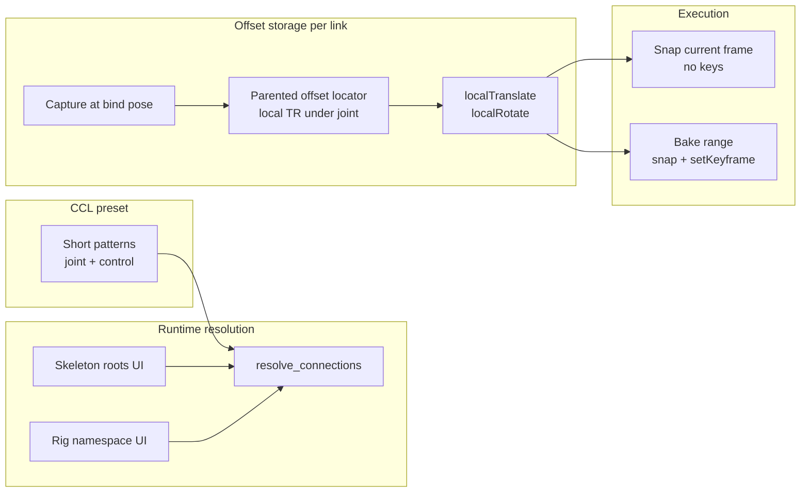

# Feature: Mocap Align Snap (native mocapBakeTools)

## Status and Overview

- **Status**: Implemented and Maya-verified (August 2026) — dual-path: local-TR when captured; legacy vector bake when not
- **Last Updated**: August 5, 2026
- **Audience**: Dev / TA — design contract for integrating skeleton→control align/snap/bake into **`mocapBakeTools`**
- **Purpose**: Replace the legacy world-vector offset bake path with the validated **parented local-TR locator** workflow (capture once, snap per frame, key controls), while preserving the existing **CCL preset format** and link-list UI artists already use. Unifies single-frame preview snap and timeline bake in one shipped cgm tool. **When `localTranslate` / `localRotate` are not set, Manual Set / Set On Bake / vector bake behave exactly as before.**

**Maintenance rule**: Update this doc when `mocapBakeTools` offset capture, snap, bake loop, CCL schema, or resolution rules change. Body-align workflow context and pivot learnings live in [`Feature_Metahuman.md`](Feature_Metahuman.md) (body rig alignment section).

**Related docs**

- [`Feature_Metahuman.md`](Feature_Metahuman.md) — MetaHuman pipelines; body align offset contract (`localTranslate` / `localRotate`, rotate pivot, skeleton roots)
- [`Feature_SceneExportFlow.md`](Feature_SceneExportFlow.md) — export bake/prep (orthogonal; mocap align may run **before** export in some shots)

---

## Problem

### What mocapBakeTools does (dual-path, July 2026)

[`cgm/core/tools/mocapBakeTools.py`](../../cgmToolsPy3/cgm/core/tools/mocapBakeTools.py) maps **source** drivers (typically mocap / MetaHuman joints) to **target** controls, then snaps or bakes over a frame range. Offset helpers live in [`mocap_align_utils.py`](../../cgmToolsPy3/cgm/core/lib/mocap_align_utils.py).

| Stage | Local-TR path (preferred) | Legacy path (no local offsets) |
|-------|---------------------------|--------------------------------|
| **Capture** | **Capture offsets** — `doLoc` at rotate pivot, parent to source, store `localTranslate` / `localRotate` | **Manual Set** / Set On Bake — world delta + `offsetForward` / `offsetUp` |
| **Snap** | Single-frame locator snap (`movePointSnap` / `moveOrientSnap`) | N/A — skip + full missing-data report |
| **Bake** | Per-frame same snap + `setKeyframe` | `POS.set` + `SNAP.aim_atPoint` (unchanged) |
| **CCL** | Short patterns + local TR; resolve via skeleton roots + rig NS | Six-element JSON; may still hold vector offsets |

### What we validated externally (July 2026)

A project-script prototype (documented in [`Feature_Metahuman.md`](Feature_Metahuman.md)) proved the local-TR workflow; that logic now lives in **cgmToolsPy3** and drives preview snap and timeline bake inside mocapBakeTools.

---

## Goals

### In scope

- Factor align/snap/CCL helpers into **`cgm/core/lib/`** (no new logic in project scripts long-term)
- **Capture offsets** in mocapBakeTools UI (bind pose) using local-TR locator workflow
- **Snap** — single-frame, no keys (all links or selection); Script Editor report
- **Bake** — per-frame snap + `setKeyframe` on targets using **same** offset math as snap
- **CCL** — load/save compatible with existing six-element format; prefer short patterns; accept legacy files
- **Resolution** — skeleton joint patterns scoped to UI skeleton roots; rig controls via namespace
- Backward compatibility: load old CCLs with `positionOffset` / forward-up; warn and require re-capture for bake/snap

### Out of scope (initial ship)

- Replacing mocapBakeTools link-by-distance / link-by-name UX (keep; may auto-fill from preset)
- Facial SDK transfer ([`Feature_Metahuman.md`](Feature_Metahuman.md) — separate pipeline)
- Scene export integration hooks (future: optional pre-export bake step)
- Artist Google Doc / shelf (after UI stabilizes)
- Persisting debug locators in CCL (`alignLocator` refs remain session-only)

---

## Architecture

### Core concepts



| Concept | Role |
|---------|------|
| **Connection dict** | One source→target pair: patterns, resolved nodes, follow flags, offsets |
| **Follow mode** | `setPosition` + `setRotation` → legacy `constraintType` `po` / `o` in CCL target data |
| **Offset locator** | Temporary or persistent debug loc; parented to **source** joint with saved local TR; world pose drives snap |
| **Resolution** | Patterns in CCL; long paths only in memory after resolve |

### Offset contract (normative)

Inherited from [`Feature_Metahuman.md`](Feature_Metahuman.md) — **do not diverge**:

| Step | Rule |
|------|------|
| Locator creation | `cgmObject.doLoc()` on **target** control; **rotate pivot** placement |
| Parent | To **source** joint; preserve world transform |
| Storage | `localTranslate`, `localRotate` on locator under joint |
| Snap / bake rebuild | **Same as capture** — `doLoc()` on target again, parent to source, apply saved local TR. **Do not** use plain `spaceLocator` (wrong `rotateOrder` / `rotateAxis` → world offset) |
| Snap position | `cgm.lib.position.movePointSnap` (rotate pivot) |
| Snap rotation | `cgm.lib.position.moveOrientSnap` |
| Meta wrap | `cgmObject(longName)` only — not `validateObjArg(setClass=True)` on anim controls |

### CCL schema (extended, backward compatible)

Existing six-element array unchanged:

```
[source_items, source_data, target_items, target_data, links, connection_data]
```

**connection_data[]** entries — supported keys:

| Key | Required | Notes |
|-----|----------|-------|
| `source`, `target` | Yes | Short patterns in saved files |
| `setPosition`, `setRotation` | Yes | Bake/snap flags |
| `localTranslate`, `localRotate` | Preferred | New capture output |
| `positionOffset`, `offsetForward`, `offsetUp` | Legacy | Load OK; snap/bake warns until re-captured |

On save: compact source patterns under Skel Roots — **leaf when unique**, minimal pipe chain when not. **Skel Roots required to save**; load unchanged for existing files.

**Save compaction (Aug 2026):** No hardcoded joint allowlist. `_minimal_unique_source_pattern` validates leaf uniqueness under configured roots; `validate_connections_for_save` ensures compacted patterns resolve to the same joints. `resolve_connections` uses `_pattern_for_resolve` so loaded CCL literals are never rewritten on load/reresolve.

---

## Module placement

Per [`cgm-module-placement`](../../.cursor/rules/cgm-module-placement.mdc):

| Module | Responsibility |
|--------|----------------|
| **`cgm/core/lib/mocap_align_utils.py`** | CCL load/save/normalize, pattern resolution, capture, single-frame snap, **per-frame bake sample**, connection dict helpers |
| **`cgm/core/tools/mocapBakeTools.py`** | UI (Align local offsets + legacy Set Connection Pose), link lists, dual-path `bake()` |
| **Project scripts** | Deprecate duplicate align UI once parity reached; may keep Scene menu entry that opens mocapBakeTools |

Do **not** put resolution or offset math in `cgm_General` or vendored trees.

### Proposed public API (`mocap_align_utils.py`)

| Function | Purpose |
|----------|---------|
| `load_ccl(path)` / `save_ccl(path, data)` | JSON six-element IO |
| `ccl_to_connections(data, rig_ns, skel_roots, skel_ns)` | Normalize + resolve |
| `connections_to_ccl(connections, rig_ns, skel_roots)` | Short-pattern export (compaction requires `skel_roots`) |
| `validate_connections_for_save(connections, skel_roots, …)` | Pre-save: roots set, patterns resolve equivalently |
| `resolve_connections(connections, rig_ns, skel_roots, skel_ns)` | Re-resolve patterns in place; sets `resolved`; clears stale `alignLocator` when source changes |
| `resolve_skeleton_joint(pattern, skel_roots, skel_ns)` | Scoped joint lookup (ranked `Body\|…` / `Face\|…` suffix match) |
| `resolve_rig_control(pattern, rig_ns)` | Namespaced control lookup |
| `source_pattern_needs_skel_roots(pattern, skel_ns)` | UI gating when multiple MH skeletons share leaf names |
| `capture_alignment_offsets(connections)` | Bind-pose capture in place |
| `snap_connections(connections, indices=None)` | Single frame; returns result dict |
| `bake_connections(connections, start, end)` | Timeline loop: snap + keyframe |
| `_align_ccl_source_pattern` / `_align_ccl_target_pattern` | Short-name helpers (module-private) |

Project-script implementations were the reference port; py3 lib reached Maya parity August 2026.

---

## mocapBakeTools UI plan

Keep existing **source / target lists**, **link**, **bake range**, and **CCL load/save**. Add:

| UI block | Control | Behavior |
|----------|---------|----------|
| **Resolution** | Rig namespace field | Default from selection or last used optionVar |
| **Resolution** | Skeleton roots field + “Set from selection” | Semicolon-separated long paths; required when >1 skeleton |
| **Offsets** | **Capture offsets** | Replaces or supplements “Set connection pose”; writes `localTranslate` / `localRotate` |
| **Preview** | **Snap all** / **Snap selected** | No keys; report to Script Editor |
| **Debug** | **Create locs** / **Delete locs** (optional) | Persistent offset locators per link |
| **Bake** | Existing bake button | Calls `bake_connections()` using locator snap |
| **Display** | **Setup → Show short names** | List aliases use `cgmObject.p_nameShort` when enabled (`mocap_show_short_names`) |
| **Lists** | Target list index labels | Each target row prefixed with 0-based index (e.g. `[0] body_C0`); survives short-name `ns:base` scroll-list display |
| **Lists** | Source link index labels | Linked sources show driven target indices (e.g. `spine_cog_anim -> [0],[1]`) |
| **Lists** | Target list RMB reorder | Move Up/Dn, Move to Top/Bottom, Set Index… (0-based); remaps link indices; order saved in CCL `target_items` |

OptionVar candidates: `mocap_rig_namespace`, `mocap_skel_roots`, `mocap_show_short_names`, `mocap_use_local_offsets` (default 1).

**Dev reload**: `tool_calls.mocapBakeTool()` and **Setup → Reload** call `reload_dependencies()` — reload `mocap_align_utils` before `mocapBakeTools` during iteration.

**“Set connection pose”** — either:

- **A (recommended):** Remove from default UI; keep legacy function as deprecated alias that warns and calls old vector math only if a “legacy offsets” debug flag is on.
- **B:** Rename to “Capture offsets (legacy)” hidden under Tools menu for old scenes.

---

## Bake loop design

Replace inner loop of `bake()`:

```python
# Current (legacy)
POS.set(target, source_pos + positionOffset)
SNAP.aim_atPoint(target, ..., vectorUp=offsetUp)

# Target (locator-based)
for frame in bake_range:
    mc.currentTime(frame)
    for conn in connection_data:
        snap_connection_pair(conn)  # same as single-frame snap
        if conn['setPosition']:
            mc.setKeyframe(target + '.translate')
        if conn['setRotation']:
            mc.setKeyframe(target + '.rotate')
```

Notes:

- Rebuild or update offset locators **once** before bake chunk; **`_get_or_build_snap_locator`** syncs parent + local TR (same doLoc rebuild as snap).
- Locator local TR stays constant; joint motion drives world locator pose.
- Single `undoInfo` open/close around full bake (existing pattern).
- `cgmGEN.playback_stop()` before bake (existing).

Performance: ~N links × M frames locators — acceptable for typical body (~50×1000); profile before optimizing (pool locators, avoid recreate per frame).

---

## Migration and compatibility

| Scenario | Behavior |
|----------|----------|
| Old CCL with long DAG paths | Load OK; normalize to short on save; resolve if nodes exist |
| Old CCL with vector offsets only | Load OK; snap/bake warn “re-capture offsets”; optional one-time “legacy bake” menu for old scenes |
| New CCL with local TR | Full snap + bake |
| Mixed skeletons in scene | User must set skeleton roots (same as MetaHuman align doc) |
| `doLoc` pivot fix in cgm core | Required dependency — rotate pivot default (July 2026) |

Character presets (e.g. per-project `.ccl` under `cgmDat/mocap/`) ship short names; mocapBakeTools default file dialog can point at project dat path via optionVar later.

---

## Implementation phases

### Phase 1 — Library extraction (py3 only)

1. Create `cgm/core/lib/mocap_align_utils.py` from validated project-script logic.
2. Unit-test pure helpers where possible (pattern parsing, CCL round-trip without Maya).
3. Maya dev tests: capture → snap → compare control to manual locator check (foot IK, one finger).

**Exit criteria:** Lib imports from Maya; one body pair passes capture/snap.

**Status: done (July 2026)** — orchestration over `doLoc` / `movePointSnap` / `moveOrientSnap`.

### Phase 2 — mocapBakeTools capture + snap (no bake change yet)

1. Wire UI: namespace, skeleton roots, Capture offsets, Snap all/selected.
2. On CCL load: `ccl_to_connections` + populate lists from patterns (or merge with existing list UI).
3. Script Editor reporting for snap.
4. Keep legacy `bake()` unchanged; warn if local offsets missing.

**Exit criteria:** Load preset, capture, scrub skeleton, snap — matches project prototype.

**Status: done (July 2026)** — Set Connection Pose kept; Snap skips missing local TR with full Script Editor report.

### Phase 3 — Bake integration

1. Implement `bake_connections()` in lib.
2. Replace `bake()` body to call lib when `localTranslate` present on all active links (or per-link fallback with warning).
3. OptionVar “set connection at bake” → auto-capture if missing (discourage for production; prefer explicit capture).

**Exit criteria:** Bake range on test scene matches single-frame snap at each frame; keys on targets only.

**Status: done (July 2026)** — per-link dual path: local TR → `bake_connections`; else legacy vector bake. Set On Bake skips links that already have local TR.

### Phase 4 — Polish and deprecation

1. Short-name save by default; mapping list or alias refresh shows resolved short names.
2. Document in [`Feature_Metahuman.md`](Feature_Metahuman.md) that mocapBakeTools is the canonical align/bake home.
3. Thin or remove duplicate project align UI; Scene menu opens mocapBakeTools or preloads preset path.
4. Google Doc capture for artists (optional).

**Status: partial** — short-name CCL save + MetaHuman doc note done; **Setup → Show short names** for link lists (Aug 2026); **Maya snap parity confirmed** vs sparrowTools / loaded CCL; project-script UI deprecation deferred until team standardizes on mocapBakeTools.

---

## Testing checklist

### Dev (Maya)

1. Load short-name CCL; set skeleton roots + rig NS; all links resolve.
2. Capture at bind pose; spot-check local TR on foot IK and one finger.
3. Snap all — Script Editor report; controls match debug locators.
4. Scrub skeleton; repeat snap on single frame — stable.
5. Bake 10-frame range; keys only on targets; motion matches live snap.
6. Load **legacy** CCL (vector offsets); warnings; re-capture; bake succeeds.
7. Two skeletons in scene; without roots — capture/snap blocked or warns; with roots — correct hierarchy.
8. CCL save/reload round-trip; file stays short; offsets preserved.

### Regression

- Existing mocapBakeTools link-by-name / link-by-distance still works for ad-hoc sessions without preset.
- Old CCL files from shipped characters still load (may need re-capture, not crash).

---

## Risks and open questions

| Item | Notes |
|------|-------|
| **Bake performance** | Many links × long ranges; may need locator pooling |
| **Orient-only pairs** | Bake rotation keys only — verify no stray translate keys |
| **Referenced rigs** | Snap/bake on referenced anim controls — test lock/reference edits |
| **Constraint conflicts** | Targets with existing constraints may not move; report in unchanged_details (reuse snap result pattern) |
| **Auto “set connection at bake”** | Legacy behavior re-captures with **wrong** math if left on — default off when local-offset mode enabled |
| **UI complexity** | mocapBakeTools already dense; consider collapsible “MetaHuman align” frame |

**Open decisions (resolve before Phase 2):**

1. Remove vs hide legacy “Set connection pose”?
2. Should link lists store **patterns** or resolved long names internally after load?
3. Default skeleton roots from selection on CCL load if exactly one MH root detected?

---

## Future work (post-ship)

- [ ] Scene export hook: optional “bake mocap align before export” on tdSet rigs
- [ ] Preset browser tied to `cgmDat/mocap/` per character
- [ ] mayapy batch bake for overnight retarget passes
- [ ] Merge with mocapBakeTools “attach point” / raycast loc workflows (shared `LOC.create` pivot rules)

---

## Revision history

| Date | Summary |
|------|---------|
| 2026-08-05 | List index display — targets `[n]` prefix; linked sources `name -> [n],…`; target RMB reorder (Move Up/Dn, Top/Bottom, Set Index); short-name display fix for index prefix |
| 2026-08-05 | CCL save: skel-root uniqueness compaction (no MH allowlist); save blocked without roots; `_pattern_for_resolve` preserves loaded patterns on load/reresolve |
| 2026-08-05 | Snap parity fix: doLoc rebuild for snap/bake/debug locs (rotateAxis invariant); sparrow resolution + `resolve_connections`; re-resolve before align ops; `reload_dependencies`; Setup → Show short names — user Maya verified |
| 2026-07-26 | Implemented dual-path in py3: `mocap_align_utils` + mocapBakeTools Align UI; local TR snap/bake; legacy path when offsets unset; full snap missing-data report |
| 2026-07-07 | Initial plan — problem statement, lib factoring, UI/bake design, phases, migration, testing |
