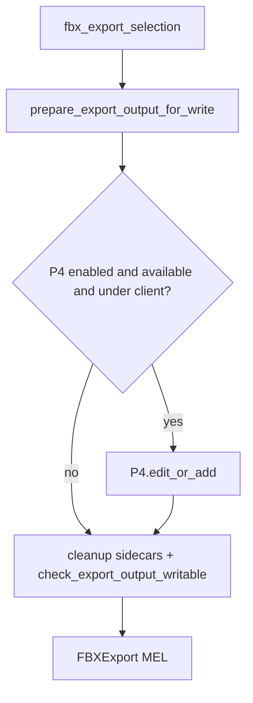
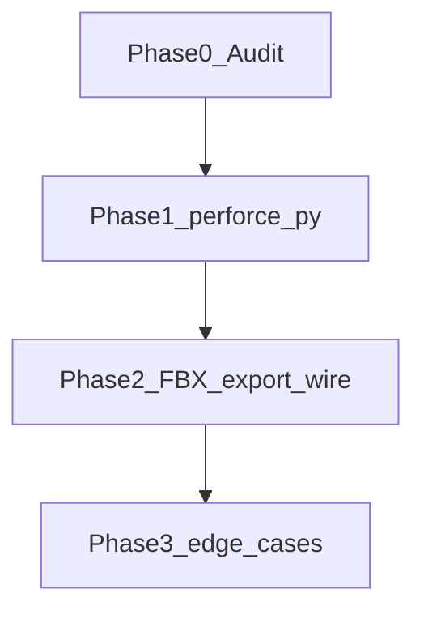

# Feature: Perforce Integration

## Status and Overview

| Field | Value |
|-------|-------|
| **Status** | Active — FBX export preflight + Scene auto checkout + mayapy batch P4 context + cgmP4 revert path fix + Scene meta sidecars + cgmP4 default CL partial submit shipped; **`useP4OnExport` export-only flag still TBD** |
| **Last Updated** | August 18, 2026 (batch export P4 context + cgmP4 revert + batch script edit-only) |
| **Owners** | TBD |
| **Audience** | Dev / TA — design contract for optional P4 incorporation in cgm tools |
| **Branch** | [`Branch_p4.md`](../Branches/Branch_p4.md) |

**Purpose:** Canonical reference for adding an **optional** Perforce layer to cgm tools. When P4 is absent, disabled, or the target path is outside a client view, **nothing changes** — same code paths, errors, and logs as today. When explicitly enabled and P4 is available, export (v1) can auto `p4 edit` / `p4 add` so synced depot FBX targets become writable before `FBXExport` runs.

**Core principle (non-negotiable):** P4 is a purely optional layer. No new dependencies, prompts, UI, or failure modes for users without Perforce.

**Maintenance rule:** Update this doc when changing `cgm.core.lib.perforce`, export prepare hooks, or P4 configuration. Timeline of individual fixes lives in [`Branch_p4.md`](../Branches/Branch_p4.md).

**Related docs**

- [`Feature_SceneExportFlow.md`](Feature_SceneExportFlow.md) — export pipeline (v1 P4 consumer)
- [`Plan_ExportP4Integration.md`](../Plans/Plan_ExportP4Integration.md) — superseded planning doc (kept for history)

---

## Scope

### In scope (v1)

- **Phase 0 — Incorporation audit:** map write paths, studio P4 setup, reference-code review
- **`cgm.core.lib.perforce`:** subprocess `p4` CLI wrapper under `cgm/core/lib/`
- **FBX export output paths** from Scene `ExportScene` / `BatchExport` (anim, cutscene, rig, static as configured)
- **Pre-export prepare (opt-in only):** attempt checkout or add so `check_export_output_writable()` passes
- **Existing sidecars:** continue best-effort `.bak` cleanup; extend if P4 state blocks deletion
- **Batch reporting:** extend non-writable summary with P4 action attempted / reason when P4 was enabled

### Out of scope (v1)

- Maya `.ma` / `.mb` save-here / Save Version
- Texture / image export paths
- Submitting changelists from **export** — export opens files only (`p4 edit` / `p4 add`); no auto-submit on export
- Revert-on-failed-export rollback
- Modifying **`cgm.lib.zoo.zooPy.perforce`** or **`Red9/`** modules
- Full depot policy (branch specs, file types, `p4 typemap`) — studio ops owns
- Requiring P4 for any cgmTools session

### Non-goals

- Mandatory P4 for all users
- Behavior changes for users without `p4` CLI installed
- Auto-enabling P4 when `p4 info` succeeds (must be explicit opt-in)
- Silent overwrite of another user's open-for-edit file without error

---

## Architecture

### Optional gate (must pass all three)

P4 subprocesses run **only** when:

1. **Explicit opt-in** — `useP4OnExport` project flag **or** `CGM_EXPORT_P4` env var is set (both default off)
2. **`is_available()`** — `p4 info` succeeds for this session
3. **`is_under_client(disk_path)`** — target path is in the workspace view (`p4 fstat`)

If any check fails → **skip P4 entirely** (no subprocess, no extra log noise) and run today's path only.



### Core concepts

| Concept | Description |
|---------|-------------|
| **Optional layer** | P4 sits between export path resolution and writability check; never replaces existing checks |
| **Path authority** | Absolute disk paths from **Scene + cgm Project** only — not Red9 pathing |
| **Module split** | P4 subprocess logic in `cgm/core/lib/perforce.py`; sidecars, writability, batch path list stay in `path_utils` |
| **Reference only** | zooPy `perforce.py` and Red9 Pro perforce docs inform reimplementation — **never imported at runtime** |

### Decision: `cgm.core.lib.perforce` (ours)

New first-party module at **`cgm/core/lib/perforce.py`** (`import cgm.core.lib.perforce as P4UTIL`). Subprocess-based `p4` CLI wrapper scoped to export needs — no zooPy `Path` monkey-patching.

**Hard rule:** cgm core **must not** `import` from `cgm.lib.zoo.zooPy.perforce`.

### Phased implementation



| Phase | Work |
|-------|------|
| **0 — Audit** | Map write paths, confirm studio `p4 info` / `P4CONFIG`, skim reference code, resolve open questions |
| **1 — Module** | `perforce.py` write/query API + cgmP4 UI + session cache — **done**; project + interactive save **`prepare_*`** — **done (Slice B + C)**; **`prepare_export_output_for_write`** wired in ExportScene — **done**; `useP4OnExport` flag — **TBD** |
| **2 — Export wire** | `fbx_export_selection`, batch summary extensions |
| **3 — Edge cases** | New file add type, `.bak` under P4, lock-by-other-user messaging |

### Hook point (normative — export preflight shipped)

```
ExportScene / fbx_export_selection
  → path_utils.preflight_export_output_paths()   ← before bake (ExportScene)
       → prepare_export_output_for_write per path
       → prepare_output_for_write (VC=perforce + in-scope + connected → P4; else writability only)
       → path_utils.cleanup_fbx_export_sidecars()
  → bake / prep / …
  → fbx_export_selection → check_export_output_writable (defense in depth)
  → FBXExport MEL
```

Project **File → Save** (shipped): `Project.data.write()` / `cgm_Dat.data.write()` → **`prepare_output_for_write(mDat=, confirm_p4=True)`** before ConfigObj/JSON write.

### Save flow contract — paths first (Aug 2026)

Once the output path is known, call **`prepare_paths_for_write`** / **`prepare_output_for_write`** / **`prepare_maya_scene_for_save`** **before** expensive save work (scene queries, pose capture, skin gather, CCL build, etc.). Goal: P4 checkout and writability dialogs appear immediately; user cancel avoids wasted work.

| Step | When |
|------|------|
| Resolve path | File dialog, loaded-file path, or computed save target |
| **Prepare path(s)** | **`prepare_*`** — fstat, out-of-date block, checkout/add confirm |
| Gather / build | Pose save, skin export, connection resolve, ConfigObj fill, … |
| Write | `open` / `mc.file(save)` / Red9 / low-level helper |

Low-level writers (e.g. **`save_ccl`**) may accept **`skip_prepare=True`** when the UI already prepared. Batch / farm callers use **`confirm_p4=False`**.

**Reference callers:** PoseManager / Animate (prepare before Red9 `poseSave`), animFilter / mocapBakeTool (prepare before gather/write), skinDat (prepare before `updateSourceSkinData`), cgm_Dat / Project (prepare before ConfigObj).

---

## Current state (baseline)

| Component | Behavior |
|-----------|----------|
| `path_utils.check_export_output_writable()` | mkdir parent, remove editable `.bak` sidecars, `os.access(W_OK)` fail-fast |
| `path_utils.prepare_output_for_write(mDat=)` | **Shipped (Slice B)** — project cfg save; fstat, out-of-date block, checkout/add confirm |
| `path_utils.PathWritePrepareError` | Save prepare failure (out of date, locked, cancelled checkout) |
| `path_utils.ExportOutputNotWritableError` | Export message suggests manual `p4 edit` |
| `path_utils` session list | `record/get/clear_non_writable_export_paths()` for batch summary |
| `cgm_General.fbx_export_selection()` | Calls writability check before `FBXExport`; ExportScene preflight runs earlier (before bake) |
| `Scene.BatchExport` | Clears path list at start; logs non-writable rollup at end |
| `cgm.core.lib.perforce` | Connectivity + path query + write slice; session cache in **`perforce_session`** |
| `cgm/core/tools/p4Tool.py` | **cgmP4** — window reuse, cache-first refresh, Opened + **Shelved Files** changelist sections (collapsible frame), batch R/S/**Sh** and D/**Mv**/Sub, Sync Workspace, path Checkout; Setup → Reload uses standard cgm `reload()` |
| `cgm/core/tools/lib/project_utils.py` | `versionControl` schema + `project_uses_perforce(mDat)` |
| `cgm/core/mrs/Scene.py` + `scene_utils.py` | Scene browser file-row P4 **itc + alias suffix** when versionControl + connected (batch fstat per column load) |
| `cgm.lib.zoo.zooPy.perforce` | Vendored zooPy; reference only |

### Scene browser file status display (shipped)

When Project **General → versionControl = perforce** and cgmP4 / Project P4 row shows **connected**, Scene **SubType / Variation / Version** columns query file status on load:

| Step | Module | Behavior |
|------|--------|----------|
| Gate | `scene_list_p4_enabled` | `project_uses_perforce(mDat)` + `query_project_p4_status()['connected']` |
| Batch query | `query_files_status(paths)` | Cache-first batch `p4 fstat`; chunked misses only |
| Classify | `classify_file_status_ui(file_dat)` | → color key or `None` (synced default) |
| Label | `file_status_ui_suffix(file_dat, key)` | → `(locked-by-other)`, `(checked-out)`, etc. |
| Apply | `scene_list_apply_p4_file_itc` | Sets `row.itc`, `row.alias`, `row.data['p4Status']`; `.item` unchanged |

**Status keys and colors** — see [`Feature_CgmToolUI.md`](Feature_CgmToolUI.md) Scene browser P4 table. **Locked** (`lockedByOther`) takes priority over checkout/sync. **Unknown** = local file not on depot (yellow, not gray). Synced at head: off-white, no suffix.

**Refresh / cache** (August 2026): `query_files_status` stores results in `perforce_session._CACHE['fstat_by_path']` keyed by `(user, client, normpath)`. **Navigation** reuses cache (fast revisit). Column **Refresh** icon / popup **Refresh** calls `invalidate_fstat_directory(search_dir)` for **that column only**, then reloads. **P4 popup writes** call `invalidate_fstat_paths` on affected files; deferred reload of owning column via `_scene_p4_after_write(list_key=)`. Full `flush_status_cache()` for cgmP4 global Refresh / connection change only. External depot changes stay stale until column Refresh — no live P4 subscription in v1. Reload from popup menus is **deferred** (`Scene._defer_ui`) so `iconTextScrollList -removeAll` / selection edits do not run during `QMenu::exec` — applies to P4 actions, **Refresh**, and **Delete** (see [`Feature_CgmToolUI.md`](Feature_CgmToolUI.md) popup pitfall).

**Right-click menu** (SubType / Variation / Version file popups): when `versionControl=perforce`, **Perforce** section with Checkout (`edit`), Add (`add`), Revert, Sync (`sync_file`), Submit, **Shelve** (`submit_paths` / `shelve_paths` + description prompt via `cgmUI.uiPrompt_getValue`). Submit and Shelve operate on **selected file(s) only** — other opened files in the same changelist remain pending. Add/checkout run only after description confirm. Omitted when VC off; disabled when disconnected. After successful write: path-scoped fstat invalidation + deferred column reload. See [`Feature_CgmToolUI.md`](Feature_CgmToolUI.md).

### Failure modes observed (Unreal workflow branch)

1. Synced FBX on disk is read-only → opaque FBX I/O (fixed UX: fail before export with path listed)
2. Stale `.fbx.bak` from prior failed export → blocks overwrite when deletable locally
3. Nested namespace / bake set issues — separate from P4; already fixed

### Future incorporation candidates (post-v1 audit notes)

| Workflow | File touchpoint | Notes |
|----------|-----------------|-------|
| FBX export prepare | `ExportScene` preflight | **`prepare_export_output_for_write`** — **shipped**; uses VC=perforce gate (same as save). Scene **Options → Auto Check out Export Files** skips checkout confirm on interactive export (default off). Project **`useP4OnExport`** — **TBD** |
| Scene folder rename / bulk depot moves | `Scene.py` | Needs P4 move/integrate policy — not checkout-only |
| Controller puppet / ml_controlLibrary exports | various | Low ROI; optional inline prepare |

**Shipped (global save rollout — Aug 2026):** Scene Save Version / Save Maya here, **Scene meta `.dat`/`.bmp`** (`prepare_meta_files_for_write`), PoseManager + Animate poses, animFilter `.afs`, mocap CCL, skinDat, Project Maya save-to, batch script writes — all via **`path_utils`** helpers. **Hard gate:** P4 subprocess + checkout dialogs only when **`project_uses_perforce(mDat)`**; non-P4 mode shows optional depot read-only hint only.

---

## Implementation Details

### Files and Responsibilities

| File | Responsibility |
|------|----------------|
| [`cgm/core/lib/perforce.py`](../../cgmToolsPy3/cgm/core/lib/perforce.py) | Subprocess `p4` wrapper — **only** module that spawns `p4`; connectivity + write APIs shipped |
| [`cgm/core/lib/perforce_session.py`](../../cgmToolsPy3/cgm/core/lib/perforce_session.py) | Session `_CACHE` — connection info + **`fstat_by_path`**; flush via `flush_status_cache()` or `cgmGEN._reloadMod(perforce_session)` |
| [`cgm/core/lib/path_utils.py`](../../cgmToolsPy3/cgm/core/lib/path_utils.py) | **`prepare_output_for_write(mDat=)`** global save prepare; **`prepare_meta_files_for_write`**, **`prepare_export_output_for_write`**, **`preflight_export_output_paths`**; shared helpers **`get_project_mDat`**, **`path_in_p4_scope`**, … |
| [`cgm/core/mrs/lib/scene_export_utils.py`](../../cgmToolsPy3/cgm/core/mrs/lib/scene_export_utils.py) | **`resolve_export_fbx_paths`** — planned FBX outputs before bake |
| [`cgm/core/mrs/Scene.py`](../../cgmToolsPy3/cgm/core/mrs/Scene.py) | **`ExportScene`** export preflight before bake; Save Version / **meta sidecars** (Refresh Data, Update Thumb); Scene browser P4 UI |
| [`cgm/core/mrs/PoseManager.py`](../../cgmToolsPy3/cgm/core/mrs/PoseManager.py) | Pose save/update/rename/duplicate/copy-to-project via **`prepare_pose_files_for_write`** |
| [`cgm/core/mrs/Animate.py`](../../cgmToolsPy3/cgm/core/mrs/Animate.py) | Legacy pose tab — same prepare pattern as PoseManager |
| [`cgm/core/tools/animFilterTool.py`](../../cgmToolsPy3/cgm/core/tools/animFilterTool.py) | `.afs` preset save via **`prepare_paths_for_write`** |
| [`cgm/core/lib/mocap_align_utils.py`](../../cgmToolsPy3/cgm/core/lib/mocap_align_utils.py) | **`save_ccl`** JSON write; optional **`skip_prepare`** when UI prepared |
| [`cgm/core/tools/mocapBakeTools.py`](../../cgmToolsPy3/cgm/core/tools/mocapBakeTools.py) | CCL **Save** / **Save As…**; paths-first prepare before connection resolve |
| [`cgm/core/lib/skinDat.py`](../../cgmToolsPy3/cgm/core/lib/skinDat.py) | **`.sknDat`** export write prepare |
| [`cgm/core/mrs/lib/batch_utils.py`](../../cgmToolsPy3/cgm/core/mrs/lib/batch_utils.py) | Batch script + rig output — **`confirm_p4=False`**; scratch launchers **`p4_add=False`** (edit-only); **`batch_export_context_from_ui`**, **`apply_batch_export_context`**, **`batch_export_setup_script_lines`** for mayapy |
| [`cgm/core/mrs/Builder.py`](../../cgmToolsPy3/cgm/core/mrs/Builder.py) | MRS batch script writer — **`confirm_p4=False`** |
| [`cgm/core/cgm_General.py`](../../cgmToolsPy3/cgm/core/cgm_General.py) | `fbx_export_selection` — defense-in-depth writability at write time; preflight runs earlier in ExportScene |
| [`cgm/core/tools/lib/project_utils.py`](../../cgmToolsPy3/cgm/core/tools/lib/project_utils.py) | `project_uses_perforce(mDat)`; `versionControl` in `d_project` schema |
| [`cgm/core/tools/lib/tool_calls.py`](../../cgmToolsPy3/cgm/core/tools/lib/tool_calls.py) | `cgmP4Tool()` — reuses window; no reload on open |
| [`cgm/core/tools/p4Tool.py`](../../cgmToolsPy3/cgm/core/tools/p4Tool.py) | cgmP4 UI; Setup → Reload flushes session cache |

### Planned API (v1)

#### Connectivity query (Phase 0 — shipped)

User-invoked only (Script Editor or **cgmP4** tool). Does not alter export or other tools.

| Function | Responsibility |
|----------|----------------|
| `get_connection_prefs()` | Read `cgmVar_p4_user` / `cgmVar_p4_client` Maya optionVars |
| `save_connection_prefs(p4_user, p4_client)` | Write optionVars; clears P4 session cache |
| `resolve_connection(p4_user, p4_client)` | Args, then optionVars, then `CGM_P4USER`/`CGM_P4CLIENT`, then `P4USER`/`P4CLIENT` env |
| `is_available(p4_user, p4_client)` | `p4 -u -c -ztag info` succeeds; session cache |
| `connection_info(p4_user, p4_client)` | Parsed `-ztag info` — userName, clientName, clientRoot, clientStream, … |
| `query_opened(p4_user, p4_client)` | `p4 -u -c -ztag opened` grouped by changelist |
| `query_pending_changes(p4_user, p4_client)` | `p4 -u -c changes -s pending` |
| `query_file_status(path, …)` / `query_path(path, …)` | `p4 fstat` — inClient, checkedOut, outOfDate, synced, lockedByOther, statusSummary |
| `query_files_status(paths, …)` | Batch `p4 fstat` — cache-first; dict normpath → same shape as `query_file_status` (Scene browser column load) |
| `invalidate_fstat_paths(paths, …)` | Drop cached fstat for specific paths (P4 writes) |
| `invalidate_fstat_directory(dir_path, …)` | Drop cached fstat for all paths under a directory (Scene column Refresh) |
| `classify_file_status_ui(file_dat)` | Map fstat dict → Scene UI key: `locked_by_other` \| `checked_out` \| `marked_for_add` \| `out_of_sync` \| `unknown` \| `None` |
| `file_status_ui_suffix(file_dat, status_key)` | Display-only alias parenthetical, e.g. `(locked-by-other)` |
| `is_under_client(path, …)` | True when path is in current client workspace view |
| `query_path_report(path, …)` | Logs formatted path status; returns structured dict |
| `format_file_status(file_dat)` | One-line summary string for UI/logs |
| `query_connection(p4_user, p4_client, scene_path=None, force=False)` | Composes connection + opened + pending + scene fstat; session cache keyed by user/client/scene; cache hit/miss at **`log.debug` only** |
| `query_status_report(p4_user, p4_client, …)` | Queries + logs formatted report; returns structured dict |
| `log_status_report(dat)` | Logs formatted report from an existing dict (no p4 queries) |
| `query_project_p4_status(p4_user, p4_client, force=False, …)` | Lightweight connected/label dict for Project General UI + Scene P4 column gate; **no routine logging** (cache hit/miss at `log.debug`; user reports via `query_status_report` / Print Log) |
| `flush_status_cache()` | Clear session cache in place (`perforce_session.clear()`) — write paths, Refresh |
| `reload_session_cache()` | Flush buffer via `cgmGEN._reloadMod(perforce_session)` and rebind — dev / manual flush |

Script Editor:

```python
import cgm.core.lib.perforce as P4UTIL
import cgm.core.cgm_General as cgmGEN
cgmGEN._reloadMod(P4UTIL)
P4UTIL.query_status_report(
    p4_user='josh.burton',
    p4_client='josh.burton_WX-MXL6062Q6F_5734_SourceArt-DDE',
)
```

**Connection model:** Server commands use explicit `p4 -u USER -c CLIENT -ztag …` (not registry/cwd discovery). Pass `p4_user` / `p4_client` args, save via **cgmP4** tool (optionVars), or set env `CGM_P4USER` / `CGM_P4CLIENT`. Both user and client are required for server queries.

**cgmP4 tool:** Help menu → Other → **cgmP4**. Sections: Connection (Save / **Print Log** / Refresh / **Sync Workspace**), Status, **Opened Files** (animFilter-style changelist rows: master checkbox + **collapsible frame** + **R** / **S** / **Sh**; per-file checkbox + Revert/Submit/**Shelve**), **Shelved Files** (same changelist layout, blue-tint headers; per-file **Delete**; header **D** / **Mv** / **Sub**), Path Query (Query / **Checkout**). Repeated opens **reuse the existing window** when it is still alive (near instant). On first create, UI reads the **session cache** when warm (no p4 subprocesses). **Refresh** runs `query_connection(force=True)` and updates the cache for the UI and **Print Log**; **Print Log** calls `log_status_report()` on that buffer (no second query). **Setup → Reload** / **Reset**: `reload_dependencies()` (`perforce_session` + `perforce`) → `cgmGEN._reloadMod(p4Tool)` → `super().reload()` (`self.__class__()` window rebuild) — same pattern as dynFK / mocapBake tools; use after py edits, not Refresh alone. **R** / **S** / **Sh**: checked files only when subset selected; whole changelist when all or none checked. **Submit** shows an **interruptable Maya progress bar** (default CL multi-file subset: create CL → reopen → submit). **Shelved Files D** / row **Delete**: `p4 shelve -d -Af` (subset or whole CL). **Mv**: unshelve checked files (or all if none checked) into a user-specified target changelist (`number`, `default`, or `new`), then delete those files from the source shelf — target ends with **local opens** (red triangle), not shelved-only. **Sub**: `p4 submit -e` whole shelved changelist. Submit and Shelve prompt for description (`style='text'`) before any P4 write. Section empty messages (`(no shelved changelists)`, etc.) use a persistent full-width centered row (Status pattern) toggled vs dynamic content frame.

```python
import cgm.core.tools.lib.tool_calls as TOOLCALLS
TOOLCALLS.cgmP4Tool()
```

#### Write actions (UI test slice — shipped)

User-invoked from cgmP4 (and Script Editor). Clears session cache on success.

| Function | Responsibility |
|----------|----------------|
| `edit(path, …)` | `p4 edit` |
| `add(path, file_type=None, …)` | `p4 add` (auto `-t binary` for `.fbx`) |
| `edit_or_add(path, …)` | edit if on depot, else add |
| `revert(path, …)` | `p4 revert` — resolves path via **`resolve_client_disk_path`** (client-root disk, not UNC) |
| `revert_opened_entry(entry, …)` | Revert from **`p4 opened`** record — **`resolve_revert_path`** → **`p4 where`** on depotFile |
| `resolve_client_disk_path(path, …)` | Map depot/UNC/disk → local path under **clientRoot** (Scene browser / cgmP4 revert) |
| `revert_change(change, …)` | `p4 revert -c` — entire changelist (including default) |
| `sync_file(path, …)` | `p4 sync` — single file to head |
| `sync_workspace(force=False, …)` | `p4 sync` on client root (`...`) — whole workspace |
| `submit_change(change, description, …, progress_cb=None)` | Whole changelist: `p4 submit` / `p4 submit -c CHANGE`; optional `-d` (default CL) or `submit -i` (numbered CL with description). **`progress_cb(step, total, status)`** → True to cancel |
| `submit_paths(paths, change, description, …, opened_entries=None, progress_cb=None)` | Selected files — default CL: **`reopen` + numbered submit** (multi) or **`submit -d`** (single); numbered CL: **`submit -i`** filtered spec. Pass **`opened_entries`** from cgmP4 |
| `reopen_paths(paths, change, …)` | `p4 reopen -c` — move opened files between changelists |
| `shelve_change(change, description, …)` | Whole changelist: numbered CL — `p4 shelve -Af -c CL` then `p4 revert -c CL`; default CL — `p4 shelve -Af -i` (**Change: new**) then revert new CL |
| `shelve_paths(paths, change, description, …)` | Selected files only — default CL: `p4 shelve -Af -i` (**Change: new**) + selected depot files; numbered CL: `p4 change -i` then `p4 shelve -Af -c CL path…`; then **`p4 revert` each shelved path** (P4V default) |
| `delete_shelf_change(change, …)` | `p4 shelve -d -Af -c CL` — remove all shelved files from changelist |
| `delete_shelf_paths(paths, change, …)` | `p4 shelve -d -Af -c CL path…` — remove selected shelved files |
| `submit_shelved_change(change, description, …)` | `p4 submit -e -c CL` — submit shelved-only changelist |
| `create_pending_change(description, …)` | `p4 change -i` with **Change: new** — empty pending changelist; parse created CL number |
| `unshelve_paths(paths, source_change, target_change, …)` | `p4 unshelve -s SOURCE -c TARGET path…` — open shelved files in target CL (depot paths) |
| `unshelve_change(source_change, target_change, …)` | Whole-CL unshelve (no path args) |
| `move_shelf_paths(paths, source_change, target_change, …)` | Orchestrator: `unshelve_paths` → on success `delete_shelf_paths` on **source**; abort delete if unshelve fails |
| `move_shelf_change(source_change, target_change, …)` | Whole-CL move variant |
| `query_shelved(…)` | `p4 changes -s shelved` + `p4 describe -sS` per CL — cgmP4 **Shelved Files** panel |
| `query_change_description(change, …)` | Description field from pending changelist spec (Submit/Shelve pre-fill) |
| `flatten_opened_entries(opened_dat)` | Flat list for row indices (preserves changelist group order) |
| `count_opened_in_change(opened_dat, change)` | Multi-file submit confirm helper |

**cgmP4 UI patterns:** Changelist header row follows [`animFilterTool.py`](../../cgmToolsPy3/cgm/core/tools/animFilterTool.py) actions list — master checkbox, collapsible frame (stretch), compact batch buttons. **Opened Files:** **R** / **S** / **Sh**. **Shelved Files:** **D** (delete shelf) / **Mv** (move to changelist) / **Sub** (submit shelved). **Mv** uses checkbox subset semantics (same as **D** / **Sub**): checked files only when subset selected; all shelved files when all or none checked. Target changelist prompt accepts **`number`**, **`default`**, or **`new`** (optional description → `create_pending_change`); lists pending CL numbers from Refresh for convenience. Perforce cannot move a shelved copy directly — **Mv** = unshelve to target + delete shelf on source. End state: files **opened** on target CL (red triangle); removed from source shelf (source CL may remain empty). Empty-section messages (e.g. `(no shelved changelists)`) use the same full-width centered row as **Status**. **Setup → Reload** uses the standard cgm tool `reload()` pattern (`reload_dependencies` + `cgmGEN._reloadMod` + `super().reload()`). Layout notes in [`Feature_CgmToolUI.md`](Feature_CgmToolUI.md).

**Submit caveat:** Perforce accepts only **one** optional file pattern on default-changelist `p4 submit` (not multiple paths). **`submit -i` with Change: default is rejected** (`Default change unknown`). Partial default-CL submit: **one file** → `p4 submit -d DESC clientPath`; **multiple files** → `p4 change` (new numbered CL) + `p4 reopen -c CL` + `p4 submit -c CL`. cgmP4 passes **`opened_entries`** so **`clientFile`** is used for reopen/submit. Numbered changelist partial submit uses **`submit -i`** with a filtered **`p4 change -o`** spec. **Shelve** on numbered changelists accepts multiple path args (`p4 shelve -Af -c CL path…`). Default changelist shelve uses a **Change: new** input form (`p4 shelve -Af -i`) — P4 cannot shelve via a filtered `p4 change -o default` spec ("Default change unknown"); shelved default-CL files land in a new numbered pending changelist. After successful shelve, workspace opens are **reverted** (P4V default "Revert checked out files after they are shelved") so the changelist shows **shelved-only** (blue triangle in P4V). Files opened for **add** are removed from disk on revert (P4V default). Scene right-click Submit and Shelve prompt for description and operate on selected file(s) only; add/checkout run only after confirm. If shelve/submit fails after prepare, Scene **reverts** files that were only `p4 add`’d in that action. cgmP4 row/changelist **S** / **Sh** use the same partial-file + description rules. **Export does not call submit or shelve.**

#### Save prepare (Slice B + rollout — shipped)

When `d_project['versionControl'] == 'perforce'`, scoped writes through **`path_utils`** may invoke P4 before the file is opened for write. **Hard gate:** no P4 subprocess unless **`project_uses_perforce(mDat)`**. When VC is off, read-only depot-like paths may show a one-button hint (no auto checkout).

| Function | Responsibility |
|----------|----------------|
| `prepare_output_for_write(path, mDat=None, use_p4=None, confirm_p4=True, …)` | Global prepare — mkdir parent, optional P4 fstat + confirm + edit/add, writability check |
| `get_project_mDat()` | Load project cfg from `cgmVar_projectCurrent` |
| `path_in_p4_scope(path, mDat, extra_roots=())` | Path filter **within** P4-enabled project |
| `prepare_paths_for_write(paths, …)` | Multi-path loop; resolves `use_p4` per path |
| `prepare_pose_files_for_write(path, store_thumbnail, …)` | `.pose` + optional `.bmp` |
| `prepare_meta_files_for_write(meta_dat_path, store_thumbnail=False, include_existing_thumbnail=False, …)` | Scene version `meta/<base>.dat` + optional sibling `.bmp` |
| `prepare_maya_scene_for_save(path, mDat, …)` | Before `mc.file(rename=…)` + save |
| `_maybe_warn_p4_writability_hint(…)` | Non-P4 mode read-only depot hint only |
| `PathWritePrepareError` | Actionable failure (out of date, locked, checkout failed, user cancelled) |
| `project_uses_perforce(mDat)` | Gate: `versionControl == 'perforce'` on project General settings |

**Wired callers:** Project/cgm_Dat cfg save; Scene Save Version / Save Maya here / **meta sidecars** (`saveMetaData`, `refreshMetaData`, `updateMetaThumbnail`); PoseManager + Animate; animFilter `.afs`; mocap CCL; skinDat; batch scripts (`confirm_p4=False`).

**Scene meta sidecars** (normative — mirrors PoseManager):

| Action | Prepare scope |
|--------|----------------|
| **Refresh Data** → Data | `.dat` only |
| **Refresh Data** → Data + Thumb | `.dat` then `.dat` + `.bmp` before thumb capture |
| **Update Thumb** / Make Thumbnail | `.dat` + `.bmp` (`store_thumbnail=True`) before viewport capture |
| **saveMetaData** / notes | `.dat`; include existing `.bmp` when on disk (`include_existing_thumbnail=True`) |

Open-scene guard: refresh/thumb blocked when selected version file ≠ open scene (`_meta_open_file_matches_selection`).

**P4 prepare sequence** (when connected; skipped silently when P4 offline):

1. `query_file_status` (`p4 fstat`)
2. **Block** if on depot and **out of date** (`haveRev < headRev`) — dialog + `PathWritePrepareError`; artist must sync first
3. **Block** if locked by another user or not in client view
4. If **already checked out** by you — no dialog; proceed to write
5. If synced read-only on depot — **`confirmDialog`**: Checkout / Cancel (default Cancel)
6. If new file in client view — **`confirmDialog`**: Add / Cancel
7. On confirm — `edit_or_add`; then local writability check

**Callers:** pass `mDat=self` (project dat) so P4 opt-in resolves from project JSON. Batch/export may pass `confirm_p4=False` when wired (no dialogs on farm).

```python
import cgm.core.lib.path_utils as PATHUTIL
PATHUTIL.prepare_output_for_write(cfg_path, mDat=project_dat)  # Scene File → Save
```

#### Export prepare (shipped — preflight before bake)

| Function | Responsibility |
|----------|----------------|
| `scene_export_utils.resolve_export_fbx_paths()` | Planned FBX paths from mode, shot list, export roots (pre-bake) |
| `path_utils.preflight_export_output_paths()` | Prepare each unique planned path; first failure aborts |
| `path_utils.prepare_export_output_for_write()` | Sidecar cleanup + **`prepare_output_for_write`** (writability; P4 when VC=perforce + in-scope + connected) |
| `path_utils.prepare_output_for_write(…, p4_add=True)` | When **`p4_add=False`**: **`p4 edit`** only — skip **`p4 add`** for not-on-depot paths (batch scratch scripts) |
| Scene **Auto Check Out Export Files** | `cgmVar_sceneUI_auto_checkout_export_files` (default off) | Export preflight: when on, `confirm_p4=False` (silent edit/add). Mayapy batch: requires **`projectConfig`** + **`p4User`**/**`p4Client`** in batch payload |
| `useP4OnExport` | Export-only opt-out/opt-in separate from `versionControl` — **TBD** |

Normative sequence:

```
ExportScene (after mode + AnimList, before bake)
  → scene_export_utils.resolve_export_fbx_paths()
  → path_utils.preflight_export_output_paths(..., confirm_p4=logExportSummary and not autoCheckoutExportFiles)
       → prepare_export_output_for_write per path
       → prepare_output_for_write (VC=perforce + in-scope + connected → P4; else writability only)
  → bake / prep / …
  → fbx_export_selection → check_export_output_writable (defense in depth)
  → FBXExport MEL
```

`autoCheckoutExportFiles` from `RunExportCommand`, batch payload, or optionVar `cgmVar_sceneUI_auto_checkout_export_files` when kwarg omitted. **Mayapy:** `batch_export_context_from_ui` copies project cfg + cgmP4 user/client when the batch file is built — regenerate batch script after sync.

Optional later: `create_changelist(description)`, per-path sync, revert-on-failed-export rollback, queue-time batch preflight without opening scene (incomplete for per-shot).

### Reference material (read-only)

| Source | Use |
|--------|-----|
| zooPy [`perforce.py`](../../cgmToolsPy3/cgm/lib/zoo/zooPy/perforce.py) | Reference for `p4run`, `fstat`, `editoradd`, `isUnderClient`, binary add — **do not call** |
| Red9 [`Red9_Pro_perforce.html`](../../cgmToolsPy3/Red9/docs/html/red9pro_templates/Red9_Pro_perforce.html) | Reference for `push_file`, `status()` strings — **do not depend at runtime** |

### Subprocess cwd

Implement inside **`cgm.core.lib.perforce`**, not zooPy `getDefaultWorkingDir()`. Open question: set cwd to cgm project root (`pathProject`) when `P4CONFIG` lives there.

---

## Configuration Guide

| Control | Type | Default | Notes |
|---------|------|---------|-------|
| `cgmVar_p4_user` | Maya optionVar (string) | empty | Saved from cgmP4; read by `resolve_connection()` |
| `cgmVar_p4_client` | Maya optionVar (string) | empty | Saved from cgmP4; read by `resolve_connection()` |
| `d_project['versionControl']` | project JSON (General) | **`none`** | `perforce` enables P4 for project; status row in Project General |
| `CGM_EXPORT_P4` | env `1`/`true`/`yes` | unset | Override for batch farm (export slice — planned) |
| P4 session cache | `cgm.core.lib.perforce_session` | — | Module `_CACHE` holds `is_available`, `connection_info`, and full `query_connection` report keyed by `(user, client, scene_path)`. **Not** reloaded on cgmP4 open or `perforce.py` reload — survives both. Cleared in place on P4 writes (`flush_status_cache()`). Full flush: `reload_session_cache()` or `cgmGEN._reloadMod(perforce_session)`; cgmP4 **Setup → Reload** runs `reload_dependencies()` + module reload + `super().reload()` (standard cgm tool rebuild). **Logging:** cache hit/miss in `query_connection` / `query_project_p4_status` is `log.debug` — avoid `log.info` on hot paths (Scene calls project status many times per column refresh) |
| P4 offline / unavailable | — | skip silently | Fall back to `path_utils` writability check only |
| `confirm_p4` on `prepare_output_for_write` | function kwarg | **`True`** | Interactive save shows checkout/add confirm; set **`False`** for batch export/farm |
| `p4_add` on `prepare_output_for_write` | function kwarg | **`True`** | Set **`False`** for scratch batch launcher scripts — edit depot files only, never **`p4 add`** |

**Resolved:** Mayapy batch P4 uses **`projectConfig`** + **`p4User`**/**`p4Client`** copied from interactive Scene when the batch file is built — not auto-enabled from `p4 info` alone.

---

## Phase 0 — Incorporation audit checklist

Complete before Phase 1 export wiring:

- [x] Map project `.cfg` save path — **`prepare_output_for_write(mDat=)`** in Project + cgm_Dat write (Slice B)
- [x] Map interactive depot write paths — Scene Maya/meta, poses, animFilter, mocap CCL, skinDat, batch scripts, **FBX export preflight** (Aug 2026)
- [x] Confirm studio `p4 info` / client root / `P4CONFIG` behavior — connectivity module probes cwd candidates; report `workingCwd` (Maya verify pending)
- [ ] List P4 error strings export must surface (locked by other user, not in client view, etc.)
- [ ] Skim zooPy `P4File.editoradd` / Red9 `push_file` for edge cases to reimplement
- [ ] Confirm depot rule for new `.fbx` (`p4 add -t binary` vs default)
- [ ] Confirm cgm Project export roots align with P4 client mappings
- [ ] Resolve remaining open questions below

---

## Testing and Validation

### Regression first (non-P4 users — must pass before P4-enabled tests)

- [ ] Export with no `p4` on PATH — identical to today (writability check only)
- [ ] Export with `useP4OnExport` off and P4 installed — no subprocess calls
- [ ] Export to local non-depot folder — no P4 calls; unchanged behavior
- [ ] Writable local export without P4 unchanged
- [ ] `logExportSummary` / batch rollup still single summary
- [ ] mayapy batch: no return of FBX MEL spam at import (keep `ensure_fbx_plugin` order)

- [ ] `versionControl` = `none` — project save unchanged (no P4 calls)
- [ ] `versionControl` = `perforce`, synced read-only `.cfg` — checkout confirm → save succeeds → file in `p4 opened`
- [ ] Checkout confirm **Cancel** — save aborted, no write, no `p4 edit` (poses, animFilter, mocap, skinDat, Scene)
- [ ] Locked depot file — checkout prompt appears before heavy gather (paths-first; no multi-second delay)
- [ ] Out-of-date depot file — block dialog, save aborted; after `p4 sync`, save succeeds
- [ ] Already checked out by you — no confirm; save proceeds
- [ ] Locked by another user — error message, no write
- [ ] P4 offline with VC=perforce — skip P4; fail only if file still read-only locally

### P4-enabled export cases (opt-in on — planned)

- [ ] Export over existing synced FBX (read-only) → prepare with confirm or `confirm_p4=False` on farm → export succeeds
- [ ] Export new FBX under depot path → auto add → file visible in `p4 opened`
- [ ] P4 not installed / `p4 info` fails with flag on → skip P4; fail only if still read-only
- [ ] Batch multi-shot: each path edited; summary shows no non-writable paths
- [ ] Another user's lock → fail with actionable message (not FBX I/O)
- [ ] `.bak` sidecar present + read-only target → prepare clears/adds/edits as expected

---

## Dependencies and Integration

| System | Relationship |
|--------|----------------|
| [`Feature_SceneExportFlow.md`](Feature_SceneExportFlow.md) | Export pipeline contract; P4 is optional prepare step before FBX write |
| [`path_utils.py`](../../cgmToolsPy3/cgm/core/lib/path_utils.py) | Global save prepare, sidecars, writability, batch path list |
| Perforce server / workspace | Studio infrastructure |
| zooPy / Red9 P4 code | Reference only — not imported |

---

## Open questions

Record decisions in the **Decisions log** as they are resolved.

1. ~~**Opt-in vs default-on**~~ — **Resolved:** explicit opt-in only; never auto-enable from `p4 info` alone
2. ~~**Red9 / zooPy runtime**~~ — **Resolved:** own `cgm.core.lib.perforce`; zooPy/Red9 reference only
3. **`getDefaultWorkingDir`:** Does the studio use `P4CONFIG` in repo roots? Should cgm set cwd to project root (`pathProject`) before `p4` subprocesses?
4. **New files:** Always `p4 add` on first export to a depot path, or only when parent dir is mapped?
5. **FBX file type:** Does depot require `p4 add -t binary` (or `binary+F`) for `.fbx`?
6. **Temp-then-replace:** If `p4 edit` fails (exclusive lock), export to temp and instruct manual reconcile, or hard-fail?
7. **Changelist:** Default changelist only, or auto-create described changelist per batch run?
8. ~~**Scope creep v1**~~ — **Resolved:** FBX export only in v1
9. **Farm batch:** Mayapy on render farm — is P4 available with same client as artist workstations?
10. **Revert policy:** On export failure after edit, leave open for edit or `p4 revert`?

---

## Decisions log

| Date | Decision | Rationale |
|------|----------|-----------|
| 2026-05-28 | Pre-check without P4 shipped first | Avoid opaque FBX I/O; no P4 API until plan approved |
| 2026-05-28 | cgm Project pathing only — not Red9 pathing | Export paths from Scene + cgm Project |
| 2026-05-28 | `cgm.core.lib.perforce` — no zooPy | New module under `cgm/core/lib/`; never import vendored zooPy |
| 2026-08-13 | Project save: confirm before checkout | Interactive save must not silent `p4 edit`; default Cancel on confirmDialog |
| 2026-08-13 | Project save: block out-of-date writes | fstat before save; sync required when haveRev < headRev |
| 2026-08-13 | Session cache in `perforce_session` | Survives module reload; cgmP4 window reuse; flush via Setup → Reload |
| 2026-08-13 | Global `prepare_output_for_write(mDat=)` | Single path_utils entry for project cfg + future export/Maya save |
| 2026-08-13 | cgmP4 changelist UI + status buffer | animFilter-style batch R/S; Print Log uses buffer; export still separate |
| 2026-08-13 | cgmP4 write slice for manual artist workflow | submit/revert in tool does not imply export auto-submit |
| 2026-08-12 | FBX export is v1 integration target | Highest-value first consumer; existing writability pre-check in place |
| 2026-08-17 | P4 mode hard gate | Full P4 prepare only when `versionControl=perforce`; path scoping via `path_in_p4_scope`; no checkout without project opt-in |
| 2026-08-17 | FBX export preflight before bake | `resolve_export_fbx_paths` + `preflight_export_output_paths`; VC=perforce P4 gate; writability for all projects |
| 2026-08-17 | Scene meta sidecar prepare | `prepare_meta_files_for_write`; Refresh Data dialog; Update Thumb; dat save includes existing bmp |
| 2026-08-17 | Default CL partial submit via reopen | P4 rejects multi-path `submit -d` and `submit -i` Change: default; multi-file subset → numbered CL + `reopen` + `submit -c`; use `opened_entries.clientFile` |
| 2026-08-17 | cgmP4 submit progress bar | Interruptable Maya bar via `progress_cb`; 3 steps for default CL multi-file subset |
| 2026-08-18 | Mayapy batch P4 context | Batch payload: `projectConfig`, `p4User`, `p4Client`, `autoCheckoutExportFiles`; bootstrap in `BatchExport` / mayapy preamble |
| 2026-08-18 | Batch scratch scripts edit-only | `p4_add=False` on `_batch_prepare_write_path` — no auto `p4 add` on `mrsScene_batch.py` |
| 2026-08-18 | cgmP4 revert client-root paths | `resolve_client_disk_path` / `revert_opened_entry` — UNC `clientFile` from `p4 opened` → `D:\p4\...` via `p4 where` |

---

## Next phase (implementation order)

1. **`useP4OnExport`** — optional export-only flag separate from `versionControl` (default off)
2. **`Scene.BatchExport`** — richer P4-prepare rollup in batch summary (paths attempted vs skipped)
3. Phase 0 audit items still open: FBX binary type, changelist policy

---

## Future work

- **`useP4OnExport`** export-only toggle
- `p4 reconcile` for orphaned `.bak` / `.fbx` pairs
- Scene folder bulk rename / P4 integrate policy
- Integration test with mock `p4` in CI (if feasible)
- Artist-facing Google Doc note when P4 export opt-in is validated studio-wide

---

## Revision history

| Date | Author | Summary |
|------|--------|---------|
| 2026-08-18 | Mayapy batch P4 + revert paths | Batch export context payload; `p4_add=False` for scratch batch scripts; cgmP4 `revert_opened_entry` / client-root path resolve |
| 2026-08-17 | Auto Check Out Export Files | Scene option; silent export preflight when on |
| 2026-08-17 | Default CL partial submit | Multi-file: `create_pending_change` + `reopen_paths` + `submit -c`; single: `submit -d`; pass `opened_entries` (not disk path re-resolve); never `submit -i` Change: default |
| 2026-08-17 | cgmP4 submit progress bar | `progress_cb` on submit APIs; Maya interruptable bar; 3 steps for default CL multi-file subset |
| 2026-08-17 | Scene meta sidecar prepare | `prepare_meta_files_for_write`; Scene Refresh Data / Update Thumb / saveMetaData; PoseManager parity for meta `.dat`/`.bmp` |
| 2026-08-17 | FBX export preflight | `resolve_export_fbx_paths` + `preflight_export_output_paths` before bake; failure stage `export_preflight` |
| 2026-08-17 | Global save rollout | Shared `path_utils` helpers; wired Scene Maya/meta, poses, animFilter, mocap, skinDat, batch; strict `project_uses_perforce` gate; non-P4 depot read-only hint |
| 2026-08-17 | cgmP4 shelve + Shelved panel | `shelve_*`, `query_shelved`, revert-after-shelve; Shelved Files UI; Scene popup Shelve; default CL **Change: new** fix |
| 2026-08-17 | Shelved Files Mv | `create_pending_change`, `unshelve_*`, `move_shelf_*`; cgmP4 **Mv** button + target prompt |
| 2026-08-17 | cgmP4 reload + empty UI | Standard `reload()` pattern; centered section empty rows; collapsible per-CL frames preserved |
| 2026-08-17 | Scene popup Delete crash fix | `_defer_list_reload_after_delete`; popup Delete menus deferred; extends entry (l) pattern to non-P4 delete |
| 2026-08-13 | P4 cache log noise | `query_project_p4_status` / `query_connection` cache messages → `log.debug`; Scene `HasSub` debug warnings removed |
| 2026-08-13 | Scene scroll-list popup crash fix | `_defer_ui` for P4 post-write + popup Refresh; `_refresh_searchable_display` guard before `ra=True` |
| 2026-08-13 | Scene browser P4 popup menu | `sync_file`; Scene Revert/Sync/Submit on file scroll popups |
| 2026-08-13 | Scene browser P4 suffix + locked | `file_status_ui_suffix`, `locked_by_other` red, unknown yellow, alias `(status)` |
| 2026-08-13 | Scene browser P4 file colors | `query_files_status`, `classify_file_status_ui`; Scene LoadSubType/Variation/Version |
| 2026-08-13 | Slice B project save | `prepare_output_for_write`: fstat, out-of-date block, checkout/add confirm; wired Project + cgm_Dat + Scene File → Save |
| 2026-08-13 | Session status cache | `perforce_session._CACHE`, cgmP4 window reuse, cache-first Project P4 row |
| 2026-08-13 | cgmP4 changelist UI + docs | iter_opened_changelist_groups, revert_change, submit_paths, buffered Print Log, R/S batch; next phase = export prepare |
| 2026-08-13 | cgmP4 UI polish + write actions | Collapsible sections, row revert/submit, sync workspace, path checkout |
| 2026-08-12 | Identity / p4 set diagnostics | query_p4_env, query_identity, P4CONFIG cwd walk, expected_user warnings |
