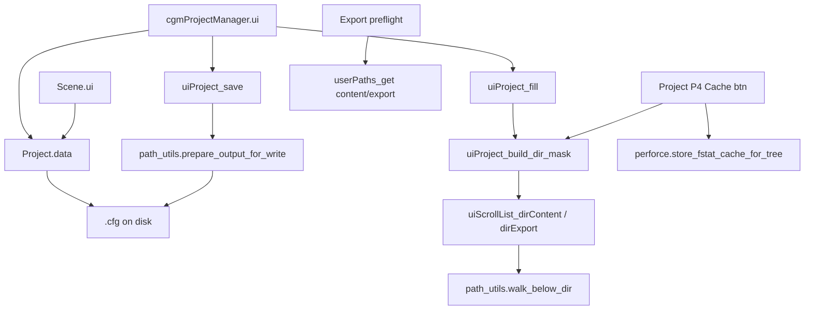

# Feature: cgm Project Manager

## Status and Overview

- **Status**: Active (ongoing P4 + path UX work on p4 branch)
- **Last Updated**: August 18, 2026 (Content/Export scroll lists + shared `dirMask`)
- **Audience**: Dev / TA — design contract for `cgmProjectManager` (`Project.py`), project `.cfg` data, and path authority used by Scene export
- **Purpose**: Canonical reference for how cgm **projects** are stored, edited, and resolved into content/export roots. Scene, export preflight, batch mayapy, and optional Perforce all read paths and flags from this system — not from ad-hoc Maya paths.

**Maintenance rule**: Update this doc when changing project schema (`project_utils`), `Project.data` read/write, path resolution, `dirMask` behavior, asset-type structure verification, or Project-tool P4 helpers.

**Related docs**

- [`Feature_PerforceIntegration.md`](Feature_PerforceIntegration.md) — optional P4 layer; Project General `versionControl`, save prepare, P4 cache/sync on content root
- [`Feature_SceneExportFlow.md`](Feature_SceneExportFlow.md) — export pathing from Scene + project roots
- [`Feature_CgmToolUI.md`](Feature_CgmToolUI.md) — scroll-list patterns (`cgmProjectDirList` shares pitfalls with Scene lists where applicable)

---

## Scope

### In scope

- **cgmProjectManager** window (`Project.ui`) — create/load/save project `.cfg`, paths, asset types, colors, export options
- **`Project.data`** — ConfigObj-backed project file; `read` / `write` / `userPaths_get` / asset structure helpers
- **`project_utils`** — schema defaults, nameStyle, subtype dir candidates, `project_uses_perforce`
- **Content / Export directory browsers** — `cgmProjectDirList` scroll lists under local path fields
- **Directory mask (`dirMask`)** — merged exclude list for UI trees, Scene navigation, and P4 fstat cache walks
- **Project-tool Perforce row** — connection status, Get Latest on content root, warm fstat cache (when `versionControl=perforce`)

### Out of scope

- Scene browser column loaders (see Scene + `Feature_CgmToolUI`) — they consume the same mask rules but live in `Scene.py`
- Full cgmP4 changelist UI (see `Feature_PerforceIntegration`)
- Artist Google Doc prose (can be seeded from this doc later via [`GoogleDoc_Capture_Guide.md`](../Guides/GoogleDoc_Capture_Guide.md))
- Red9 pathing or zooPy project roots

---

## Core Concepts

### Project file (`.cfg`)

Each project is a **ConfigObj** file (JSON-like sections) managed by `Project.data`:

| Stored dict | UI section | Role |
|-------------|------------|------|
| `d_project` | General | name, type, `versionControl`, `nameStyle`, Maya version prefs, **`dirMask`**, lock |
| `d_pathsProject` | Paths (project) | Studio/canonical roots: content, export, image, scripts, … |
| `d_paths` | Paths (local) | Per-machine overrides (merged in `userPaths_get`) |
| `d_pathsUser` | (internal) | Per-OS-user local path map saved on write |
| `assetDat` | Asset types | Category/subtype/content/export structure templates |
| `d_colors`, `d_anim`, `d_world`, `d_exportOptions` | Collapsible frames | Scene/Maya alignment settings |

**Path authority**: `data.userPaths_get()` merges project paths with the current user's local overrides. Scene and export code should use this helper (or optionVars pushed from Project), not raw text fields.

### Directory mask (`dirMask`)

**Semantics**: list of **directory name tokens to exclude** (not globs). Matching is **case-insensitive** on folder basename and anywhere in the path below the walk root.

**Merged mask** (single source in code):

1. **Base mask** (always): `meta`, `.mayaSwatches`, `incrementalSave`, `cgmDat`, `mayaSwatches`
2. **Project field** General → **`dirMask`**: comma-separated extra tokens (parsed via `CORESTRING.parseCommaString`)

**API**: `project_dir_mask(mDat=, l_dirMask=, dirMask=)` in `Project.py` returns the lowercase merged list.

**Consumers** (must stay aligned):

| Consumer | Usage |
|----------|--------|
| Project UI `l_dirMask` | Built in `uiProject_build_dir_mask`; cached on UI + scroll lists |
| Content / Export scroll lists | `cgmProjectDirList.rebuild` → `path_utils.walk_below_dir(..., l_mask=)` |
| P4 fstat cache warmup | `uiProject_p4_cache_dir_mask` → `store_fstat_cache_for_tree(dir_mask=)` |
| Scene browser | `Scene.uiProject_refreshDisplay` builds the same `l_dirMask` for category/subtype navigation |

**Live edit**: changing General **`dirMask`** runs `uiProject_dirMask_refresh_lists` — rebuilds Content and Export trees from the text field without requiring Save.

### Content / Export scroll lists

`cgmProjectDirList` (`Project.py`):

- **`iconTextScrollList`** tree of directories under content or export root
- **`rebuild(path)`** walks with `walk_below_dir` + project mask
- **`str_structureMode`**: `'content'` (default) or `'export'`
- RMB popup: explorer, Maya open/save, add/delete subdir, optional P4 Get Latest (Perforce projects)
- Filter text field → `update_display()` on canonical walk strings

**Not masked by default walk**: `.svn`, `pristine` remain in `walk_below_dir`'s default when no custom mask passed; Project scroll lists pass the **project** mask instead (base + `dirMask`), which supersedes that default list.

---

## Architecture

### Call graph (simplified)

### Key files

| File | Responsibility |
|------|----------------|
| [`cgm/core/tools/Project.py`](../../cgmToolsPy3/cgm/core/tools/Project.py) | UI, `data`, `cgmProjectDirList`, P4 row helpers, `project_dir_mask`, save/load/fill |
| [`cgm/core/tools/lib/project_utils.py`](../../cgmToolsPy3/cgm/core/tools/lib/project_utils.py) | Schema defaults, `l_projectDat`, path keys, `project_uses_perforce`, subtype dir helpers |
| [`cgm/core/lib/path_utils.py`](../../cgmToolsPy3/cgm/core/lib/path_utils.py) | `walk_below_dir` (mask + prune), `prepare_output_for_write`, export/save prepare |
| [`cgm/core/mrs/Scene.py`](../../cgmToolsPy3/cgm/core/mrs/Scene.py) | Reads `mDat`; duplicate `l_dirMask` build for browser navigation |
| [`cgm/core/lib/perforce.py`](../../cgmToolsPy3/cgm/core/lib/perforce.py) | P4 queries; fstat cache tree store respects `dir_mask` |

### Key APIs

| Symbol | Role |
|--------|------|
| `Project.data(filepath=)` | Load/create project; `read` / `write` / `userPaths_get` / `asset_addDir` / structure verify |
| `project_dir_mask(...)` | Merged exclude list for walks and cache |
| `uiProject_build_dir_mask(self)` | Refresh UI `l_dirMask` from mDat or live General field |
| `uiProject_fill(self)` | Push mDat → UI fields; rebuild mask + scroll lists |
| `cgmProjectDirList.rebuild(path)` | Repopulate directory tree with mask |
| `project_uses_perforce(mDat)` | True when General `versionControl == 'perforce'` |

### Save / P4 prepare

Project `.cfg` save (`data.write`) calls **`path_utils.prepare_output_for_write(mDat=self, confirm_p4=True)`** before ConfigObj write when VC=perforce (Slice B). Same gate as [`Feature_PerforceIntegration.md`](Feature_PerforceIntegration.md).

**Maya save-to** from scroll-list popup uses **`prepare_maya_scene_for_save`**.

---

## Configuration Guide

### General fields (high-signal)

| Field | Default | Notes |
|-------|---------|-------|
| `versionControl` | `none` | Set `perforce` to enable P4 status row, save prepare, scroll-list sync, cache warmup |
| `dirMask` | `""` | Comma-separated extra directory names to hide from Content/Export lists and P4 cache walk |
| `nameStyle` | project default | Drives str casing in structure verify / asset names |
| `usePluralSubDirs` | bool | Prefer plural subtype folder names (`Rigs` vs `Rig`) |
| `lock` | `False` | Locks UI fields when `True` |

### Paths

- **Project paths** — canonical studio roots in `d_pathsProject`
- **Local paths** — per-machine overrides in UI `paths` section; persisted to `d_pathsUser[currentUser]` on save when different from project paths
- **Push to Maya** — `uiProject_pushPaths` runs `mel setProject` on content root when valid

### OptionVars (related)

| OptionVar | Role |
|-----------|------|
| `cgmVar_projectCurrent` | Last loaded project `.cfg` path |
| `cgmVar_projectPath` | Legacy project path field |
| `cgmProjectPaths` | Registered project list (pathList) |

---

## Project-tool Perforce UI

Visible when General **`versionControl = perforce`**:

| Control | Action |
|---------|--------|
| Perforce status button | Opens **cgmP4**; label green/orange from `query_project_p4_status` (cache-first) |
| Sync icon | `p4 sync` on **content root** and below (`uiProject_p4_sync_project_root`) |
| Cache icon | Warm **`fstat`** session cache under content root; skips **`dir_mask`** dirs (same as scroll lists) |
| Refresh icon | Force P4 status re-query |

Get Latest / Cache buttons enable only when content path is under the active P4 client view.

Scroll-list RMB **Get Latest Revision** on a selected subdirectory uses the same sync helper (Perforce projects only).

---

## Testing and Validation

### Manual checklist — project core

- [ ] New / Load / Save / Save As — `.cfg` round-trip; local path overrides persist per user
- [ ] Lock — fields disable when `lock=True`
- [ ] Verify Dir (content/export) — creates asset structure from `assetDat`
- [ ] Push paths — `setProject` on valid content root

### Manual checklist — dirMask + scroll lists

- [ ] Load project with known `meta` / `cgmDat` under content — **not** listed in Content scroll list
- [ ] Add custom token to **`dirMask`** (e.g. `backup`) — folder hidden in Content and Export lists
- [ ] Edit **`dirMask`** without Save — lists refresh on field change
- [ ] Refresh button — rebuilds with current mask
- [ ] Scene browser — same folders still hidden when navigating same project (mask parity)

### Manual checklist — Perforce (VC=perforce)

- [ ] P4 row hidden when `versionControl=none`
- [ ] Save locked `.cfg` — checkout confirm / out-of-date block per feature doc
- [ ] Cache warmup — skips masked dirs; faster Scene column tint after cache
- [ ] Sync on content root — succeeds in client view; disabled when path out of scope

### Regression

- [ ] `versionControl=none` — no P4 subprocess from Project save or cache buttons
- [ ] Empty / invalid content path — scroll lists clear gracefully; P4 buttons disabled

---

## Dependencies and Integration

| System | Integration |
|--------|-------------|
| **Scene** | Loads same `Project.data`; mirrors `l_dirMask`; export directory optionVars set via **Send To → Scene** |
| **Export** | FBX paths from `userPaths_get()['export']` + Scene tokens; preflight uses project VC flag |
| **cgmP4** | Shared user/client optionVars; Project status row cache-first |
| **Batch mayapy** | Batch payload includes `projectConfig` path (see export feature doc) |

---

## Future Work

- **`useP4OnExport`** project flag (export-only opt-in) — tracked on p4 branch
- Shared **`project_dir_mask`** module location (`project_utils` vs `Project.py`) if Scene import cycle allows
- Collapse duplicate mask constants (`_l_directoryMask` in Scene vs `_l_p4_cache_dir_mask` in Project)
- Google Doc artist section for Project tool + dirMask field

---

## Revision History

| Date | Summary |
|------|---------|
| 2026-08-18 | Initial feature doc; Content/Export scroll lists use merged `dirMask`; `project_dir_mask` API; `walk_below_dir` case-insensitive mask + prune |
| 2026-08-13 | P4 status row, session cache-first refresh, Slice B save prepare (timeline in Branch_p4) |

---

*Timeline of day-to-day implementation: [`Branch_p4.md`](../Branches/Branch_p4.md)*
