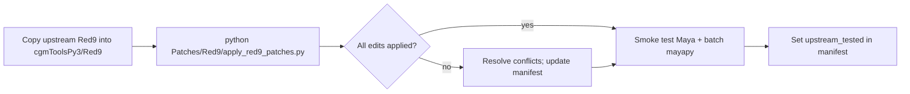

# Feature: Red9 local patches

## Status and Overview

| Field | Value |
|-------|-------|
| **Status** | Active — patch manifest + apply script shipped |
| **Last Updated** | September 3, 2026 |
| **Audience** | Dev / TA / agents — how to record and replay cgm edits to vendored Red9 |
| **Patch registry** | [`Patches/Red9/manifest.json`](../Patches/Red9/manifest.json) |
| **Apply script** | [`Patches/Red9/apply_red9_patches.py`](../Patches/Red9/apply_red9_patches.py) |

**Purpose:** Red9 ships vendored inside `cgmToolsPy3/Red9`. We occasionally patch it for cgm integration (batch mayapy, import paths, etc.). Those edits must survive upstream Red9 drops. Patch metadata lives in **cgmToolsDev** (not py3) per the clean-repo rule.

**Maintenance rule:** Every edit under `cgmToolsPy3/Red9/` must have a matching manifest entry. Treat manifest drift as a bug.

---

## When to patch vs wrap in cgm

| Prefer | When |
|--------|------|
| **cgm-side workaround** | Batch bootstrap (`Red9.setup.addPythonPackages()`), wrappers in `cgm/core/lib/`, thin callers |
| **Red9 patch + manifest** | Import path fix inside Red9 core, behavior that only makes sense inside Red9 modules |

Default: do not edit Red9 without clearance (see `.cursor/rules/cgm-module-placement.mdc`). When Red9 must change, record it here.

---

## Upgrade workflow



1. Replace `cgmToolsPy3/Red9` with the upstream drop (or merge manually).
2. From `cgmToolsDev`: `python Patches/Red9/apply_red9_patches.py --dry-run`
3. Apply: `python Patches/Red9/apply_red9_patches.py`
4. On failure: inspect reported find/replace counts; update `manifest.json` if upstream changed the target strings; re-run.
5. Smoke-test interactive Maya and any batch mayapy paths that import Red9.
6. Set `upstream_tested` on each patch entry to the upstream version or date you verified against.

---

## Manifest format

`Patches/Red9/manifest.json` — array of patch objects:

```json
{
  "id": "pyperclip-vendored-import",
  "summary": "Short description",
  "upstream_tested": "unknown",
  "edits": [
    {
      "file": "core/Red9_Meta.py",
      "find": "import pyperclip",
      "replace": "import Red9.packages.pyperclip as pyperclip",
      "count": 1
    }
  ]
}
```

- **`file`**: path relative to the Red9 root (use `/` separators).
- **`find` / `replace`**: exact string replacement.
- **`count`**: required number of matches; apply script fails if count differs (no silent partial apply).

Find/replace is preferred over unified `.patch` hunks for upstream drops that shift line numbers. Complex edits can add optional `.patch` files later; manifest remains the source of truth for what cgm expects.

---

## Apply script

[`Patches/Red9/apply_red9_patches.py`](../Patches/Red9/apply_red9_patches.py)

| Flag | Purpose |
|------|---------|
| `--target` | Red9 tree (default: sibling `cgmToolsPy3/Red9`) |
| `--manifest` | Path to manifest (default: alongside script) |
| `--id` | Apply one patch only |
| `--dry-run` | Validate match counts without writing |

Exit code `0` = all edits OK; non-zero = at least one failure.

---

## Shipped patches

| id | Summary |
|----|---------|
| `pyperclip-vendored-import` | `Red9_Meta` / `Red9_PoseSaver` import vendored pyperclip so batch mayapy works without `addPythonPackages()` on sys.path |
| `dead-mnode-getattribute-swallow` | `Red9_Meta` — swallow `MetaInstanceError` in `__getattribute__`; re-raise cleanly from `mNode` so stale cache entries do not break `meta.delete()` / `removeFromCache` |

Related cgm-side fix: `mayaBeOdd_utils.mayaScanner_batch` template also bootstraps `Red9.setup.addPythonPackages()` (same pattern as `batch_utils.py`).

---

## Changelog

| Date | Change |
|------|--------|
| 2026-09-03 | Initial manifest + apply script; `pyperclip-vendored-import` patch |
| 2026-09-04 | `dead-mnode-getattribute-swallow` — restore P4 tolerance for dead cached meta during `removeFromCache`; regression test in `test_cgmMeta.test_base.Test_r9Issues` |
