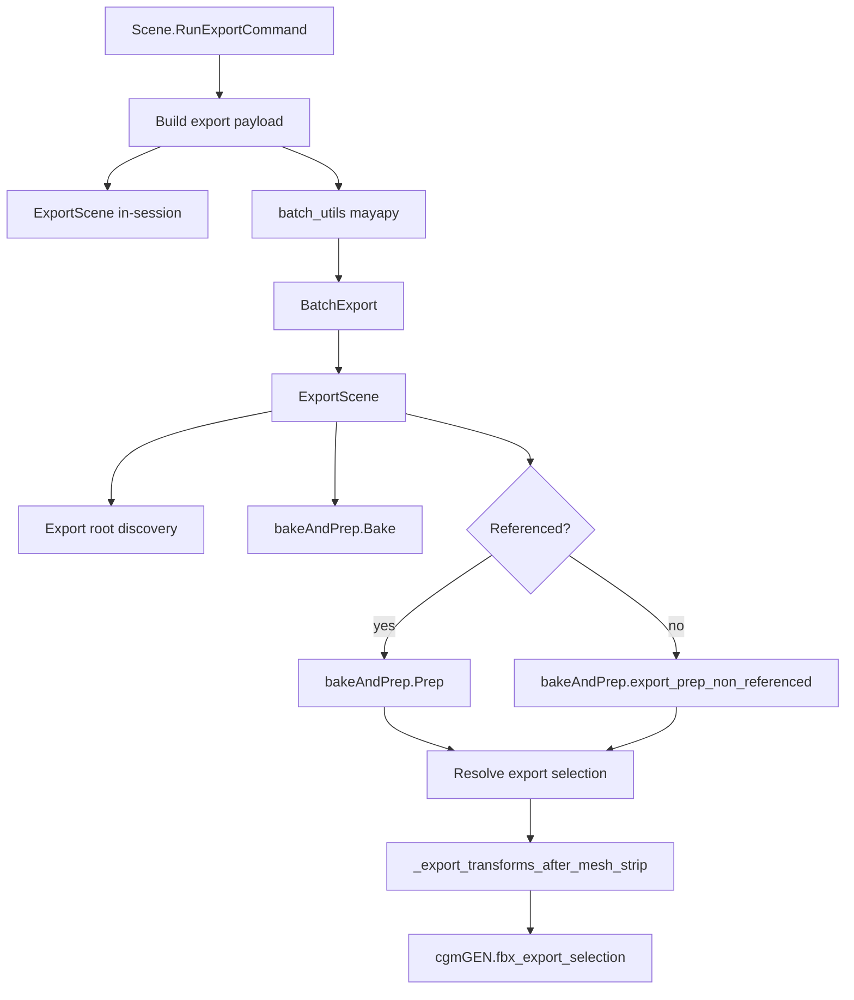
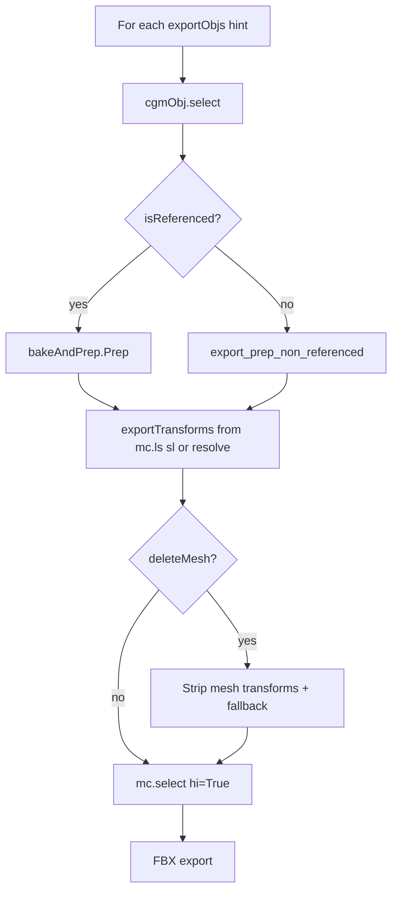
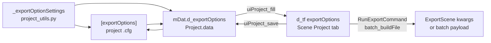

# Feature: Scene Export Flow

## Status and Overview

- **Status**: Shipped (UnrealWorkflow branch, June 2026)
- **Last Updated**: August 4, 2026
- **Audience**: Dev / TA — design contract for export pipeline behavior (not artist manual prose)
- **Purpose**: Canonical reference for what Scene export does, in what order, and what rig/scene setup must look like. Use when debugging regressions, reviewing PRs, or aligning on tdSet / namespace / selection semantics.

**Maintenance rule**: Update this doc whenever `ExportScene`, `Prep`, `export_prep_non_referenced`, or tdSet resolution behavior changes. Timeline of individual fixes lives in [`Branch_UnrealWorkflow.md`](../Branches/Branch_UnrealWorkflow.md).

**Related docs**

- [`Feature_MRSWiring.md`](Feature_MRSWiring.md) — block/module/puppet wiring and qss sets on puppet/modules (orthogonal; export reads tdSets, not module graph)

---

## Scope

### In scope

- Interactive Scene UI export (`RunExportCommand`) and batch/mayapy (`BatchExport` → `ExportScene`)
- Bake → prep → FBX selection → write pipeline
- tdSet resolution, namespace handling, export root discovery
- Mode-specific path/naming and multi-rig behavior
- Common rig patterns and known failure modes

### Out of scope

- P4 checkout integration — see [`Plan_ExportP4Integration.md`](../Plans/Plan_ExportP4Integration.md)
- Artist Google Doc wording (this doc can seed that later)
- Set Tools UI quirks, skin import clutter, missing Maya plugins (`mtoa`, `TitanDDS`, etc.)
- Post-bake anim filters (`PostBake.py`, AnimFilter tool) except where they affect scene state before export

---

## Entry Points and Call Graph

Three surfaces invoke the same core pipeline:

| Surface | Entry | Notes |
|---------|-------|-------|
| Scene UI | `Scene.RunExportCommand(mode, …)` | Builds paths from open-file tokens + export directory |
| In-session | `ExportScene(**kwargs)` | Direct call from UI or scripts |
| Batch / mayapy | `BatchExport(dataList)` → `ExportScene` | Per-file open; `logExportSummary=False`; optional `worldUp` |



### Key files

| File | Responsibility |
|------|----------------|
| [`cgm/core/mrs/Scene.py`](../../cgmToolsPy3/cgm/core/mrs/Scene.py) | `RunExportCommand`, `BatchExport`, `ExportScene`, export root discovery, mode flags, FBX pathing, `_export_transforms_after_mesh_strip` |
| [`cgm/core/tools/bakeAndPrep.py`](../../cgmToolsPy3/cgm/core/tools/bakeAndPrep.py) | `Bake`, `Prep`, `export_prep_non_referenced`, tdSet helpers, unparent/constraints/select helpers |
| [`cgm/core/mrs/lib/batch_utils.py`](../../cgmToolsPy3/cgm/core/mrs/lib/batch_utils.py) | mayapy preflight — `ensure_fbx_plugin` **before** `import Scene` |
| [`cgm/core/lib/path_utils.py`](../../cgmToolsPy3/cgm/core/lib/path_utils.py) | Writable FBX path checks, `.bak` sidecar cleanup, `ExportOutputNotWritableError` |
| [`cgm/core/cgm_General.py`](../../cgmToolsPy3/cgm/core/cgm_General.py) | `ensure_fbx_plugin`, `fbx_export_preamble`, `fbx_export_selection`, export result summary |

---

## Export Modes

Modes come from `RunExportCommand` (`Scene.py` mode arg) or `ExportScene(mode=…)` / batch payload.

| Mode | UI label | Bake | Prep | FBX | Flags / behavior |
|------|----------|------|------|-----|------------------|
| 0 | bake | Yes | Yes | No | `exportFBXFile=False` — bake + prep only; writes `*_baked.mb` rename target |
| 1 | export | Yes | Yes | Yes | Single-asset anim; multi-root **prompts** cutscene confirm |
| 2 | cutscene | Yes | Yes | Yes | `exportAsCutscene`, `deleteMesh=True`, per-shot FBX under animation folder |
| 3 | rig | Yes | Yes | Yes | `exportAsRig`; multi-root → **one** combined FBX at asset path |
| 4 | static | No | No | Yes | Skips bake and prep; optional `BreakTextureLinks` only |

**Auto-detect** (`mode=-1`): if multiple `exportObjs` → mode 2 (cutscene); if one → mode 1 (anim).

**`exportFBXFile`**: set when `mode > 0`. Mode 0 still runs bake and per-object prep.

---

## Pipeline Stages (normative order)

High-level order inside `ExportScene`:

1. Optional workspace open, rig update (`updateRigs`)
2. **Export root discovery** — if `exportObjs` empty, scan `*:export_tdSet` and build context hints
3. Camera handling — constrained cameras may become `exportCam`
4. Mode resolution and path build (`exportAnimPath`, `exportAssetPath`, cutscene nesting)
5. Rename scene to `*_baked.mb` (safety copy target)
6. **`Bake(exportObjs, …)`** — unless `exportStatic`; frame range from `AnimList` shot list when present (see **Shot list and bake frame range** below)
7. **`ensure_fbx_plugin`** — before any FBX write
8. **Per export hint** (`for obj in exportObjs`):
   - Referenced → `Prep(…)`
   - Non-referenced → `export_prep_non_referenced(…)`
   - Optional `deleteMesh` strip on resolved export transforms
   - `_export_transforms_after_mesh_strip` when `deleteMesh`
   - `mc.select(exportTransforms, hi=True)`
   - FBX export (per mode path rules)
9. Export result summary (`log_export_results_summary`)

---

### Shot list and bake frame range

`AnimListNode.subAnimList` (via [`Shots.py`](../../cgmToolsPy3/cgm/core/mrs/Shots.py) `AnimList`) stores shots as:

```text
{ "shotName": [start, end, length] }
```

| Index | Meaning |
|-------|---------|
| `[0]` | Start frame |
| `[1]` | End frame |
| `[2]` | Length (`end - start`); UI convenience — **not** a timeline frame |

Legacy 2-element entries `[start, end]` may still exist; indices 0 and 1 remain start/end.

Before `Bake()`, `ExportScene` loads `AnimList()` and computes the bake range:

- `_start` = **minimum** of all shots' `[0]` (start)
- `_end` = **maximum** of all shots' `[1]` (end)
- Sets `mc.playbackOptions(minTime=…, maxTime=…)` when both are set
- Empty `shotList` → `_start` / `_end` stay `None`; `Bake()` falls back to timeline range

**Normative rule**: use `shot[1][0]` and `shot[1][1]` only. **Never** `min(shot[1])` / `max(shot[1])` on the full triple — length can be smaller than start (e.g. `[1673, 1805, 132]` would wrongly bake from frame 132).

FBX take splitting (`FBXExportSplitAnimationIntoTakes`) and export result recording already use `[0]` / `[1]`; bake must match.

---

## Core Concepts

### Three tdSets

Each rig/asset should publish three object sets (names configurable via Scene UI / option vars):

| Set | Default | Used in | Purpose |
|-----|---------|---------|---------|
| Bake | `bake_tdSet` | `Bake()` | Controls/joints to simulation-bake for export frame range |
| Export | `export_tdSet` | Prep / post-delete selection | **Surviving DAG roots** for FBX hi-selection |
| Delete | `delete_tdSet` | Prep / non-ref prep | Nodes removed before export (often includes `master`) |

**Resolution**: `resolve_td_set_for_asset(setName, namespaces)` in `bakeAndPrep.py`:

- Parses namespaces from export context hint (e.g. `Crate:master` → `['Crate']`)
- Tries `{outer}:{inner}:…:{base}` candidates outer→inner, then unqualified `setName` / `base`
- When `namespaces` is empty, may fall back to global `*:{base}` scan (used carefully — multi-rig scenes require per-rig `resolved_set=` on delete)

**Delete set behavior**: `ProcessDeleteSet(…, resolved_set=)` deletes set members. Missing delete set is **warning-only** in Prep (not hard failure). Failed deletes log survivors.

### Export context hint vs post-delete selection

**Critical invariant** — source of most recent export bugs:

| Concept | What it is | Example |
|---------|------------|---------|
| **Export context hint** | String in `exportObjs` for bake correlation + tdSet namespace resolution | `Crate:master`, `master` |
| **Post-delete FBX roots** | Surviving DAG paths from `export_tdSet` after prep | `rootMotion_jnt`, `Crate_geo` |

- `exportObjs` entries are **not** guaranteed to exist after `ProcessDeleteSet`.
- Do **not** use the hint (`master`) as `exportTransforms` after delete.
- Post-delete selection uses `export_select_targets_resolve(hint, member_hints=…)` where `member_hints` are **strings captured before delete**.

Discovery logs say: *"export context hint (bake/delete correlation, not post-delete DAG root)"*.

### Prep order (referenced and non-ref must match)

Both `Prep()` and `export_prep_non_referenced()` follow this order:

```mermaid
sequenceDiagram
  participant ES as ExportScene
  participant BP as bakeAndPrep
  participant Maya as Maya DAG

  ES->>BP: Resolve export_tdSet + capture member hint strings
  BP->>Maya: export_constraints_clear_on_members
  BP->>Maya: export_unparent_members_to_world
  Note over BP,Maya: When parentExportToWorld=True; required if export members are under master in delete_tdSet
  BP->>Maya: ProcessDeleteSet per-rig resolved_set
  BP->>Maya: mergeNamespaceWithRoot if removeNamespace
  BP->>Maya: export_select_targets_resolve
  ES->>Maya: optional deleteMesh strip
  ES->>Maya: _export_transforms_after_mesh_strip fallback
  ES->>Maya: mc.select paths hi=True
  ES->>Maya: FBXExport -s
```

**Shared helpers** (`bakeAndPrep.py`):

| Function | Role |
|----------|------|
| `export_constraints_clear_on_members` | Remove constraints (and optional `zeroRoot` on `rootMotion`) on export set members |
| `export_unparent_members_to_world` | When `parentExportToWorld=True`: `mc.parent(member, world=True)` so delete of `master` does not delete export hierarchy |
| `export_select_targets_resolve` | Resolve surviving paths from member hints + short-name `mc.ls`; post-NS fallback re-reads unnamespaced export set |
| `export_prep_non_referenced` | Full non-ref prep pipeline; returns list of paths or `None` |

**Member hint capture rule**: capture export set member **DAG path strings** when the set is first read. Do not read `exportSetObjs[].mNode` after delete or namespace merge — meta goes stale (`None`).

### Referenced vs non-referenced branch



| Path | When | Notes |
|------|------|-------|
| **Referenced** | `cgmObj.isReferenced()` | Imports top reference; `Prep()` uses current selection as top node |
| **Non-referenced** | Baked file, merged rig, local duplicate | `export_prep_non_referenced(export_root_hint=obj, …)` — must stay aligned with `Prep()` |

**Rig multi-root** (`exportAsRig` and `len(exportObjs) > 1`): prep each hint, accumulate selections, **one** FBX export (avoids overwriting same rig filename between passes).

---

## Namespace Rules

Bake and namespace strip are **separate** stages.

| Stage | Strips ref prefix? | Behavior |
|-------|-------------------|----------|
| `Bake()` | No | Uses `resolve_td_set_for_asset(bakeSetName, namespaces)` from hint |
| `Prep()` early | Partial | Merges **outer** nested namespaces (`namespaces[:-1]`) before export/delete set work |
| `Prep()` / non-ref final | Optional | If `removeNamespace=True`, merges **last** ref namespace (`namespaces[-1]`) |
| Scene option | Controls final strip | **"Remove namespace upon export"** → `removeNamespace` kwarg |

**Implications**:

- Bake leaving `Crate:` prefix intact is expected.
- Cutscene multi-ref with `removeNamespace=True` strips each rig's ref prefix during its prep pass.
- Nested refs (e.g. `APose:Head:root`): tdSet resolution walks prefix chain; outer namespaces merged during Prep before final ref NS handling.

---

## Path and FBX Naming

Path roots built in `RunExportCommand`:

- `categoryExportPath` = `{exportDirectory}/{category}`
- `exportAssetPath` = `{categoryExportPath}/{asset}`
- `exportAnimPath` = `{exportAssetPath}/{subtypeDir}` (e.g. `Animations`)

`ExportScene` adjustments:

| Mode | Output location | Naming |
|------|-----------------|--------|
| **Anim (1)** | `exportAnimPath / exportName` | Single FBX or per-shot files under `exportAnimPath` when `exportShotsToIndividualFiles` |
| **Cutscene (2)** | `exportAnimPath / {animationName}/` when animation name set | Per-shot: `{shotName}_{assetName}.fbx` where `assetName` = first namespace token of hint (e.g. `Crane` from `Crane:master`) |
| **Rig (3)** | `exportAssetPath / {assetName}_rig.fbx` | Multi-root: single combined file; `fbx_export_preamble(clear_takes=False)` |
| **Static (4)** | `exportAssetPath / {p_nameBase}.fbx` | No bake/prep |

**Cutscene directory rule**: per-shot FBXs sit directly under the animation folder (`flow/`), not `flow/shot1/`, `flow/shot2/`.

**Multi-root anim (non-cutscene)**: when `exportShotsToIndividualFiles` and multiple hints, shot FBXs nest under `{exportDir}/{exportStem}/` to avoid cross-asset name collisions.

**`addNamespaceSuffix`**: when cutscene-style multi-export, stem may get `_{assetName}` before `.fbx` for the base export file path.

**Empty shot list + per-shot option**: when `exportShotsToIndividualFiles` (or cutscene flags) is on but `AnimList.shotList` is empty, export **falls back** to a single FBX (same as when per-shot is off). Log: `No shot list; falling back to single FBX`. If no FBX is recorded after export, `ExportScene` fails with `No FBX files written`.

**Empty shot list naming** (`noShotListExportName` — anim/cutscene only; ignored when `shotList` is non-empty):

| Value | Single-file FBX stem when `shotList` is empty |
|-------|-----------------------------------------------|
| `asset` (default) | Browser/batch `exportName` (`asset_set[_variation].fbx` or `asset_subtypeToken.fbx`) |
| `sceneFile` | Open Maya file basename without extension; `_baked` suffix stripped; invalid chars sanitized |

Resolved in `ExportScene` via `_resolve_no_shot_export_name()` after `AnimList()` load. Rig (`{assetName}_rig.fbx`) and static (`p_nameBase.fbx`) naming are unchanged.

---

## Export Options Data Flow

Export toggles (namespace strip, zero root, bake settings, etc.) are **project data**, edited on the Scene **Project** tab, and read from live UI widgets at export time — not from `mDat` directly during `ExportScene`.

### Pipeline



### Layers

| Layer | Location | Role |
|-------|----------|------|
| **Schema** | [`project_utils.py`](../../cgmToolsPy3/cgm/core/tools/lib/project_utils.py) `_exportOptionSettings` | Defines option names, types, and default values (`dv`) |
| **Defaults map** | `_d_defaultsMap['exportOptions']` + `fillDefaults()` | Fills missing keys on project load |
| **Storage key** | `_dataConfigToStored['exportOptions']` → `d_exportOptions` | In-memory dict on `Project.data` |
| **Persisted file** | `[exportOptions]` section in `*.cfg` | Per-project saved values (see [`example_project.cfg`](../../cgmToolsPy3/cgm/assets/example_project.cfg)) |
| **UI widgets** | `self.d_tf['exportOptions']` | Built by `PROJECT.buildFrames()` on Scene Project tab |
| **Load UI** | `uiProject_fill()` | `mDat.d_exportOptions` → widget `.setValue()` |
| **Save UI** | `uiProject_save()` | widget `.getValue()` → `mDat.d_exportOptions` → `.cfg` write |
| **Export read** | `RunExportCommand`, `batch_buildFile` | **`d_tf['exportOptions']` only** — current widget values |

### Schema fields (`_exportOptionSettings`)

| Project / UI key | Type | Default | Notes |
|------------------|------|---------|-------|
| `removeNameSpace` | bool | False | → `removeNamespace` kwarg |
| `zeroRoot` | bool | True | → `zeroRoot` |
| `postEuler` | bool | True | → `euler` |
| `postTangent` | `none` / `auto` / `linear` / `step` | `auto` | → `tangent` (`none` → False in RunExportCommand) |
| `sampleBy` | float | 1.0 | Bake sample rate |
| `reducer` | bool | False | Bake |
| `simplify` | bool | False | Bake |
| `exportShotsToIndividualFiles` | bool | False | Per-shot FBX vs single file |
| `noShotListExportName` | `asset` / `sceneFile` | `asset` | Single-file FBX stem when `shotList` is empty (anim/cutscene only) |
| `parentExportToWorld` | bool | True | Unparent `export_tdSet` members to world before delete |
| `breakTextureLinks` | bool | True | Prep / static |
| `fbxVersion` | option menu | `default` | Project setting; FBX version probing is lazy elsewhere |

Add a new export option by extending `_exportOptionSettings`, then wiring the widget read in `RunExportCommand` / `batch_buildFile` and the corresponding `ExportScene` kwarg (if needed).

### Name mapping (project UI → export)

| `d_tf['exportOptions']` key | `ExportScene` / batch key |
|-------------------------------|---------------------------|
| `removeNameSpace` | `removeNamespace` |
| `postEuler` | `euler` |
| `postTangent` | `tangent` |
| `zeroRoot`, `sampleBy`, `simplify`, `reducer`, `exportShotsToIndividualFiles`, `breakTextureLinks`, `noShotListExportName`, `parentExportToWorld` | same name |

### Not in `exportOptions`

These are **separate** from project export options:

| Setting | Source |
|---------|--------|
| `bakeSetName`, `exportSetName`, `deleteSetName` | Scene option vars (`var_bakeSet`, `var_exportSet`, `var_deleteSet`) |
| `worldUp` | `mDat.d_world['worldUp']` — injected into batch payload from project **world** section, not exportOptions |
| Export mode (bake / anim / cutscene / rig / static) | `RunExportCommand(mode)` argument, not project cfg |

### Batch / mayapy

`batch_buildFile()` builds a shared `d_base` from `d_tf['exportOptions']` (plus tdSet names and `worldUp`) and `d.update(d_base)` on each queued item before `BATCH.create_Scene_batchFile()`. `BatchExport` maps string booleans back to Python bools and calls `ExportScene(**_d)`.

Interactive export and batch therefore share the same project-tab values **as they appear in the UI at queue/run time** — changing the Project tab after queueing but before batch run affects the batch.

### Export queue UI (Sets / Variation / Version lists)

- **Sets**, **Variation**, and **Version** scroll lists support **multi-select** (Ctrl/Shift).
- Bottom toolbar **Add to queue as:** (Anim / Cutscene / Rig) calls `AddSelectedToExportQueue` — enqueues **all** selected items from the active file list (prefers a list with multi-selection; otherwise Version → Variation → Sets precedence).
- Right-click **To Queue as:** on Sets / Version popups still calls `AddToExportQueue` — **single** primary selection only (unchanged). With multi-select active, the popup menu is deleted and not rebuilt (Builder scroll-list pattern).
- Reference / Import / Replace / Load File remain single-selection operations.

### Legacy note

Older Scene code synced some export toggles to option vars (`var_postEuler`, `var_removeNamespace`) and an Options menu; that menu block is commented out. **`LoadProject` still partially pushes `mDat.d_exportOptions` into those legacy vars**, but export reads **`d_tf['exportOptions']`**. After loading a project, `uiProject_fill()` is the authoritative sync into the widgets export uses.

---

## Export Options Matrix

Scene Project tab → `ExportScene` kwargs (representative):

| UI / payload key | Kwarg | Effect |
|------------------|-------|--------|
| Remove namespace upon export | `removeNamespace` | Final ref namespace merge in prep |
| Zero root | `zeroRoot` | Zero `rootMotion` translate/rotate on export members before delete |
| Break texture links | `breakTextureLinks` | `BreakTextureLinks()` in Prep / static path |
| Export shots to individual files | `exportShotsToIndividualFiles` | Per-shot FBX files vs single file |
| No-shot-list export name | `noShotListExportName` | `asset` vs `sceneFile` stem when `shotList` is empty |
| Parent export to world | `parentExportToWorld` | Unparent export set members before delete (default on) |
| Sample by | `sampleBy` | Bake sample rate |
| Euler / tangent / reducer / simplify | `euler`, `tangent`, `reducer`, `simplify` | Bake options |
| Bake / export / delete set names | `bakeSetName`, `exportSetName`, `deleteSetName` | tdSet names (Scene option vars — **not** `[exportOptions]` in cfg) |
| Batch `worldUp` | applied in `BatchExport` | From `mDat.d_world`, not exportOptions |
| Batch summary | `logExportSummary=False` | Suppresses per-scene duplicate summary in batch |

See **Export Options Data Flow** above for schema, cfg persistence, and UI wiring.

Cutscene mode forces `deleteMesh=True` in code (mode 2).

---

## Common Rig / Scene Patterns

### Pattern: Crate-style prop rig

| Item | Value |
|------|-------|
| **Setup** | `master` in `delete_tdSet`; `export_tdSet` = geo + `rootMotion_jnt` (children of `master`) |
| **Expected** | When `parentExportToWorld=True`: unparent export members → delete `master` → select export members → FBX |
| **Typical scene** | `Crate_rigRef.mb` referenced, `removeNamespace=True`, `zeroRoot=True` |
| **Regression test** | Re-export from `*_baked.mb` (non-ref path) |

### Pattern: Referenced single ref

| Item | Value |
|------|-------|
| **Setup** | Namespaced sets `Crate:bake_tdSet`, `Crate:export_tdSet`, `Crate:delete_tdSet` |
| **Hint** | `Crate:master` from export set discovery |
| **Expected** | `Prep()` imports ref, resolves per-namespace sets, optional NS strip |

### Pattern: Cutscene multi-ref

| Item | Value |
|------|-------|
| **Setup** | Multiple `*:export_tdSet` (e.g. `Crane:`, `CrateBase:`); one hint per namespace |
| **Expected** | Per-rig delete sets via `resolve_td_set_for_asset` — no cross-rig delete bleed |
| **Mesh** | `deleteMesh=True` strips geo; `_export_transforms_after_mesh_strip` falls back to export set members |

### Pattern: Non-ref baked file

| Item | Value |
|------|-------|
| **Setup** | Scene saved as `{name}_baked.mb` after bake; nodes no longer referenced |
| **Expected** | `export_prep_non_referenced()` — **not** `Prep()` |
| **Invariant** | Same prep order as referenced path (constraints → unparent → delete → NS → select) |

### Pattern: Nested namespaces

| Item | Value |
|------|-------|
| **Example** | `APose:Head:root` export hint |
| **Expected** | `resolve_td_set_for_asset` walks `APose:`, then `APose:Head:`; outer NS merged in Prep before delete |

---

## Anti-Patterns and Failure Modes

| Anti-pattern | Symptom | Fix / contract |
|--------------|---------|----------------|
| Export members parented under node in `delete_tdSet` | Export targets vanish when `master` deleted | Enable `parentExportToWorld` (default) so unparent runs before delete |
| Using `exportObjs` hint as post-delete FBX root | `No object exists: master` | Select from `export_tdSet` via `export_select_targets_resolve` |
| Reading `exportSetObjs[].mNode` after delete | `member_hints=[None, None]` | Capture hint strings before delete |
| Global `*:delete_tdSet` in multi-rig prep | Wrong rig's delete set processed | Pass `resolved_set=` from hint namespaces |
| `parentExportToWorld=False` with export under delete targets | Silent loss of export hierarchy | Only disable when export members are not parented under anything in `delete_tdSet` |
| Assuming bake strips namespace | Prefix still on during bake | Namespace strip is prep-stage only |
| Mode 4 static expecting prep | No delete/export set processing | Static skips bake/prep by design |
| `exportShotsToIndividualFiles` with empty `shotList` (old behavior) | Prep OK, no `FBXExport` log, batch `succeeded=1` | Fall back to single FBX at `exportFile`; guard fails if nothing written |
| `min(shot[1])` / `max(shot[1])` on 3-element shot value | `Bake \| start:` equals frame **count** not shot start (e.g. 132 instead of 1673) | Use `shot[1][0]` and `shot[1][1]` only |

---

## Failure Stages and Troubleshooting

`ExportScene` reports `_finalize_failure(stage, reason, ctx)`. Stages:

| Stage | Typical cause | Log grep |
|-------|---------------|----------|
| `path_resolve` | Invalid open-file tokens, missing export directory | `RunExportCommand \| Invalid open file` |
| `bake` | Missing/empty bake set, bake exception | `Bake stage failed` |
| `prep` | `Prep()` returned False, NS merge fail, non-ref prep exception | `Prep stage failed`, `Non-referenced prep failed` |
| `select` | No targets after prep or mesh strip | `No export targets after`, `No export DAG to select after mesh strip` |
| `fbx_export` | FBX plugin missing, path not writable, **no files written** | `FBX plugin not ready`, `Export output not writable`, `No FBX files written` |
| `post_cleanup` | Optional cleanup delete failures | `Failed export cleanup delete` |

**Useful success markers**:

- `ExportScene >> Bake | start: {N} | end: {M}` — must match shot list starts/ends (not frame count)
- `Prep\|unparent \| unparented to world`
- `delete set resolved: {Ns}:delete_tdSet`
- `Prep\|select \| resolved N export target(s)`

**Batch**: `BatchExport` collects failures with file index; check `PATHUTIL.get_non_writable_export_paths()` after batch for depot permission issues.

---

## Verification Checklist (dev)

Run in Maya after export pipeline changes:

1. **Crate referenced** — `Crate_rigRef.mb`, `removeNamespace=True`, `zeroRoot=True` → `{asset}_rig.fbx` or anim FBX without `master` errors
2. **Crate baked re-export** — `*_baked.mb` non-ref path
3. **Cutscene two-namespace** — Crane + CrateBase, `deleteMesh`, per-shot files under `flow/`
4. **Rig multi-root** — single combined FBX
5. **Static (mode 4)** — no prep logs; FBX still writes
6. **Batch mayapy** — one-item smoke; FBX plugin loaded before Scene import
7. **Mode 0 bake** — bake + prep run; no FBX write
8. **Shot list bake range** — scene with `AnimListNode` shot e.g. `[1673, 1805, 132]` → log `ExportScene >> Bake | start: 1673 | end: 1805` (not 132); multi-shot unions min start / max end

---

## Related Documentation

- **[Branch_UnrealWorkflow.md](../Branches/Branch_UnrealWorkflow.md)** — timeline of export fixes and PR notes
- **[Plan_ExportP4Integration.md](../Plans/Plan_ExportP4Integration.md)** — planned P4 checkout for FBX output
- **[NewFeature_Guide.md](../Guides/NewFeature_Guide.md)** — feature doc conventions (this file lives under `Features/` at cgmToolsDev root)
- **[NewBranch_Guide.md](../Guides/NewBranch_Guide.md)** — branch doc format

### Code references (py3)

- [`cgm/core/mrs/Scene.py`](../../cgmToolsPy3/cgm/core/mrs/Scene.py) — `ExportScene`, `BatchExport`, `RunExportCommand`
- [`cgm/core/tools/bakeAndPrep.py`](../../cgmToolsPy3/cgm/core/tools/bakeAndPrep.py) — bake/prep implementation

---

## Revision History

| Date | Summary |
|------|---------|
| 2026-06-15 | Initial feature doc — modes, tdSets, prep invariants, namespace/path rules, pattern cards, troubleshooting (post delete-selection + unparent fixes) |
| 2026-06-15 | Added Export Options Data Flow — schema, cfg, Project tab UI, RunExportCommand/batch payload wiring |
| 2026-07-02 | Empty shot list fallback — single FBX when per-shot option on but no shots; `No FBX files written` guard |
| 2026-07-13 | `noShotListExportName` (asset vs scene file stem) and `parentExportToWorld` export options |
| 2026-07-20 | Multi-select on Sets/Variation/Version lists; toolbar **Add to queue as** bulk enqueue; right-click queue unchanged |
| 2026-08-04 | Shot list bake frame range — `[start, end, length]` contract; anti-pattern for `min/max(shot[1])`; verification checklist item (user verified in Maya) |
