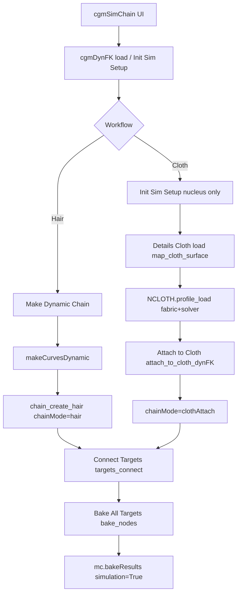

# Feature: cgmSimChain (cgmDynFK)

## Status and Overview

- **Status**: Shipped (UnrealWorkflow branch, July 2026)
- **Last Updated**: September 15, 2026 (curve **extendEnd** split from **addEndJoint**; Create + Details UI)
- **Audience**: Dev / TA — design contract for dynamic follow chains (hair + cloth attach), presets, connect/bake behavior
- **Purpose**: Canonical reference for what **cgmSimChain** (`dynFKTool` / `cgmDynFK`) does, how hair vs cloth attach chains differ, and what scene/setup invariants must hold. Use when debugging regressions, reviewing PRs, or adding nCloth / dynFK presets.

**Maintenance rule**: Update this doc whenever `cgmDynFK`, `attach_to_cloth_dynFK`, `map_cloth_surface`, `nCloth_utils.profile_load`, `simChain_dat`, `dynFKTool` bake/connect UI, or preset skip/query rules change. Timeline of Face26 sim-chain fixes: [`Branch_Face26.md`](../Branches/Branch_Face26.md); broader Unreal/dynFK history: [`Branch_UnrealWorkflow.md`](../Branches/Branch_UnrealWorkflow.md).

**Related docs**

- [`Feature_SceneExportFlow.md`](Feature_SceneExportFlow.md) — export bake/prep (orthogonal; sim-chain bake is local to cgmSimChain, not Scene export)
- [`Feature_MRSWiring.md`](Feature_MRSWiring.md) — puppet space groups (`worldSpaceObjects`, `puppetSpaceObjects`) collect dyn drivers from built modules
- [`Branch_UnrealWorkflow.md`](../Branches/Branch_UnrealWorkflow.md) — branch timeline and PR notes

---

## Scope

### In scope

- **cgmSimChain** UI (`dynFKTool.py`) and **`cgmDynFK`** meta (`dynamic_utils.py`)
- **Hair chains** — `makeCurvesDynamic`, follicle + outCurve locators, sim joint chain (`mObjJointChain`)
- **Cloth attach chains** — mapped nCloth `outMesh`, surface trackers (follicle / rivet / uvPin), loc→target connect/bake
- Shared **nucleus** on one setup; dynFK nucleus + hair presets (`cgmDynFK_presets`)
- **nCloth** fabric/solver/wind presets (`cgmNCloth_presets` + `nCloth_utils`)
- **cgmSim*Dat** preset files (`simChain_dat` — hair / cloth / nucleus JSON under `cgmDat/sim/`)
- **Connect Targets** / **Bake All Targets** / **Bake All Joints**
- **Tools → Query Settings** (preset capture from selection)
- Rigging Utils **Attach by** surface-track items (shared `attach_toShape`)

### Out of scope

- nCloth **creation** (mesh → nCloth in Maya) — artists author cloth outside the tool
- Scene export / tdSet bake — see [`Feature_SceneExportFlow.md`](Feature_SceneExportFlow.md)
- Artist Google Doc / shelf wording (this doc can seed that later)
- `dynamic_mesh_follow` as a separate module — cloth attach lives in **`dynamic_utils.attach_to_cloth_dynFK`**
- Editing **zooPy** or **Red9**

---

## Entry Points and Call Graph

| Surface | Entry | Notes |
|---------|-------|-------|
| Toolbox / menu | `tool_calls.cgmSimChain()` | `reload_dependencies()` + **`cgmGEN._reloadMod(dynFKTool)`** + `ui()` — full tool + backend refresh |
| UI | `dynFKTool.ui` | Window name `cgmSimChain_ui` |
| Script | `RIGDYN.cgmDynFK(...)`, `RIGDYN.setup_sim_dynFK(...)` | Direct meta construction |
| nCloth presets | `NCLOTH.profile_load(fabric, solver=, wind=)` | Script editor or Details Cloth menus |



### Key files

| File | Responsibility |
|------|----------------|
| [`cgm/core/tools/dynFKTool.py`](../../cgmToolsPy3/cgm/core/tools/dynFKTool.py) | cgmSimChain UI: Init Sim, map cloth, fabric/solver menus, attach, connect/bake, base name, Query Settings |
| [`cgm/core/rig/dynamic_utils.py`](../../cgmToolsPy3/cgm/core/rig/dynamic_utils.py) | `cgmDynFK` meta, `map_cloth_surface`, `attach_to_cloth_dynFK`, `chain_create_hair`, connect/bake helpers |
| [`cgm/core/rig/constraint_utils.py`](../../cgmToolsPy3/cgm/core/rig/constraint_utils.py) | `attach_toShape(..., surfaceTrack=)` — follicle / rivet / uvPin on mesh |
| [`cgm/core/lib/node_utils.py`](../../cgmToolsPy3/cgm/core/lib/node_utils.py) | `createRivetOnMesh`, `create_UVPinOnMesh` |
| [`cgm/core/lib/nCloth_utils.py`](../../cgmToolsPy3/cgm/core/lib/nCloth_utils.py) | nCloth resolve, layered `profile_load`, query_settings, scene-up gravity remap |
| [`cgm/core/presets/cgmNCloth_presets.py`](../../cgmToolsPy3/cgm/core/presets/cgmNCloth_presets.py) | Fabric / solver / wind profiles, `d_profileKind` |
| [`cgm/core/presets/cgmDynFK_presets.py`](../../cgmToolsPy3/cgm/core/presets/cgmDynFK_presets.py) | Nucleus + hairSystem profiles (`n`, `hs`) |
| [`cgm/core/lib/simChain_dat.py`](../../cgmToolsPy3/cgm/core/lib/simChain_dat.py) | cgmSim*Dat preset files — capture, apply, dev library scan |
| [`cgm/core/tools/lib/tool_calls.py`](../../cgmToolsPy3/cgm/core/tools/lib/tool_calls.py) | `cgmSimChain()` launcher + reload |

---

## Core Concepts

### Setup meta: `cgmDynFK`

- Root transform: `{baseName}_dynFK` with `cgmName` = base name (editable in UI via `set_base_name`)
- Child messages (typical):
  - **`mNucleus`** — shared solver
  - **`mCloth`** — mapped nCloth **transform** (not shape — shape `viewName` breaks message readback)
  - **`mHairSysDag` / `mHairSysShape`** — **default** hairSystem (Create **Default** + **Presets → Hair** menu target)
  - **`msgList mHairSystems`** — all registered hairSystem **shapes** on this setup (shared nucleus)
  - **`chain_{i}`** — per-chain groups (msgList `chain`)

**Multi hairSystem:** Each **hair** chain grp has **`mHairSysShape`** (its sim feel). **Create → Hair system** = **New** (new `{baseName}_{chainName}_hairSys`) | **Default** | pick a registered system. When **New** and a hairSystem already exists on the setup nucleus, the tool **pre-creates an empty hairSystem** and selects it for **makeCurvesDynamic** (MCD alone would add the curve to the existing system). **Details** per chain: **Hair system `<<`** rewire follicle (`chain_map_hair_system`). Legacy setups backfill chain + registry from follicle DG on **get_dat** / refresh.

### Chain modes

| `chainMode` | Created by | Driver | Sim joint chain |
|-------------|------------|--------|-----------------|
| `hair` | **Make Dynamic Chain** | Dynamic outCurve + POC/aim locs | Yes (`mObjJointChain`) |
| `clothAttach` | **Attach to Cloth** | nCloth **outMesh** surface tracker + loc | No |

Per-chain group stores `cgmName`, `surfaceTrack` (cloth only), and msgLists:

| msgList / message | Hair | Cloth attach |
|---------|------|----------------|
| `mTargets` | Rig joints to follow | Rig joints to follow |
| `mLocs` | Curve-follow locs | Loc under surface track |
| `mObjJointChain` | Sim-driven joints | — |
| `mHairSysShape` | This chain’s hairSystem shape | — |
| `mMeshFollicles` / `mRivets` / `mUvPins` | — | Surface trackers |

**Hair preset targets:** **Presets → Hair** → setup **default** `mHairSysShape` only. Per **registered hairSystem** in Details (**Hair system 1**, **2**, …): row menu **Load Dat** / **Save Hair Dat…** applies or captures **`.cgmSimHairDat`** on **that shape** (same library + capture path as the top **Presets** menu — not Maya **`nodePreset`**). Per-chain **Hair system `<<`** picks which system a chain uses; tune feel on the matching Details row (`bangs_firm` vs `bob` on separate systems). **Presets → Reset → Base** resets **all** `mHairSystems` + nucleus.

### Connect / bake contract (normative)

1. **Connect Targets** (`targets_connect`):
   - Scrub to **`startFrame - 1`** per chain (hair chains use **that chain’s** hairSystem `startFrame`; cloth attach uses setup nucleus / default)
   - For each target/loc pair: delete existing target constraints, **`SNAP.go(loc, target)`** (align loc to target at that frame), **`SNAP.matchTarget_set(target, loc)`**, **`parentConstraint(loc, target)`**
   - Restore previous timeline time
2. **Bake All Targets** (`bake_nodes`):
   - `cgmGEN.playback_stop()`
   - `mc.bakeResults(targets, simulation=True, disableImplicitControl=True, …)` over UI frame range
   - **`targets_disconnect`** on any chain whose targets were baked (loc→target `parentConstraint` cleanup)
3. **Bake All Joints** — same `bake_nodes` path on `mObjJointChain` (hair only; cloth chains excluded from global joint bake list)

### Hair chain segment length (normative)

`chain_create_hair` must keep **inCurve segment lengths**, **sim joint spacing**, and **POC locator fractions** aligned to the target joint chain:

| Step | Contract |
|------|----------|
| **inCurve CVs** | One CV per **sim joint** by default; optional **+1** CV when **`extendEnd`** is on (curve overshoot past tip sim joint if **`addEndJoint`**, else past last target). **`extendStart`** default off (not wired in UI yet) |
| **Curve degree** | **`curveLinear`** (degree 1) so chord length between CVs equals joint spacing (cubic EP curves bow and stretch arc length) |
| **Sim joints** | **`skinCluster` on the full `mObjJointChain`**, not root joint only — all joints follow inCurve deformation |
| **Follicle sim sampling (default)** | **`fixedSegmentLength=off`**, **`sampleDensity=1`** — one sim/collision segment per inCurve CV span (matches joint count) |
| **Follicle sim sampling (optional)** | Create **Options → Fixed segment length** — **`fixedSegmentLength=on`**, **`segmentLength`** (default **1** scene unit) for uniform world-length collision sampling |
| **Sim joints (runtime)** | Ordered **`ml_sim`** (`cgmMeta` joint list) from **`doCreateAt('joint')`** + **`mJnt.p_parent = ml_chain[-1]`** (serial chain); indexed `{name}_sim_##_jnt`; add-end via **`doDuplicate`** on last base — **not** selection-only joint create; **`_hair_reparent_sim_chain_ordered`** before skin/MCD if hierarchy drifted |
| **Driven joints (spline IK)** | **`_build_hair_driven_joint_chain`**: duplicate **`ml_sim[0]`** with **`renameChildren=True`**, rename via **`_ordered_joint_chain_from_root`** — driven count must match sim (≥ **3** joints for **`ik_utils.spline`**) |
| **Bind order** | Build sim joints → **`skinCluster` + 1:1 CV weights on inCurve** → parent inCurve to **world** → **`makeCurvesDynamic`** → resolve follicle → **rebuild linear inCurve**, wire **`follicle.startPosition`**, rebind skin → **follicle sampling** (default CV-matched) → **sync outCurve at rest** → parent root joint to follicle, **keep inCrv on chain grp** → **`parentConstraint`** to rig parent |
| **Follow locs** | **`pointOnCurveInfo`** on outCurve with **`turnOnPercentage`** + **`polyline_length_fractions`** from joint positions (not raw `getUParamOnCurve` closest-U on an extended curve) |
| **Last-joint aim (default)** | When **`extendEnd=False`**, tip uses same **`+fwd`** as interior joints; aim null = tip POC position + **outCurve tangent × last segment length** (no extra inCurve CV) |
| **outCurve at rest** | After post-MCD inCurve rebuild, **`_finalize_hair_outcurve_rest`**: restPose → segment sampling (build) → **refresh at startFrame** → **sync CVs to inCurve** via `CURVES.match` (sync last — refresh overwrites earlier CV edits) |
| **inCrv hierarchy** | **`startPosition`** uses curve **`worldSpace`**; inCrv must stay world-aligned on the chain grp | **Do not** snap follicle then **`parent inCrv` with `relative=True`** — shifts CV world positions and lifts the chain off the rig; use **`parentConstraint`** + inCrv on chain grp |
| **Chain floating above rig after rebuild** | Stale DG eval or scene state after heavy hair edits | **Setup → Reload** `dynamic_utils`; delete broken chain grp; fresh **Make Dynamic Chain**; confirm inCrv on chain grp at frame 0 |

Optional **`extendEnd`** (numeric distance or bool guess; Create default distance **1.0**) adds one CV beyond the chain end for tail overshoot — separate from **`addEndJoint`** (sim joint only). Do not use for bob / blunt-cut hair where sim length must match rig joints.

### Surface tracks (cloth attach only)

All routes go through **`RIGCONSTRAINTS.attach_toShape(..., surfaceTrack=)`** on the nCloth **output mesh shape** (`NCLOTH.get_out_mesh_shape`).

| `surfaceTrack` | Mechanism | msgList |
|----------------|-----------|---------|
| `follicle` | Mesh follicle, closest UV | `mMeshFollicles` |
| `rivet` | Constraints-menu rivet API or classic edge-loft network | `mRivets` |
| `uvPin` | `uvPin` + locator | `mUvPins` |

**Rivet note**: `mel createRivet` is not available in current Maya/py3 builds — use `node_utils.createRivetOnMesh`.

Per target: tracker node + **`mLoc`** parented under tracker. Connect/bake uses **loc world pose**, not tracker xform directly.

---

## Workflows (normative order)

### A. Hair dynamic chain (unchanged legacy path)

1. Load or create `cgmDynFK` (optional: set base name)
2. Add joints to Create list → optional **Options → Fixed segment length** → **Make Dynamic Chain**
3. `chain_create_hair` → skin inCurve → `makeCurvesDynamic`, post-MCD inCurve rebuild, outCurve, locs, `mObjJointChain`
4. Tune nucleus / hair presets (Details menus)
5. **Connect Targets** → sim/scene on timeline
6. **Bake All Targets** or **Bake All Joints**

Hair and cloth chains may coexist on one setup (shared nucleus).

### B. Cloth attach chain (apparel / follow simmed cloth)

1. Artist creates nCloth in scene (outside tool)
2. **Tools → Init Sim Setup** — `cgmDynFK` + nucleus + `time1.outTime → nucleus.currentTime` (no hair chain)
3. Select nCloth → Details **Cloth `<<`** → `map_cloth_surface()`:
   - Links `mCloth` transform
   - If setup nucleus exists: rewires nCloth sim to that nucleus + time wire
4. **Presets → Cloth** / **Presets → Nucleus** → fabric + solver layers
5. Create panel (cloth section): pick **Mesh track** → add joints → **Attach to Cloth** (requires mapped nCloth)
6. Play sim / tune presets
7. **Connect Targets** → **Bake All Targets** over playback range

**Gate**: **Attach to Cloth** disabled until `mCloth` is mapped (no silent selection fallback).

---

## nCloth Preset Contract

### Cloth vs simulation taxonomy

Profiles are **not** monolithic cloth+solver blobs. Groups (`d_profileKind`):

| Group | Kind | Section | Examples | UI |
|-------|------|---------|----------|-----|
| Cloth | `fabric` | `nc` only | `cotton`, `silk`, `denim`, `bangs_firm`, … (`.cgmSimClothDat`) | **Presets → Cloth** |
| Simulation | `solver` | `n` only | `solver_balanced`, `solver_quality`, `solver_high` (`.cgmSimNucleusDat`) | **Presets → Nucleus** |
| Simulation | `wind` | `n` only | `wind_calm`, … | **Presets → Nucleus** |
| Simulation | `utility` | `nc` + `n` | `calm` | **Presets → Nucleus** |
| Reset | `base` | `nc` + `n` | `base` | Explicit `profile_load('base')` |

`wind` / `calm` are simulation layers, not cloth materials — cloth feel is **Presets → Cloth** only.

### Apply / merge contract

```python
import cgm.core.lib.nCloth_utils as NCLOTH
NCLOTH.profile_load('cotton')                          # nc only
NCLOTH.profile_load('cotton', solver='solver_high')    # nc + solver n
NCLOTH.profile_load('solver_high')                     # n only (nucleus ok without cloth)
NCLOTH.profile_load('wind_flag')                       # n only
NCLOTH.profile_load('calm')                            # utility: both (needs nCloth)
NCLOTH.profile_load('base')                            # full reset both sections
```

| Call | `nc` written | `n` written |
|------|--------------|-------------|
| fabric | `base.nc` (if `clean`) + fabric | none |
| fabric + solver | `base.nc` + fabric | solver only |
| solver / wind | none | layer only (never full `base.n`) |
| utility | `base.nc` (if `clean`) + utility.nc | `base.n` (if `clean`) + utility.n |
| `base` | full `base.nc` | full `base.n` (gravity remapped) |

- **`clean=False`**: no base seed; apply named layer keys only
- **`base.n` env** (gravity, `spaceScale`, wind, plane, …): Query Settings diff catalog + explicit `base` / utility reset — **not** applied on fabric or solver menu paths
- **`gravityDirection`** remapped at apply from `scene_up_axis_get()` when `n` is written
### Never preset (skip at apply + query)

| Attr / class | Reason |
|--------------|--------|
| `isDynamic` | Runtime sim on/off — workflow switch, not fabric feel |
| `selfCollide`, `collisionFlag`, `selfCollisionFlag`, `thickness`, `selfCollideWidthScale` | Scene-specific collision setup |
| `localSpaceOutput` | Output-space / transform hierarchy (Convert nCloth Output Space) — not fabric feel |
| `collide`, `ignoreSolverGravity`, `ignoreSolverWind` | Structural / solver-link switches — not fabric feel |

### Query Settings (`Tools → Query Settings`)

- `NCLOTH.query_settings_selection()` — nCloth, nucleus, cgmDynFK mapped cloth, dynFK hair/nucleus nodes
- Returns **`profile`** = diff from `base` + **`paste`** Python block for new preset entries
- Script Editor + log output; use when capturing tuned cloth for `cgmNCloth_presets.py`

---

## cgmSim Dat presets (Phase 1 — file transport, Maya-verified)

Shipped and user-authored preset files live under **`cgm/cgmDat/sim/`** as JSON dats. **Presets → Hair / Cloth / Nucleus** in dynFK loads and applies `.cgmSim*Dat` files from that library (Maya-verified, Face26). Python modules **`cgmDynFK_presets.py`** / **`cgmNCloth_presets.py`** remain for **`base`** seeding, Query Settings diffs, and script API — not artist menu presets.

| Dat class | Extension | Section | Target | UI |
|-----------|-----------|---------|--------|-----|
| `SimHairDat` | `.cgmSimHairDat` | `hs` | `hairSystem` | **Presets → Hair** |
| `SimClothDat` | `.cgmSimClothDat` | `nc` | `nClothShape` | **Presets → Cloth** |
| `SimNucleusDat` | `.cgmSimNucleusDat` | `n` | `nucleus` | **Presets → Nucleus** |

Module: [`simChain_dat.py`](../../cgmToolsPy3/cgm/core/lib/simChain_dat.py) — `capture()`, `apply()`, `read_dat()`, `get_library_options()`.

**On-disk layout** (BlockConfig-style dev library):

```
cgm/cgmDat/sim/
├── hair/       (*.cgmSimHairDat — bob, bob_hold, bangs_firm, shoulder, ponytail, long_flow, ribbon, tail, tail_firm, limb, rope)
├── cloth/      (*.cgmSimClothDat — shipped seeds: silk, chiffon, cotton, denim, leather, burlap from Autodesk nCloth attribute preset table)
└── nucleus/    (*.cgmSimNucleusDat — solver_balanced, solver_quality, solver_high, wind_calm)
```

**JSON schema (v1):** `schemaVersion`, `name`, `datKind`, `section`, `profileKind`, `differential`, `profile` (attr dict), `meta` (user/date/scene/sourceNode).

**Apply contract:** dat apply calls `NCLOTH.profile_apply_section()` / `RIGDYN.profile_apply_section()` — same clean/seed, skip-list, and gravity remap rules as module `profile_load`. Layered combos (e.g. cotton + solver_high) remain **two dat applies** (cloth dat, then nucleus dat).

**UI:**

- **Presets → Hair / Cloth / Nucleus** — scan `cgmDat/sim`, load + apply on pick; **Save * Dat…** captures from selection or loaded cgmDynFK
- **Details → Hair systems** — one option menu per registered shape: **Load Dat** (library names, **SearchDir** dev/workspace) + **Save Hair Dat…** (`SimHairDat.capture(nodes=<shape>, mDynFK=…)` + save dialog — parity with **Presets → Save Hair Dat…**)
- **Presets → Reset → Base** — nucleus + hairSystem reset via module `base` profile (not a dat file)
- **Presets → Setups** — `.cgmSimChainSetup` dev library
- **File → Load/Save Dat** — in-memory dat I/O + **Apply Loaded Dat**
- Menu rebuilds when **Presets** opens (`uiMenu_PresetsMenu.clear()`); Details hair row menus refresh on **Details** rebuild (library scan uses same **`cgmSimChain_libraryDirMode`** optionVar)

**Phase 2 (shipped):** `.cgmSimChainSetup` under `cgmDat/sim/setups/` — serializable `cgmDynFK` setup recipe for re-wire when scene nodes still exist. See **Setup dat** below.

### Setup dat (`cgmSimChainSetup`)

Extension: **`.cgmSimChainSetup`**. Class: `SimChainSetup` in [`simChain_dat.py`](../../cgmToolsPy3/cgm/core/lib/simChain_dat.py).

**On-disk layout:** `cgm/cgmDat/sim/setups/*.cgmSimChainSetup`

**Schema (v1):**

| Field | Purpose |
|-------|---------|
| `baseName` | cgmDynFK base name (`{baseName}_dynFK`) |
| `setupRoot` | Long name of setup transform when captured |
| `options` | `fwd`, `up`, `startFrame`, `upSetup`, `extendStart`, `addEndJoint`, `extendEnd`, `advancedTwist`, `aimUpMode`, follicle / follow defaults |
| `mapped` | Long names: `nucleus`, `cloth`, `hairSystem` (default), `hairSystems[]` (all registered), optional `clothOutMesh` |
| `chains[]` | Per chain: `index`, `name`, `chainMode`, `surfaceTrack`, `targets[]`, optional `hairSystem` (per-chain), optional `options` (hair: …), `presetRefs` |
| `presetRefs` | Setup-level library keys (`hair/bob`, `cloth/bangs_firm`, `nucleus/solver_balanced`) |

**Capture:** `SimChainSetup.capture(mDynFK)` — from loaded setup via `cgmDynFK.get_dat()`.

**Apply / re-setup:** `SimChainSetup.apply()` — find or create setup → `map_nucleus` / `map_cloth_surface` / `map_hair_system` → rebuild chains (`attach_to_cloth_dynFK` or `chain_create_hair`) when targets resolve → optional `presetRefs` via dat library.

**UI:**

| Surface | Action |
|---------|--------|
| **File → Capture Setup Dat…** | Save loaded setup to `cgmDat/sim/setups/` |
| **Tools → Apply Setup Dat** | Re-wire from loaded setup file |
| **Presets → Setups** | Dev library scan; load + apply on pick |
| **File → Apply Loaded Dat** | Routes to setup apply when a setup file is loaded |

**Contract:** All `mapped` nodes and chain `targets` must exist in the scene (resolved by long name, with short-name fallback). Existing chains at matching index are verified when `recreateChains=False`; default is recreate after delete. Layered presets still use separate preset dats referenced by `presetRefs`.

---

## dynFK Presets (hair feel + simulation)

Module: `cgmDynFK_presets.py` — sections `n` (nucleus), `hs` (hairSystem). Same **feel vs simulation** split as nCloth:

| Group | Kind | Section | Examples | UI |
|-------|------|---------|----------|-----|
| Hair feel | `hair` | `hs` only | Library: `bob`, `tail_firm`, … | **Presets → Hair** (`.cgmSimHairDat`) |
| Simulation | `wind` | `n` (+ optional `hs` wind attrs) | Library: `wind_calm`, … | **Presets → Nucleus** |
| Simulation | `solver` | `n` (+ light `hs`) | Library: `solver_balanced`, `solver_quality`, `solver_high`, … | **Presets → Nucleus** |
| Reset | `base` | `n` + `hs` | module `base` only | **Presets → Reset → Base** |

Apply rules (`dynamic_utils.profile_load`):

- **Hair feel** on hairSystem: seeds `base.hs` when `clean`, writes `hs` only — never nucleus / cloth
- **Wind / solver** on nucleus: layer keys only (no full `base.n` dump) unless kind is `base`
- **Presets → Nucleus** + dynFK wind/solver: always apply `n` to setup nucleus; apply `hs` **only if hair exists** (cloth-only setups skip hs)
- **Do not** merge `cgmNCloth_presets` into `cgmDynFK_presets` (`nc` vs `hs` are separate concerns); shared nucleus sim from nCloth solvers/wind stays in **Presets → Nucleus** (ncloth source)

---

## UI Surface (`dynFKTool`)

| Area | Control | Backend |
|------|---------|---------|
| Header | `<<` load selected setup | `cgmDynFK(selection)` |
| Header | refresh icon | **`uiFunc_refresh_loaded_setup`** — rebind loaded setup meta from scene + rebuild Details (no selection change; does not load Python from disk) |
| Header | autoload on open | **`LastDynFK`** optionVar (`cgmVar_cgmSimChain.ui_LastDynFK`) — reload last setup if node still exists |
| Details | **Base Name** (text field) | `set_base_name` |
| Details | Nucleus / Cloth / Hair rows | Status + `<<` map from selection (`map_nucleus` / `map_cloth_surface` / `map_hair_system`) |
| Details | **Baking** section | Start time, bake range, Connect/Bake buttons |
| Details | Bake range, Connect/Bake buttons | `targets_connect`, `bake_nodes` |
| Create | Target list + Add/Remove/Clear | Shared joint/control list for hair or cloth attach |
| Create | **Naming & aim** (above Hair / Cloth) | Base Name, chain Name, Fwd/Up — shared by both workflows |
| Create | **Hair** (collapsible) | **Hair system** (New / Default / registered), fixed segment, sample density, follow mode, in/out degrees, add end joint; **Make Dynamic Chain** |
| Details | Per hair chain — **Sample density** | Live follicle attr + `follicleSampleDensity` on chain grp; **Rebuild Chain** honors stored value |
| Create | **Cloth** (collapsible) | Cloth link status, mesh track (default **uvPin**); **Attach to Cloth** → `attach_to_cloth_dynFK` when nCloth mapped |
| Details | **Hair systems** header — rows **Hair system 1**, **2**, … (DAG name in data column) + **Load Dat** / **Save Hair Dat…**; **Default** enum picks setup default; **Register** `<<` adds from selection | Library **`.cgmSimHairDat`** only (`uiFunc_library_apply_hair_to_target`, `uiFunc_sim_dat_capture_save_for_target`); no follicle-row preset menu |
| Details | **Baking** | Collapsible frame (start time, bake range, bake/connect all) |
| Details | **Chains** | Outer collapsible; per-chain frames **`[index] - name`** with alternating header `bgc` |
| Details | Per hair chain — **Hair system** row (`<<` map / rewire) | **`chain_map_hair_system`** |
| Details | Chain frames | Title **`[index] - chainName`** (`uiFunc_chain_section_label`) |
| Details | Per hair chain — **Rebuild Chain** (spline) or **Rebuild Locators** (legacy) | **`chain_rebuild_hair`** → **`chain_rebuild_spline_follow`** or **`chain_rebuild_follow`** |
| Details | Per hair chain — **Push build → Create** | Copies chain grp hair build attrs to Create **Options** (another setup) |
| Details | Per chain — **Name** + **Apply** | **`RIGDYN.chain_set_name(mDynFK, idx, name)`** on **Apply** only (not per keystroke); `chain_{name}_grp` + `cgmName`; hair infra (curves, follicle, sim/driven joints, follow locs when name-prefixed); **not** rig **mTargets**; cloth attach renames grp only. Setup **discovery** = **`chain` msgList** (`chain_0`… + grp **`owner`**), not outliner name — **`chain_connect_to_setup`** / **`chainIndex`** on grp. **Create** auto-unique names; **Details** runs **`chain_fixup_duplicate_names`** + **`chain_sync_chain_index_attrs`** |
| Details | Per chain — Targets / Locators / Joints collapsibles | Nested under chain frame; zebra sub-header `bgc` per [`Feature_CgmToolUI.md`](Feature_CgmToolUI.md) nested frames |
| Details | Broken / partial chain | **`_hair_chain_integrity_missing`** → frame label **`[BROKEN — incomplete build]`**, warning log, **Delete broken chain** (confirm); skip bake/connect/rebuild rows until fixed or deleted |
| Setup menu | **Relaunch Tool** | **`reload_dependencies()`** (libs → **`dynamic_utils` last**) + **`_dynfk_rebind_loaded_mDynFK`** + **`cgmGEN._reloadMod(dynFKTool)`** + **`ui()`** — same as toolbox **`cgmSimChain()`** (see **Reload contract** below) |
| **Presets** menu | **Hair** / **Cloth** / **Nucleus** | `.cgmSim*Dat` library load + apply |
| **Presets** menu | **Save * Dat…** / **Reset → Base** | Capture to `cgmDat/sim/`; module base reset |
| **Presets → Setups** | Load + apply `.cgmSimChainSetup` | `SimChainSetup.apply()` |
| **File** menu | Load / Save / Apply Dat / Capture Setup | Preset + setup dat I/O |
| Tools menu | **Init Sim Setup** | `setup_sim_dynFK` / `cgmDynFK.setup_sim` |
| Tools menu | **Apply Setup Dat** | Re-wire from loaded setup dat |
| Tools menu | **Query Settings** | `query_settings_selection` |

**Presets menu**: Hair / Cloth / Nucleus = **`.cgmSim*Dat` library** under `cgmDat/sim/`. Details body has no Fabric/Solver dropdowns — status + `<<` map only. Hair / cloth / nucleus applies stay section-isolated.

**Create — Hair section**: **Add end joint** → `addEndJoint` / `requireAddEndJoint` (**N+1** sim joints when on; default distance **2.0**). **Extend end** → `extendEnd` (default off; distance **1.0** when on) — extra **inCurve** CV past the chain end (after tip sim joint when add end is on, else past last target); tip CVs bind to last sim joint. **Advanced twist** → `advancedTwist` (default off; **Spline IK** only) — see [Spline IK advanced twist](#spline-ik-advanced-twist-advancedtwist) below; stored on **`mGrp.advancedTwist`** + setup dat; toggle on existing chain → **Rebuild Chain**. Legacy follow ignores this flag. Changing add-end, extend-end, or advanced-twist on an existing spline chain requires **Rebuild Chain**. **Follow mode** (`Spline IK` \| **Legacy**), **In/Out curve degree** — see hair follow modes below. **Fixed segment length** checkbox default **off**. When fixed segment is on, **sample density** create field is inactive (follicle uses fixed segment length instead). When off, **Sample density** text field sets the default for **Make Dynamic Chain** only (no live follicle edit — use per-chain **Details** slider for that). **Sample density** slider on each hair chain in **Details** remains live + stored on `mGrp.follicleSampleDensity`. When fixed segment is on, sets **`fixedSegmentLength=1`** and **`segmentLength`** (default **1.0** scene unit). Segment length field uses **`editable=False` + light `bgc`** when inactive (see [`Feature_CgmToolUI.md`](Feature_CgmToolUI.md) — do not use `enable=False` on dark template rows).

## Hair follow modes

| Mode | UI default | Follow rig | Out curve at rest | Rebuild |
|------|------------|------------|-------------------|---------|
| **Spline IK** | Yes | Duplicate **sim** hierarchy → **driven** chain (**one duplicate-root**, child joints under root) + **`ik_utils.spline`** on **`outCrv`**; optional **`_apply_hair_spline_ik_advanced_twist`** when **`advancedTwist`**; **locators** parented under driven joints (one loc per **target**, not per add-end sim joint) → **Connect Targets** unchanged (`mLocs` → `mTargets`) | **`follicleShape.degree`** → **`follicle_regenerate_out_curve`** → **`_refresh_hair_rest_output`** (follicle eval, not CV match) | **Rebuild Chain** — frame **`startFrame - 1`**: teardown driven/IK/locs/outCrv; rebuild inCrv via **`follicle_set_input_curve`**; regenerate outCrv; rebuild driven + locators (+ advanced twist if on) |
| **Legacy** | Opt-in | POC + aim locators on **`outCrv`** (`_build_hair_chain_follow`) | **`_finalize_hair_outcurve_rest`** + **`CURVES.match`** inCurve → outCrv | **Rebuild Locators** — **`chain_rebuild_follow`** at **`startFrame`** |

Shared (both modes): nucleus / hairSys / MCD, bind-before-dynamic, **`_consolidate_hair_incurve_after_mcd`**, sim **`mObjJointChain`** skins **`inCrv`**, cloth attach unchanged.

**Follicle I/O helpers** (`dynamic_utils`):

- **`follicle_set_input_curve`**: `shape.local` → **`startPosition`**, input transform **`worldMatrix[0]`** → **`startPositionMatrix`** (spline consolidate / rebuild)
- **`follicle_regenerate_out_curve`**: placeholder curve → **`follicleShape.outCurve`** → **`create`**, **`inheritsTransform=0`**

**Rebuild Locators workflow** (legacy hair chain, Details): scrub to **`hairSystem.startFrame`**; tune follicle attrs in AE if needed; click **Rebuild Locators** → `chain_rebuild_follow` runs **`_finalize_hair_outcurve_rest`**, tears down POC/aim locators, rebuilds follow rig from **`mBaseTargets`**, reconnects targets if connected. Preserves follicle, inCurve, sim joints — no **`makeCurvesDynamic`** redo.

**Rebuild Chain workflow** (spline hair chain): **`chain_rebuild_spline_follow`** seeks **`startFrame - 1`**, disconnects targets if connected, tears down spline IK + driven + locators + **`mOutCrv`**, deletes inCurve **skinCluster**, removes **stray joint children** under sim (orphan driven dupes), **renames sim joints** to **`{cgmName}_sim_##_jnt`**, re-syncs add-end / extend-end, consolidates inCurve, regenerates outCurve, rebuilds driven + spline IK (+ advanced twist when on), restores time and connect state.

### Spline IK advanced twist (`advancedTwist`)

Optional spline-follow rig step in **`dynamic_utils`** (not cgm **`ik_utils.spline`** `advancedTwistSetup` ramp mode).

| Item | Contract |
|------|----------|
| **When** | **`hairFollowMode`** = spline IK and **`mGrp.advancedTwist`** / **`cgmDynFK.advancedTwist`** true |
| **Where applied** | **`_apply_hair_spline_ik_advanced_twist`** after **`IKUTIL.spline`** + default **`IKHandle_addSplineIKTwist`** (curve **`twistStart`** / **`twistEnd`** → roll unchanged) |
| **UI** | Create **Advanced twist** checkbox + optionVar; Details per-chain row; **Push build → Create** copies grp value |
| **Persist** | **`mGrp.advancedTwist`**; **`SimChainSetup`** setup + per-chain **`options.advancedTwist`** |

**ikHandle attrs set** (Maya spline IK advanced twist):

| Maya plug | Value |
|-----------|--------|
| **`dTwistControlEnable`** | `1` |
| **`dWorldUpType`** | **`4`** = Object Rotation Up (Start/End) — `SHARED._ikSpline_worldUpType_objectRotationUpStartEnd` |
| **`dForwardAxis`** | Chain **`fwd`** (`mGrp.fwd` / setup fwd) via **`_ik_spline_handle_twist_axis_enum(..., 'dForwardAxis', …)`** — fallback **`SHARED._d_simple_axis_to_ikSpline_forward_axis_enum`** (positive x=0 … negative z=5) |
| **`dWorldUpAxis`** | Chain **`up`** via same helper with **`'dWorldUpAxis'`** — **not** the forward enum table; **`listEnum`** on the handle picks **positive/negative** label for the axis letter and **skips `closest*`** entries (e.g. `y+` must be **Positive Y**, not Closest Y) |
| **`dWorldUpVector`** / **`dWorldUpVectorEnd`** | **`simpleAxis(up).p_vector`** (e.g. `y+` → `(0,1,0)`) — local offsets for object-rotation-up mode |
| **`dWorldUpMatrix`** / **`dWorldUpMatrixEnd`** | **`worldMatrix[0]`** from **sim** joints: index **0** and last **base-target** sim (`ml_baseTargets`, not add-end tip). Attribute Editor “World Up Object” fields are these **matrix** inputs — there is **no** **`dWorldUpObject`** message plug on ikHandle |

**Driven vs sim naming**: Spline **driven** joints are **`{name}_driven_##_jnt`** (duplicate of sim hierarchy under follicle). **Sim** joints stay **`{name}_sim_##_jnt`**; rebuild enforces sim names and deletes non-sim joint children accidentally parented under the sim chain.

**Reload contract** (dev) — **`cgmDynFK`** is a registered **`mClass`** subclass (`cgmObject` in **`dynamic_utils`**). See [`Feature_CgmMetaAPI.md`](Feature_CgmMetaAPI.md) § Session reload. **Do not** partial-reload Red9/**`cgm_Meta`** inside this tool — use **core reload** for subclass registry.

| Path | What runs | When |
|------|-----------|------|
| **Setup → Relaunch Tool** / shelf **`cgmSimChain()`** | **`reload_dependencies()`** libs/dat/presets + **`dynamic_utils` last** + **`_dynfk_rebind_loaded_mDynFK`** + **`cgmGEN._reloadMod(dynFKTool)`** + **`ui()`** | **`dynamic_utils`**, **`dynFKTool`**, **`simChain_dat`**, presets, **`ik_utils`**, and other backend module edits |
| **Header refresh icon** | **`reinitializeMetaClass`** + **`RIGDYN.cgmDynFK(node)`** + Details refresh | Scene/message graph changed; **does not** load new Python from disk |
| **`import cgm.core as CGM; CGM._reload()`** | Red9 + **`_l_core_order`** + all **`mClass`** modules in sequence | **`cgmDynFK` class** / **`registerMClassInheritanceMapping`** / **`cgm_Meta`** / **`cgm_RigMeta`** subclass **class body** edits — run **before** relaunch; then relaunch + rebind loaded setup |

**API placement:** **`RIGDYN.<fn>(mDynFK, …)`** (e.g. **`chain_set_name`**). No new **`cgmDynFK`** instance methods without explicit approval; then **core reload**.

**Script Editor check:** Relaunch / **`reload_dependencies()`** logs each backend **`module.__name__`** and **`cgmSimChain backend done`**. It does **not** log Red9/**`cgm_Meta`** — use **CGM._reload** for those.

- **Never** call **`reload_dependencies()`** / rebind from **Make Dynamic Chain** or other one-shot buttons — see **`cgm-reload-mod`** / **`cgm-stale-session-diagnosis`**.

**Maya API boundary**: **`maya.cmds`** arguments must be **`str`** ( **`meta.mNode`** or **`getParent(asMeta=False)`** ). Do not pass meta instances into **`mc.*`** — see **`maya-cmds-strings-only`**. Details **Hair system** row preset menus use **cgmDat/sim** library dats only (same as **Presets** top menu — **Load Dat** / **Save Hair Dat…**); not Maya **`nodePreset`**.

### Dev debug: stale session vs bad wiring

| Observation | Likely cause | Next step |
|-------------|--------------|-----------|
| UI create log shows correct `addEndJoint=2.0`, no `chain_create_hair` entry logs | Stale **`dynamic_utils`** or stale **`self._mDynFK`** class | **Relaunch Tool** or shelf **`cgmSimChain()`** (per-module reload lines) |
| **`AttributeError: object instance has no attribute : …`** on **`self._mDynFK.<method>`** | Subclass edit without **core reload**, or use **`RIGDYN.<fn>(mDynFK)`** instead | **CGM._reload** + tool rebind; prefer module API |
| Entry logs show `addEndJoint` off while checkbox on | UI → kwargs wiring | Fix tool/options read only after reload verified |
| **N** targets, add end on, **N** sim joints | Trim/ensure bug or addEnd off in backend | Backend logic — not reload |
| **N** follow locs with **N+1** sim joints | Expected (spline follow) | Do not treat as missing “5th loc” |
| Partial create / failed **Make Dynamic Chain** | Details **BROKEN** banner; missing **`mFollicle`**, **`mTargets`**, etc. | **Delete broken chain**; do not bake/rebuild until deleted or recreated |
| Meta passed to **`mc.*`** | `TypeError: Object (node: '…' \| mClass: …) is invalid` | **`.mNode`** or **`getParent(asMeta=False)`** at command; meta OK for **`p_parent`** / msgList |
| Spline IK **needs at least three joints** | Driven count **1** while **`ml_sim`** lists N | Sim joints not parented serially under root — **`_hair_reparent_sim_chain_ordered`**; verify duplicate-root driven count |

**Log contract** (hair create, after reload): (1) `uiFunc_make_dynamic_chain` resolved `addEndJoint` + `extendEnd` → (2) `chain_create_hair` entry both flags + targets → (3) after ensure `simJoints` + **`l_pos` CV** counts. Missing step (2) with correct (1) ⇒ session, not feature patch loop.

**Count reminder**: **Add end joint** adds a **sim** joint only; **Extend end** adds an **inCurve** CV only; **follow locators** stay **one per target**.

---

## Common Patterns

### Pattern: Character apparel on body nCloth

| Item | Value |
|------|-------|
| **Setup** | Init Sim → map character nCloth → `cotton` + `solver_high` |
| **Attach** | Joint chain on garment bones; `follicle` or `uvPin` on outMesh |
| **Finish** | Connect Targets → Bake All Targets → disconnect implicit via bake |

### Pattern: Firm short cloth / fringe panels (cloth attach)

| Item | Value |
|------|-------|
| **Setup** | Init Sim → map nCloth → **`bangs_firm`** + **`solver_quality`** (or `solver_balanced`) |
| **Feel** | **Stretch + compression** fairly high; **bend** relatively low; **damp** moderate (`damp` 1.0); **`inputMeshAttract`** subtle (0.08) for silhouette recovery without locking head motion |
| **Attach** | Short joint chains on panel bones; `follicle` or `uvPin` on outMesh |
| **Finish** | Connect Targets → **Bake All Targets** |

**Key attrs** (`bangs_firm` nc): stretch 120, compression 80, bend 0.25, shear 30, damp 1.0, mass 0.6, drag 0.08, input attract 0.08.

**Tuning**: too floppy → raise stretch/compression; too stiff / no head follow → lower **`inputMeshAttract`** (not raise); nervous sim → raise **`damp`**.

### Pattern: Hair ribbon + cloth cape (shared nucleus)

| Item | Value |
|------|-------|
| **Setup** | Make Dynamic Chain for hair; map cloth on same `cgmDynFK` |
| **Expected** | Two chain groups (`chainMode` hair + clothAttach); one nucleus |
| **Bake** | Targets per chain or **Bake All Targets** on combined `mTargets` |

### Pattern: Bob haircut (short volume hair)

| Item | Value |
|------|-------|
| **Chain** | 4–8 joints, chin-length guides — **no `extendEnd`** so inCurve length matches joints |
| **Hair feel** | **`bob`** — lively (low drag/mass) with blended rest-shape hold; **`bob_hold`** — max return-to-form (bobTest capture) |
| **Simulation** | **Presets → Nucleus** → `solver_balanced` or `solver_quality` (separate from hair feel) |
| **Collision** | Artist-enabled shoulder/head colliders in AE — not in preset |
| **Finish** | Connect Targets → **Bake All Targets** over playback range |

**Tuning**: too floppy after motion → **`bob_hold`** or raise `startCurveAttract`; lost liveliness → **`bob`** or lower tip `stiffnessScale`. Capture deltas via **Tools → Query Settings** → **Presets → Save Hair Dat…**.

**vs `bangs_firm`**: fringe uses **`bangs_firm`**; sides/back volume uses **`bob`** / **`bob_hold`**.

### Pattern: Bangs / forehead fringe (firm)

| Item | Value |
|------|-------|
| **Chain** | 3–4 joints, short guides — **no `extendEnd`** |
| **Hair feel** | **`bangs_firm`** — stronger root/mid hold than `bob`; higher `startCurveAttract`, drag, and bend; lighter mass |
| **Simulation** | Same as bob — **Presets → Nucleus** → `solver_balanced` or `solver_quality` |
| **Collision** | Head/face capsule in AE if bangs clip the mesh — not in preset |
| **Finish** | Connect Targets → **Bake All Targets** |

**vs `bob`**: use `bangs_firm` for forehead fringe; use **`bob`** for sides/back volume where tips need more sway.

### Pattern: Bangs + bob (two hairSystems, one setup)

| Item | Value |
|------|-------|
| **Setup** | One `cgmDynFK`, shared nucleus |
| **Bangs chain** | Create **Hair system → New** → **Make Dynamic Chain** → Details **Hair system *n*** row **Load Dat** → **`bangs_firm`** |
| **Bob chain** | Create **Hair system → New** again → chain build → matching hair row **Load Dat** → **`bob`** or **`bob_hold`** |
| **Solver** | **Presets → Nucleus** once (both systems share nucleus) |
| **Finish** | **Connect Targets** / **Bake All Targets** per chain or global |

### Pattern: Hair / curve library (`.cgmSimHairDat`)

Apply via **Presets → Hair** (default system only) or **Details → Hair system *n* → Load Dat** when multiple hairSystems exist. Collision attrs omitted from seeds — set in AE when needed.

| Library preset | Chain / use | Character |
|----------------|-------------|-----------|
| **`bob`** | 4–8 joints | Chin-length — **lively** (low drag) + **bobTest-style hold** blended |
| **`bob_hold`** | 4–8 joints | Same cut as bob — **max rest-shape return** (your bobTest tuning) |
| **`bangs_firm`** | 3–4 joints | Forehead fringe, firm |
| **`shoulder`** | 6–10 joints | Shoulder-length, balanced sway |
| **`ponytail`** | 8–14 joints | Long tied hair; enable ground/self collide in AE if needed |
| **`long_flow`** | 10–16 joints | Loose long hair, more tip motion |
| **`ribbon`** | Card / ribbon guides | Stiff hair cards, follow strips |
| **`tail_firm`** | 6–14 joints | Character tail — firm base/root, loose tip whip |
| **`tail`** | Long appendage | Heavy legacy tail (high mass, strong mid hold) |
| **`limb`** | Short sparse chain | Whiskers, antenna, light follow |
| **`rope`** | Thick dynamic curve | Rope/cord props (not character hair) |

### Pattern: Nucleus solver tiers (`.cgmSimNucleusDat`)

Apply via **Presets → Nucleus** after Init Sim (hair and cloth feel are separate applies).

| Preset | subSteps | maxCollisionIterations | Use |
|--------|----------|------------------------|-----|
| **`solver_balanced`** | 6 | 8 | Default character work |
| **`solver_quality`** | 8 | 12 | Better collisions / stability |
| **`solver_high`** | 20 | 50 | Hero sim, difficult collisions (slowest) |
| **`wind_calm`** | — | — | Zero wind env layer |

Module **`cgmDynFK_presets.py`** (`ponytail2`, `tentacle`, …) is no longer in the artist menu — use library dats or script `RIGDYN.profile_load` for module entries.

### Pattern: Preset capture from tuned sim

| Item | Value |
|------|-------|
| **Action** | Select nCloth / hairSystem / nucleus → **Tools → Query Settings** |
| **Output** | `profile` diff + paste block |
| **Add preset** | **Presets → Save * Dat…** or save JSON under `cgmDat/sim/` |

### Pattern: Cotton-like fabric (query match)

Tuned attrs matching **`cotton`** fabric layer (stretch 50, bend 0.4, friction 0.15, etc.) — pair with appropriate **solver** profile separately; do not encode solver speed in fabric preset.

---

## Anti-Patterns and Failure Modes

| Anti-pattern | Symptom | Fix / contract |
|--------------|---------|----------------|
| Attach without **Init Sim** / map | Attach button disabled or map error | Tools → Init Sim Setup → Cloth `<<` before Attach |
| Attach to **input** mesh | Locators slide wrong / no sim motion | Always `get_out_mesh_shape` (sim **output**) |
| `mCloth` linked to **shape** | `get_mapped_cloth` fails readback | Link nCloth **transform** only |
| Bake with snap/key loop | Keys exist but constraints still drive | Use `bake_nodes`; `targets_disconnect` runs after bake for baked targets |
| `isDynamic` in preset | Applying preset toggles sim unexpectedly | Keep in `l_skipPresetAttrs`; artist toggles sim in AE |
| Preset overwrites collision | Self-collide / thickness wrong after preset | Collision attrs in skip list by design |
| Fabric apply resets nucleus env | Wind / `spaceScale` / gravity wiped by cotton | Section-isolated merge; fabric never seeds `base.n` |
| Hardcoded Y-down gravity | Wrong gravity in Z-up scenes | `_remap_nucleus_scene_axes` at apply |
| `mel createRivet` for rivet track | MEL error / no rivet | `createRivetOnMesh` internal API + fallback |
| `mc.ls(..., longPath=True)` | `Invalid flag 'longPath'` | Use `long=True` |
| Cubic inCurve / default **extendEnd** | Sim curve longer than joint chain; locators misaligned | Linear inCurve through joints; `extendEnd=False`; full-chain `skinCluster`; POC arc-length fractions |
| **Last joint aim collapsed** | Tip loc does not rotate with chain; aim POC same as position POC | Default **`extendEnd=False`**: forward tangent aim at tip (**`+fwd`**, aim = tip + tangent × segment length); do not use **`extendEnd`** for blunt/fringe chains just to fix tip rotation |
| **skinCluster after `makeCurvesDynamic`** | `No suitable object... for the skin cluster` when adding chain to existing hairSys | Bind inCurve **before** `makeCurvesDynamic`; up/aim POC on **outCurve** only |
| **Empty `_inCrv` transform / CVs off joints** | MCD leaves shell + separate `startPosition` curve; phantom shape on shell | Post-MCD: **delete MCD curve debris**, rebuild linear inCurve from joint positions, wire **`startPosition`**, rebind skin |
| **outCurve off joints at frame 0** | MCD outCurve built before inCurve rebuild; stale rest geometry | **`restPose`** Same As Start + **match outCurve CVs to inCurve** at build; outCurve tracks sim after **`startFrame`** |
| **Hair viz / collision chain off curve at frame 0** | outCurve rest stale after inCurve rebuild; or follicle **`fixedSegmentLength`** / hairSystem **`extraBendLinks`** | **Sync outCurve to inCurve** + **`restPose`** at build; default **`sampleDensity=1`**; tune hairSystem bend attrs if collision samples are finer than joints |
| **Collision segments ≠ joint/CV spacing** | **Fixed segment length** option uses uniform world-length steps; shared **`extraBendLinks` / `subSegments`** subdivide further | Default off (CV-matched); enable in Create **Options → Fixed segment length** for Maya-style 1-unit sampling |
| **Follicle attrs changed without Rebuild Locators** | Locators misaligned on reshaped **`outCrv`** | Scrub to **startFrame**; **Rebuild Locators** after AE changes to sampling / **`degree`** |
| **Rebuild Chain hang after add-end distance edit** | Tip sim joint moved while **skinCluster** + spline IK still driving dynamic inCurve | **Rebuild Chain** tears down spline follow + deletes inCurve skin before repositioning sim joints (then consolidate + rebind) |
| **Sim joint named like duplicate** (`…_fk_anim_…_fk_anim_jnt`) after rebuild | Orphan **driven** duplicate parented under sim; normalize walked wrong child | **Rebuild Chain** runs **`_hair_delete_stray_joints_under_sim`** + **`_hair_rename_sim_joint_chain`**; driven dup uses **`renameChildren=False`** then **`_driven_##_jnt`** rename |
| **Advanced twist `dWorldUpAxis` = Closest Y** for chain **y+** | Reused **dForwardAxis** integer map on **`dWorldUpAxis`** | Use **`_ik_spline_handle_twist_axis_enum`** per attr; verify AE shows **Positive Y** / **Positive Z** etc. |
| **Advanced twist on but no WU matrices** | Looking for **`dWorldUpObject`** in attr tools | Connect **`dWorldUpMatrix`** / **`dWorldUpMatrixEnd`** from sim **`worldMatrix[0]`**; log lines in **`_apply_hair_spline_ik_advanced_twist`** |
| High **`inputMeshAttract`** on head-follow cloth | Firm but stuck in rest shape; outMesh does not move with head | Firmness via stretch/bend/damp/drag; keep **`inputMeshAttract` ≤ ~0.15** on animated input panels |
| **Save Cloth Dat** with `_dynFK` selected only (old capture) | `get_nCloth` warns on setup root; capture aborts despite mapped **`mCloth`** | **Setup → Reload**; capture uses loaded setup **`mCloth`** (not selection-only); map cloth if Details shows unset |

---

## Failure Stages and Troubleshooting

| Stage | Typical cause | What to check |
|-------|---------------|---------------|
| Map cloth | Selection not nCloth / no outMesh | `NCLOTH.get_nCloth`, sim has run at least once if outMesh missing |
| Attach | `mCloth` unset | Details Cloth status; run `>>` |
| attach_toShape | Mesh not sim output | `get_out_mesh_shape(mCloth)` |
| Connect | Missing `mLocs` | Re-attach chain; verify msgList on chain group |
| Bake | Playback running | `playback_stop` runs at bake entry |
| Bake | No keys / constraint fight | Confirm `disableImplicitControl=True`; Connect before bake |
| Query | Nothing selected / wrong type | nCloth transform, nucleus, or cgmDynFK root |
| **Save Cloth Dat** | Capture only probed selection (`DynamicChain_dynFK`) | Load setup in UI; **Setup → Reload**; capture reads **`mCloth`** message (`nCloth1`) |
| Preset apply | Invalid profile name | `NCLOTH.profile_list(category='fabric'|'solver')` |

**Useful log markers**

- `map_cloth_surface >> Mapped cloth`
- `attach_to_cloth_dynFK >> chain N attached`
- `bake_nodes >> frames start-end`
- `profile_load >> Scene up` + `gravityDirection`
- `_consolidate_hair_incurve_after_mcd >> Rebuilt startPosition inCurve`
- `_sync_hair_outcurve_to_incurve >> Matched outCurve CVs to inCurve at rest`
- `_warn_hair_system_extra_segments` — log when shared hairSystem **`extraBendLinks` / `subSegments`** add collision samples beyond joint CV count

---

## Verification Checklist (dev)

Run in Maya after cgmSimChain changes:

1. **Init Sim only** — nucleus exists, timeline drives `currentTime`, no hair system
2. **Map cloth** — `mCloth` set; nCloth rewired to setup nucleus; Z-up gravity sane after preset
3. **Fabric + solver** — **Presets → Cloth** `cotton` then **Presets → Nucleus** `solver_high`; no collision / `isDynamic` / unrelated nucleus env; body UI has no preset dropdowns
4. **Attach follicle / rivet / uvPin** — locs follow outMesh; three modes on test mesh
5. **Connect Targets** — parentConstraint loc→joint; `cgmMatchTarget` → loc
6. **Bake All Targets** — keys on joints; constraints removed after bake
7. **Hair + cloth coexist** — one nucleus, two chain modes
8. **Query Settings** — select nCloth → paste block in Script Editor; cotton diff sane
9. **Base name edit** — rename `{baseName}_dynFK` in Details
10. **Reload** — edit `dynamic_utils` / **`dynFKTool`** / presets → **Relaunch Tool** or shelf **`cgmSimChain()`** → **Make Dynamic Chain** picks up new logs/behavior; **`cgmDynFK` / `cgm_Meta` class edits** → **`CGM._reload()`** first
11. **Hair dat — bob** — **Presets → Hair → bob** on Edna-style chin hair; try **`bob_hold`** if rest shape drifts
12. **Cloth + nucleus dat** — **Presets → Cloth** `cotton` then **Presets → Nucleus** `solver_balanced` (layered; no cross-section bleed)
13. **Dat capture round-trip** — tune sim → **Presets → Save * Dat…** → **File → Load Dat** → **Apply Loaded Dat**
14. **Setup dat capture** — load cgmDynFK → **File → Capture Setup Dat…** → save under `cgmDat/sim/setups/`
15. **Setup dat apply** — same scene nodes present → **Presets → Setups** or **Tools → Apply Setup Dat** → setup remapped + chains rebuilt
16. **Add chain to existing hairSys** — second **Make Dynamic Chain** on mapped setup; no `inCrv.worldSpace` / skinCluster errors; up/aim POC uses **outCurve** (not follicle-wired inCurve)
17. **Frame 0 alignment** — after fresh build: `inCrv` / `outCrv` overlay joint chain; sim root joint parented to follicle; **`inCrv` parent = chain grp** (not follicle)
18. **Fixed segment length option** — Create **Options → Fixed segment length** off by default; on → follicle **`fixedSegmentLength=1`**, **`segmentLength=1.0`**; collision segment count may differ from joint count (expected)
19. **Last-joint aim (default)** — 4-joint chain, **`extendEnd=False`**: last `*_aim` sits **past** tip along outCurve tangent; tip **`*_pos`** uses same **`+fwd`** as interior joints; rotation stable at frame 0
20. **Rebuild Locators** — at startFrame after AE follicle tweak: locators realign on **`outCrv`**; **Connect Targets** state preserved (disconnect → rebuild → reconnect)
21. **Spline IK + add end** — 4 targets + add end → **5** sim joints, **5** driven, **4** locs; **Make Dynamic Chain** completes past follicle constraint + spline IK (Edna bang verify)
22. **Broken chain** — interrupt create → load setup → Details shows **BROKEN** + delete confirm; intact chain unchanged
23. **Curve extend end** — 4 targets, extend on (1.0), add end off → **4** sim, **5** CVs, **4** locs
24. **Add end + extend** — 4 targets, both on → **5** sim, **6** CVs, **4** locs; **Rebuild Chain** preserves CV count
25. **Multi hairSystem** — bangs **New** + **Load Dat** `bangs_firm` on that system’s Details row; bob **New** + **Load Dat** `bob` on its row — AE attrs independent; **Presets → Hair** still applies to **default** `mHairSysShape` only
26. **Hair row dat save** — tune one hairSystem in AE → its row **Save Hair Dat…** → file under `cgmDat/sim/hair/` → **Load Dat** on same row round-trips attrs
27. **Chain hair rewire** — Details **Hair system `<<`** map other registered system; sim runs; **Refresh** backfills messages
28. **Connect per-system startFrame** — two hairSystems with different `startFrame` if needed; connect logs per chain frame

Unittest: Toolbox → **coreLib → SIMCHAIN** (`test_SIMCHAIN.py` — presets + setup schema round-trip).

---

## Related Documentation

- **[Branch_UnrealWorkflow.md](../Branches/Branch_UnrealWorkflow.md)** — timeline, lessons learned, PR notes
- **[NewFeature_Guide.md](../Guides/NewFeature_Guide.md)** — feature doc conventions
- **[cgm-module-placement.mdc](../.cursor/rules/cgm-module-placement.mdc)** — where new sim helpers belong (`lib/` vs `rig/`)

### Code references (py3)

- [`cgm/core/tools/dynFKTool.py`](../../cgmToolsPy3/cgm/core/tools/dynFKTool.py)
- [`cgm/core/rig/dynamic_utils.py`](../../cgmToolsPy3/cgm/core/rig/dynamic_utils.py)
- [`cgm/core/lib/nCloth_utils.py`](../../cgmToolsPy3/cgm/core/lib/nCloth_utils.py)
- [`cgm/core/lib/simChain_dat.py`](../../cgmToolsPy3/cgm/core/lib/simChain_dat.py)
- [`cgm/core/lib/shared_data.py`](../../cgmToolsPy3/cgm/core/lib/shared_data.py) — `_d_simple_axis_to_ikSpline_forward_axis_enum`, `_d_simple_axis_to_ikSpline_worldUp_axis_enum`, `_ikSpline_worldUpType_objectRotationUpStartEnd`
- [`cgm/core/presets/cgmNCloth_presets.py`](../../cgmToolsPy3/cgm/core/presets/cgmNCloth_presets.py)

---

## Revision History

| Date | Summary |
|------|---------|
| 2026-09-15 | **Multi hairSystem per chain** — `mHairSystems` registry + per-chain `mHairSysShape`; Create hair system menu; setup dat `hairSystems[]` / per-chain `hairSystem`; `chain_map_hair_system` rewire; Details hair rows **Load Dat** / **Save Hair Dat…** (library dats only; **`nodePreset`** removed from **`dynFKTool`**) |
| 2026-09-15 | **Spline IK advanced twist** — **`advancedTwist`** (Create + Details + setup dat); **`_apply_hair_spline_ik_advanced_twist`** (`dWorldUpType` 4, separate **`dForwardAxis`** / **`dWorldUpAxis`** via **`listEnum`**, WU matrices from base sim joints); rebuild sim rename + stray driven cleanup; rebuild hang fix (teardown/skin before sim move) |
| 2026-09-15 | **Curve `extendEnd`** split from **`addEndJoint`** — optional inCurve tip CV (default off, distance **1.0**); Create + Details UI; consolidate/rebuild; setup dat capture; legacy API `extendEnd` kw → add-end joint when `addEndJoint` omitted |
| 2026-09-14 | **Maya-verified hair create** — **`addEndJoint`** / **`requireAddEndJoint`** UI→backend logging; sim chain **`p_parent`** serial create + **`_hair_reparent_sim_chain_ordered`**; spline **driven** = duplicate **sim root** + hierarchy walk; **`_hair_chain_integrity_missing`** broken-chain Details + delete; **Reload Dependencies** (backend only) vs **Relaunch Tool**; **`mc.*`** string boundary at API edge; **`getMessageAsMeta('mFollicle')`** on load |
| 2026-09-14 | **Hair follow modes** — default **Spline IK** (driven chain + spline IK on **`outCrv`**, locators on driven); **Legacy** POC/aim path retained; Create **Options** follow mode + in/out curve degree; **`chain_rebuild_hair`** / **Rebuild Chain** vs **Rebuild Locators**; **`follicle_set_input_curve`** / **`follicle_regenerate_out_curve`**; setup dat captures **`hairFollowMode`** + degrees |
| 2026-09-11 | **`chain_rebuild_follow`** + **Rebuild Locators** (rest sync order + POC/aim rebuild; no tool UI for **`follicle.degree`**) |
| 2026-09-10 | **Presets menu** — Hair / Cloth / Nucleus load **`.cgmSim*Dat` library** only; **Reset → Base** for module baseline; Python preset menus removed from UI |
| 2026-09-10 | Hair library tuning — **`bob`** / **`bob_hold`** (lively vs rest-shape); **`ponytail`**, **`ribbon`**, **`tail_firm`**; shipped full hair seed set |
| 2026-09-11 | **Last-joint forward tangent aim** — when **`extendEnd=False`**, tip **`+fwd`** aim null = tip POC + outCurve tangent × last segment length |
| 2026-09-11 | **LastDynFK** optionVar — autoload last cgmDynFK setup on tool open when node exists |
| 2026-09-11 | Hair **bind-before-dynamic** + post-MCD **`_consolidate_hair_incurve_after_mcd`** (rebuild inCurve, wire **`startPosition`**, rebind skin); **outCurve rest sync** + follicle **`restPose`**; default **CV-matched** follicle sampling; Create **Options → Fixed segment length**; add-to-existing hairSys POC on **outCurve**; inCrv stays on **chain grp** (no follicle snap / relative reparent) |
| 2026-09-11 | Create panel: hair button first, **Cloth Options** header row, **Mesh track** cloth-only (disabled until nCloth mapped) |
| 2026-09-10 | **`solver_high`** nucleus dat (subSteps 20, maxCollisionIterations 50) |
| 2026-09-10 | Shipped **cgmSimClothDat** library seeds (silk, chiffon, cotton, denim, leather, burlap) from Autodesk nCloth material preset table |
| 2026-09-10 | Shipped **cgmSimHairDat** library seeds (shoulder, long_flow, ribbon, tail, limb, rope, …) + **solver_quality** nucleus dat |
| 2026-09-10 | **SimClothDat.capture** resolves **`mCloth`** from loaded cgmDynFK (not selection-only on `_dynFK` root); hair/nucleus capture same pattern |
| 2026-09-09 | **Phase 2** — `SimChainSetup` (`.cgmSimChainSetup`): capture/apply full cgmDynFK setup; **Presets → Setups**, **File → Capture Setup Dat**, **Tools → Apply Setup Dat** |
| 2026-09-09 | **cgmSim*Dat** Phase 1 Maya-verified — Library load/apply, File Save/Load, capture round-trip; fix Library submenu rebuild (no `MelMenuItem.clear`) |
| 2026-09-09 | **cgmSim*Dat** Phase 1 shipped — `SimHairDat` / `SimClothDat` / `SimNucleusDat` JSON presets under `cgmDat/sim/`; Library + File Save/Load in cgmSimChain; `profile_apply_section` dict apply |
| 2026-09-09 | nCloth **`bangs_firm`** retuned: high stretch/compression, soft bend, damp 1.0, subtle input attract (cage / head-follow panels) |
| 2026-09-08 | Hair chain **segment length** contract; **`bob`** + **`bangs_firm`** hair-feel presets; bangs Common Pattern |
| 2026-08-08 | Cloth vs sim taxonomy; hair feel vs sim split (`d_profileKind`); section-isolated merge; **Presets** Cloth/Hair/Nucleus context-aware loads; never-preset structural attrs |
| 2026-07-14 | Initial feature doc — hair vs clothAttach, map/init sim, layered nCloth presets, connect/bake contract, surface tracks, Query Settings, skip attrs, verification checklist |
