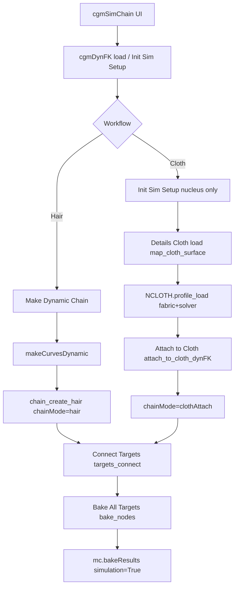

# Feature: cgmSimChain (cgmDynFK)

## Status and Overview

- **Status**: Shipped (UnrealWorkflow branch, July 2026)
- **Last Updated**: August 8, 2026 (Presets menu only — no body preset dropdowns)
- **Audience**: Dev / TA — design contract for dynamic follow chains (hair + cloth attach), presets, connect/bake behavior
- **Purpose**: Canonical reference for what **cgmSimChain** (`dynFKTool` / `cgmDynFK`) does, how hair vs cloth attach chains differ, and what scene/setup invariants must hold. Use when debugging regressions, reviewing PRs, or adding nCloth / dynFK presets.

**Maintenance rule**: Update this doc whenever `cgmDynFK`, `attach_to_cloth_dynFK`, `map_cloth_surface`, `nCloth_utils.profile_load`, `dynFKTool` bake/connect UI, or preset skip/query rules change. Timeline of individual fixes lives in [`Branch_UnrealWorkflow.md`](../Branches/Branch_UnrealWorkflow.md).

**Related docs**

- [`Feature_SceneExportFlow.md`](Feature_SceneExportFlow.md) — export bake/prep (orthogonal; sim-chain bake is local to cgmSimChain, not Scene export)
- [`Feature_MRSWiring.md`](Feature_MRSWiring.md) — puppet space groups (`worldSpaceObjects`, `puppetSpaceObjects`) collect dyn drivers from built modules
- [`Branch_UnrealWorkflow.md`](../Branches/Branch_UnrealWorkflow.md) — branch timeline and PR notes

---

## Scope

### In scope

- **cgmSimChain** UI (`dynFKTool.py`) and **`cgmDynFK`** meta (`dynamic_utils.py`)
- **Hair chains** — `makeCurvesDynamic`, follicle + outCurve locators, sim joint chain (`mObjJointChain`)
- **Cloth attach chains** — mapped nCloth `outMesh`, surface trackers (follicle / rivet / uvPin), loc→target connect/bake
- Shared **nucleus** on one setup; dynFK nucleus + hair presets (`cgmDynFK_presets`)
- **nCloth** fabric/solver/wind presets (`cgmNCloth_presets` + `nCloth_utils`)
- **Connect Targets** / **Bake All Targets** / **Bake All Joints**
- **Tools → Query Settings** (preset capture from selection)
- Rigging Utils **Attach by** surface-track items (shared `attach_toShape`)

### Out of scope

- nCloth **creation** (mesh → nCloth in Maya) — artists author cloth outside the tool
- Scene export / tdSet bake — see [`Feature_SceneExportFlow.md`](Feature_SceneExportFlow.md)
- Artist Google Doc / shelf wording (this doc can seed that later)
- `dynamic_mesh_follow` as a separate module — cloth attach lives in **`dynamic_utils.attach_to_cloth_dynFK`**
- Editing **zooPy** or **Red9**

---

## Entry Points and Call Graph

| Surface | Entry | Notes |
|---------|-------|-------|
| Toolbox / menu | `tool_calls.cgmSimChain()` | Reloads backend modules via `dynFKTool.reload_dependencies()` before UI open |
| UI | `dynFKTool.ui` | Window name `cgmSimChain_ui` |
| Script | `RIGDYN.cgmDynFK(...)`, `RIGDYN.setup_sim_dynFK(...)` | Direct meta construction |
| nCloth presets | `NCLOTH.profile_load(fabric, solver=, wind=)` | Script editor or Details Cloth menus |



### Key files

| File | Responsibility |
|------|----------------|
| [`cgm/core/tools/dynFKTool.py`](../../cgmToolsPy3/cgm/core/tools/dynFKTool.py) | cgmSimChain UI: Init Sim, map cloth, fabric/solver menus, attach, connect/bake, base name, Query Settings |
| [`cgm/core/rig/dynamic_utils.py`](../../cgmToolsPy3/cgm/core/rig/dynamic_utils.py) | `cgmDynFK` meta, `map_cloth_surface`, `attach_to_cloth_dynFK`, `chain_create_hair`, connect/bake helpers |
| [`cgm/core/rig/constraint_utils.py`](../../cgmToolsPy3/cgm/core/rig/constraint_utils.py) | `attach_toShape(..., surfaceTrack=)` — follicle / rivet / uvPin on mesh |
| [`cgm/core/lib/node_utils.py`](../../cgmToolsPy3/cgm/core/lib/node_utils.py) | `createRivetOnMesh`, `create_UVPinOnMesh` |
| [`cgm/core/lib/nCloth_utils.py`](../../cgmToolsPy3/cgm/core/lib/nCloth_utils.py) | nCloth resolve, layered `profile_load`, query_settings, scene-up gravity remap |
| [`cgm/core/presets/cgmNCloth_presets.py`](../../cgmToolsPy3/cgm/core/presets/cgmNCloth_presets.py) | Fabric / solver / wind profiles, `d_profileKind` |
| [`cgm/core/presets/cgmDynFK_presets.py`](../../cgmToolsPy3/cgm/core/presets/cgmDynFK_presets.py) | Nucleus + hairSystem profiles (`n`, `hs`) |
| [`cgm/core/tools/lib/tool_calls.py`](../../cgmToolsPy3/cgm/core/tools/lib/tool_calls.py) | `cgmSimChain()` launcher + reload |

---

## Core Concepts

### Setup meta: `cgmDynFK`

- Root transform: `{baseName}_dynFK` with `cgmName` = base name (editable in UI via `set_base_name`)
- Child messages (typical):
  - **`mNucleus`** — shared solver
  - **`mCloth`** — mapped nCloth **transform** (not shape — shape `viewName` breaks message readback)
  - **`mHairSysDag` / `mHairSysShape`** — when hair chain exists
  - **`chain_{i}`** — per-chain groups (msgList `chain`)

### Chain modes

| `chainMode` | Created by | Driver | Sim joint chain |
|-------------|------------|--------|-----------------|
| `hair` | **Make Dynamic Chain** | Dynamic outCurve + POC/aim locs | Yes (`mObjJointChain`) |
| `clothAttach` | **Attach to Cloth** | nCloth **outMesh** surface tracker + loc | No |

Per-chain group stores `cgmName`, `surfaceTrack` (cloth only), and msgLists:

| msgList | Hair | Cloth attach |
|---------|------|----------------|
| `mTargets` | Rig joints to follow | Rig joints to follow |
| `mLocs` | Curve-follow locs | Loc under surface track |
| `mObjJointChain` | Sim-driven joints | — |
| `mMeshFollicles` / `mRivets` / `mUvPins` | — | Surface trackers |

### Connect / bake contract (normative)

1. **Connect Targets** (`targets_connect`):
   - `SNAP.matchTarget_set(target, loc)` on each pair
   - `parentConstraint(loc, target)` — loc drives target
2. **Bake All Targets** (`bake_nodes`):
   - `cgmGEN.playback_stop()`
   - `mc.bakeResults(targets, simulation=True, disableImplicitControl=True, …)` over UI frame range
   - **`targets_disconnect`** on any chain whose targets were baked (loc→target `parentConstraint` cleanup)
3. **Bake All Joints** — same `bake_nodes` path on `mObjJointChain` (hair only; cloth chains excluded from global joint bake list)

### Surface tracks (cloth attach only)

All routes go through **`RIGCONSTRAINTS.attach_toShape(..., surfaceTrack=)`** on the nCloth **output mesh shape** (`NCLOTH.get_out_mesh_shape`).

| `surfaceTrack` | Mechanism | msgList |
|----------------|-----------|---------|
| `follicle` | Mesh follicle, closest UV | `mMeshFollicles` |
| `rivet` | Constraints-menu rivet API or classic edge-loft network | `mRivets` |
| `uvPin` | `uvPin` + locator | `mUvPins` |

**Rivet note**: `mel createRivet` is not available in current Maya/py3 builds — use `node_utils.createRivetOnMesh`.

Per target: tracker node + **`mLoc`** parented under tracker. Connect/bake uses **loc world pose**, not tracker xform directly.

---

## Workflows (normative order)

### A. Hair dynamic chain (unchanged legacy path)

1. Load or create `cgmDynFK` (optional: set base name)
2. Add joints to Create list → **Make Dynamic Chain**
3. `chain_create_hair` → `makeCurvesDynamic`, outCurve, locs, `mObjJointChain`
4. Tune nucleus / hair presets (Details menus)
5. **Connect Targets** → sim/scene on timeline
6. **Bake All Targets** or **Bake All Joints**

Hair and cloth chains may coexist on one setup (shared nucleus).

### B. Cloth attach chain (apparel / follow simmed cloth)

1. Artist creates nCloth in scene (outside tool)
2. **Tools → Init Sim Setup** — `cgmDynFK` + nucleus + `time1.outTime → nucleus.currentTime` (no hair chain)
3. Select nCloth → Details **Cloth `<<`** → `map_cloth_surface()`:
   - Links `mCloth` transform
   - If setup nucleus exists: rewires nCloth sim to that nucleus + time wire
4. **Presets → Cloth** / **Presets → Nucleus** → fabric + solver layers
5. Create panel: pick **Cloth track** → add joints → **Attach to Cloth**
6. Play sim / tune presets
7. **Connect Targets** → **Bake All Targets** over playback range

**Gate**: **Attach to Cloth** disabled until `mCloth` is mapped (no silent selection fallback).

---

## nCloth Preset Contract

### Cloth vs simulation taxonomy

Profiles are **not** monolithic cloth+solver blobs. Groups (`d_profileKind`):

| Group | Kind | Section | Examples | UI |
|-------|------|---------|----------|-----|
| Cloth | `fabric` | `nc` only | `cotton`, `denim`, `silk`, `stable`, … | **Presets → Cloth** |
| Simulation | `solver` | `n` only | `solver_balanced`, `solver_quality`, `solver_high`, … | **Presets → Nucleus** |
| Simulation | `wind` | `n` only | `wind_calm`, `wind_flag` | **Presets → Nucleus** |
| Simulation | `utility` | `nc` + `n` | `calm` | **Presets → Nucleus** |
| Reset | `base` | `nc` + `n` | `base` | Explicit `profile_load('base')` |

`wind` / `calm` are simulation layers, not cloth materials — cloth feel is **Presets → Cloth** only.

### Apply / merge contract

```python
import cgm.core.lib.nCloth_utils as NCLOTH
NCLOTH.profile_load('cotton')                          # nc only
NCLOTH.profile_load('cotton', solver='solver_high')    # nc + solver n
NCLOTH.profile_load('solver_high')                     # n only (nucleus ok without cloth)
NCLOTH.profile_load('wind_flag')                       # n only
NCLOTH.profile_load('calm')                            # utility: both (needs nCloth)
NCLOTH.profile_load('base')                            # full reset both sections
```

| Call | `nc` written | `n` written |
|------|--------------|-------------|
| fabric | `base.nc` (if `clean`) + fabric | none |
| fabric + solver | `base.nc` + fabric | solver only |
| solver / wind | none | layer only (never full `base.n`) |
| utility | `base.nc` (if `clean`) + utility.nc | `base.n` (if `clean`) + utility.n |
| `base` | full `base.nc` | full `base.n` (gravity remapped) |

- **`clean=False`**: no base seed; apply named layer keys only
- **`base.n` env** (gravity, `spaceScale`, wind, plane, …): Query Settings diff catalog + explicit `base` / utility reset — **not** applied on fabric or solver menu paths
- **`gravityDirection`** remapped at apply from `scene_up_axis_get()` when `n` is written
### Never preset (skip at apply + query)

| Attr / class | Reason |
|--------------|--------|
| `isDynamic` | Runtime sim on/off — workflow switch, not fabric feel |
| `selfCollide`, `collisionFlag`, `selfCollisionFlag`, `thickness`, `selfCollideWidthScale` | Scene-specific collision setup |
| `localSpaceOutput` | Output-space / transform hierarchy (Convert nCloth Output Space) — not fabric feel |
| `collide`, `ignoreSolverGravity`, `ignoreSolverWind` | Structural / solver-link switches — not fabric feel |

### Query Settings (`Tools → Query Settings`)

- `NCLOTH.query_settings_selection()` — nCloth, nucleus, cgmDynFK mapped cloth, dynFK hair/nucleus nodes
- Returns **`profile`** = diff from `base` + **`paste`** Python block for new preset entries
- Script Editor + log output; use when capturing tuned cloth for `cgmNCloth_presets.py`

---

## dynFK Presets (hair feel + simulation)

Module: `cgmDynFK_presets.py` — sections `n` (nucleus), `hs` (hairSystem). Same **feel vs simulation** split as nCloth:

| Group | Kind | Section | Examples | UI |
|-------|------|---------|----------|-----|
| Hair feel | `hair` | `hs` only | `rope`, `ponytail`, `tentacle`, … | **Presets → Hair** |
| Simulation | `wind` | `n` (+ optional `hs` wind attrs) | `wind` | **Presets → Nucleus** (`dynFK_wind`) |
| Simulation | `solver` | `n` (+ light `hs`) | `default` | **Presets → Nucleus** (`dynFK_default`) |
| Reset | `base` | `n` + `hs` | `base` | Explicit `RIGDYN.profile_load(nucleus, 'base')` |

Apply rules (`dynamic_utils.profile_load`):

- **Hair feel** on hairSystem: seeds `base.hs` when `clean`, writes `hs` only — never nucleus / cloth
- **Wind / solver** on nucleus: layer keys only (no full `base.n` dump) unless kind is `base`
- **Presets → Nucleus** + dynFK wind/solver: always apply `n` to setup nucleus; apply `hs` **only if hair exists** (cloth-only setups skip hs)
- **Do not** merge `cgmNCloth_presets` into `cgmDynFK_presets` (`nc` vs `hs` are separate concerns); shared nucleus sim from nCloth solvers/wind stays in **Presets → Nucleus** (ncloth source)

---

## UI Surface (`dynFKTool`)

| Area | Control | Backend |
|------|---------|---------|
| Header | `<<` load selected setup | `cgmDynFK(selection)` |
| Details | **Base Name** (text field) | `set_base_name` |
| Details | Nucleus / Cloth / Hair rows | Status + `<<` map from selection (`map_nucleus` / `map_cloth_surface` / `map_hair_system`) |
| Details | **Baking** section | Start time, bake range, Connect/Bake buttons |
| Details | Bake range, Connect/Bake buttons | `targets_connect`, `bake_nodes` |
| Create | **Make Dynamic Chain** | `chain_create` → hair |
| Create | **Cloth track** + **Attach to Cloth** | `attach_to_cloth_dynFK` |
| Setup menu | **Reload** | `reload_dependencies()` + UI reload |
| **Presets** menu | **Cloth** / **Hair** / **Nucleus** | fabric → cloth only; hair feel → hair only; Nucleus = nCloth sim + dynFK wind/solver (context-aware) |
| Tools menu | **Init Sim Setup** | `setup_sim_dynFK` / `cgmDynFK.setup_sim` |
| Tools menu | **Query Settings** | `query_settings_selection` |

**Presets menu** (sole UI for cgm profiles): Cloth = fabrics; Hair = hair feel only; Nucleus = nCloth solvers/wind/`calm` then dynFK wind/solver. Details body has no Fabric/Solver/Load Preset enums — status + `>>` only. Loading adjusts for hair vs cloth (dynFK `hs` skipped when no hair).

**Reload contract**: After editing `dynamic_utils`, `constraint_utils`, `node_utils`, or preset modules during dev → **Setup → Reload** or relaunch from toolbox (reloads via `cgmGEN._reloadMod`).

---

## Common Patterns

### Pattern: Character apparel on body nCloth

| Item | Value |
|------|-------|
| **Setup** | Init Sim → map character nCloth → `cotton` + `solver_high` |
| **Attach** | Joint chain on garment bones; `follicle` or `uvPin` on outMesh |
| **Finish** | Connect Targets → Bake All Targets → disconnect implicit via bake |

### Pattern: Hair ribbon + cloth cape (shared nucleus)

| Item | Value |
|------|-------|
| **Setup** | Make Dynamic Chain for hair; map cloth on same `cgmDynFK` |
| **Expected** | Two chain groups (`chainMode` hair + clothAttach); one nucleus |
| **Bake** | Targets per chain or **Bake All Targets** on combined `mTargets` |

### Pattern: Preset capture from tuned sim

| Item | Value |
|------|-------|
| **Action** | Select nCloth → **Tools → Query Settings** |
| **Output** | `profile` diff + paste block |
| **Add preset** | New entry in `cgmNCloth_presets.py` + `d_profileKind` registry |

### Pattern: Cotton-like fabric (query match)

Tuned attrs matching **`cotton`** fabric layer (stretch 50, bend 0.4, friction 0.15, etc.) — pair with appropriate **solver** profile separately; do not encode solver speed in fabric preset.

---

## Anti-Patterns and Failure Modes

| Anti-pattern | Symptom | Fix / contract |
|--------------|---------|----------------|
| Attach without **Init Sim** / map | Attach button disabled or map error | Tools → Init Sim Setup → Cloth `<<` before Attach |
| Attach to **input** mesh | Locators slide wrong / no sim motion | Always `get_out_mesh_shape` (sim **output**) |
| `mCloth` linked to **shape** | `get_mapped_cloth` fails readback | Link nCloth **transform** only |
| Bake with snap/key loop | Keys exist but constraints still drive | Use `bake_nodes`; `targets_disconnect` runs after bake for baked targets |
| `isDynamic` in preset | Applying preset toggles sim unexpectedly | Keep in `l_skipPresetAttrs`; artist toggles sim in AE |
| Preset overwrites collision | Self-collide / thickness wrong after preset | Collision attrs in skip list by design |
| Fabric apply resets nucleus env | Wind / `spaceScale` / gravity wiped by cotton | Section-isolated merge; fabric never seeds `base.n` |
| Hardcoded Y-down gravity | Wrong gravity in Z-up scenes | `_remap_nucleus_scene_axes` at apply |
| `mel createRivet` for rivet track | MEL error / no rivet | `createRivetOnMesh` internal API + fallback |
| `mc.ls(..., longPath=True)` | `Invalid flag 'longPath'` | Use `long=True` |

---

## Failure Stages and Troubleshooting

| Stage | Typical cause | What to check |
|-------|---------------|---------------|
| Map cloth | Selection not nCloth / no outMesh | `NCLOTH.get_nCloth`, sim has run at least once if outMesh missing |
| Attach | `mCloth` unset | Details Cloth status; run `>>` |
| attach_toShape | Mesh not sim output | `get_out_mesh_shape(mCloth)` |
| Connect | Missing `mLocs` | Re-attach chain; verify msgList on chain group |
| Bake | Playback running | `playback_stop` runs at bake entry |
| Bake | No keys / constraint fight | Confirm `disableImplicitControl=True`; Connect before bake |
| Query | Nothing selected / wrong type | nCloth transform, nucleus, or cgmDynFK root |
| Preset apply | Invalid profile name | `NCLOTH.profile_list(category='fabric'|'solver')` |

**Useful log markers**

- `map_cloth_surface >> Mapped cloth`
- `attach_to_cloth_dynFK >> chain N attached`
- `bake_nodes >> frames start-end`
- `profile_load >> Scene up` + `gravityDirection`

---

## Verification Checklist (dev)

Run in Maya after cgmSimChain changes:

1. **Init Sim only** — nucleus exists, timeline drives `currentTime`, no hair system
2. **Map cloth** — `mCloth` set; nCloth rewired to setup nucleus; Z-up gravity sane after preset
3. **Fabric + solver** — **Presets → Cloth** `cotton` then **Presets → Nucleus** `solver_high`; no collision / `isDynamic` / unrelated nucleus env; body UI has no preset dropdowns
4. **Attach follicle / rivet / uvPin** — locs follow outMesh; three modes on test mesh
5. **Connect Targets** — parentConstraint loc→joint; `cgmMatchTarget` → loc
6. **Bake All Targets** — keys on joints; constraints removed after bake
7. **Hair + cloth coexist** — one nucleus, two chain modes
8. **Query Settings** — select nCloth → paste block in Script Editor; cotton diff sane
9. **Base name edit** — rename `{baseName}_dynFK` in Details
10. **Reload** — edit `dynamic_utils` → Setup → Reload → attach still works

---

## Related Documentation

- **[Branch_UnrealWorkflow.md](../Branches/Branch_UnrealWorkflow.md)** — timeline, lessons learned, PR notes
- **[NewFeature_Guide.md](../Guides/NewFeature_Guide.md)** — feature doc conventions
- **[cgm-module-placement.mdc](../.cursor/rules/cgm-module-placement.mdc)** — where new sim helpers belong (`lib/` vs `rig/`)

### Code references (py3)

- [`cgm/core/tools/dynFKTool.py`](../../cgmToolsPy3/cgm/core/tools/dynFKTool.py)
- [`cgm/core/rig/dynamic_utils.py`](../../cgmToolsPy3/cgm/core/rig/dynamic_utils.py)
- [`cgm/core/lib/nCloth_utils.py`](../../cgmToolsPy3/cgm/core/lib/nCloth_utils.py)
- [`cgm/core/presets/cgmNCloth_presets.py`](../../cgmToolsPy3/cgm/core/presets/cgmNCloth_presets.py)

---

## Revision History

| Date | Summary |
|------|---------|
| 2026-08-08 | Cloth vs sim taxonomy; hair feel vs sim split (`d_profileKind`); section-isolated merge; **Presets** Cloth/Hair/Nucleus context-aware loads; never-preset structural attrs |
| 2026-07-14 | Initial feature doc — hair vs clothAttach, map/init sim, layered nCloth presets, connect/bake contract, surface tracks, Query Settings, skip attrs, verification checklist |
